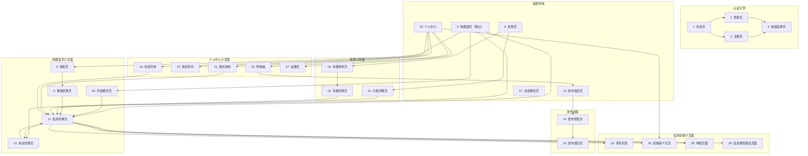
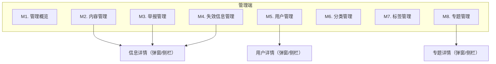

# 信息架构与导航设计

> 此刻校园 · Moment Campus  
> 版本：2.0（地图优先优化版）  
> 最后更新：2026-06-18

## 1. 文档概述

### 1.1 文档目的

本文档描述"此刻校园"产品的信息架构和导航设计,包括移动端和桌面端的信息架构、页面层级关系、导航逻辑和深链接设计,为 UI 设计和前端开发提供结构指导。

### 1.2 设计原则

1. **地图优先**：地图作为产品核心交互方式,用户进入系统后的主页面
2. **移动优先**：优先设计移动端体验,再扩展到桌面端
3. **信息优先**：导航结构服务于内容发现,减少层级深度
4. **路径清晰**：用户始终知道自己在哪,可以回到哪里
5. **入口明显**：核心功能入口保持可见和易达
6. **一致性**：导航模式在各页面保持一致

---

## 2. 移动端信息架构

### 2.1 底部导航结构

移动端采用底部导航栏（Tab Bar）作为主要导航方式,包含 5 个主要入口,**地图作为默认首页**：

```
┌─────────────────────────────────────────────────┐
│                                                 │
│                  页面内容区                      │
│                                                 │
├─────────────────────────────────────────────────┤
│  🗺️      🔍      ➕      💬      👤            │
│ 地图    发现    发布    消息    我的             │
└─────────────────────────────────────────────────┘
```

### 2.2 底部导航说明

| 导航项 | 图标 | 说明 | 目标页面 |
|--------|------|------|----------|
| **地图** | 🗺️ | 校园地图主页（默认首页） | 地图首页 |
| **发现** | 🔍 | 分类浏览和信息流 | 发现页 |
| **发布** | ➕ | 发布新信息（中心突出按钮） | 发布信息页 |
| **消息** | 💬 | 查看通知和消息 | 消息通知页 |
| **我的** | 👤 | 个人中心 | 个人中心 |

### 2.3 发布按钮设计

发布按钮位于底部导航中央,采用突出设计：

- **位置**：底部导航第 3 个位置（中央）
- **样式**：圆形按钮,比其它导航项更大,使用主色 #2F7D5A
- **图标**：加号 "+" 图标
- **交互**：点击直接进入发布信息页
- **未登录**：点击后引导登录

### 2.4 地图首页设计

地图首页是产品的核心页面,占据主要视觉区域：

- **地图区域**：占屏幕 70-80% 面积,显示校园地图和信息标记点
- **顶部搜索栏**：浮动在地图上方,支持关键词搜索和分类筛选
- **分类筛选**：横向滚动的分类按钮,浮动在地图上方
- **标记点**：不同类型信息使用不同颜色的地图标记
- **底部信息卡片**：点击标记后从底部弹出信息摘要卡片
- **列表模式切换**：右上角提供"地图/列表"视图切换按钮

### 2.5 移动端页面层级

```
底部导航（一级）
├── 地图首页（默认首页）
│   ├── 信息详情页（二级）
│   │   ├── 评论列表（三级）
│   │   ├── 其他用户主页（三级）
│   │   ├── 举报页面（三级）
│   │   └── 信息修改建议页面（三级）
│   ├── 地点详情页（二级）
│   │   └── 信息详情页（三级）
│   ├── 搜索页（二级）
│   │   └── 搜索结果页（三级）
│   │       └── 信息详情页（四级）
│   └── 列表模式页（二级）
│       └── 信息详情页（三级）
│
├── 发现页
│   ├── 信息流模式（二级）
│   │   └── 信息详情页（三级）
│   ├── 分类详情页（二级）
│   │   └── 信息详情页（三级）
│   ├── 热门信息区（二级）
│   │   └── 信息详情页（三级）
│   ├── 热门地点区（二级）
│   │   └── 地点详情页（三级）
│   └── 专题清单页（二级）
│       └── 专题详情页（三级）
│           └── 信息详情页（四级）
│
├── 发布（中心按钮）
│   ├── 发布信息页（二级）
│   ├── 发布预览页（三级）
│   └── 发布成功页（四级）
│
├── 消息
│   └── 消息通知页（二级）
│
└── 我的
    ├── 个人中心（二级）
    │   ├── 我的发布（三级）
    │   │   └── 信息详情页（四级）
    │   ├── 我的评论（三级）
    │   ├── 浏览历史（三级）
    │   │   └── 信息详情页（四级）
    │   ├── 草稿箱（三级）
    │   │   └── 发布信息页（四级）
    │   ├── 其他用户主页（三级）
    │   └── 设置页（三级）
    └── 设置页（二级）
```

---

## 3. 桌面端信息架构

### 3.1 三栏布局结构

桌面端采用经典三栏布局,**中间主要内容区默认显示地图**：

```
┌──────────────────────────────────────────────────────────────────┐
│  Logo    搜索框....................    通知    头像    校园选择   │
├──────────┬───────────────────────────────────────┬───────────────┤
│          │                                       │               │
│ 左侧     │         中间主要内容区                 │    右侧       │
│ 主导航   │         （默认显示地图）               │    推荐栏     │
│          │                                       │               │
│ 🗺️ 地图  │   校园地图（带标记点）                 │ 🔥 热门信息   │
│ 🔍 发现  │   / 列表模式 / 搜索结果等              │ 📍 热门地点   │
│ ➕ 发布  │                                       │ 📋 专题推荐   │
│ 💬 消息  │                                       │ 🏷️ 标签云     │
│ 👤 我的  │                                       │               │
│          │                                       │               │
│ ──────── │                                       │               │
│ 分类导航  │                                       │               │
│ 🍜 美食  │                                       │               │
│ 🐱 动物  │                                       │               │
│ 🖨️ 打印  │                                       │               │
│ 📸 拍照  │                                       │               │
│ 📚 学习  │                                       │               │
│ 🎉 活动  │                                       │               │
│ ...      │                                       │               │
│          │                                       │               │
├──────────┴───────────────────────────────────────┴───────────────┤
│  © 此刻校园 · Moment Campus                                      │
└──────────────────────────────────────────────────────────────────┘
```

### 3.2 桌面端导航说明

**顶部导航栏**：
- Logo（点击回地图首页）
- 全局搜索框（居中突出）
- 通知图标（带未读数标记）
- 用户头像（下拉菜单）
- 校园选择器（切换校园）

**左侧主导航**：
- 地图（默认选中）
- 发现
- 发布（按钮样式）
- 消息
- 我的
- 分隔线
- 12个分类快捷入口

**右侧推荐栏**：
- 热门信息（Top 10）
- 热门地点（Top 10）
- 专题推荐
- 标签云

### 3.3 桌面端页面层级

```
桌面端全局框架
├── 顶部导航（全局）
│   ├── Logo → 地图首页
│   ├── 搜索框 → 搜索结果页
│   ├── 通知 → 消息通知页
│   ├── 头像 → 下拉菜单
│   │   ├── 个人中心
│   │   ├── 我的发布
│   │   ├── 设置
│   │   └── 退出登录
│   └── 校园选择器
│
├── 左侧导航（全局）
│   ├── 地图（默认选中）
│   ├── 发现
│   │   ├── 分类浏览
│   │   ├── 热门信息
│   │   └── 热门地点
│   ├── 发布
│   ├── 消息
│   ├── 我的
│   └── 分类快捷入口（12个）
│
├── 中间内容区
│   ├── 地图首页（默认）
│   ├── 列表模式页
│   ├── 发现页
│   ├── 搜索结果页
│   ├── 分类详情页
│   ├── 信息详情页
│   ├── 地点详情页
│   ├── 发布信息页
│   ├── 发布预览页
│   ├── 发布成功页
│   ├── 消息通知页
│   ├── 专题清单页
│   ├── 专题详情页
│   ├── 个人中心
│   ├── 我的发布
│   ├── 我的评论
│   ├── 浏览历史
│   ├── 草稿箱
│   ├── 其他用户主页
│   └── 设置页
│
└── 右侧推荐栏（全局）
    ├── 热门信息
    ├── 热门地点
    ├── 专题推荐
    └── 标签云
```

---

## 4. 页面信息架构图

### 4.1 整体信息架构（Mermaid）

```mermaid
graph TD
    Root["此刻校园"] --> Auth["认证与引导"]
    Root --> Main["主导航"]
    Root --> Admin["管理端"]

    Auth --> Welcome["1. 欢迎页"]
    Auth --> Login["2. 登录页"]
    Auth --> Register["3. 注册页"]
    Auth --> SchoolSelect["4. 校园选择页"]

    Main --> MapHome["5. 地图首页（默认）"]
    Main --> Discover["6. 发现页"]
    Main --> Publish["发布流程"]
    Main --> Message["17. 消息通知页"]
    Main --> Profile["20. 个人中心"]

    MapHome --> Search["8. 搜索页"]
    MapHome --> PostDetail["11. 信息详情页"]
    MapHome --> LocationDetail["12. 地点详情页"]
    MapHome --> ListView["列表模式页"]

    ListView --> PostDetail

    Discover --> CategoryDetail["10. 分类详情页"]
    Discover --> TopicList["18. 专题清单页"]
    Discover --> HotPosts["热门信息"]
    Discover --> HotLocations["热门地点"]

    Search --> SearchResults["9. 搜索结果页"]
    SearchResults --> PostDetail

    CategoryDetail --> PostDetail
    LocationDetail --> PostDetail
    TopicList --> TopicDetail
    TopicDetail --> PostDetail

    PostDetail --> CommentList["16. 评论列表"]
    PostDetail --> OtherProfile["26. 其他用户主页"]
    PostDetail --> Report["28. 举报页面"]
    PostDetail --> Suggestion["29. 信息修改建议页面"]

    Publish --> PublishPage["13. 发布信息页"]
    PublishPage --> PublishPreview["14. 发布预览页"]
    PublishPreview --> PublishSuccess["15. 发布成功页"]

    Profile --> MyPosts["21. 我的发布"]
    Profile --> MyComments["23. 我的评论"]
    Profile --> History["24. 浏览历史"]
    Profile --> Drafts["25. 草稿箱"]
    Profile --> OtherProfile
    Profile --> Settings["27. 设置页"]

    MyPosts --> PostDetail
    History --> PostDetail
    Drafts --> PublishPage

    Admin --> AdminOverview["M1. 管理概览"]
    Admin --> ContentMgmt["M2. 内容管理"]
    Admin --> ReportMgmt["M3. 举报管理"]
    Admin --> ExpiredMgmt["M4. 失效信息管理"]
    Admin --> UserMgmt["M5. 用户管理"]
    Admin --> CategoryMgmt["M6. 分类管理"]
    Admin --> TagMgmt["M7. 标签管理"]
    Admin --> TopicMgmt["M8. 专题管理"]

    ContentMgmt --> PostDetail
    ReportMgmt --> PostDetail
    ExpiredMgmt --> PostDetail
```



### 4.2 用户端信息架构（Mermaid 详细）



---

## 5. 导航设计

### 5.1 一级导航

一级导航是全局导航,在所有页面保持可见(管理端除外)。

| 导航项 | 移动端 | 桌面端 | 说明 |
|--------|--------|--------|------|
| 地图 | 底部 Tab | 左侧导航 + 顶部 Logo | 校园地图主页(默认首页) |
| 发现 | 底部 Tab | 左侧导航 | 分类浏览、热门内容、专题 |
| 发布 | 底部中心按钮 | 左侧导航按钮 | 发布新信息 |
| 消息 | 底部 Tab | 顶部通知图标 | 查看通知和消息 |
| 我的 | 底部 Tab | 顶部头像下拉 | 个人中心 |

### 5.2 二级导航

二级导航是页面级导航,用于在一级导航页面内切换子功能。

| 所属一级页面 | 二级导航项 | 导航形式 |
|-------------|-----------|----------|
| 地图首页 | 地图模式 / 列表模式 | 右上角视图切换按钮 |
| 发现页 | 分类 / 地图 / 热门 / 专题 | 顶部 Tab 或卡片入口 |
| 个人中心 | 资料 / 发布 / 评论 / 历史 / 草稿 | 列表菜单 |
| 消息通知 | 全部 / 评论 / 点赞 / 系统 | 顶部 Tab 切换 |
| 分类详情页 | 最新 / 最热 / 距离 | 顶部排序切换 |
| 搜索结果页 | 综合 / 距离 / 时间 / 热度 | 顶部排序切换 |

### 5.3 页面层级和返回逻辑

#### 层级深度定义

| 层级 | 说明 | 示例 |
|------|------|------|
| L0 | 全局框架 | 底部导航、顶部导航 |
| L1 | 一级页面 | 地图首页、发现页、消息通知页、个人中心 |
| L2 | 二级页面 | 信息详情页、搜索页、分类详情页、列表模式页 |
| L3 | 三级页面 | 评论列表、其他用户主页、举报页面 |
| L4 | 四级页面 | 从三级页面进入的详情页 |

#### 返回逻辑规则

1. **一级页面之间**：通过底部导航（移动端）或左侧导航（桌面端）切换，无返回按钮
2. **二级页面返回**：返回上一级一级页面，显示返回按钮
3. **三级页面返回**：返回上一级二级页面，显示返回按钮
4. **四级页面返回**：返回上一级三级页面，显示返回按钮
5. **跨级返回**：长按返回按钮可显示返回路径选择（可选 P1 功能）
6. **模态页面**：发布流程使用模态页面，提供关闭按钮而非返回按钮

#### 返回按钮显示规则

| 场景 | 返回按钮 | 说明 |
|------|----------|------|
| 一级页面 | 不显示 | 通过导航切换 |
| 二级页面 | 左上角显示 | 返回一级页面 |
| 三级页面 | 左上角显示 | 返回二级页面 |
| 四级页面 | 左上角显示 | 返回三级页面 |
| 发布流程 | 关闭按钮 | 关闭模态页面 |
| 搜索结果页 | 返回搜索页 | 返回上一级搜索入口 |

### 5.4 深链接设计

深链接（Deep Link）允许用户直接访问特定页面，无需从首页逐层导航。

#### 深链接 URL 设计

| 页面 | URL 路径 | 说明 |
|------|----------|------|
| 地图首页 | `/` | 根路径，默认首页 |
| 发现页 | `/discover` | 发现页 |
| 校园地图页 | `/map` | 地图页 |
| 搜索页 | `/search` | 搜索入口 |
| 搜索结果页 | `/search?q=关键词` | 带搜索参数 |
| 分类详情页 | `/category/:id` | 分类详情 |
| 信息详情页 | `/post/:id` | 信息详情 |
| 地点详情页 | `/location/:id` | 地点详情 |
| 专题清单页 | `/topics` | 专题列表 |
| 专题详情页 | `/topic/:id` | 专题详情 |
| 发布信息页 | `/publish` | 发布信息 |
| 消息通知页 | `/messages` | 消息列表 |
| 个人中心 | `/profile` | 个人资料 |
| 我的发布 | `/profile/posts` | 我的发布 |
| 我的评论 | `/profile/comments` | 我的评论 |
| 浏览历史 | `/profile/history` | 浏览历史 |
| 草稿箱 | `/profile/drafts` | 草稿箱 |
| 其他用户主页 | `/user/:id` | 用户主页 |
| 设置页 | `/settings` | 设置 |
| 登录页 | `/login` | 登录 |
| 注册页 | `/register` | 注册 |
| 校园选择页 | `/school-select` | 选择校园 |

#### 深链接规则

1. **游客访问**：游客可以访问公开页面的深链接（首页、信息详情等）
2. **登录拦截**：需要登录的页面（发布、个人中心等），未登录时跳转登录页，登录后回到原页面
3. **校园拦截**：未选择校园的用户，跳转校园选择页，选择后回到原页面
4. **404 处理**：无效深链接显示 404 页面，提供返回首页入口
5. **分享支持**：所有公开页面支持链接分享

### 5.5 面包屑导航（桌面端）

桌面端在中间内容区顶部显示面包屑导航，帮助用户了解当前位置。

#### 面包屑规则

| 页面层级 | 面包屑示例 | 说明 |
|----------|-----------|------|
| 一级页面 | 首页 | 不显示面包屑 |
| 二级页面 | 首页 > 信息详情 | 显示返回路径 |
| 三级页面 | 首页 > 分类详情 > 信息详情 | 显示完整路径 |
| 搜索结果 | 首页 > 搜索结果 | 搜索关键词显示在页面标题 |

#### 面包屑设计

- **位置**：内容区顶部，左侧对齐
- **分隔符**：使用 ">" 或 "/" 分隔
- **可点击**：面包屑中每项可点击跳转
- **当前页**：最后一项不可点击，显示为普通文本
- **折叠**：层级过深时，中间层级可折叠

### 5.6 发布按钮位置

发布按钮是产品核心入口，需要在各端保持明显。

| 端 | 位置 | 样式 | 说明 |
|----|------|------|------|
| 移动端 | 底部导航中央 | 圆形突出按钮，主色 #2F7D5A | 底部导航第3个位置 |
| 桌面端 | 左侧导航 | 按钮样式，主色背景 | 左侧导航第3个位置 |
| 桌面端 | 顶部导航 | 可选，文字按钮 | 作为辅助入口 |

#### 发布按钮交互

- **已登录**：点击进入发布信息页
- **未登录**：点击后弹出登录引导，登录后继续发布流程
- **未选择校园**：点击后引导选择校园，选择后继续发布流程

### 5.7 搜索入口位置

搜索入口需要在各端保持易达。

| 端 | 位置 | 样式 | 说明 |
|----|------|------|------|
| 移动端 | 首页顶部 | 搜索框 + 搜索图标 | 固定顶部 |
| 移动端 | 发现页 | Tab 切换或独立入口 | 发现页内 |
| 桌面端 | 顶部导航中央 | 全局搜索框 | 所有页面可用 |

#### 搜索交互

- **点击搜索框**：进入搜索页，显示搜索历史和热门搜索
- **输入关键词**：实时显示搜索建议（P1 功能）
- **回车或点击搜索**：进入搜索结果页
- **搜索页返回**：返回上一页面

### 5.8 地图入口位置

地图入口是产品特色，需要在各端保持明显。

| 端 | 位置 | 样式 | 说明 |
|----|------|------|------|
| 移动端 | 发现页顶部 | 卡片入口 | 发现页第一个入口 |
| 移动端 | 首页右下角 | 浮动按钮 | 在底部导航之上 |
| 桌面端 | 左侧导航 | 分类导航区域 | 左侧导航内 |
| 桌面端 | 发现页 | Tab 切换 | 发现页内 |

#### 地图交互

- **点击地图入口**：进入校园地图页
- **地图页返回**：返回上一页面
- **地图标记点击**：显示信息摘要，再点击进入信息详情页

---

## 6. 页面层级关系

### 6.1 用户端 28 个页面

#### 6.1.1 认证与引导（4个页面）

| 序号 | 页面 | 层级 | 入口 | 返回 |
|------|------|------|------|------|
| 1 | 欢迎页 | L0 | 首次访问 | 进入首页或登录页 |
| 2 | 登录页 | L0 | 欢迎页/操作拦截 | 返回首页或上一页 |
| 3 | 注册页 | L0 | 登录页 | 返回登录页 |
| 4 | 校园选择页 | L0 | 首次登录/未选择校园 | 返回首页 |

#### 6.1.2 一级页面（5个页面）

| 序号 | 页面 | 层级 | 入口 | 返回 |
|------|------|------|------|------|
| 5 | 首页 | L1 | 底部导航/Logo | 无（导航切换） |
| 6 | 发现页 | L1 | 底部导航/左侧导航 | 无（导航切换） |
| 13 | 发布信息页 | L1 | 底部中心按钮/左侧导航 | 关闭/返回首页 |
| 17 | 消息通知页 | L1 | 底部导航/顶部通知图标 | 无（导航切换） |
| 20 | 个人中心 | L1 | 底部导航/头像下拉 | 无（导航切换） |

#### 6.1.3 二级页面（13个页面）

| 序号 | 页面 | 层级 | 入口 | 返回 |
|------|------|------|------|------|
| 7 | 校园地图页 | L2 | 发现页/首页浮动按钮 | 返回发现页 |
| 8 | 搜索页 | L2 | 首页顶部搜索框 | 返回首页 |
| 9 | 搜索结果页 | L2 | 搜索页 | 返回搜索页 |
| 10 | 分类详情页 | L2 | 首页/发现页分类入口 | 返回首页或发现页 |
| 11 | 信息详情页 | L2 | 多处入口 | 返回上一页 |
| 12 | 地点详情页 | L2 | 发现页/地图页 | 返回发现页 |
| 14 | 发布预览页 | L2 | 发布信息页 | 返回发布信息页 |
| 16 | 评论列表 | L2 | 信息详情页 | 返回信息详情页 |
| 18 | 专题清单页 | L2 | 发现页 | 返回发现页 |
| 19 | 专题详情页 | L2 | 专题清单页/首页 | 返回专题清单页 |
| 26 | 其他用户主页 | L2 | 信息详情页/个人中心 | 返回上一页 |
| 27 | 设置页 | L2 | 个人中心 | 返回个人中心 |
| 28 | 举报页面 | L2 | 信息详情页 | 返回信息详情页 |

#### 6.1.4 三级页面（6个页面）

| 序号 | 页面 | 层级 | 入口 | 返回 |
|------|------|------|------|------|
| 15 | 发布成功页 | L3 | 发布预览页 | 返回首页或个人中心 |
| 21 | 我的发布 | L3 | 个人中心 | 返回个人中心 |
| 23 | 我的评论 | L3 | 个人中心 | 返回个人中心 |
| 24 | 浏览历史 | L3 | 个人中心 | 返回个人中心 |
| 25 | 草稿箱 | L3 | 个人中心 | 返回个人中心 |
| 29 | 信息修改建议页面 | L3 | 信息详情页 | 返回信息详情页 |

> 注：三级页面中有 6 个页面，上面表格列出了全部 6 个。

#### 6.1.5 页面层级汇总表

| 层级 | 页面数量 | 页面列表 |
|------|----------|----------|
| L0 | 4 | 欢迎页、登录页、注册页、校园选择页 |
| L1 | 5 | 首页、发现页、发布信息页、消息通知页、个人中心 |
| L2 | 13 | 校园地图页、搜索页、搜索结果页、分类详情页、信息详情页、地点详情页、发布预览页、评论列表、专题清单页、专题详情页、其他用户主页、设置页、举报页面 |
| L3 | 6 | 发布成功页、我的发布、我的评论、浏览历史、草稿箱、信息修改建议页面 |
| **总计** | **28** | |

### 6.2 管理端 8 个页面

管理端采用独立的后台布局，左侧为管理菜单，右侧为内容区。

#### 6.2.1 管理端布局

```
┌──────────────────────────────────────────────────────────┐
│  Logo    此刻校园管理后台              管理员    退出     │
├──────────┬───────────────────────────────────────────────┤
│          │                                               │
│ 管理菜单  │              内容区                           │
│          │                                               │
│ 📊 概览  │                                               │
│ 📝 内容  │     根据左侧菜单选择显示对应管理内容            │
│ 🚨 举报  │                                               │
│ ⏰ 失效  │                                               │
│ 👥 用户  │                                               │
│ 📂 分类  │                                               │
│ 🏷️ 标签  │                                               │
│ 📋 专题  │                                               │
│          │                                               │
└──────────┴───────────────────────────────────────────────┘
```

#### 6.2.2 管理端页面列表

| 序号 | 页面 | 层级 | 入口 | 说明 |
|------|------|------|------|------|
| M1 | 管理概览 | L1 | 管理菜单 | 数据统计和概览 |
| M2 | 内容管理 | L1 | 管理菜单 | 审核和管理用户发布的内容 |
| M3 | 举报管理 | L1 | 管理菜单 | 处理用户举报 |
| M4 | 失效信息管理 | L1 | 管理菜单 | 管理过期和失效信息 |
| M5 | 用户管理 | L1 | 管理菜单 | 管理用户账户 |
| M6 | 分类管理 | L1 | 管理菜单 | 管理信息分类 |
| M7 | 标签管理 | L1 | 管理菜单 | 管理信息标签 |
| M8 | 专题管理 | L1 | 管理菜单 | 管理专题清单 |

#### 6.2.3 管理端页面层级



### 6.3 全部 36 个页面汇总

| 分类 | 数量 | 页面列表 |
|------|------|----------|
| 用户端 | 28 | 欢迎页、登录页、注册页、校园选择页、首页、发现页、校园地图页、搜索页、搜索结果页、分类详情页、信息详情页、地点详情页、发布信息页、发布预览页、发布成功页、评论列表、消息通知页、专题清单页、专题详情页、个人中心、我的发布、我的评论、浏览历史、草稿箱、其他用户主页、设置页、举报页面、信息修改建议页面 |
| 管理端 | 8 | 管理概览、内容管理、举报管理、失效信息管理、用户管理、分类管理、标签管理、专题管理 |
| **总计** | **36** | |

---

## 7. 导航设计总结

### 7.1 导航入口汇总

| 功能入口 | 移动端位置 | 桌面端位置 | 优先级 |
|----------|-----------|-----------|--------|
| 首页 | 底部 Tab 1 | 左侧导航 + Logo | P0 |
| 发现 | 底部 Tab 2 | 左侧导航 | P0 |
| 发布 | 底部 Tab 3（中心按钮） | 左侧导航按钮 | P0 |
| 消息 | 底部 Tab 4 | 顶部通知图标 | P0 |
| 我的 | 底部 Tab 5 | 顶部头像下拉 | P0 |
| 搜索 | 首页顶部搜索框 | 顶部导航中央搜索框 | P0 |
| 地图 | 发现页顶部 + 首页浮动按钮 | 左侧导航 + 发现页 Tab | P0 |
| 分类 | 发现页分类网格 | 左侧导航分类列表 | P0 |
| 专题 | 发现页专题入口 | 右侧推荐栏 + 发现页 | P1 |

### 7.2 页面访问路径统计

| 页面 | 可能的入口数量 | 主要入口 |
|------|--------------|----------|
| 信息详情页 | 10+ | 首页、发现、搜索、地图、分类、专题、历史等 |
| 首页 | 5+ | 底部导航、Logo、返回、深链接、发布成功 |
| 发现页 | 3+ | 底部导航、左侧导航、深链接 |
| 发布信息页 | 4+ | 底部按钮、左侧导航、草稿箱、深链接 |
| 个人中心 | 3+ | 底部导航、头像下拉、深链接 |
| 搜索页 | 3+ | 首页搜索框、顶部搜索框、深链接 |
| 校园地图页 | 3+ | 发现页、首页浮动按钮、深链接 |

### 7.3 导航设计原则总结

1. **底部导航（移动端）**：5个主要入口，发布按钮居中突出
2. **三栏布局（桌面端）**：左侧导航 + 中间内容 + 右侧推荐
3. **搜索全局可达**：移动端首页顶部，桌面端顶部导航中央
4. **地图入口明显**：移动端双入口（发现页+浮动按钮），桌面端左侧导航
5. **返回逻辑清晰**：每级页面都有明确的返回路径
6. **深链接支持**：所有公开页面支持直接访问
7. **面包屑辅助**：桌面端提供面包屑导航
8. **发布按钮突出**：使用主色和特殊样式，在所有页面保持可见

---

## 8. 相关文档

- [项目总览](00_project_overview.md)
- [产品需求文档](01_product_requirements.md)
- [功能范围与优先级](03_feature_scope_and_priority.md)
- [页面规格说明](06_page_specifications.md)
- [用户流程](05_user_flows.md)
