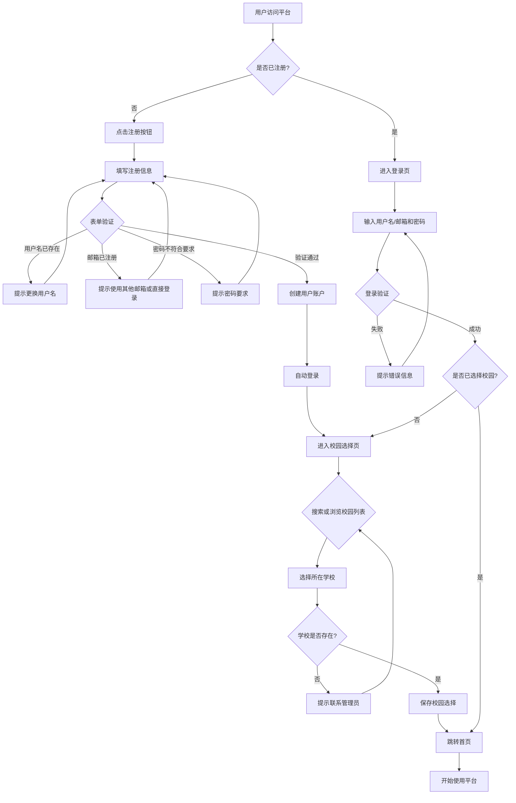
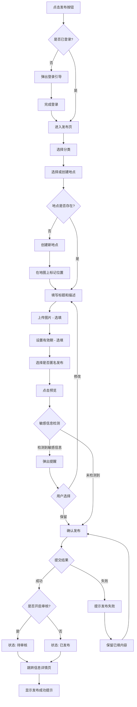
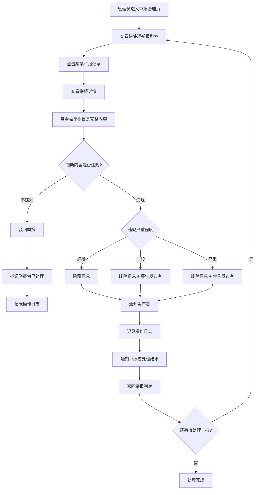

# 用户流程

> 此刻校园 · Moment Campus  
> 版本：1.0  
> 最后更新：2026-06-18

## 1. 流程概览

| 编号 | 流程名称 | 是否需登录 | 优先级 |
|------|----------|------------|--------|
| F01 | 游客浏览校园信息 | 否 | P0 |
| F02 | 新用户注册并选择学校 | 否 | P0 |
| F03 | 用户从首页查看信息详情 | 否 | P0 |
| F04 | 用户通过地图发现地点内容 | 否 | P0 |
| F05 | 用户通过搜索寻找特定服务 | 否 | P0 |
| F06 | 用户发布一条校园信息 | 是 | P0 |
| F07 | 用户保存发布草稿 | 是 | P1 |
| F08 | 用户点赞信息 | 是 | P0 |
| F09 | 用户发表评论或回复评论 | 是 | P0 |
| F10 | 用户确认信息仍然有效 | 是 | P0 |
| F11 | 用户反馈信息已经失效 | 是 | P0 |
| F12 | 用户提出修改建议 | 是 | P1 |
| F13 | 用户举报违规内容 | 是 | P0 |
| F14 | 管理员处理举报 | 是（管理员） | P0 |
| F15 | 管理员处理可能过期的信息 | 是（管理员） | P1 |
| F16 | 用户查看消息通知 | 是 | P0 |
| F17 | 用户查看自己的发布 | 是 | P0 |
| F18 | 用户浏览校园专题 | 否 | P1 |

---

## 2. 流程详细说明

### F01：游客浏览校园信息

**触发条件：** 用户通过分享链接、搜索引擎或直接输入网址访问平台

**前置条件：** 无

**主要步骤：**

1. 用户打开平台首页
2. 系统展示当前校园（默认或根据 URL 参数确定）的推荐信息流
3. 用户浏览信息卡片列表（标题、分类、地点、时间、有效性状态、点赞数）
4. 用户可切换分类标签筛选信息
5. 用户点击某条信息进入详情页
6. 用户浏览完整信息内容
7. 用户可点击地点名称查看地点详情页
8. 用户可通过页面引导注册账户

**成功结果：** 游客成功浏览到感兴趣的校园信息，对平台产生认知

**失败情况：**

- 页面加载失败
- 信息列表为空
- 信息详情页加载失败

**异常处理：**

- 网络错误：显示友好错误提示和重试按钮
- 无信息：显示空状态，引导用户注册后发布
- 链接失效：提示"信息不存在或已被删除"，引导回首页

**是否需要登录：** 否

**涉及页面：** 首页、信息详情页、地点详情页

**涉及数据实体：** Post、Category、Location

---

### F02：新用户注册并选择学校

**触发条件：** 用户点击"注册"按钮，或尝试执行需要登录的操作（发布、点赞等）

**前置条件：** 用户未注册、未登录

**主要步骤：**

1. 用户点击"注册"按钮，进入注册页面
2. 用户填写用户名（3-20 字符，字母、数字、下划线）
3. 用户填写邮箱地址
4. 用户设置密码（至少 8 位，包含字母和数字）
5. 用户确认密码
6. 用户点击"注册"按钮提交
7. 系统进行表单验证（格式校验、唯一性校验）
8. 系统创建用户账户，发送验证邮件（第一版可简化）
9. 注册成功，自动登录并跳转到校园选择页面
10. 系统展示校园列表（支持搜索、按名称排序）
11. 用户搜索或浏览找到所在学校
12. 用户选择学校并确认
13. 系统保存校园选择，跳转到首页

**成功结果：** 用户完成注册并选择了所属校园，可以开始使用平台全部功能

**失败情况：**

- 用户名已存在
- 邮箱已被注册
- 密码不符合要求
- 用户名格式不合法
- 网络错误
- 找不到所在学校

**异常处理：**

- 用户名已存在：提示"用户名已被注册，请更换"
- 邮箱已存在：提示"该邮箱已被注册，可直接登录或使用其他邮箱"
- 密码不符合要求：实时提示具体要求（长度、字符类型）
- 网络错误：提示"注册失败，请稍后重试"
- 找不到学校：提示"暂未收录该学校，请联系管理员"并提供反馈入口

**是否需要登录：** 否（注册前无需登录，注册后自动登录）

**涉及页面：** 注册页、校园选择页、首页

**涉及数据实体：** User、School

**Mermaid 流程图：** 见下方 [F02 流程图](#f02-流程图)

---

### F03：用户从首页查看信息详情

**触发条件：** 用户在首页信息流中看到感兴趣的信息

**前置条件：** 无（游客和登录用户均可）

**主要步骤：**

1. 用户在首页浏览信息流
2. 用户看到感兴趣的信息卡片
3. 用户点击信息卡片
4. 系统跳转到信息详情页
5. 系统加载并展示完整信息：标题、分类、地点、描述、图片、发布时间、有效期
6. 用户查看发布者信息（昵称、头像）
7. 用户查看有效性状态和确认人数
8. 用户查看互动数据（点赞数、评论数）
9. 用户浏览评论区（默认显示最新 10 条）
10. 用户可进行点赞、评论、确认有效性等操作（需登录）
11. 用户可点击地点名称跳转到地点详情页
12. 用户可返回列表继续浏览

**成功结果：** 用户成功查看信息详情，获取所需信息

**失败情况：**

- 信息已被删除
- 信息加载失败
- 图片加载失败

**异常处理：**

- 信息不存在：提示"信息不存在或已被删除"，引导回首页
- 加载失败：显示错误提示和重试按钮
- 图片加载失败：显示图片占位符，不影响其他内容展示

**是否需要登录：** 否（浏览不需要，互动需要）

**涉及页面：** 首页、信息详情页、地点详情页

**涉及数据实体：** Post、Category、Location、User、Comment、Like、ValidationRecord

---

### F04：用户通过地图发现地点内容

**触发条件：** 用户进入地图页面

**前置条件：** 无（游客和登录用户均可）

**主要步骤：**

1. 用户点击底部导航栏"地图"进入地图页
2. 系统加载校园地图（使用 MapLibre GL JS 或 Leaflet）
3. 系统加载当前学校静态地图和地点标记
4. 用户在地图上查看信息标记点
5. 系统根据缩放级别动态调整标记显示（最多 100 个）
6. 用户拖动或缩放地图探索不同区域
7. 用户点击某个标记点
8. 系统弹出地点信息摘要卡片（地点名称、信息数量、最新信息标题）
9. 用户点击摘要卡片进入地点详情页
10. 用户在地点详情页查看该地点下的所有信息
11. 用户选择感兴趣的信息查看详情

**成功结果：** 用户通过地图发现了地点相关的有价值信息

**失败情况：**

- 地图加载失败
- 标记点过多导致卡顿
- 网络错误

**异常处理：**

- 地图加载失败：显示错误提示和重试按钮
- 地图中心：使用当前学校配置的静态中心点，用户可手动拖动
- 标记过多：限制显示数量，优先显示热度高的信息标记
- 网络错误：显示错误提示和重试按钮

**是否需要登录：** 否

**涉及页面：** 地图页、地点详情页、信息详情页

**涉及数据实体：** Post、Location、Category

---

### F05：用户通过搜索寻找特定服务

**触发条件：** 用户有明确的信息需求，主动使用搜索功能

**前置条件：** 无

**主要步骤：**

1. 用户点击搜索图标进入搜索页面
2. 系统展示搜索历史和热门搜索（可选）
3. 用户输入关键词（如"打印"、"食堂"、"自习"）
4. 系统实时展示搜索建议（可选）
5. 用户提交搜索
6. 系统返回搜索结果列表
7. 用户可使用筛选条件：分类、距离、发布时间、有效性状态、是否有图片
8. 用户可选择排序方式：综合、距离最近、发布时间最新、热度最高
9. 用户浏览搜索结果
10. 用户点击某条信息查看详情
11. 系统记录搜索历史（最近 10 条，仅登录用户）

**成功结果：** 用户找到所需的服务信息

**失败情况：**

- 搜索无结果
- 搜索结果不相关
- 网络错误

**异常处理：**

- 无结果：显示"未找到相关信息"，提供相关分类入口引导用户浏览
- 结果不相关：建议用户更换关键词或使用筛选条件
- 网络错误：显示错误提示和重试按钮

**是否需要登录：** 否（搜索不需要，记录搜索历史需要）

**涉及页面：** 搜索页、搜索结果页、信息详情页

**涉及数据实体：** Post、Category、Location

---

### F06：用户发布一条校园信息

**触发条件：** 用户点击"发布"按钮

**前置条件：** 用户已登录、已选择校园

**主要步骤：**

1. 用户点击底部导航栏中间的"发布"按钮（或首页浮动发布按钮）
2. 系统进入发布页面，第一步：选择分类
3. 用户从 12 个预定义分类中选择一个（校园美食、校园动物、打印服务等）
4. 系统根据所选分类展示对应的特有字段表单
5. 第二步：选择地点
6. 用户在地图上点击选择地点，或从已有地点列表中搜索选择
7. 如地点不存在，用户可创建新地点（填写名称、在地图上标记位置）
8. 第三步：填写标题（5-100 字符，必填）
9. 第四步：填写描述（10-5000 字符，必填）
10. 第五步：上传图片（选填，最多 9 张，每张不超过 5MB）
11. 第六步：设置有效期（选填，可选永久、7天、30天、90天、自定义日期；系统根据分类给出默认建议）
12. 第七步：选择是否匿名发布
13. 用户点击"预览"按钮
14. 系统展示信息发布预览效果
15. 系统进行敏感信息检测（手机号、身份证号等），如有则提醒用户
16. 用户确认无误后点击"发布"按钮
17. 系统提交信息，如开启审核则状态为"待审核"，否则直接"已发布"
18. 系统跳转到信息详情页，显示发布成功提示

**成功结果：** 信息成功发布，其他用户可以浏览

**失败情况：**

- 必填项缺失
- 标题或描述长度不符合要求
- 图片上传失败
- 包含敏感信息
- 网络错误
- 地点未选择

**异常处理：**

- 必填项缺失：对应字段标红并提示"此项为必填"
- 长度不符：实时提示字数要求和当前字数
- 图片上传失败：提示"图片上传失败，请重试"，保留其他已填内容
- 敏感信息：弹出提醒"检测到可能包含敏感信息（如手机号），请确认是否需要保留"，用户可选择继续或修改
- 网络错误：提示"发布失败，请检查网络后重试"，内容保留不丢失
- 地点未选择：提示"请选择或创建一个地点"

**是否需要登录：** 是

**涉及页面：** 发布页（多步骤表单）、预览页、信息详情页

**涉及数据实体：** Post、Category、Location、PostImage

**Mermaid 流程图：** 见下方 [F06 流程图](#f06-流程图)

---

### F07：用户保存发布草稿

**触发条件：** 用户在发布页面点击"保存草稿"按钮，或系统自动触发

**前置条件：** 用户已登录

**主要步骤：**

1. 用户在发布页面填写信息（部分或全部）
2. 用户点击"保存草稿"按钮（或系统每 30 秒自动保存）
3. 系统校验草稿数据
4. 系统保存草稿到数据库
5. 系统提示"草稿已保存"
6. 用户可继续在草稿箱中查看、编辑或删除草稿
7. 用户打开草稿继续编辑，回到发布页面并自动填充已有内容
8. 草稿数量上限为 50 个

**成功结果：** 草稿保存成功，用户可稍后继续编辑和发布

**失败情况：**

- 草稿数量超过上限
- 网络错误
- 数据校验失败

**异常处理：**

- 超过上限：提示"草稿数量已达上限（50个），请先删除部分草稿"
- 网络错误：提示"保存失败，请检查网络"，内容保留在页面
- 校验失败：提示具体错误信息

**是否需要登录：** 是

**涉及页面：** 发布页、草稿箱页

**涉及数据实体：** Post（status=draft）

---

### F08：用户点赞信息

**触发条件：** 用户在信息详情页或信息卡片上点击"点赞"按钮

**前置条件：** 用户已登录

**主要步骤：**

1. 用户在信息详情页或信息卡片上看到"点赞"按钮
2. 用户点击"点赞"按钮
3. 系统发送点赞请求到后端
4. 系统更新点赞数并实时显示
5. 按钮变为已点赞状态（高亮）
6. 用户可再次点击取消点赞
7. 点赞记录保存在用户账户中

**成功结果：** 用户成功点赞了感兴趣的信息

**失败情况：**

- 未登录
- 网络错误
- 重复操作

**异常处理：**

- 未登录：弹出登录引导弹窗
- 网络错误：提示"操作失败，请重试"，按钮恢复原状态
- 重复点赞：系统做幂等处理，不报错

**是否需要登录：** 是

**涉及页面：** 信息详情页、首页信息卡片

**涉及数据实体：** Like、Post

---

### F09：用户发表评论或回复评论

**触发条件：** 用户在信息详情页的评论区输入内容并提交

**前置条件：** 用户已登录

**主要步骤：**

1. 用户在信息详情页浏览评论区
2. 用户点击评论输入框
3. 用户输入评论内容（1-1000 字符）
4. 用户点击"发送"按钮
5. 系统校验评论内容
6. 系统保存评论并更新评论数
7. 评论出现在评论区顶部
8. 信息发布者收到评论通知

**回复评论流程：**

1. 用户点击某条评论的"回复"按钮
2. 评论输入框自动填入"@用户名"
3. 用户输入回复内容
4. 用户点击"发送"按钮
5. 系统保存回复评论（关联父评论 ID）
6. 被回复者收到回复通知
7. 评论最多支持 2 级嵌套

**成功结果：** 评论或回复成功发布，相关用户收到通知

**失败情况：**

- 评论内容为空
- 评论内容超过长度限制
- 网络错误
- 信息已被删除

**异常处理：**

- 内容为空：提示"请输入评论内容"
- 超过长度限制：提示"评论内容不能超过1000字"
- 网络错误：提示"发送失败，请重试"，保留输入内容
- 信息已删除：提示"该信息已被删除"

**是否需要登录：** 是

**涉及页面：** 信息详情页

**涉及数据实体：** Comment、Post、Notification、User

---

### F10：用户确认信息仍然有效

**触发条件：** 用户在信息详情页点击"仍然有效"按钮

**前置条件：** 用户已登录

**主要步骤：**

1. 用户在信息详情页看到有效性状态区域
2. 用户点击"仍然有效"按钮
3. 系统发送确认请求（确认类型：valid）
4. 系统记录确认数据（用户 ID、信息 ID、确认类型、时间）
5. 系统更新信息的有效性统计
6. 按钮变为已确认状态
7. 如信息有效性状态为"可能过期"，根据确认人数可能恢复为"有效"

**成功结果：** 用户成功确认信息有效，信息有效性统计更新

**失败情况：**

- 未登录
- 网络错误
- 信息不存在

**异常处理：**

- 未登录：弹出登录引导
- 网络错误：提示"操作失败，请重试"
- 信息不存在：提示"信息不存在"

**是否需要登录：** 是

**涉及页面：** 信息详情页

**涉及数据实体：** ValidationRecord、Post

---

### F11：用户反馈信息已经失效

**触发条件：** 用户在信息详情页点击"已经失效"按钮

**前置条件：** 用户已登录

**主要步骤：**

1. 用户在信息详情页看到有效性状态区域
2. 用户点击"已经失效"按钮
3. 系统弹出确认对话框："确认该信息已经失效？"
4. 用户确认
5. 系统发送确认请求（确认类型：expired）
6. 系统记录确认数据
7. 系统更新信息的有效性统计
8. 如收到 3 个以上失效反馈，系统自动将信息标记为"可能过期"
9. 信息发布者收到失效反馈通知

**成功结果：** 用户成功反馈信息失效，系统更新有效性状态

**失败情况：**

- 未登录
- 网络错误
- 信息不存在

**异常处理：**

- 未登录：弹出登录引导
- 网络错误：提示"操作失败，请重试"
- 信息不存在：提示"信息不存在"

**是否需要登录：** 是

**涉及页面：** 信息详情页

**涉及数据实体：** ValidationRecord、Post、Notification

---

### F12：用户提出修改建议

**触发条件：** 用户在信息详情页点击"提出建议"按钮

**前置条件：** 用户已登录

**主要步骤：**

1. 用户在信息详情页点击"提出建议"按钮
2. 系统弹出建议输入面板
3. 用户选择建议修改的字段（标题、描述、地点、价格等）
4. 用户填写建议内容（建议修改为什么）
5. 用户点击"提交建议"
6. 系统保存建议数据
7. 信息发布者收到修改建议通知
8. 发布者可查看建议内容，选择接受或拒绝
9. 如接受，系统自动或提示发布者更新信息

**成功结果：** 建议提交成功，发布者收到通知并可处理

**失败情况：**

- 建议内容为空
- 网络错误

**异常处理：**

- 内容为空：提示"请填写建议内容"
- 网络错误：提示"提交失败，请重试"

**是否需要登录：** 是

**涉及页面：** 信息详情页

**涉及数据实体：** Suggestion、Post、Notification

---

### F13：用户举报违规内容

**触发条件：** 用户在信息详情页点击"举报"按钮

**前置条件：** 用户已登录

**主要步骤：**

1. 用户在信息详情页点击更多操作菜单（"..."）
2. 用户选择"举报"选项
3. 系统弹出举报对话框
4. 用户选择举报类型：虚假信息、广告推广、隐私泄露、违法违规、其他
5. 用户填写举报说明（选填，0-500 字符）
6. 用户点击"提交举报"
7. 系统保存举报记录
8. 举报进入管理员审核队列
9. 系统提示"举报已提交，管理员将尽快处理"
10. 每个用户对同一条内容只能举报一次

**成功结果：** 举报提交成功，进入管理员审核队列

**失败情况：**

- 未登录
- 重复举报
- 网络错误

**异常处理：**

- 未登录：弹出登录引导
- 重复举报：提示"您已举报过该内容"
- 网络错误：提示"举报提交失败，请重试"

**是否需要登录：** 是

**涉及页面：** 信息详情页

**涉及数据实体：** Report、Post

---

### F14：管理员处理举报

**触发条件：** 管理员进入举报管理页面

**前置条件：** 管理员已登录，存在待处理举报

**主要步骤：**

1. 管理员进入后台管理系统的"举报管理"页面
2. 系统展示待处理举报列表（举报时间、举报类型、被举报内容摘要、举报人数）
3. 管理员点击某条举报记录
4. 系统展示举报详情：被举报信息完整内容、举报类型、举报说明、举报者信息
5. 管理员查看被举报信息内容
6. 管理员判断内容是否违规
7. 管理员选择处理方式：
   - **驳回举报**：内容不违规，标记举报为已处理
   - **隐藏信息**：信息违规，隐藏信息并通知发布者
   - **删除信息**：信息严重违规，删除信息并通知发布者
   - **警告发布者**：对发布者发出警告
   - **禁言发布者**：对发布者实施禁言处罚（7天/永久）
8. 管理员填写处理备注（选填）
9. 系统保存处理结果
10. 系统更新举报状态为"已处理"
11. 系统发送处理结果通知给举报者（P1 功能）
12. 系统记录管理员操作日志

**成功结果：** 举报处理完成，违规内容被处理或举报被驳回

**失败情况：**

- 处理过程中网络错误
- 信息已被删除

**异常处理：**

- 网络错误：提示"处理失败，请重试"
- 信息已被删除：提示"该信息已被删除"，自动标记举报为已处理

**是否需要登录：** 是（管理员权限）

**涉及页面：** 举报管理页、信息详情页（管理视图）

**涉及数据实体：** Report、Post、User、AdminOperationLog、Notification

**Mermaid 流程图：** 见下方 [F14 流程图](#f14-流程图)

---

### F15：管理员处理可能过期的信息

**触发条件：** 管理员进入过期信息管理页面，或系统自动标记信息为"可能过期"

**前置条件：** 管理员已登录，存在可能过期的信息

**主要步骤：**

1. 系统自动检测：超过有效期的信息标记为"可能过期"
2. 系统发送通知给信息发布者："您的信息可能已过期，请确认是否仍然有效"
3. 管理员进入"过期信息管理"页面
4. 系统展示可能过期的信息列表（信息标题、分类、发布时间、有效期、过期天数）
5. 管理员查看信息详情
6. 管理员选择处理方式：
   - **确认有效**：将信息状态恢复为"有效"
   - **标记过期**：将信息状态设为"已过期"，降低展示权重
   - **隐藏信息**：隐藏已过时的信息
   - **删除信息**：删除无价值的过期信息
   - **联系发布者**：发送提醒通知
7. 管理员填写处理备注
8. 系统保存处理结果
9. 系统记录操作日志

**成功结果：** 过期信息得到妥善处理，信息库质量得到维护

**失败情况：**

- 网络错误
- 信息已被删除

**异常处理：**

- 网络错误：提示"操作失败，请重试"
- 信息已被删除：跳过该条，自动标记为已处理

**是否需要登录：** 是（管理员权限）

**涉及页面：** 过期信息管理页、信息详情页（管理视图）

**涉及数据实体：** Post、Notification、AdminOperationLog

---

### F16：用户查看消息通知

**触发条件：** 用户点击顶部导航栏的通知图标

**前置条件：** 用户已登录

**主要步骤：**

1. 用户点击顶部导航栏的通知图标（显示未读数量红点）
2. 系统进入通知列表页面
3. 系统展示通知列表，按时间倒序排列
4. 通知类型包括：评论通知、回复通知、点赞通知、系统通知、审核通知
5. 未读通知显示蓝色圆点标记
6. 用户点击某条通知
7. 系统将通知标记为已读
8. 系统跳转到通知对应的内容页面（信息详情页、评论详情等）
9. 用户可在通知列表中左滑删除通知（移动端）
10. 通知保留时间为 30 天

**成功结果：** 用户查看了通知消息并跳转到相关内容

**失败情况：**

- 无通知
- 通知对应的内容已被删除
- 网络错误

**异常处理：**

- 无通知：显示空状态"暂无通知"
- 内容已删除：提示"相关内容已被删除"
- 网络错误：显示错误提示和重试按钮

**是否需要登录：** 是

**涉及页面：** 通知列表页、信息详情页

**涉及数据实体：** Notification、Post、Comment

---

### F17：用户查看自己的发布

**触发条件：** 用户进入个人中心

**前置条件：** 用户已登录

**主要步骤：**

1. 用户点击底部导航栏"我的"进入个人中心
2. 用户点击"我的发布"
3. 系统展示用户发布的信息列表，按时间倒序排列
4. 每条信息显示状态标签：已发布、待审核、已拒绝、已删除
5. 用户可点击信息进入详情页
6. 用户可编辑或删除自己的信息
7. 支持分页加载

**成功结果：** 用户成功查看和管理自己的发布

**失败情况：**

- 无发布记录
- 网络错误

**异常处理：**

- 无记录：显示空状态，引导用户去浏览或发布
- 网络错误：显示错误提示和重试按钮

**是否需要登录：** 是

**涉及页面：** 个人中心页、我的发布页、信息详情页

**涉及数据实体：** Post、User

---

### F18：用户浏览校园专题

**触发条件：** 用户进入专题列表页面

**前置条件：** 无（游客可浏览公开专题）

**主要步骤：**

1. 用户进入"发现"页面或首页专题入口
2. 系统展示专题列表（按热度排序）
3. 每个专题显示：封面图、标题、描述、信息数量
4. 用户点击某个专题进入专题详情页
5. 系统展示专题信息：标题、描述、创建者、信息列表
6. 用户浏览专题下的信息列表
7. 用户点击某条信息查看详情
8. 用户可返回列表继续浏览专题内其他信息
9. 登录用户可创建自己的专题（P1 功能）

**成功结果：** 用户成功浏览专题内容，获取主题化的信息集合

**失败情况：**

- 无专题
- 专题为空（无关联信息）
- 网络错误

**异常处理：**

- 无专题：显示空状态"暂无专题"
- 专题为空：显示"该专题暂无信息"
- 网络错误：显示错误提示和重试按钮

**是否需要登录：** 否（浏览不需要，创建需要）

**涉及页面：** 专题列表页、专题详情页、信息详情页

**涉及数据实体：** Topic、Post、User

---

## 3. 核心流程图

### F02 流程图

### F06 流程图

### F14 流程图

---

## 4. 流程交叉引用

| 流程 | 可能衔接的后续流程 |
|------|-------------------|
| F01 游客浏览 | → F02 注册、F03 查看详情 |
| F02 注册并选择学校 | → F01 浏览、F06 发布 |
| F03 查看详情 | → F08 点赞、F09 评论、F10/F11 确认有效性、F13 举报 |
| F04 地图发现 | → F03 查看详情 |
| F05 搜索 | → F03 查看详情 |
| F06 发布信息 | → F07 保存草稿、F03 查看详情 |
| F08 点赞 | → F17 查看发布 |
| F09 评论 | → F16 查看通知 |
| F10/F11 确认有效性 | → F16 查看通知（通知发布者） |
| F13 举报 | → F14 管理员处理 |
| F14 处理举报 | → F16 通知举报者 |
| F16 查看通知 | → F03 查看详情、F09 查看评论 |
| F17 查看发布 | → F03 查看详情 |
| F18 浏览专题 | → F03 查看详情 |

---

## 5. 相关文档

- [产品需求文档](01_product_requirements.md)
- [用户角色与场景](02_user_roles_and_scenarios.md)
- [功能范围与优先级](03_feature_scope_and_priority.md)
- [页面规格说明](06_page_specifications.md)
- [内容与分类设计](07_content_and_category_design.md)

---

## 6. 2026-08 手机号主账号认证流程（当前实现）

### 6.1 Web

1. 登录：输入手机号，选择短信验证码登录或密码登录。
2. 注册：输入手机号、短信验证码、密码、确认密码和注册学校；昵称默认为“此刻用户”。
3. 新账号默认未认证，登录后直接进入界面。
4. 个人中心提交当前注册学校的教育邮箱，完成邮箱验证码校验后成为已认证。
5. 小程序创建且未设置密码的账号，可在个人中心一次性设置密码；不提供邮箱找回密码。

### 6.2 小程序

点击“微信登录并授权手机号”后，后端使用微信 openid 身份和手机号业务唯一键自动登录或创建账号。已有手机号账号会复用，微信身份保留在 `wechat_miniprogram` 身份记录中。

### 6.3 教育邮箱解绑

教育邮箱只用于校园认证，和手机号保持一对一唯一约束。解除绑定前必须向当前手机号发送短信验证码；解绑后 `campus_verified` 恢复为 `false`。
