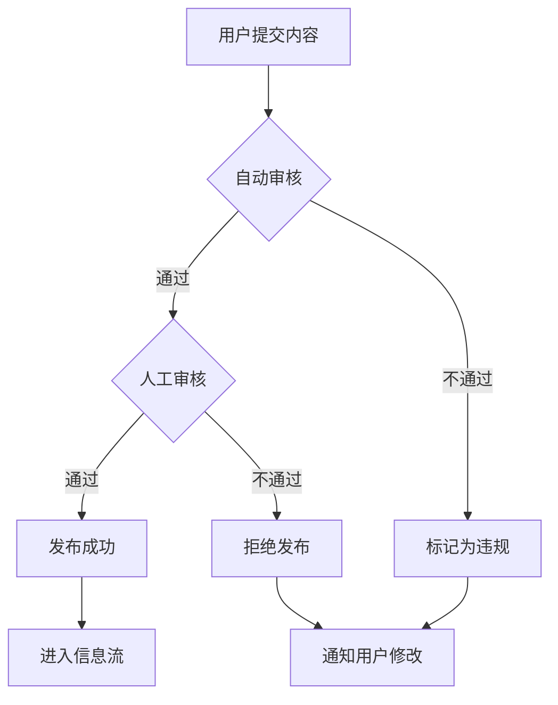
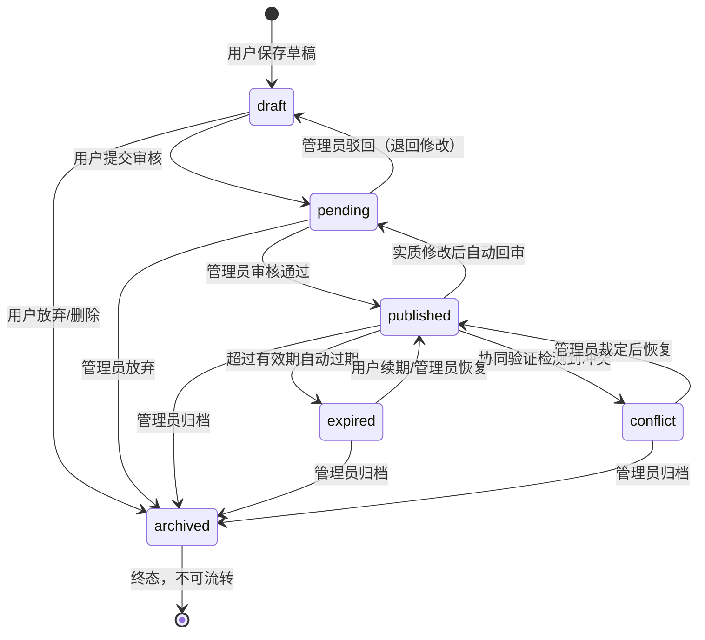
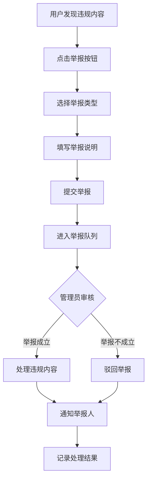
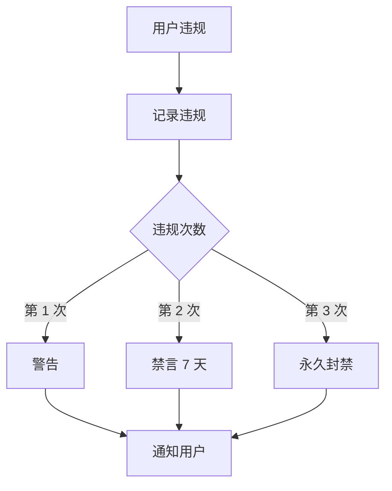
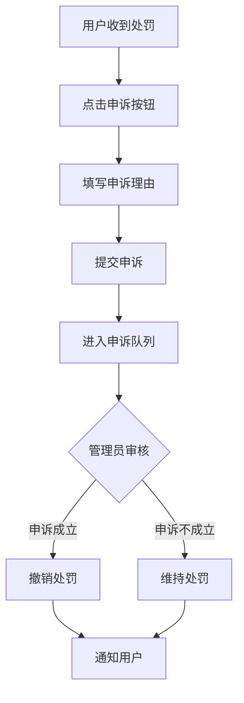

# 社区治理

> 此刻校园 · Moment Campus  
> 版本：1.1  
> 最后更新：2026-07-30

## 1. 内容审核机制

### 1.1 审核流程

内容审核采用**自动审核 + 人工审核**相结合的双重机制：



**自动审核：**
- 敏感词过滤：检测标题、描述、评论中的敏感词汇
- 图片审核：检测图片中的违规内容（色情、暴力等）
- 重复内容检测：识别重复发布的内容
- 格式验证：检查内容格式是否符合规范

**人工审核：**
- 管理员审核队列：待审核内容进入管理员审核队列
- 审核优先级：按发布时间、举报次数排序
- 批量审核：支持批量通过或拒绝

### 1.2 审核标准

| 审核维度 | 通过标准 | 不通过标准 |
|---------|---------|-----------|
| 内容真实性 | 信息真实、准确 | 包含虚假信息 |
| 广告推广 | 无商业推广内容 | 明显广告、营销信息 |
| 隐私保护 | 无个人隐私信息 | 包含手机号、身份证等 |
| 法律法规 | 符合法律法规 | 违法违规内容 |
| 社区规范 | 符合社区规范 | 不当言论、恶意内容 |
| 内容质量 | 描述清晰、完整 | 内容空洞、无意义 |

### 1.3 审核状态流转

本系统采用 **6 态状态机**（T-B-01），替代旧版的 6 态（draft/pending/published/rejected/hidden/deleted）。新状态机消除了 `rejected`、`hidden`、`deleted` 三个冗余状态，使状态语义更清晰、流转更简洁。



**6 态说明：**

| 状态 | 标识 | 说明 | 进入方式 |
|------|------|------|---------|
| 草稿 | draft | 用户保存的未提交内容 | 新建草稿 |
| 待审核 | pending | 等待管理员审核 | 用户提交审核 / 实质修改回审 |
| 已发布 | published | 审核通过，正常展示 | 管理员审核通过 / 续期恢复 / 冲突裁定 |
| 已过期 | expired | 超过有效期，不再展示 | 自动过期 / 协同验证触发 |
| 冲突中 | conflict | 协同验证检测到矛盾信息 | 冲突检测（同一地点出现矛盾信息） |
| 已归档 | archived | 终态，不再参与流转 | 管理员归档 / 放弃 / 删除 |

**13 条合法流转规则：**

| # | 当前状态 | 目标状态 | 触发条件 |
|---|---------|---------|---------|
| 1 | draft | pending | 用户提交审核 |
| 2 | draft | archived | 用户放弃/删除 |
| 3 | pending | published | 管理员审核通过 |
| 4 | pending | draft | 管理员驳回（退回用户修改） |
| 5 | pending | archived | 管理员放弃处理 |
| 6 | published | pending | 实质修改后自动回审（FND-03.2） |
| 7 | published | expired | 超过有效期自动过期 |
| 8 | published | conflict | 协同验证检测到冲突 |
| 9 | published | archived | 管理员手动归档 |
| 10 | expired | published | 用户续期/管理员恢复 |
| 11 | expired | archived | 管理员归档过期内容 |
| 12 | conflict | published | 管理员裁定冲突后恢复 |
| 13 | conflict | archived | 管理员归档冲突内容 |

**设计说明：**

- **删除机制**：软删除不引入独立的 `deleted` 状态，而是将任意非终态内容流转至 `archived`（终态），同时设置 `is_deleted=True` 标记。该设计统一了用户删除、管理员删除、内容过期等多种场景的终态处理。
- **驳回语义**：旧版的 `rejected` 状态不再使用。管理员驳回审核时，内容退回 `draft` 状态供用户修改，实现了"驳回—修改—重提"的闭环。
- **隐藏语义**：旧版的 `hidden` 状态不再使用。管理员需要隐藏内容时，通过将状态转为 `archived` 或 `conflict` 实现。
- **实质修改回审（FND-03.2）**：已发布内容修改标题、内容、分类、地点等实质字段时，系统自动将状态回退至 `pending` 重新审核。修改 `expire_at`、`contact_info`、`is_anonymous`、`image_urls` 等非实质字段不触发回审。

### 1.4 审核时效要求

| 内容类型 | 审核时效 | 说明 |
|---------|---------|------|
| 普通信息 | 24 小时内 | 一般内容 |
| 举报内容 | 4 小时内 | 被举报的内容优先处理 |
| 紧急内容 | 1 小时内 | 涉及违法违规的内容 |
| 申诉内容 | 48 小时内 | 用户申诉的内容 |

## 2. 举报机制

### 2.1 举报类型

| 举报类型 | 说明 | 处理优先级 |
|---------|------|-----------|
| 虚假信息 | 内容不真实、误导他人 | 高 |
| 广告推广 | 商业广告、营销信息 | 中 |
| 隐私泄露 | 包含个人隐私信息 | 高 |
| 违法违规 | 违反法律法规的内容 | 紧急 |
| 不当内容 | 不当言论、恶意攻击 | 中 |
| 其他 | 其他违规内容 | 低 |

### 2.2 举报流程



**举报步骤：**
1. 用户在信息详情页点击"举报"按钮
2. 选择举报类型（必填）
3. 填写举报说明（选填，最多 500 字符）
4. 提交举报
5. 系统生成举报记录，进入管理员审核队列
6. 管理员审核举报内容
7. 处理结果通知举报人（P1 功能）

### 2.3 举报处理规则

**处理原则：**
- 每个用户对每条内容只能举报一次
- 举报后不可撤销
- 管理员可查看举报详情和处理历史
- 同一内容被多人举报时，优先处理

**处理措施：**

| 违规程度 | 处理措施 | 说明 |
|---------|---------|------|
| 轻微违规 | 警告 | 首次轻微违规 |
| 一般违规 | 删除内容 | 删除违规内容 |
| 严重违规 | 隐藏内容 + 警告 | 隐藏内容并警告用户 |
| 恶意违规 | 删除内容 + 禁言 | 删除内容并禁言 7 天 |
| 极端违规 | 永久封禁 | 涉及违法违规的内容 |

### 2.4 恶意举报处理

**恶意举报定义：**
- 同一用户频繁举报同一用户的内容
- 举报内容明显不违规
- 举报说明包含恶意攻击
- 多人协同恶意举报

**处理措施：**
- 第一次恶意举报：警告
- 第二次恶意举报：禁言 3 天
- 第三次恶意举报：永久封禁举报功能

## 3. 协同验证机制

本系统当前采用 **2 类协同验证**，将社区事实判断融入内容生命周期管理。用户可对已发布内容进行证实或证伪；每名用户对每条帖子仅保留一条验证记录，支持切换和取消。

> 历史说明：早期 GOV-01 方案曾规划 `update`、`expiration_report`、`conflict_report` 三类问题报告，并与证实/证伪合称五类协同治理。该方案已放弃，相关值、`post_change_reports` 队列和治理路由不属于现行实现，以下内容以当前两类正式契约为准。

### 3.1 验证类型

协同验证为 **2 类互斥投票（validation_records 表）**：

| 验证类型 | 标识 | 说明 | 规则 |
|---------|------|------|------|
| 证实 | confirmation | 用户确认信息真实有效 | 互斥：每用户每帖仅可投一票，切换时替换原记录 |
| 证伪 | refutation | 用户指出信息有误或已失效 | 互斥：每用户每帖仅可投一票，切换时原地更新记录 |

接口不再接受 `valid`、`invalid`、`uncertain` 等历史别名，也不接受三类废弃问题报告值。

### 3.2 协同验证如何影响内容状态

#### 3.2.1 互斥投票的状态判断

系统基于 `confirmation` 与 `refutation` 的数量计算详情页有效性摘要：

```
综合有效性状态判断规则：
- confirmation_count > refutation_count → valid（有效）
- refutation_count > confirmation_count → invalid（无效）
- 有投票但持平 → uncertain（不确定）
- 无投票 → valid（默认有效）
```

每用户每帖仅可投一票（confirmation 或 refutation）：首次提交创建记录，提交另一类型原地切换，再次提交同类型则取消。作者不能验证自己的帖子。两类验证本身不直接触发帖子状态流转。

#### 3.2.2 续期与恢复

已过期或冲突的内容可通过以下方式恢复：

| 场景 | 操作 | 状态流转 |
|------|------|---------|
| 过期内容续期 | 发布者重新确认内容有效性 | expired → published |
| 冲突内容裁定 | 管理员调查后裁定恢复 | conflict → published |
| 管理员手动恢复 | 管理员直接恢复状态 | expired/conflict → published |

### 3.3 自动过期规则

系统同时基于时间维度自动管理内容生命周期：

| 有效期类型 | 自动过期时间 | 说明 |
|-----------|-------------|------|
| 永久有效 | 不自动过期 | 长期有效的信息 |
| 短期有效 | 30 天 | 短期活动、临时信息 |
| 自定义日期 | 用户设定的日期 | 用户自定义有效期 |
| 活动类 | 活动结束时间 | 根据活动结束时间判断 |

**自动过期处理：**
- 超过有效期后，状态自动流转至 `expired`
- 信息流中不再展示已过期内容
- 发送通知提醒发布者续期
- 生产环境由独立 `moment-expire-posts.timer` 在系统启动后 5 分钟首次触发 oneshot worker，此后每 30 分钟触发一次，不在 Uvicorn Web worker 内启动调度器
- 任务使用数据库 advisory lock、60 分钟运行租约和幂等通知；手动触发及运行记录只允许 `super_admin`

### 3.4 历史投票统计

系统维护每条内容的协同验证统计：

```python
# 帖子模型中的统计字段（由验证 API 自动维护）
valid_count: int = 0      # 证实票总数（confirmation）
invalid_count: int = 0    # 证伪票总数（refutation）
```

**统计规则：**
- 提交 confirmation：`valid_count += 1`
- 提交 refutation：`invalid_count += 1`
- 切换投票类型（如 confirmation → refutation）：`valid_count -= 1, invalid_count += 1`
- 取消投票（重复提交同类型）：对应计数减 1
- 正式接口只接受 `confirmation` 与 `refutation`，不再新增历史别名数据

## 4. 信息补充与纠错

现行版本不提供独立的“修改建议”验证类型或问题报告队列。用户可通过评论补充上下文、通过普通举报反馈违规内容；发布者可编辑自己的帖子，管理员按审核和状态机规则处理内容。

已发布帖子修改标题、正文、分类、地点或失物类型等实质字段时自动回到 `pending` 重新审核。修改有效期、联系方式、匿名设置或图片等非实质字段不触发回审。

## 5. 评论管理

### 5.1 评论审核

**自动审核：**
- 敏感词过滤
- 重复评论检测
- 垃圾评论识别

**人工审核：**
- 被举报的评论
- 系统标记的可疑评论

### 5.2 评论删除

**删除权限：**
- 用户可删除自己的评论
- 管理员可删除任何评论
- 信息发布者可删除其信息下的评论

**删除规则：**
- 软删除：标记为已删除，不物理删除
- 删除后评论数实时更新
- 删除后不可恢复

### 5.3 恶意评论处理

**恶意评论定义：**
- 人身攻击、辱骂
- 广告推广
- 恶意刷屏
- 虚假信息

**处理措施：**
- 第一次：删除评论 + 警告
- 第二次：删除评论 + 禁言 3 天
- 第三次：永久封禁评论功能

## 6. 敏感内容处理

### 6.1 敏感信息检测

| 敏感信息类型 | 检测规则 | 处理方式 |
|-------------|---------|---------|
| 手机号 | 11 位数字匹配 | 发布前提醒 |
| 身份证号 | 18 位数字匹配 | 发布前提醒 |
| 宿舍房间号 | 关键词匹配 | 发布前提醒 |
| 银行卡号 | 16-19 位数字匹配 | 发布前提醒 |
| 微信号 | 关键词匹配 | 发布前提醒 |
| QQ 号 | 关键词匹配 | 发布前提醒 |

### 6.2 发布前提醒

**提醒流程：**
1. 用户填写内容
2. 系统检测敏感信息
3. 发现敏感信息时弹出提醒
4. 用户确认是否继续发布
5. 用户可选择修改或删除敏感信息

**提醒文案：**
> "检测到内容中可能包含敏感信息（如手机号、身份证号等），请注意保护个人隐私。是否继续发布？"

### 6.3 敏感内容处理策略

**发布前：**
- 提醒用户注意隐私保护
- 建议用户模糊化处理

**发布后：**
- 系统自动隐藏敏感信息（如手机号中间 4 位）
- 管理员可手动处理

**被举报后：**
- 立即隐藏内容
- 管理员审核处理

## 7. 用户违规记录

### 7.1 违规等级

| 违规等级 | 说明 | 处罚措施 |
|---------|------|---------|
| 一级违规 | 轻微违规 | 警告 |
| 二级违规 | 一般违规 | 禁言 7 天 |
| 三级违规 | 严重违规 | 禁言 30 天 |
| 四级违规 | 极端违规 | 永久封禁 |

### 7.2 处罚机制

**处罚流程：**


**处罚规则：**
- 违规记录保留 1 年
- 1 年内无新的违规，违规记录自动清除
- 管理员可手动调整处罚

### 7.3 申诉机制

**申诉流程：**
1. 用户收到处罚通知
2. 用户点击"申诉"按钮
3. 填写申诉理由
4. 提交申诉
5. 管理员审核申诉
6. 通知用户申诉结果

**申诉处理：**
- 申诉成立：撤销处罚
- 申诉不成立：维持处罚
- 申诉处理时效：48 小时内

## 8. 管理员操作日志

### 8.1 记录内容

| 操作类型 | 记录内容 | 说明 |
|---------|---------|------|
| 内容审核 | 审核结果、审核意见 | 审核通过/驳回/放弃 |
| 内容归档 | 归档原因 | 违规内容归档至 archived 终态 |
| 状态流转 | 原状态、目标状态、流转原因 | 记录 6 态状态机的每次流转 |
| 用户处罚 | 处罚类型、处罚原因 | 警告、禁言、封禁 |
| 申诉处理 | 处理结果、处理意见 | 处理用户申诉 |
| 举报处理 | 处理结果、处理意见 | 处理用户举报 |
| 协同验证统计 | 两类票数、有效性摘要 | 记录证实/证伪聚合结果 |

**日志字段：**
- 操作人 ID（admin_id）
- 操作人姓名（通过 admin_id 关联 users 表查询）
- 操作时间
- 操作类型
- 操作对象类型与 ID（target_type + target_id）
- 操作详情（detail）
- 操作 IP

### 8.2 日志保留策略

| 日志类型 | 保留期限 | 说明 |
|---------|---------|------|
| 操作日志 | 1 年 | 管理员操作记录 |
| 审核日志 | 1 年 | 内容审核记录 |
| 处罚日志 | 2 年 | 用户处罚记录 |
| 申诉日志 | 1 年 | 申诉处理记录 |

**日志管理：**
- 日志不可修改、不可删除
- 支持按时间、操作人、操作类型查询
- 定期备份日志数据

## 9. 匿名发布规则

### 9.1 匿名机制说明

**匿名发布：**
- 用户可选择匿名发布
- 匿名发布后不显示发布者信息
- 显示"匿名用户"标识

**匿名范围：**
- 信息详情页不显示发布者
- 评论列表不显示发布者
- 搜索结果不显示发布者

### 9.2 匿名与数据库存储的关系

**数据库存储：**
- 数据库中仍保存发布者 ID
- 用于审计和追溯
- 管理员可查看匿名信息的发布者

**隐私保护：**
- 前端不展示发布者信息
- API 接口不返回发布者信息（普通用户）
- 管理员接口可返回发布者信息

### 9.3 匿名信息的管理

**匿名信息审核：**
- 匿名信息同样需要审核
- 审核标准与普通信息一致

**匿名信息举报：**
- 匿名信息可被举报
- 管理员可查看发布者信息
- 处理流程与普通信息一致

## 10. 联系方式保护

### 10.1 默认不显示

**联系方式类型：**
- 手机号
- 微信号
- QQ 号
- 邮箱

**默认规则：**
- 联系方式默认不显示
- 用户需主动查看
- 显示"查看联系方式"按钮

### 10.2 查看条件

**查看权限：**
- 登录用户可查看
- 未登录用户需登录

**查看记录：**
- 记录查看次数
- 记录查看用户（可选）

### 10.3 防爬虫策略

**防爬虫措施：**
- 联系方式加密存储
- 前端动态加载
- 限制查看频率（每用户每小时最多 100 次）
- 验证码保护（可选）
- 图片化显示（可选）

## 11. 地点隐私保护

### 11.1 模糊地点支持

**模糊地点：**
- 用户可选择模糊地点
- 模糊地点不显示精确坐标
- 显示大致区域（如"食堂附近"、"教学楼区域"）

**模糊级别：**
- 精确地点：显示精确坐标
- 模糊地点：显示大致区域
- 匿名地点：只显示名称

### 11.2 敏感地点保护

**敏感地点类型：**
- 宿舍楼
- 宿舍房间号
- 教师办公室
- 其他私密场所

**保护措施：**
- 发布前提醒用户注意隐私
- 建议用户模糊化处理
- 管理员可手动隐藏敏感地点信息

## 12. 内容软删除

### 12.1 删除策略

**软删除实现：**
- 标记 `is_deleted=True` + 状态流转至 `archived`（终态）
- 前端不展示已删除内容（过滤 `is_deleted=True` 或 `status=archived`）
- 数据库中保留记录用于审计追溯

**删除范围：**
- 信息内容（Post）
- 相关评论（Comment）
- 相关点赞、浏览历史等关联数据

### 12.2 数据保留期限

| 数据类型 | 保留期限 | 说明 |
|---------|---------|------|
| 已删除信息 | 90 天 | 90 天后物理删除 |
| 已删除评论 | 90 天 | 随信息删除 |
| 操作日志 | 1 年 | 管理员操作记录 |
| 用户数据 | 注销后删除 | 账户注销后删除 |

### 12.3 恢复机制

**恢复条件：**
- 用户误删除可申请恢复
- 管理员可手动恢复
- 保留期限内可申请

**恢复流程：**
1. 用户提交恢复申请
2. 管理员审核申请
3. 审核通过后恢复内容
4. 通知用户恢复结果

## 13. 申诉机制

### 13.1 申诉流程



**申诉类型：**
- 内容审核申诉：对审核结果有异议
- 处罚申诉：对处罚结果有异议
- 举报申诉：对举报处理结果有异议

### 13.2 申诉处理

**处理原则：**
- 申诉处理时效：48 小时内
- 申诉结果不可再次申诉
- 申诉处理结果记录在案

**处理措施：**
- 申诉成立：撤销处罚、恢复内容
- 申诉不成立：维持处罚、通知用户
- 部分成立：调整处罚措施

## 14. 内容分类处理

### 14.1 普通错误信息

**定义：** 信息不准确但非恶意

**处理措施：**
- 通知发布者修改
- 通过协同验证触发状态流转至 `conflict`（冲突中）
- 降低展示权重

**处理时效：** 24 小时内

### 14.2 已经过期的信息

**定义：** 信息已过有效期

**处理措施：**
- 状态自动流转至 `expired`（已过期）
- 降低展示权重
- 提醒发布者续期

**处理时效：** 自动处理

### 14.3 恶意虚假信息

**定义：** 故意发布虚假信息

**处理措施：**
- 状态流转至 `archived`（归档）+ `is_deleted=True`
- 警告发布者
- 情节严重者禁言或封禁

**处理时效：** 4 小时内

### 14.4 广告和刷屏

**定义：** 商业广告、恶意刷屏

**处理措施：**
- 状态流转至 `archived`（归档）+ `is_deleted=True`
- 警告发布者
- 情节严重者禁言

**处理时效：** 4 小时内

### 14.5 隐私泄露

**定义：** 包含个人隐私信息

**处理措施：**
- 状态流转至 `archived`（归档）+ `is_deleted=True`
- 通知发布者修改
- 情节严重者警告

**处理时效：** 1 小时内

### 14.6 违法违规内容

**定义：** 违反法律法规的内容

**处理措施：**
- 立即归档（`archived`）+ `is_deleted=True`
- 永久封禁账号
- 必要时上报相关部门

**处理时效：** 立即处理

### 14.7 不适合公开展示的敏感地点

**定义：** 宿舍、教师办公室等私密场所

**处理措施：**
- 隐藏地点信息
- 通知发布者修改
- 建议模糊化处理

**处理时效：** 24 小时内

## 15. 相关文档

- [产品需求文档](01_product_requirements.md)
- [用户角色与场景](02_user_roles_and_scenarios.md)
- [功能范围与优先级](03_feature_scope_and_priority.md)
- [数据库设计](12_database_design.md)
- [API 接口规范](13_api_specification.md)
