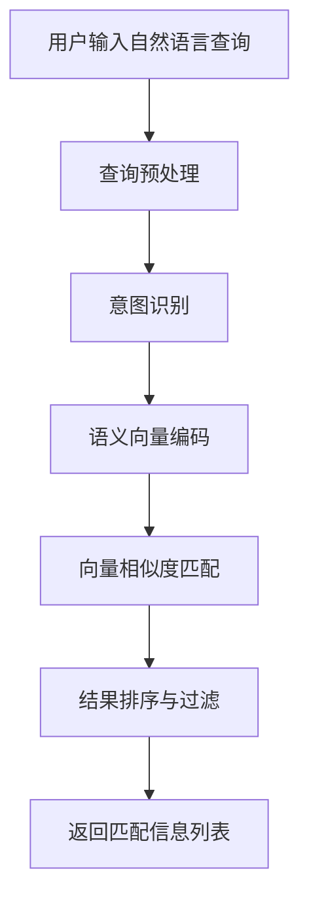
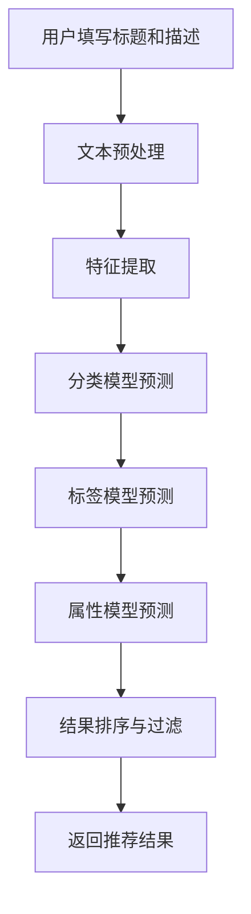
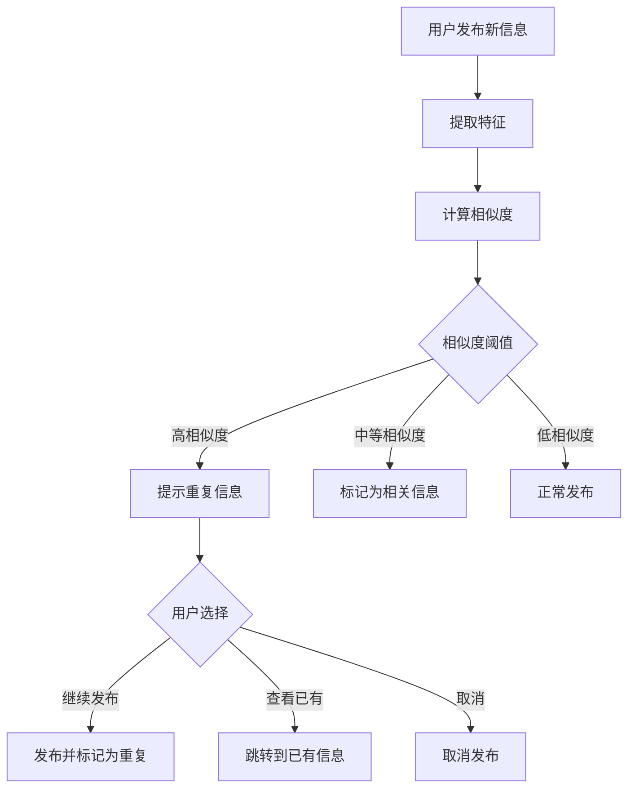
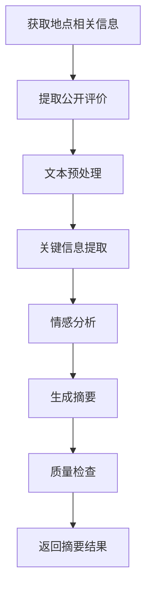
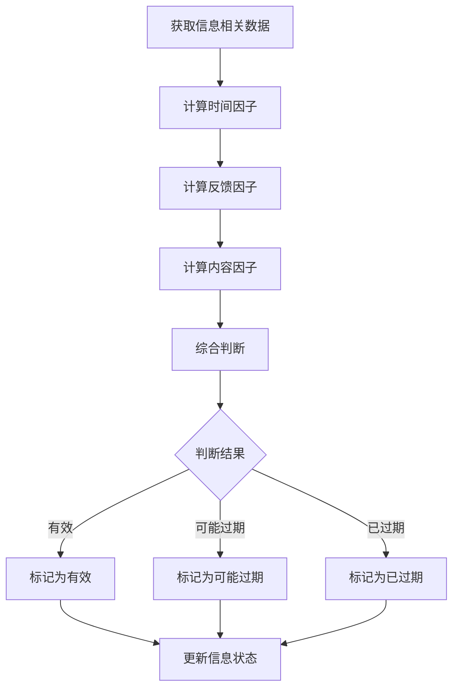
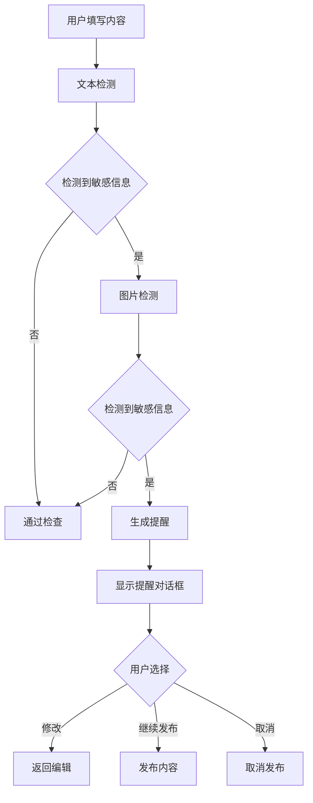

# AI 能力规划

> 此刻校园 · Moment Campus  
> 版本：1.0  
> 最后更新：2026-06-18

> **历史规划说明（2026-08-07）**：本文是早期 AI 能力草案。涉及距离、位置距离计算或按距离排序的内容已废弃；当前 AI 地点能力只整理当前学校地点的近期动态，来源快照和摘要版本必须经过管理员审核。

## 1. 概述

本文档规划"此刻校园"平台的 AI 能力，所有 AI 能力均为 P2 优先级（后续扩展功能），在第一版核心功能完成后逐步实现。

**AI 能力总体原则：**
- 只处理用户主动发布的公开内容
- 不得读取私人聊天、通讯录和个人行动轨迹
- 提供降级方案，确保无 AI 时系统仍可正常运行
- 保护用户隐私，遵循数据最小化原则

### 当前实现补充：AI 辅助发布建议

发布页 AI 助手在原有分类、摘要、有效期、遗漏信息和敏感提醒之外，可返回两个可选的优化结果：

- `optimized_title`：基于草稿润色标题，只改善清晰度和可读性，不改变事实。
- `optimized_content`：基于草稿润色正文，只改善结构和表达，不添加草稿中不存在的信息。

优化结果只作为建议展示，用户点击采纳后才会写入发布表单；旧版 `title` 等字段仍保留，模型未返回优化字段时不影响原有流程。

---

## 2. AI 语义搜索

### 2.1 功能描述

**输入：** 自然语言查询（如"十分钟内可以打印彩色照片的地方"、"适合晚上自习的安静教室"）

**输出：** 匹配的信息列表，按相关性排序

### 2.2 处理流程



**详细流程：**
1. **查询预处理**：分词、去除停用词、标准化
2. **意图识别**：识别查询意图（找地点、找服务、找活动等）
3. **语义向量编码**：将查询文本转换为语义向量
4. **向量相似度匹配**：在向量数据库中搜索相似内容
5. **结果排序与过滤**：结合有效性、距离、时间等因素排序
6. **返回结果**：返回匹配的信息列表

### 2.3 技术方案概述

**核心技术：**
- 文本嵌入模型：将文本转换为语义向量（如 BERT、Sentence-BERT）
- 向量数据库：存储和检索语义向量（如 Milvus、Pinecone、FAISS）
- 混合搜索：结合语义搜索和关键词搜索

**实现步骤：**
1. 构建文本嵌入服务
2. 将现有信息转换为向量并存储
3. 实现语义检索接口
4. 实现混合搜索（语义 + 关键词）
5. 优化排序算法

### 2.4 数据需求

**训练数据：**
- 校园信息文本数据（标题、描述、评论）
- 用户查询日志
- 标注数据（查询-信息匹配对）

**实时数据：**
- 新发布信息的向量表示
- 用户查询记录

### 2.5 隐私边界

**可处理数据：**
- 用户主动发布的公开信息（标题、描述、标签、评论）
- 公开地点信息
- 公开分类信息

**不可处理数据：**
- 用户私人聊天记录
- 用户通讯录
- 用户个人行动轨迹
- 未公开的草稿内容
- 匿名信息的发布者身份

### 2.6 降级方案

**无 AI 时的降级策略：**

1. **关键词搜索**
   - 使用传统全文搜索（如 Elasticsearch）
   - 支持模糊匹配和分词搜索
   - 搜索范围：标题、正文、地点名称、标签

2. **分类筛选**
   - 提供分类导航
   - 用户可按分类浏览
   - 支持多分类组合筛选

3. **标签匹配**
   - 基于标签的精确匹配
   - 热门标签推荐
   - 标签组合筛选

4. **地点筛选**
   - 基于地点的搜索
   - 距离排序
   - 地点热度排序

**降级实现：**
- 检测 AI 服务可用性
- 自动切换到关键词搜索模式
- 提示用户"正在使用基础搜索模式"

---

## 3. AI 标签推荐

### 3.1 功能描述

**输入：** 标题 + 描述文本

**输出：** 
- 推荐分类（1 个）
- 推荐标签（3-5 个）
- 推荐地点属性（室内/室外、精确/模糊）
- 推荐有效期类型（永久、短期、自定义）

### 3.2 处理流程



**详细流程：**
1. **文本预处理**：分词、去除停用词、标准化
2. **特征提取**：提取文本特征（关键词、语义特征）
3. **分类模型预测**：预测最匹配的分类
4. **标签模型预测**：预测最相关的标签
5. **属性模型预测**：预测地点属性和有效期类型
6. **结果排序与过滤**：按置信度排序，过滤低置信度结果
7. **返回推荐**：返回推荐结果供用户选择

### 3.3 技术方案概述

**核心技术：**
- 多标签分类模型：预测分类和标签
- 文本分类算法：如 BERT、TextCNN
- 规则引擎：基于规则的补充推荐

**实现步骤：**
1. 收集训练数据（历史发布信息）
2. 训练分类模型
3. 实现标签推荐服务
4. 实现属性推荐服务
5. 集成到发布流程

### 3.4 数据需求

**训练数据：**
- 历史发布信息（标题、描述、分类、标签）
- 地点属性数据
- 有效期类型数据
- 用户选择数据（用户最终选择的标签）

**实时数据：**
- 新发布信息的文本
- 用户选择行为

### 3.5 隐私边界

**可处理数据：**
- 用户当前填写的标题和描述
- 历史公开信息的分类和标签

**不可处理数据：**
- 用户私人聊天记录
- 用户通讯录
- 用户个人行动轨迹
- 其他用户的私人信息

### 3.6 降级方案

**无 AI 时的降级策略：**

1. **热门标签推荐**
   - 显示当前热门标签列表
   - 按分类显示热门标签
   - 用户手动选择

2. **分类默认标签**
   - 每个分类预设默认标签
   - 用户选择分类后自动显示默认标签
   - 用户可修改

3. **历史标签推荐**
   - 推荐用户过去使用过的标签
   - 推荐同分类下其他用户常用的标签

4. **手动输入**
   - 用户完全手动输入标签
   - 提供标签输入提示

**降级实现：**
- 检测 AI 服务可用性
- 自动切换到标签推荐列表模式
- 不提示用户，静默降级

---

## 4. 重复信息聚合

### 4.1 功能描述

**识别场景：**
- 同一地点重复帖子（如多次发布同一食堂窗口信息）
- 同一活动重复发布（如多次发布同一社团招新信息）
- 同一服务重复发布（如多次发布同一打印店信息）
- 相似内容聚合（如多个用户发布相似的美食推荐）

**输出：**
- 重复信息提示（发布时）
- 聚合信息展示（浏览时）

### 4.2 处理流程



**详细流程：**
1. **特征提取**：提取标题、描述、地点、分类等特征
2. **相似度计算**：计算与现有信息的相似度
3. **阈值判断**：根据相似度判断是否重复
4. **重复提示**：高相似度时提示用户
5. **聚合展示**：中等相似度时标记为相关信息
6. **用户选择**：用户可选择继续发布、查看已有信息或取消

### 4.3 技术方案概述

**核心技术：**
- 文本相似度计算：余弦相似度、Jaccard 相似度
- 地点匹配：地理位置距离计算
- 分类匹配：分类一致性检查
- 聚类算法：DBSCAN、K-means

**实现步骤：**
1. 实现文本相似度计算
2. 实现地点匹配算法
3. 实现综合相似度计算
4. 实现重复检测服务
5. 实现聚合展示逻辑

### 4.4 数据需求

**实时数据：**
- 新发布信息的特征
- 现有信息的特征库

**索引数据：**
- 标题索引
- 地点索引
- 分类索引
- 标签索引

### 4.5 隐私边界

**可处理数据：**
- 用户当前发布的信息
- 现有公开信息的特征

**不可处理数据：**
- 用户私人聊天记录
- 用户通讯录
- 用户个人行动轨迹
- 匿名信息的发布者身份

### 4.6 降级方案

**无 AI 时的降级策略：**

1. **标题相似度**
   - 基于字符串相似度算法（如编辑距离）
   - 检测标题高度相似的信息
   - 阈值：相似度 > 0.8

2. **地点匹配**
   - 精确匹配同一地点
   - 检测同一地点的相似内容

3. **分类匹配**
   - 同一分类下的重复检测
   - 结合标题和地点判断

4. **时间窗口**
   - 检测短时间内（如 7 天）的重复发布
   - 同一用户短时间内发布相似内容

**降级实现：**
- 使用规则引擎进行简单匹配
- 降低检测精度，提高召回率
- 提示用户"可能存在重复信息"

---

## 5. 信息摘要

### 5.1 功能描述

**输入：** 同一地点的多条公开评价（评论、信息描述）

**输出：** 
- 地点综合评价摘要（100-200 字）
- 保留原始内容入口

**应用场景：**
- 地点详情页显示摘要
- 帮助用户快速了解地点整体评价

### 5.2 处理流程



**详细流程：**
1. **获取地点相关信息**：获取该地点的所有公开信息
2. **提取公开评价**：提取评论和信息描述
3. **文本预处理**：分词、去除停用词、标准化
4. **关键信息提取**：提取关键观点和信息
5. **情感分析**：分析评价的情感倾向（正面、负面、中性）
6. **生成摘要**：综合生成摘要文本
7. **质量检查**：检查摘要质量和准确性
8. **返回结果**：返回摘要和原始内容入口

### 5.3 技术方案概述

**核心技术：**
- 文本摘要模型：抽取式摘要、生成式摘要
- 情感分析模型：分析评价情感
- 关键信息提取：提取关键观点

**实现步骤：**
1. 实现文本摘要服务
2. 实现情感分析服务
3. 实现关键信息提取
4. 集成到地点详情页
5. 定期更新摘要

### 5.4 数据需求

**输入数据：**
- 地点相关信息列表
- 地点相关评论列表
- 信息描述文本

**输出数据：**
- 摘要文本
- 情感分布
- 关键观点列表

### 5.5 隐私边界

**可处理数据：**
- 公开信息的描述
- 公开评论
- 地点公开信息

**不可处理数据：**
- 用户私人聊天记录
- 用户通讯录
- 用户个人行动轨迹
- 匿名评论的发布者身份
- 已删除的内容

### 5.6 降级方案

**无 AI 时的降级策略：**

1. **显示最新评论**
   - 显示最新的 5-10 条评论
   - 按时间倒序排列
   - 用户自行阅读

2. **显示热门评论**
   - 显示点赞数最多的评论
   - 按点赞数排序
   - 突出高质量评论

3. **显示统计信息**
   - 显示评论总数
   - 显示平均评分（如有）
   - 显示有效性确认统计

4. **显示标签云**
   - 提取评论中的关键词
   - 显示标签云
   - 帮助用户快速了解

**降级实现：**
- 检测 AI 服务可用性
- 自动切换到最新评论模式
- 显示"暂无摘要，显示最新评论"

---

## 6. 智能过期判断

### 6.1 功能描述

**考虑因素：**
- 发布时间
- 有效期设置
- 最后确认时间
- 失效反馈数
- 评论内容（提及"已关闭"、"已过期"等）
- 活动结束时间（活动类信息）
- 信息类型（活动、服务、美食等）

**输出：**
- 有效性状态（有效、可能过期、已过期）
- 过期判断理由
- 更新建议

### 6.2 处理流程



**详细流程：**
1. **获取信息相关数据**：获取发布时间、有效期、确认记录、评论等
2. **计算时间因子**：根据时间和有效期计算时间得分
3. **计算反馈因子**：根据有效性确认记录计算反馈得分
4. **计算内容因子**：根据评论内容计算内容得分
5. **综合判断**：综合各因子计算有效性状态
6. **更新状态**：更新信息的有效性状态

### 6.3 技术方案概述

**核心技术：**
- 规则引擎：基于规则的判断
- 机器学习模型：分类模型（可选）
- 时间序列分析：分析信息有效性变化趋势

**判断规则：**

```
有效性得分 = 
  时间得分 * 0.4 +
  反馈得分 * 0.4 +
  内容得分 * 0.2

时间得分：
- 未超过有效期：1.0
- 超过有效期 1-7 天：0.5
- 超过有效期 7 天以上：0.0

反馈得分：
- 有效确认数 > 失效确认数 * 2：1.0
- 有效确认数 > 失效确认数：0.5
- 失效确认数 >= 有效确认数：0.0

内容得分：
- 评论中无过期提及：1.0
- 评论中有过期提及：0.5
- 评论中多处提及过期：0.0

状态判断：
- 得分 > 0.7：有效
- 得分 0.4-0.7：可能过期
- 得分 < 0.4：已过期
```

### 6.4 数据需求

**输入数据：**
- 信息发布时间
- 信息有效期设置
- 有效性确认记录
- 评论内容
- 活动结束时间（如有）
- 信息分类

**实时数据：**
- 新的有效性确认
- 新的评论

### 6.5 隐私边界

**可处理数据：**
- 公开信息的时间信息
- 公开的有效性确认记录
- 公开评论内容

**不可处理数据：**
- 用户私人聊天记录
- 用户通讯录
- 用户个人行动轨迹
- 匿名确认的用户身份

### 6.6 降级方案

**无 AI 时的降级策略：**

1. **基于时间的简单规则**
   - 超过有效期自动标记为"可能过期"
   - 超过有效期 7 天标记为"已过期"
   - 无有效期设置的信息不自动过期

2. **基于反馈的简单规则**
   - 失效反馈数 >= 3：标记为"可能过期"
   - 失效反馈数 >= 5：标记为"已过期"

3. **基于活动时间的规则**
   - 活动结束时间已过：标记为"已过期"
   - 活动结束时间临近：标记为"可能过期"

4. **手动更新**
   - 提醒发布者定期更新
   - 用户可手动标记有效性

**降级实现：**
- 使用规则引擎进行简单判断
- 定期运行过期检查任务
- 发送过期提醒通知

---

## 7. 敏感信息提醒

### 7.1 功能描述

**检测内容：**
- 手机号（11 位数字）
- 身份证号（18 位数字）
- 私人聊天截图（图片 OCR）
- 宿舍精确房间号（如"XX 栋 XXX 室"）
- 个人二维码（图片识别）
- 微信号、QQ 号
- 银行卡号

**输出：**
- 敏感信息提示
- 敏感信息位置
- 修改建议

### 7.2 处理流程



**详细流程：**
1. **文本检测**：使用正则表达式检测文本中的敏感信息
2. **图片检测**：使用 OCR 和图片识别检测图片中的敏感信息
3. **生成提醒**：生成敏感信息提醒
4. **显示提醒**：显示提醒对话框
5. **用户选择**：用户可选择修改、继续发布或取消

### 7.3 技术方案概述

**核心技术：**
- 正则表达式：检测文本中的敏感信息
- OCR 技术：识别图片中的文字
- 图像识别：识别二维码等

**检测规则：**

```python
# 手机号检测
phone_pattern = r'1[3-9]\d{9}'

# 身份证号检测
id_card_pattern = r'\d{17}[\dXx]'

# 宿舍房间号检测
dorm_pattern = r'\d+栋\s*\d+室'

# 微信号检测
wechat_pattern = r'微信[：:]\s*\w+'

# QQ 号检测
qq_pattern = r'QQ[：:]\s*\d+'

# 银行卡号检测
bank_card_pattern = r'\d{16,19}'
```

### 7.4 数据需求

**规则数据：**
- 敏感信息正则表达式库
- 敏感关键词库
- 敏感图片特征库

### 7.5 隐私边界

**可处理数据：**
- 用户当前填写的内容
- 用户当前上传的图片

**不可处理数据：**
- 用户私人聊天记录
- 用户通讯录
- 用户个人行动轨迹
- 历史发布内容（除非重新编辑）

### 7.6 降级方案

**无 AI 时的降级策略：**

1. **正则匹配**
   - 使用正则表达式检测文本中的敏感信息
   - 检测手机号、身份证号、银行卡号等
   - 检测关键词（微信、QQ、宿舍等）

2. **关键词匹配**
   - 维护敏感关键词库
   - 检测文本中的敏感关键词
   - 提示用户检查

3. **简单图片检测**
   - 检测图片中是否包含文字（OCR）
   - 提示用户检查图片内容

4. **用户教育**
   - 提供隐私保护指南
   - 提醒用户注意隐私保护
   - 提供敏感信息示例

**降级实现：**
- 使用正则表达式进行文本检测
- 使用简单关键词匹配
- 不检测图片内容，仅提示用户注意
- 提示"建议检查内容是否包含敏感信息"

---

## 8. 实现优先级与顺序

### 8.1 实现优先级

所有 AI 能力均为 **P2 优先级**，在第一版核心功能（P0）和增强功能（P1）完成后实现。

### 8.2 实现顺序

**第一阶段：基础 AI 能力**
1. **敏感信息提醒**（最简单，规则明确）
   - 实现正则表达式检测
   - 集成到发布流程
   - 预计开发时间：1 周

2. **AI 标签推荐**（相对简单，数据需求少）
   - 实现文本分类模型
   - 集成到发布流程
   - 预计开发时间：2 周

**第二阶段：核心 AI 能力**
3. **智能过期判断**（规则明确，数据需求中等）
   - 实现规则引擎
   - 集成到信息状态管理
   - 预计开发时间：2 周

4. **重复信息聚合**（算法复杂，数据需求中等）
   - 实现相似度计算
   - 集成到发布和浏览流程
   - 预计开发时间：3 周

**第三阶段：高级 AI 能力**
5. **AI 语义搜索**（技术复杂，数据需求大）
   - 实现文本嵌入服务
   - 实现向量数据库
   - 集成到搜索功能
   - 预计开发时间：4 周

6. **信息摘要**（技术复杂，需要大量数据）
   - 实现文本摘要模型
   - 集成到地点详情页
   - 预计开发时间：3 周

### 8.3 技术依赖

**基础设施：**
- 向量数据库（Milvus/Faiss）
- 文本嵌入服务
- OCR 服务
- 模型训练平台

**数据准备：**
- 收集训练数据
- 数据标注
- 数据清洗

**人员需求：**
- AI 工程师：2-3 人
- 后端工程师：2 人
- 前端工程师：1 人

---

## 9. 隐私保护原则

### 9.1 核心原则

1. **数据最小化**
   - 只处理必要的公开数据
   - 不收集额外信息

2. **用户同意**
   - 明确告知用户 AI 功能
   - 提供关闭 AI 功能的选项

3. **透明性**
   - 告知用户 AI 处理的数据范围
   - 告知用户 AI 决策的依据

4. **可解释性**
   - AI 决策可解释
   - 用户可理解 AI 行为

### 9.2 数据使用边界

**可处理数据：**
- 用户主动发布的公开信息
- 公开评论和反馈
- 公开地点信息
- 公开分类和标签

**不可处理数据：**
- 用户私人聊天记录
- 用户通讯录
- 用户个人行动轨迹
- 匿名信息的发布者身份
- 已删除的内容
- 未公开的草稿内容

### 9.3 数据安全

**数据存储：**
- 加密存储敏感数据
- 定期清理过期数据
- 限制数据访问权限

**数据传输：**
- 使用 HTTPS 传输
- 加密敏感数据
- 防止数据泄露

**数据访问：**
- 限制 AI 系统的数据访问范围
- 记录数据访问日志
- 定期审计数据访问

---

## 10. 相关文档

- [产品需求文档](01_product_requirements.md)
- [用户角色与场景](02_user_roles_and_scenarios.md)
- [功能范围与优先级](03_feature_scope_and_priority.md)
- [社区治理](08_community_governance.md)
- [技术架构](11_technical_architecture.md)
