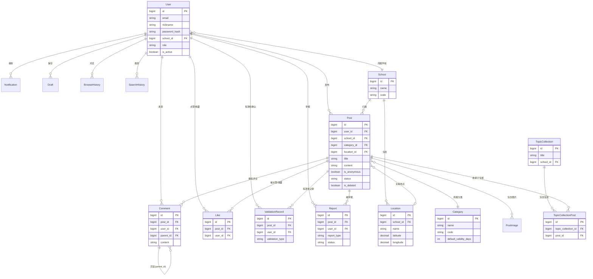

# 数据库设计

> 此刻校园 · Moment Campus
> 版本：1.0
> 最后更新：2026-06-18

---

## ⚠️ 文档过时声明（2026-07-26 修订）

> **本文档已过时，请勿作为开发或验收依据。**

**过时内容**：

- 本文档仅覆盖 **17 个核心实体**，实际运行数据库已有 **41 张表**（含多租户、订阅、平台管理、AI 日志、专题合集、官方发布主体等模块）
- 字段定义、约束、索引与实际 Alembic 迁移脚本（`backend/alembic/versions/` 22 条迁移）存在差异
- 文中的收藏实体和收藏计数属于已删除能力；现行数据库不存在 `favorites` 表和 `favorite_count` 字段

**正确参考资料**：

| 资料 | 位置 | 说明 |
|------|------|------|
| 实际表结构 | `backend/app/models/` | 40 个 SQLAlchemy 模型文件，权威源 |
| 实际索引 | `backend/alembic/versions/` | 22 条迁移脚本，231 个索引 |
| ER 图 | `docs/design/` | 6 个子系统 ER 图（.dot/.svg/.png） |
| 物理模型说明 | [docs/27_数据库物理模型设计.md](27_数据库物理模型设计.md) | 头部「课设交付物说明」已说明实际部署与课设交付物的差异 |

---

## 1. 文档概述

### 1.1 文档目的

本文档描述"此刻校园"平台的完整数据模型设计，涵盖 17 个核心实体的字段定义、约束、索引、关系及隐私安全要求，为后端开发和数据库建表提供规范指导。

### 1.2 设计原则

1. **软删除优先**：所有业务实体均采用软删除（`is_deleted` + `deleted_at`），保留数据可追溯性
2. **匿名不等于无主**：匿名发布仅在展示层隐藏发布者，数据库中始终记录真实发布者
3. **唯一约束防重复**：点赞、收藏等用户行为通过唯一约束防止重复操作
4. **时间标准化**：所有时间字段使用 UTC 存储，展示层转换为 `Asia/Shanghai`
5. **分类与类型分离**：`Category` 为内容分类（12 个固定分类），两者正交

---

## 2. 核心实体关系图

---

## 3. 实体详细设计

### 3.1 User（用户）

**中文名称：** 用户

**业务用途：** 平台注册用户，包括普通用户和管理员。用户归属某所学校，可发布信息、评论、互动。

**核心字段：**

| 字段名 | 类型 | 是否必填 | 默认值 | 说明 |
|--------|------|----------|--------|------|
| id | BIGINT | 是 | 自增 | 主键 |
| email | VARCHAR(255) | 是 | — | 登录邮箱，全局唯一 |
| nickname | VARCHAR(50) | 是 | — | 用户昵称（展示名） |
| password_hash | VARCHAR(255) | 是 | — | bcrypt 加密后的密码 |
| avatar_url | VARCHAR(500) | 否 | NULL | 头像地址 |
| school_id | BIGINT | 是 | — | 所属学校 FK |
| role | ENUM | 是 | 'user' | 角色：user / moderator / admin |
| bio | VARCHAR(500) | 否 | NULL | 个人简介 |
| is_active | BOOLEAN | 是 | true | 账户是否激活 |
| last_login_at | TIMESTAMP | 否 | NULL | 最后登录时间 |
| created_at | TIMESTAMP | 是 | CURRENT_TIMESTAMP | 注册时间 |
| updated_at | TIMESTAMP | 是 | CURRENT_TIMESTAMP | 更新时间 |
| is_deleted | BOOLEAN | 是 | false | 是否软删除 |
| deleted_at | TIMESTAMP | 否 | NULL | 删除时间 |

**唯一约束：**
- `email` 全局唯一
- `(school_id, email)` 联合唯一（同一邮箱不同学校视为不同账户，预留多校扩展）

**状态字段：**
- `is_active`：true=正常，false=禁用（管理员封禁或未完成邮箱验证）
- `role`：user=普通用户，moderator=版主，admin=管理员

**与其他实体的关系：**
- 属于一个 School（多对一）
- 发布多个 Post（一对多）
- 发表多个 Comment（一对多）
- 拥有多个 Like / ValidationRecord / Report / Notification / Draft / BrowseHistory / SearchHistory（一对多）

**删除策略：** 软删除（`is_deleted` + `deleted_at`）。删除后昵称显示为"已注销用户"，发布内容保留但匿名化。

**索引建议：**
- `idx_user_email` UNIQUE on `email`
- `idx_user_school` on `school_id`
- `idx_user_role` on `role`
- `idx_user_created` on `created_at`

**隐私和安全要求：**
- 密码使用 bcrypt（cost factor ≥ 12）加密存储
- 邮箱需验证后方可使用
- 软删除后个人信息不对外展示
- 登录失败记录 IP 和时间，5 次失败锁定 15 分钟

---

### 3.2 School（学校）

**中文名称：** 学校

**业务用途：** 平台支持的高校/校区。所有信息按学校隔离，用户必须选择所属学校。

**核心字段：**

| 字段名 | 类型 | 是否必填 | 默认值 | 说明 |
|--------|------|----------|--------|------|
| id | BIGINT | 是 | 自增 | 主键 |
| name | VARCHAR(100) | 是 | — | 学校名称 |
| code | VARCHAR(20) | 是 | — | 学校编码（如 edu 域名前缀） |
| logo_url | VARCHAR(500) | 否 | NULL | 学校 Logo |
| province | VARCHAR(50) | 否 | NULL | 省份 |
| city | VARCHAR(50) | 否 | NULL | 城市 |
| address | VARCHAR(255) | 否 | NULL | 详细地址 |
| center_lat | DECIMAL(10,7) | 否 | NULL | 校园中心纬度 |
| center_lng | DECIMAL(10,7) | 否 | NULL | 校园中心经度 |
| map_zoom | INT | 否 | 15 | 默认地图缩放级别 |
| is_active | BOOLEAN | 是 | true | 是否开放 |
| created_at | TIMESTAMP | 是 | CURRENT_TIMESTAMP | 创建时间 |
| updated_at | TIMESTAMP | 是 | CURRENT_TIMESTAMP | 更新时间 |

**唯一约束：**
- `code` 全局唯一

**状态字段：**
- `is_active`：true=开放注册，false=暂停

**与其他实体的关系：**
- 拥有多个 User（一对多）
- 拥有多个 Post（一对多）
- 拥有多个 Location（一对多）
- 拥有多个 TopicCollection（一对多）

**删除策略：** 不删除（系统基础数据）。如需下线，通过 `is_active=false` 实现。

**索引建议：**
- `idx_school_code` UNIQUE on `code`
- `idx_school_active` on `is_active`

**隐私和安全要求：**
- 学校信息为公开数据，无特殊隐私要求
- 仅管理员可创建和编辑学校

---

### 3.3 Post（信息/帖子）

**中文名称：** 信息（帖子）

**业务用途：** 平台核心内容实体，用户发布的校园信息。通过 `category_id` 区分内容分类（美食/动物/打印等）。

**核心字段：**

| 字段名 | 类型 | 是否必填 | 默认值 | 说明 |
|--------|------|----------|--------|------|
| id | BIGINT | 是 | 自增 | 主键 |
| user_id | BIGINT | 是 | — | 发布者 FK（即使匿名也记录真实用户） |
| school_id | BIGINT | 是 | — | 所属学校 FK |
| category_id | BIGINT | 是 | — | 内容分类 FK |
| location_id | BIGINT | 否 | NULL | 关联地点 FK |
| title | VARCHAR(200) | 是 | — | 标题 |
| content | TEXT | 是 | — | 正文内容 |
| is_anonymous | BOOLEAN | 是 | false | 是否匿名发布（仅影响展示层） |
| status | ENUM | 是 | 'pending' | 审核状态 |
| view_count | INT | 是 | 0 | 浏览次数 |
| like_count | INT | 是 | 0 | 点赞数（冗余计数） |
| comment_count | INT | 是 | 0 | 评论数（冗余计数） |
| valid_count | INT | 是 | 0 | 确认有效数（冗余计数） |
| invalid_count | INT | 是 | 0 | 确认无效数（冗余计数） |
| expire_at | TIMESTAMP | 否 | NULL | 信息过期时间（根据分类默认有效期或自定义） |
| activity_start_at | TIMESTAMP | 否 | NULL | 活动开始时间（仅活动类型使用） |
| activity_end_at | TIMESTAMP | 否 | NULL | 活动结束时间（仅活动类型使用） |
| lost_type | ENUM | 否 | NULL | 失物类型：lost=丢失 / found=拾到（仅失物招领类型） |
| contact_info | VARCHAR(255) | 否 | NULL | 联系方式（失物招领可选） |
| is_top | BOOLEAN | 是 | false | 是否置顶 |
| is_recommend | BOOLEAN | 是 | false | 是否推荐 |
| created_at | TIMESTAMP | 是 | CURRENT_TIMESTAMP | 发布时间 |
| updated_at | TIMESTAMP | 是 | CURRENT_TIMESTAMP | 更新时间 |
| is_deleted | BOOLEAN | 是 | false | 是否软删除 |
| deleted_at | TIMESTAMP | 否 | NULL | 删除时间 |

**唯一约束：**
- 无（Post 本身无唯一约束，通过 id 唯一标识）

**状态字段：**
- `status`：draft=草稿，pending=待审核，published=已发布，rejected=已拒绝，hidden=已隐藏
- `is_anonymous`：true=匿名展示（但数据库仍记录 user_id），false=正常展示
- `is_top`：true=置顶，false=普通
- `is_recommend`：true=推荐，false=普通

**时间字段说明：**
- `expire_at`：根据分类默认有效期自动计算，用户可手动延长
- `activity_start_at` / `activity_end_at`：仅当信息为"活动"类型时使用
- 失物招领类型使用默认 30 天有效期

**与其他实体的关系：**
- 属于一个 User（多对一）
- 属于一个 School（多对一）
- 属于一个 Category（多对一）
- 关联一个 Location（多对一，可选）
- 拥有多个 PostImage（一对多）
- 拥有多个 Comment / Like / ValidationRecord / Report（一对多）
- 可被多个 TopicCollectionPost 收录（一对多）

**删除策略：** 软删除（`is_deleted` + `deleted_at`）。删除后关联的 Comment、Like 保留但不再展示。

**索引建议：**
- `idx_post_user` on `user_id`
- `idx_post_school_status` on `school_id, status`
- `idx_post_category` on `category_id`
- `idx_post_location` on `location_id`
- `idx_post_status_created` on `status, created_at DESC`
- `idx_post_status_recommend` on `status, is_recommend, created_at DESC`
- `idx_post_expire` on `expire_at`
- `idx_post_school_category` on `school_id, category_id, status`

**隐私和安全要求：**
- 匿名发布时 API 层不返回 `user_id`，但数据库必须保存
- `contact_info` 为敏感字段，仅登录后可见，且需加密存储
- 内容需经过敏感词过滤和审核流程
- 软删除后内容不对外展示

---

### 3.4 Category（分类）

**中文名称：** 分类

**业务用途：** 内容分类体系，共 12 个固定分类（校园美食、校园动物、打印服务等）。每个分类有独立的特有字段和默认有效期。

**核心字段：**

| 字段名 | 类型 | 是否必填 | 默认值 | 说明 |
|--------|------|----------|--------|------|
| id | BIGINT | 是 | 自增 | 主键 |
| name | VARCHAR(50) | 是 | — | 分类名称（如"校园美食"） |
| code | VARCHAR(30) | 是 | — | 分类编码（如 food / animal / print） |
| icon | VARCHAR(10) | 是 | — | 分类图标（emoji） |
| description | VARCHAR(200) | 否 | NULL | 分类描述 |
| default_validity_days | INT | 是 | 30 | 默认有效天数 |
| sort_order | INT | 是 | 0 | 排序权重 |
| is_active | BOOLEAN | 是 | true | 是否启用 |
| created_at | TIMESTAMP | 是 | CURRENT_TIMESTAMP | 创建时间 |
| updated_at | TIMESTAMP | 是 | CURRENT_TIMESTAMP | 更新时间 |

**唯一约束：**
- `code` 全局唯一

**状态字段：**
- `is_active`：true=启用，false=停用

**与其他实体的关系：**
- 被多个 Post 引用（一对多）

**删除策略：** 不硬删除，通过 `is_active=false` 停用。

**索引建议：**
- `idx_category_code` UNIQUE on `code`
- `idx_category_sort` on `sort_order`

**隐私和安全要求：**
- 系统配置数据，仅管理员可维护

---

### 3.6 PostImage（信息图片）

**中文名称：** 信息图片

**业务用途：** 存储信息关联的图片，一条信息可包含多张图片（最多 9 张）。

**核心字段：**

| 字段名 | 类型 | 是否必填 | 默认值 | 说明 |
|--------|------|----------|--------|------|
| id | BIGINT | 是 | 自增 | 主键 |
| post_id | BIGINT | 是 | — | 信息 FK |
| image_url | VARCHAR(500) | 是 | — | 图片地址 |
| thumbnail_url | VARCHAR(500) | 否 | NULL | 缩略图地址 |
| sort_order | INT | 是 | 0 | 排序序号 |
| file_size | INT | 否 | NULL | 文件大小（字节） |
| width | INT | 否 | NULL | 图片宽度 |
| height | INT | 否 | NULL | 图片高度 |
| created_at | TIMESTAMP | 是 | CURRENT_TIMESTAMP | 创建时间 |
| is_deleted | BOOLEAN | 是 | false | 是否软删除 |
| deleted_at | TIMESTAMP | 否 | NULL | 删除时间 |

**唯一约束：**
- 无

**与其他实体的关系：**
- 属于一个 Post（多对一）

**删除策略：** 软删除。信息删除时图片一并软删除。

**索引建议：**
- `idx_postimage_post` on `post_id, sort_order`

**隐私和安全要求：**
- 图片上传需经过内容安全审核（涉黄/涉暴检测）
- 图片 URL 使用签名 URL 防止盗链
- 单张图片大小限制 10MB

---

### 3.9 Location（地点）

**中文名称：** 地点

**业务用途：** 校园内的具体地点，包含地理坐标。地点与信息为一对多关系：一个地点可关联多条信息，一条信息最多关联一个地点。

**核心字段：**

| 字段名 | 类型 | 是否必填 | 默认值 | 说明 |
|--------|------|----------|--------|------|
| id | BIGINT | 是 | 自增 | 主键 |
| school_id | BIGINT | 是 | — | 所属学校 FK |
| name | VARCHAR(100) | 是 | — | 地点名称 |
| description | VARCHAR(500) | 否 | NULL | 地点描述 |
| latitude | DECIMAL(10,7) | 是 | — | 纬度 |
| longitude | DECIMAL(10,7) | 是 | — | 经度 |
| floor | VARCHAR(10) | 否 | NULL | 楼层信息 |
| building | VARCHAR(100) | 否 | NULL | 所属建筑 |
| post_count | INT | 是 | 0 | 关联信息数（冗余计数） |
| is_verified | BOOLEAN | 是 | false | 是否已验证（管理员确认地点准确） |
| created_at | TIMESTAMP | 是 | CURRENT_TIMESTAMP | 创建时间 |
| updated_at | TIMESTAMP | 是 | CURRENT_TIMESTAMP | 更新时间 |
| is_deleted | BOOLEAN | 是 | false | 是否软删除 |
| deleted_at | TIMESTAMP | 否 | NULL | 删除时间 |

**唯一约束：**
- `(school_id, name, latitude, longitude)` 联合唯一（同一学校内同名同坐标地点不重复）

**与其他实体的关系：**
- 属于一个 School（多对一）
- 被多个 Post 引用（一对多）

**删除策略：** 软删除。地点删除后，关联 Post 的 `location_id` 置为 NULL。

**索引建议：**
- `idx_location_school` on `school_id`
- `idx_location_coords` on `latitude, longitude`
- `idx_location_school_name` on `school_id, name`
- `idx_location_verified` on `is_verified`

**隐私和安全要求：**
- 地点坐标精度保留 7 位小数（约 1cm 精度）
- 地点信息为公开数据
- 用户创建地点需管理员验证后方可使用

---

### 3.10 Comment（评论）

**中文名称：** 评论

**业务用途：** 用户对信息的评论和回复。通过 `parent_id` 自引用实现树形回复结构。

**核心字段：**

| 字段名 | 类型 | 是否必填 | 默认值 | 说明 |
|--------|------|----------|--------|------|
| id | BIGINT | 是 | 自增 | 主键 |
| post_id | BIGINT | 是 | — | 所属信息 FK |
| user_id | BIGINT | 是 | — | 评论者 FK |
| parent_id | BIGINT | 否 | NULL | 父评论 ID（自引用，NULL 表示顶级评论） |
| reply_to_user_id | BIGINT | 否 | NULL | 回复目标用户 FK（用于 @某人） |
| content | TEXT | 是 | — | 评论内容 |
| like_count | INT | 是 | 0 | 点赞数（冗余计数） |
| status | ENUM | 是 | 'pending' | 审核状态 |
| created_at | TIMESTAMP | 是 | CURRENT_TIMESTAMP | 评论时间 |
| updated_at | TIMESTAMP | 是 | CURRENT_TIMESTAMP | 更新时间 |
| is_deleted | BOOLEAN | 是 | false | 是否软删除 |
| deleted_at | TIMESTAMP | 否 | NULL | 删除时间 |

**唯一约束：**
- 无

**状态字段：**
- `status`：pending=待审核，published=已发布，hidden=已隐藏
- `parent_id`：NULL=顶级评论，非 NULL=回复某条评论

**回复结构说明：**
- 采用 `parent_id` 自引用模式
- 顶级评论：`parent_id = NULL`
- 回复评论：`parent_id = 被回复评论的 id`
- 查询某信息的所有评论：`WHERE post_id = ? AND parent_id IS NULL`（顶级评论），再嵌套查询子评论
- 最大嵌套层级建议限制为 3 层，超过后自动平铺

**与其他实体的关系：**
- 属于一个 Post（多对一）
- 属于一个 User（多对一）
- 可回复自身（parent_id 自引用）
- 可指定回复目标用户（reply_to_user_id）

**删除策略：** 软删除。删除后内容显示为"该评论已被删除"，子评论保留。

**索引建议：**
- `idx_comment_post` on `post_id, created_at`
- `idx_comment_parent` on `parent_id`
- `idx_comment_user` on `user_id`
- `idx_comment_status` on `status`

**隐私和安全要求：**
- 评论内容需经过敏感词过滤
- 匿名信息的评论中，评论者身份正常展示（匿名仅针对信息发布者）
- 评论频率限制：每分钟最多 10 条

---

### 3.11 Like（点赞）

**中文名称：** 点赞

**业务用途：** 用户对信息的点赞操作。用户对同一信息只能点赞一次。

**核心字段：**

| 字段名 | 类型 | 是否必填 | 默认值 | 说明 |
|--------|------|----------|--------|------|
| id | BIGINT | 是 | 自增 | 主键 |
| post_id | BIGINT | 是 | — | 信息 FK |
| user_id | BIGINT | 是 | — | 点赞用户 FK |
| created_at | TIMESTAMP | 是 | CURRENT_TIMESTAMP | 点赞时间 |

**唯一约束：**
- `(post_id, user_id)` 联合唯一 — 确保用户对同一信息只能点赞一次

**与其他实体的关系：**
- 属于一个 Post（多对一）
- 属于一个 User（多对一）

**删除策略：** 硬删除。取消点赞时直接删除记录。

**索引建议：**
- `idx_like_post_user` UNIQUE on `(post_id, user_id)`
- `idx_like_user` on `user_id`

**隐私和安全要求：**
- 点赞行为对他人可见（用于社交展示）
- 需防止刷赞（频率限制：每秒最多 5 次）

---

### 3.12 ValidationRecord（有效性确认记录）

**中文名称：** 有效性确认记录

**业务用途：** 用户反馈信息是否仍然有效（核心社区治理功能）。用户可以多次反馈有效性，系统保留所有历史记录。与 Like 不同，不设置唯一约束。

**核心字段：**

| 字段名 | 类型 | 是否必填 | 默认值 | 说明 |
|--------|------|----------|--------|------|
| id | BIGINT | 是 | 自增 | 主键 |
| post_id | BIGINT | 是 | — | 信息 FK |
| user_id | BIGINT | 是 | — | 确认用户 FK |
| validation_type | ENUM | 是 | — | 确认类型：valid=有效，invalid=无效 |
| comment | VARCHAR(500) | 否 | NULL | 补充说明（如"已搬迁"） |
| created_at | TIMESTAMP | 是 | CURRENT_TIMESTAMP | 确认时间 |

**唯一约束：**
- 无 — 允许用户多次反馈同一信息的有效性，保留完整历史

**状态字段：**
- `validation_type`：valid=确认有效，invalid=确认无效

**设计说明：**
- 与 Like 不同，ValidationRecord 不设唯一约束
- 同一用户可对同一信息多次反馈（如先确认有效，后发现已失效再确认无效）
- 冗余计数 `Post.valid_count` / `Post.invalid_count` 取每个用户最近一次反馈汇总
- 当 `invalid_count > valid_count` 时，信息标记为"疑似失效"，通知发布者确认

**与其他实体的关系：**
- 属于一个 Post（多对一）
- 属于一个 User（多对一）

**删除策略：** 硬删除。用户撤回反馈时删除记录。

**索引建议：**
- `idx_validation_post` on `post_id, created_at DESC`
- `idx_validation_user` on `user_id`
- `idx_validation_post_type` on `post_id, validation_type`

**隐私和安全要求：**
- 有效性反馈对所有人可见（社区透明）
- 频率限制：同一用户对同一信息每小时最多反馈 3 次

---

### 3.14 Report（举报）

**中文名称：** 举报

**业务用途：** 用户举报违规内容，进入管理员审核队列。

**核心字段：**

| 字段名 | 类型 | 是否必填 | 默认值 | 说明 |
|--------|------|----------|--------|------|
| id | BIGINT | 是 | 自增 | 主键 |
| post_id | BIGINT | 否 | NULL | 被举报信息 FK（举报评论时可为 NULL） |
| comment_id | BIGINT | 否 | NULL | 被举报评论 FK（举报信息时可为 NULL） |
| reporter_id | BIGINT | 是 | — | 举报人 FK |
| report_type | ENUM | 是 | — | 举报类型：fake=虚假 / ad=广告 / privacy=隐私泄露 / illegal=违法违规 / inappropriate=不当内容 / other=其他 |
| description | TEXT | 否 | NULL | 举报说明 |
| status | ENUM | 是 | 'pending' | 处理状态 |
| handler_id | BIGINT | 否 | NULL | 处理管理员 FK |
| handle_result | TEXT | 否 | NULL | 处理结果说明 |
| handled_at | TIMESTAMP | 否 | NULL | 处理时间 |
| created_at | TIMESTAMP | 是 | CURRENT_TIMESTAMP | 举报时间 |
| updated_at | TIMESTAMP | 是 | CURRENT_TIMESTAMP | 更新时间 |

**唯一约束：**
- `(post_id, reporter_id)` 联合唯一（同一用户对同一信息只能举报一次；评论举报同理加 `(comment_id, reporter_id)`）

**状态字段：**
- `status`：pending=待处理，processing=处理中，resolved=已解决，dismissed=已驳回

**与其他实体的关系：**
- 关联一个 Post（多对一，可选）
- 关联一个 Comment（多对一，可选）
- 属于一个举报人 User（多对一）
- 由一个管理员 User 处理（多对一）

**删除策略：** 不删除。举报记录永久保留用于审计。

**索引建议：**
- `idx_report_post_reporter` UNIQUE on `(post_id, reporter_id)`
- `idx_report_status` on `status, created_at`
- `idx_report_handler` on `handler_id`

**隐私和安全要求：**
- 举报人信息对管理员可见，对被举报人不可见
- 举报记录为敏感数据，仅管理员角色可访问
- 举报处理时效要求：被举报内容 4 小时内处理

---

### 3.15 Notification（通知）

**中文名称：** 通知

**业务用途：** 向用户推送系统通知和互动消息（被评论、被点赞、被收藏、审核结果、系统公告等）。

**核心字段：**

| 字段名 | 类型 | 是否必填 | 默认值 | 说明 |
|--------|------|----------|--------|------|
| id | BIGINT | 是 | 自增 | 主键 |
| user_id | BIGINT | 是 | — | 接收通知的用户 FK |
| type | ENUM | 是 | — | 通知类型：comment=新评论 / reply=新回复 / like=新点赞 / validation=有效性变更 / system=系统通知 / audit=审核结果 |
| title | VARCHAR(200) | 是 | — | 通知标题 |
| content | VARCHAR(500) | 否 | NULL | 通知内容摘要 |
| target_type | VARCHAR(50) | 否 | NULL | 关联对象类型（post / comment / user） |
| target_id | BIGINT | 否 | NULL | 关联对象 ID |
| actor_id | BIGINT | 否 | NULL | 触发者用户 FK（系统通知为 NULL） |
| is_read | BOOLEAN | 是 | false | 是否已读 |
| read_at | TIMESTAMP | 否 | NULL | 阅读时间 |
| created_at | TIMESTAMP | 是 | CURRENT_TIMESTAMP | 创建时间 |
| is_deleted | BOOLEAN | 是 | false | 是否软删除 |
| deleted_at | TIMESTAMP | 否 | NULL | 删除时间 |

**唯一约束：**
- 无

**状态字段：**
- `is_read`：true=已读，false=未读

**通知类型说明：**
- `comment`：有人评论了你的信息
- `reply`：有人回复了你的评论
- `like`：有人点赞了你的信息
- `validation`：你的信息有效性状态变更
- `system`：系统公告
- `audit`：信息审核结果

**与其他实体的关系：**
- 属于一个接收用户 User（多对一）
- 可由一个触发者 User 引起（多对一，可选）
- 可关联一个 Post 或 Comment（可选）

**删除策略：** 软删除。用户删除通知仅对本人不可见。

**索引建议：**
- `idx_notification_user_read` on `user_id, is_read, created_at DESC`
- `idx_notification_user_type` on `user_id, type`
- `idx_notification_target` on `target_type, target_id`

**隐私和安全要求：**
- 通知仅接收者可见
- 匿名信息的互动通知中，触发者信息正常展示
- 通知数据定期清理（已读通知保留 90 天）

---

### 3.16 TopicCollection（专题集合）

**中文名称：** 专题集合

**业务用途：** 管理员或版主创建的主题信息集合，将相关信息组织为专题（如"新生入学指南"、"毕业季攻略"），便于用户系统性浏览。

**核心字段：**

| 字段名 | 类型 | 是否必填 | 默认值 | 说明 |
|--------|------|----------|--------|------|
| id | BIGINT | 是 | 自增 | 主键 |
| title | VARCHAR(200) | 是 | — | 专题标题 |
| description | TEXT | 否 | NULL | 专题描述 |
| cover_url | VARCHAR(500) | 否 | NULL | 封面图片 |
| school_id | BIGINT | 是 | — | 所属学校 FK |
| creator_id | BIGINT | 是 | — | 创建者 FK |
| post_count | INT | 是 | 0 | 收录信息数（冗余计数） |
| view_count | INT | 是 | 0 | 浏览次数 |
| status | ENUM | 是 | 'draft' | 状态 |
| sort_order | INT | 是 | 0 | 排序权重 |
| published_at | TIMESTAMP | 否 | NULL | 发布时间 |
| created_at | TIMESTAMP | 是 | CURRENT_TIMESTAMP | 创建时间 |
| updated_at | TIMESTAMP | 是 | CURRENT_TIMESTAMP | 更新时间 |
| is_deleted | BOOLEAN | 是 | false | 是否软删除 |
| deleted_at | TIMESTAMP | 否 | NULL | 删除时间 |

**唯一约束：**
- 无

**状态字段：**
- `status`：draft=草稿，published=已发布，archived=已归档

**与其他实体的关系：**
- 属于一个 School（多对一）
- 属于一个创建者 User（多对一）
- 通过 TopicCollectionPost 关联多个 Post（多对多）

**删除策略：** 软删除。删除时同步清理 TopicCollectionPost 关联。

**索引建议：**
- `idx_topic_school` on `school_id, status`
- `idx_topic_sort` on `sort_order`
- `idx_topic_creator` on `creator_id`

**隐私和安全要求：**
- 专题仅管理员/版主可创建
- 专题内容为公开信息

---

### 3.17 TopicCollectionPost（专题-信息关联）

**中文名称：** 专题-信息关联

**业务用途：** 实现 TopicCollection 与 Post 的多对多关系，记录信息在专题中的排序。

**核心字段：**

| 字段名 | 类型 | 是否必填 | 默认值 | 说明 |
|--------|------|----------|--------|------|
| id | BIGINT | 是 | 自增 | 主键 |
| topic_collection_id | BIGINT | 是 | — | 专题 FK |
| post_id | BIGINT | 是 | — | 信息 FK |
| sort_order | INT | 是 | 0 | 在专题中的排序 |
| created_at | TIMESTAMP | 是 | CURRENT_TIMESTAMP | 创建时间 |

**唯一约束：**
- `(topic_collection_id, post_id)` 联合唯一

**与其他实体的关系：**
- 属于一个 TopicCollection（多对一）
- 属于一个 Post（多对一）

**删除策略：** 硬删除。移除关联时直接删除记录。

**索引建议：**
- `idx_tcp_topic_post` UNIQUE on `(topic_collection_id, post_id)`
- `idx_tcp_post` on `post_id`

**隐私和安全要求：**
- 无特殊要求

---

### 3.18 Draft（草稿）

**中文名称：** 草稿

**业务用途：** 用户未完成的发布信息，支持自动保存和手动保存草稿。

**核心字段：**

| 字段名 | 类型 | 是否必填 | 默认值 | 说明 |
|--------|------|----------|--------|------|
| id | BIGINT | 是 | 自增 | 主键 |
| user_id | BIGINT | 是 | — | 用户 FK |
| title | VARCHAR(200) | 否 | NULL | 草稿标题 |
| content | TEXT | 否 | NULL | 草稿内容 |
| category_id | BIGINT | 否 | NULL | 分类 FK（预选） |
| location_id | BIGINT | 否 | NULL | 地点 FK（预选） |
| is_anonymous | BOOLEAN | 是 | false | 是否匿名 |
| extra_data | JSON | 否 | NULL | 扩展字段（图片列表、标签、特有字段等，JSON 格式） |
| created_at | TIMESTAMP | 是 | CURRENT_TIMESTAMP | 创建时间 |
| updated_at | TIMESTAMP | 是 | CURRENT_TIMESTAMP | 更新时间 |
| is_deleted | BOOLEAN | 是 | false | 是否软删除 |
| deleted_at | TIMESTAMP | 否 | NULL | 删除时间 |

**唯一约束：**
- 无

**设计说明：**
- 草稿使用 `extra_data` JSON 字段存储不确定的扩展数据（图片、标签、活动/失物特有字段等），避免为草稿创建大量关联表
- 草稿发布时，从 `extra_data` 解析数据并创建正式的 Post 及关联记录

**与其他实体的关系：**
- 属于一个 User（多对一）
- 预选关联 Category / Location（可选）

**删除策略：** 软删除。用户删除草稿后标记为已删除。

**索引建议：**
- `idx_draft_user` on `user_id, updated_at DESC`

**隐私和安全要求：**
- 草稿仅创建者可见
- 草稿内容不经过审核

---

### 3.19 BrowseHistory（浏览历史）

**中文名称：** 浏览历史

**业务用途：** 记录用户浏览过的信息，用于个性化推荐和用户查看历史记录。

**核心字段：**

| 字段名 | 类型 | 是否必填 | 默认值 | 说明 |
|--------|------|----------|--------|------|
| id | BIGINT | 是 | 自增 | 主键 |
| user_id | BIGINT | 是 | — | 用户 FK |
| post_id | BIGINT | 是 | — | 信息 FK |
| created_at | TIMESTAMP | 是 | CURRENT_TIMESTAMP | 浏览时间 |

**唯一约束：**
- 无 — 同一用户可多次浏览同一信息，每次记录独立

**设计说明：**
- 浏览历史定期清理（保留 90 天）
- 同一用户短时间内（如 5 分钟内）重复浏览同一信息，仅保留最新记录（通过定时任务去重）
- 游客浏览不记录（仅登录用户）

**与其他实体的关系：**
- 属于一个 User（多对一）
- 属于一个 Post（多对一）

**删除策略：** 硬删除。过期数据由定时任务清理。

**索引建议：**
- `idx_browse_user` on `user_id, created_at DESC`
- `idx_browse_post` on `post_id`

**隐私和安全要求：**
- 浏览历史仅本人可见
- 用户可手动清除自己的浏览历史
- 浏览历史数据不对外提供

---

### 3.20 SearchHistory（搜索历史）

**中文名称：** 搜索历史

**业务用途：** 记录用户的搜索关键词，用于搜索建议和历史记录展示。

**核心字段：**

| 字段名 | 类型 | 是否必填 | 默认值 | 说明 |
|--------|------|----------|--------|------|
| id | BIGINT | 是 | 自增 | 主键 |
| user_id | BIGINT | 是 | — | 用户 FK |
| keyword | VARCHAR(200) | 是 | — | 搜索关键词 |
| result_count | INT | 否 | NULL | 搜索结果数 |
| created_at | TIMESTAMP | 是 | CURRENT_TIMESTAMP | 搜索时间 |

**唯一约束：**
- 无 — 同一关键词可多次搜索

**设计说明：**
- 搜索历史保留最近 50 条（按用户维度）
- 定期清理（保留 30 天）
- 游客搜索不记录

**与其他实体的关系：**
- 属于一个 User（多对一）

**删除策略：** 硬删除。用户可手动清除，过期数据由定时任务清理。

**索引建议：**
- `idx_search_user` on `user_id, created_at DESC`
- `idx_search_keyword` on `keyword`

**隐私和安全要求：**
- 搜索历史仅本人可见
- 搜索关键词需过滤敏感词
- 搜索记录不对外提供

---

### 3.21 AdminOperationLog（管理员操作日志）

**中文名称：** 管理员操作日志

**业务用途：** 记录管理员的所有操作，用于审计追溯和安全监控。

**核心字段：**

| 字段名 | 类型 | 是否必填 | 默认值 | 说明 |
|--------|------|----------|--------|------|
| id | BIGINT | 是 | 自增 | 主键 |
| admin_id | BIGINT | 是 | — | 操作管理员 FK |
| action | VARCHAR(50) | 是 | — | 操作类型（如 post_approve / post_reject / post_hide / user_ban / report_handle 等） |
| target_type | VARCHAR(50) | 是 | — | 操作对象类型（post / user / report / comment / category 等） |
| target_id | BIGINT | 是 | — | 操作对象 ID |
| detail | JSON | 否 | NULL | 操作详情（变更前后值等） |
| ip_address | VARCHAR(45) | 否 | NULL | 操作 IP 地址 |
| user_agent | VARCHAR(500) | 否 | NULL | 浏览器 User-Agent |
| created_at | TIMESTAMP | 是 | CURRENT_TIMESTAMP | 操作时间 |

**唯一约束：**
- 无

**操作类型说明：**
- `post_approve`：审核通过信息
- `post_reject`：审核拒绝信息
- `post_hide`：隐藏信息
- `post_restore`：恢复信息
- `user_ban`：封禁用户
- `user_unban`：解封用户
- `report_handle`：处理举报
- `category_create`：创建分类
- `category_update`：修改分类
- `topic_create`：创建专题
- `topic_delete`：删除专题

**与其他实体的关系：**
- 属于一个管理员 User（多对一）
- 可关联任意实体（通过 target_type + target_id）

**删除策略：** 不删除。操作日志永久保留，用于安全审计。

**索引建议：**
- `idx_adminlog_admin` on `admin_id, created_at DESC`
- `idx_adminlog_action` on `action`
- `idx_adminlog_target` on `target_type, target_id`
- `idx_adminlog_created` on `created_at DESC`

**隐私和安全要求：**
- 操作日志仅超级管理员可访问
- 日志数据不可篡改（只增不改不删）
- 日志保留期限至少 1 年
- 记录操作 IP 和 User-Agent 用于安全审计

---

## 4. 关键设计决策说明

### 4.1 Category 分类体系

信息通过 `Category` 进行内容分类（12 个固定分类），每个分类有独立的特有字段和默认有效期。

### 4.2 软删除策略

所有业务实体（User、Post、Location、Comment、PostImage、Notification、Draft、TopicCollection）采用软删除：
- `is_deleted = true` 标记已删除
- `deleted_at` 记录删除时间
- 查询时统一加 `WHERE is_deleted = false`

关联表（TopicCollectionPost）和用户行为表（Like、BrowseHistory、SearchHistory）采用硬删除。

### 4.3 冗余计数字段

以下字段使用冗余计数避免频繁 COUNT 查询：
- `Post.like_count` / `comment_count` / `valid_count` / `invalid_count` / `view_count`
- `Location.post_count`
- `TopicCollection.post_count` / `view_count`

冗余计数通过事务保证一致性：操作发生时同步更新计数。

### 4.4 匿名发布机制

- `Post.is_anonymous = true` 时，API 层不返回 `user_id` 和用户信息
- 数据库中始终保存真实的 `user_id`
- 管理员在后台可查看匿名信息的真实发布者
- 匿名不影响评论、点赞等互动功能的正常运行

### 4.5 时间字段规范

- 所有 TIMESTAMP 字段使用 UTC 存储
- 展示层转换为 `Asia/Shanghai` 时区
- `created_at` / `updated_at` 由数据库自动维护
- `deleted_at` 在软删除时设置，恢复时置为 NULL

---

## 5. 数据量预估与分区建议

| 实体 | 预估日增量（单校） | 分区策略 |
|------|-------------------|----------|
| Post | 100-500 | 按 `created_at` 月度分区 |
| Comment | 500-2000 | 按 `created_at` 月度分区 |
| Like | 1000-5000 | 按 `created_at` 月度分区 |
| ValidationRecord | 100-500 | 按 `created_at` 月度分区 |
| BrowseHistory | 5000-20000 | 按 `created_at` 周分区，90 天后清理 |
| SearchHistory | 2000-10000 | 按 `created_at` 周分区，30 天后清理 |
| Notification | 2000-10000 | 按 `created_at` 月度分区，已读 90 天后清理 |
| AdminOperationLog | 50-200 | 按 `created_at` 年度分区，永久保留 |

---

## 6. 附录：枚举值汇总

| 枚举名 | 值 | 说明 |
|--------|-----|------|
| UserRole | user, moderator, admin | 用户角色 |
| PostStatus | draft, pending, published, rejected, hidden | 信息审核状态 |
| CommentStatus | pending, published, hidden | 评论审核状态 |
| ValidationType | valid, invalid | 有效性确认类型 |
| ReportType | fake, ad, privacy, illegal, inappropriate, other | 举报类型 |
| ReportStatus | pending, processing, resolved, dismissed | 举报处理状态 |
| NotificationType | comment, reply, like, validation, system, audit | 通知类型 |
| TopicStatus | draft, published, archived | 专题状态 |
| LostType | lost, found | 失物类型 |
