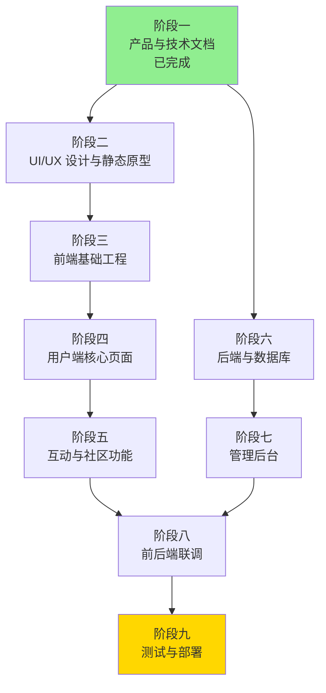

# 此刻校园 开发路线图

## 项目信息

- **项目名称**：此刻校园 (Moment Campus)
- **项目定位**：校园信息共享与沉淀平台
- **应用场景**：TRAE AI 创造力大赛、项目演示、产品路演、用户测试

---

## 阶段一：产品与技术文档（当前，已完成）

### 阶段目标
完成产品需求文档、技术架构设计、UI/UX 设计规范，为后续开发提供完整指导。

### 输入
- 项目创意和初始需求
- 竞品分析
- 用户调研

### 输出
- 产品需求文档 (PRD)
- 技术架构文档
- UI/UX 设计规范
- 数据模型设计
- API 接口文档

### 任务列表
- [x] 00_project_overview.md - 项目概述
- [x] 01_product_requirements.md - 产品需求文档
- [x] 02_user_roles_and_scenarios.md - 用户角色与场景
- [x] 03_feature_scope_and_priority.md - 功能范围与优先级
- [x] 04_information_architecture.md - 信息架构
- [x] 05_user_flows.md - 用户流程
- [x] 06_page_specifications.md - 页面规格说明
- [x] 07_content_and_category_design.md - 内容与分类设计
- [x] 08_community_governance.md - 社区治理
- [x] 09_ai_capability_plan.md - AI 能力规划
- [x] 10_ui_ux_design_system.md - UI/UX 设计系统
- [x] 14_security_and_privacy.md - 安全与隐私

### 前置依赖
无

### 验收标准
- [x] 所有文档已完成并通过评审
- [x] 文档之间逻辑一致，无矛盾
- [x] 技术方案可行，符合比赛要求
- [x] 为后续阶段提供清晰的开发指导

---

## 阶段二：UI/UX 设计与静态原型

### 阶段目标
完成线框图、高保真页面、组件规范、交互说明，确保用户体验流畅。

### 输入
- 产品文档（阶段一输出）
- UI/UX 设计规范

### 输出
- 线框图（所有核心页面）
- 高保真设计稿
- 组件规范文档
- 交互说明文档
- 设计资源包

### 任务列表
- [ ] 绘制用户流程图可视化
- [ ] 设计线框图 - 登录/注册页面
- [ ] 设计线框图 - 首页信息流
- [ ] 设计线框图 - 发现页
- [ ] 设计线框图 - 地图页
- [ ] 设计线框图 - 搜索页
- [ ] 设计线框图 - 详情页
- [ ] 设计线框图 - 发布页
- [ ] 设计线框图 - 个人中心
- [ ] 设计线框图 - 管理后台
- [ ] 制作高保真设计稿 - 移动端
- [ ] 制作高保真设计稿 - 桌面端
- [ ] 定义组件库 - 按钮、输入框、卡片等
- [ ] 定义色彩系统、字体系统、间距系统
- [ ] 编写交互说明文档
- [ ] 设计图标和插图
- [ ] 整理设计资源包

### 前置依赖
- 阶段一（产品与技术文档）

### 验收标准
- [ ] 所有核心页面都有线框图
- [ ] 高保真设计稿符合设计规范
- [ ] 组件库完整，可复用
- [ ] 交互说明清晰，开发可理解
- [ ] 设计稿通过团队评审

---

## 阶段三：前端基础工程

### 阶段目标
完成项目初始化、路由配置、布局系统、设计系统实现、基础组件开发、Mock API 搭建。

### 输入
- 设计稿（阶段二输出）
- 组件规范

### 输出
- 可运行的前端项目
- 基础组件库
- Mock API 服务
- 开发环境配置

### 任务列表
- [ ] 初始化 React + TypeScript 项目
- [ ] 配置 Vite 构建工具
- [ ] 配置 ESLint + Prettier
- [ ] 配置路径别名
- [ ] 集成 Tailwind CSS
- [ ] 实现设计系统（色彩、字体、间距）
- [ ] 开发基础组件 - Button
- [ ] 开发基础组件 - Input
- [ ] 开发基础组件 - Card
- [ ] 开发基础组件 - Modal
- [ ] 开发基础组件 - Toast
- [ ] 开发基础组件 - Loading
- [ ] 配置 React Router
- [ ] 实现路由守卫
- [ ] 实现布局组件 - Header
- [ ] 实现布局组件 - Sidebar
- [ ] 实现布局组件 - Footer
- [ ] 实现布局组件 - 移动端底部导航
- [ ] 搭建 Mock API 服务
- [ ] 配置 Axios 请求封装
- [ ] 实现状态管理（Zustand/Redux）
- [ ] 配置环境变量
- [ ] 编写前端基础文档

### 前置依赖
- 阶段二（UI/UX 设计与静态原型）

### 验收标准
- [ ] 项目可正常启动和运行
- [ ] 路由配置正确，页面可切换
- [ ] 基础组件可正常使用
- [ ] Mock API 可返回测试数据
- [ ] 代码符合规范，无 lint 错误

---

## 阶段四：用户端核心页面

### 阶段目标
完成登录、首页、发现、地图、搜索、详情、发布、个人中心等核心页面的开发。

### 输入
- 前端基础工程（阶段三输出）
- 页面规格说明

### 输出
- 核心页面实现
- 页面交互逻辑
- 表单验证

### 任务列表
- [ ] 实现登录/注册页面
- [ ] 实现手机号验证码登录
- [ ] 实现微信授权登录（模拟）
- [ ] 实现首页信息流
- [ ] 实现信息流下拉刷新和上拉加载
- [ ] 实现发现页 - 分类筛选
- [ ] 实现发现页 - 标签筛选
- [ ] 实现地图页 - 地图组件集成
- [ ] 实现地图页 - 地点标记
- [ ] 实现地图页 - 地点弹窗
- [ ] 实现搜索页 - 搜索框
- [ ] 实现搜索页 - 搜索历史
- [ ] 实现搜索页 - 搜索结果
- [ ] 实现详情页 - 信息展示
- [ ] 实现详情页 - 图片轮播
- [ ] 实现详情页 - 评论区
- [ ] 实现发布页 - 表单
- [ ] 实现发布页 - 图片上传
- [ ] 实现发布页 - 位置选择
- [ ] 实现发布页 - 分类选择
- [ ] 实现个人中心 - 用户信息
- [ ] 实现个人中心 - 我的发布
- [ ] 实现个人中心 - 我的收藏
- [ ] 实现个人中心 - 设置页面

### 前置依赖
- 阶段三（前端基础工程）

### 验收标准
- [ ] 所有核心页面可正常访问
- [ ] 页面交互流畅，无明显卡顿
- [ ] 表单验证正确
- [ ] 页面响应式适配（移动端 + 桌面端）
- [ ] 代码结构清晰，可维护

---

## 阶段五：互动与社区功能

### 阶段目标
完成点赞、收藏、评论、有效性确认、举报、通知等互动功能。

### 输入
- 核心页面（阶段四输出）
- 社区治理文档

### 输出
- 完整互动功能
- 通知系统
- 举报系统

### 任务列表
- [ ] 实现点赞功能
- [ ] 实现收藏功能
- [ ] 实现评论功能 - 发表评论
- [ ] 实现评论功能 - 评论列表
- [ ] 实现评论功能 - 回复评论
- [ ] 实现评论功能 - 删除评论
- [ ] 实现有效性确认功能 - 确认有效
- [ ] 实现有效性确认功能 - 标记失效
- [ ] 实现举报功能 - 举报弹窗
- [ ] 实现举报功能 - 举报类型选择
- [ ] 实现举报功能 - 提交举报
- [ ] 实现通知系统 - 通知列表
- [ ] 实现通知系统 - 通知详情
- [ ] 实现通知系统 - 标记已读
- [ ] 实现通知系统 - 未读数量提示
- [ ] 实现分享功能

### 前置依赖
- 阶段四（用户端核心页面）

### 验收标准
- [ ] 所有互动功能可正常使用
- [ ] 数据实时更新（乐观更新）
- [ ] 通知系统正常工作
- [ ] 举报流程完整
- [ ] 无明显的 bug 和异常

---

## 阶段六：后端与数据库

### 阶段目标
完成 FastAPI 后端服务、数据模型、认证系统、API 接口、数据库设计、演示数据。

### 输入
- API 文档（阶段一输出）
- 数据模型设计

### 输出
- 可运行的后端服务
- 数据库 schema
- API 接口实现
- 演示数据

### 任务列表
- [ ] 初始化 FastAPI 项目
- [ ] 配置数据库连接（PostgreSQL/SQLite）
- [ ] 设计数据库 schema
- [ ] 实现用户模型
- [ ] 实现信息模型
- [ ] 实现评论模型
- [ ] 实现分类模型
- [ ] 实现地点模型
- [ ] 实现收藏模型
- [ ] 实现点赞模型
- [ ] 实现举报模型
- [ ] 实现通知模型
- [ ] 实现认证系统 - JWT
- [ ] 实现认证系统 - 登录接口
- [ ] 实现认证系统 - 注册接口
- [ ] 实现用户 API - 获取用户信息
- [ ] 实现用户 API - 更新用户信息
- [ ] 实现信息 API - 列表查询
- [ ] 实现信息 API - 详情查询
- [ ] 实现信息 API - 创建信息
- [ ] 实现信息 API - 更新信息
- [ ] 实现信息 API - 删除信息
- [ ] 实现评论 API
- [ ] 实现点赞 API
- [ ] 实现收藏 API
- [ ] 实现举报 API
- [ ] 实现通知 API
- [ ] 实现搜索 API
- [ ] 实现地图 API
- [ ] 生成演示数据 - 用户
- [ ] 生成演示数据 - 信息
- [ ] 生成演示数据 - 评论
- [ ] 生成演示数据 - 其他

### 前置依赖
- 阶段一（产品与技术文档）

### 验收标准
- [ ] 后端服务可正常启动
- [ ] 所有 API 接口可正常访问
- [ ] 数据库操作正常
- [ ] 认证系统正常工作
- [ ] API 文档完整（Swagger/OpenAPI）
- [ ] 演示数据完整且真实

---

## 阶段七：管理后台

### 阶段目标
完成内容审核、举报管理、用户管理、分类管理、专题管理等管理功能。

### 输入
- 后端 API（阶段六输出）
- 社区治理文档

### 输出
- 管理后台系统
- 管理功能实现

### 任务列表
- [ ] 实现管理后台布局
- [ ] 实现管理员登录
- [ ] 实现仪表盘 - 数据统计
- [ ] 实现内容审核 - 待审核列表
- [ ] 实现内容审核 - 审核通过
- [ ] 实现内容审核 - 审核拒绝
- [ ] 实现举报管理 - 举报列表
- [ ] 实现举报管理 - 处理举报
- [ ] 实现用户管理 - 用户列表
- [ ] 实现用户管理 - 用户详情
- [ ] 实现用户管理 - 禁用用户
- [ ] 实现分类管理 - 分类列表
- [ ] 实现分类管理 - 创建分类
- [ ] 实现分类管理 - 编辑分类
- [ ] 实现分类管理 - 删除分类
- [ ] 实现专题管理 - 专题列表
- [ ] 实现专题管理 - 创建专题
- [ ] 实现专题管理 - 编辑专题
- [ ] 实现系统设置页面

### 前置依赖
- 阶段六（后端与数据库）

### 验收标准
- [ ] 管理后台可正常访问
- [ ] 所有管理功能可正常使用
- [ ] 权限控制正确
- [ ] 数据统计准确
- [ ] 操作日志完整

---

## 阶段八：前后端联调

### 阶段目标
完成所有核心业务的闭环，实现前后端数据交互。

### 输入
- 前端系统（阶段五输出）
- 后端系统（阶段六输出）
- 管理后台（阶段七输出）

### 输出
- 完整系统
- 业务闭环验证

### 任务列表
- [ ] 替换 Mock API 为真实 API
- [ ] 联调登录/注册流程
- [ ] 联调信息流加载
- [ ] 联调信息发布流程
- [ ] 联调信息详情查看
- [ ] 联调评论功能
- [ ] 联调点赞/收藏功能
- [ ] 联调搜索功能
- [ ] 联调地图功能
- [ ] 联调举报功能
- [ ] 联调通知功能
- [ ] 联调管理后台功能
- [ ] 处理跨域问题
- [ ] 处理错误码和异常
- [ ] 优化接口性能
- [ ] 数据一致性验证
- [ ] 端到端流程测试

### 前置依赖
- 阶段五（互动与社区功能）
- 阶段七（管理后台）

### 验收标准
- [ ] 所有核心业务流程可闭环
- [ ] 数据交互正常，无丢失
- [ ] 错误处理完善
- [ ] 性能满足要求
- [ ] 无明显的 bug 和异常

---

## 阶段九：测试与部署

### 阶段目标
完成功能测试、API 测试、响应式测试、安全检查、构建优化、部署上线、演示环境准备。

### 输入
- 完整系统（阶段八输出）

### 输出
- 可演示的产品
- 测试报告
- 部署文档
- 演示环境

### 任务列表
- [ ] 编写功能测试用例
- [ ] 执行功能测试
- [ ] 编写 API 测试用例
- [ ] 执行 API 测试
- [ ] 执行响应式测试（移动端 + 桌面端）
- [ ] 执行浏览器兼容性测试
- [ ] 执行安全检查
- [ ] 修复发现的 bug
- [ ] 优化前端构建（代码分割、压缩）
- [ ] 优化后端性能（缓存、索引）
- [ ] 配置生产环境
- [ ] 部署前端到 Vercel/Netlify
- [ ] 部署后端到云服务
- [ ] 配置域名和 HTTPS
- [ ] 配置数据库备份
- [ ] 准备演示账号和数据
- [ ] 编写演示脚本
- [ ] 录制演示视频
- [ ] 编写用户手册
- [ ] 编写部署文档
- [ ] 准备项目路演 PPT

### 前置依赖
- 阶段八（前后端联调）

### 验收标准
- [ ] 所有功能测试通过
- [ ] API 测试覆盖率 > 80%
- [ ] 响应式适配良好
- [ ] 无严重安全漏洞
- [ ] 系统稳定运行
- [ ] 演示环境可正常访问
- [ ] 演示材料完整

---

## 阶段依赖关系图

**图例说明：**
- 🟢 绿色：已完成的阶段
- 🟡 黄色：最终交付阶段
- 白色：待开发阶段

---

## 建议开发顺序

### 关键路径
**阶段一 → 阶段二 → 阶段三 → 阶段四 → 阶段五 → 阶段八 → 阶段九**

这是项目的主要开发路径，决定了项目的最短完成时间。

### 并行开发可能性

**路径 A（前端主线）：**
阶段一 → 阶段二 → 阶段三 → 阶段四 → 阶段五

**路径 B（后端支线）：**
阶段一 → 阶段六 → 阶段七

**汇合点：**
路径 A 和路径 B 在阶段八汇合，进行前后端联调。

### 并行开发建议

1. **阶段一完成后**，可以同时启动：
   - 阶段二（UI/UX 设计）
   - 阶段六（后端开发）

2. **人员配置建议**：
   - 如果有前端和后端开发人员，可以并行开发
   - 如果只有一人，建议先完成前端（阶段二→五），再完成后端（阶段六→七）

3. **时间估算**（单人开发）：
   - 阶段二：3-5 天
   - 阶段三：2-3 天
   - 阶段四：5-7 天
   - 阶段五：3-4 天
   - 阶段六：5-7 天
   - 阶段七：3-4 天
   - 阶段八：3-4 天
   - 阶段九：3-5 天
   - **总计：27-39 天**

4. **时间估算**（前后端并行，2 人团队）：
   - 前端路径：13-19 天
   - 后端路径：8-11 天
   - 联调 + 测试：6-9 天
   - **总计：27-39 天**（但实际日历时间可缩短至 20-30 天）

---

## 演示数据规划

### 用户数据（10 个）

| ID | 昵称 | 学校 | 年级 | 个性签名 | 头像 |
|----|------|------|------|----------|------|
| 1 | 校园美食家小林 | 华东师范大学 | 大三 | 吃遍闵行校区每一个食堂 | 美食博主风格 |
| 2 | 图书馆常驻民 | 复旦大学 | 大二 | 今天在光华楼自习室抢到了靠窗位置 | 文艺青年 |
| 3 | 橘猫铲屎官 | 上海交通大学 | 研一 | 东川路校区橘猫后援会会长 | 猫咪照片 |
| 4 | 篮球少年阿杰 | 同济大学 | 大一 | 每天下午 5 点篮球场见 | 运动阳光 |
| 5 | 考研狗小王 | 华东理工大学 | 大四 | 图书馆闭馆音乐是我的安眠曲 | 学习达人 |
| 6 | 社团达人CC | 上海外国语大学 | 大三 | 参加了 5 个社团，还在继续加 | 活泼开朗 |
| 7 | 快递站常客 | 上海财经大学 | 大二 | 双十一收了 12 个快递 | 购物达人 |
| 8 | 实验室搬砖工 | 上海交通大学 | 研二 | 导师说今天实验必须成功 | 科研狗 |
| 9 | 校园摄影师老李 | 华东师范大学 | 大三 | 用镜头记录四季的校园 | 文艺范儿 |
| 10 | 外卖测评员 | 复旦大学 | 大一 | 学校周边外卖全测评 | 吃货属性 |

### 学校数据（2 所）

**学校 1：华东师范大学（闵行校区）**
- 地址：上海市闵行区东川路 500 号
- 特色：师范类综合大学，校园面积大，有多个食堂和湖泊

**学校 2：复旦大学（邯郸校区）**
- 地址：上海市杨浦区邯郸路 220 号
- 特色：综合性研究型大学，历史建筑多，学术氛围浓厚

### 分类数据（12 个）

1. 美食推荐
2. 学习场所
3. 校园活动
4. 失物招领
5. 二手交易
6. 兼职实习
7. 校园风景
8. 生活服务
9. 学术交流
10. 社团招新
11. 运动健身
12. 情感树洞

### 校园信息数据（30 条）

**美食推荐类（5 条）：**
1. "第二食堂二楼新开的石锅拌饭，18 块钱分量超足，泡菜是正宗韩国风味，老板是东北人但去过韩国学厨艺"
2. "北区食堂的麻辣香锅窗口每天下午 4 点半开始排队，建议错峰 5 点半再去，加份方便面绝了"
3. "学校南门外的烤冷面摊出摊时间不固定，一般晚上 8 点后会出现，加两个蛋一根肠 12 块"
4. "图书馆一楼咖啡厅的拿铁比瑞幸便宜，味道差不多，关键是可以用学生卡打 8 折"
5. "第三食堂的早餐包子铺 6 点半就开门了，肉包 2 块钱一个，豆浆 1 块，性价比超高"

**学习场所类（4 条）：**
6. "图书馆东侧自习室有插座，适合带笔记本电脑，早上 8 点开门，考研季要早起占座"
7. "光华楼 10 楼有个露台，天气好的时候可以在那里背书，风景特别好，能看到整个校园"
8. "教学楼 A 栋 302 教室晚上没课的时候会开放自习，有空调有饮水机，人少安静"
9. "宿舍楼下的快递站旁边有个休息区，有沙发和桌子，适合临时赶作业，但晚上 10 点关门"

**校园活动类（3 条）：**
10. "这周五下午 2 点在大学生活动中心有跳蚤市场，据说有学长学姐卖二手教材和电子产品"
11. "下周三晚上 7 点大礼堂有校园歌手大赛决赛，免费入场，听说有上届冠军返场表演"
12. "每周六上午 9 点操场有晨跑团，一起跑步打卡，坚持一个月的送定制 T 恤"

**失物招领类（3 条）：**
13. "在图书馆三楼捡到一个白色保温杯，杯身有贴纸，放在一楼服务台了，失主去认领"
14. "昨天下午在操场跑步丢了一副 AirPods Pro，白色充电盒，如果有捡到的请联系我，必有重谢"
15. "教学楼 B 栋 205 教室有一把黑色雨伞，放学时忘拿了，现在放在教室门口讲台上了"

**二手交易类（3 条）：**
16. "毕业清仓：九成新小米平板电脑，买了半年，配手写笔，1200 出，送保护壳"
17. "转让高等数学教材 + 习题集 + 笔记，全套 30 块，笔记上有重点标注，考研必备"
18. "出二手自行车，凤凰牌，骑了两年，刹车轮胎都换过，200 块，校内代步神器"

**兼职实习类（2 条）：**
19. "学校勤工助学图书馆助理招新，每周工作 8 小时，每小时 15 块，能锻炼整理能力"
20. "某互联网公司远程实习，适合设计专业，每周至少 3 天，日薪 150，可开实习证明"

**校园风景类（3 条）：**
21. "图书馆东侧草坪经常出现一只橘猫，特别亲人，会主动蹭人，被学生称为'橘座'"
22. "樱花大道的花已经开了，最佳拍摄时间是早上 7-8 点，人少光线好，推荐从南门进入"
23. "下雨后的校园湖特别美，有荷叶和锦鲤，适合拍照，建议在湖边长椅上坐着发呆"

**生活服务类（3 条）：**
24. "南门外的理发店 Tony 老师手艺不错，剪发 35 块，不推销办卡，周二去打 8 折"
25. "学校快递站下午 5-6 点人最多，建议早上或晚上 8 点后去，不用排队"
26. "宿舍楼下的自助洗衣机经常满员，推荐用小程序'洗刷刷'提前预约，省时间"

**学术交流类（1 条）：**
27. "计算机学院周五下午有 ACM 集训队经验分享会，在计算机楼 201，有免费披萨"

**社团招新类（2 条）：**
28. "摄影社招新，要求有相机或手机摄影爱好者，每周三下午活动，会组织外拍和影展"
29. "街舞社招新，零基础也可以，每周二四晚上 7-9 点在舞蹈房训练，会费一学期 50"

**运动健身类（2 条）：**
30. "体育馆健身房下午 3-5 点人最少，器械齐全，有淋浴，学生卡每次 10 块"

**情感树洞类（2 条）：**
31. "考研倒计时 100 天，有点焦虑，有没有一起考研的小伙伴互相打气？"
32. "毕业季要离开了，舍不得学校的猫咪和食堂的阿姨，想对大家说声谢谢"

### 地点数据（15 个）

**华东师范大学（闵行校区）地点（8 个）：**
1. 第二食堂 - 校区中部，两层楼，特色是各地风味窗口
2. 图书馆 - 校区中心位置，标志性建筑，共 5 层
3. 操场 - 校区西侧，标准 400 米跑道，有看台
4. 校园湖 - 校区东侧，有荷叶和锦鲤，周围有柳树
5. 教学楼 A 栋 - 校区北部，主要用于大一基础课
6. 大学生活动中心 - 校区南门附近，社团活动场地
7. 宿舍区 - 校区西北角，分为梅兰竹菊四个园区
8. 快递站 - 宿舍区旁边，每天 8:00-21:00 营业

**复旦大学（邯郸校区）地点（7 个）：**
9. 光华楼 - 校区中心，双子塔结构，有观景露台
10. 第三食堂 - 校区北门附近，早餐特别受欢迎
11. 图书馆 - 校区东侧，历史悠久，古籍藏书丰富
12. 大礼堂 - 校区中部，举办大型活动和演出
13. 教学楼 B 栋 - 校区南部，主要用于专业课
14. 体育馆 - 校区西南角，有健身房和游泳池
15. 樱花大道 - 连接校门和教学楼，春天樱花盛开

### 评论数据（40 条）

**针对美食推荐的评论（8 条）：**
1. "石锅拌饭我去过了，确实不错，就是排队有点长，建议 11 点半就去"
2. "麻辣香锅加方便面是我的最爱，每周至少吃两次"
3. "烤冷面摊主大叔人很好，可以多给点酱料"
4. "图书馆咖啡厅的拿铁我也经常喝，环境很好，适合约会"
5. "第三食堂的包子我吃了四年，百吃不腻"
6. "第二食堂的麻辣香锅窗口排队太恐怖了，我选择饿死"
7. "南门外的烤冷面有时候 7 点半就出摊了，看运气"
8. "咖啡厅可以用学生卡打折这个信息太有用了，感谢分享"

**针对学习场所的评论（6 条）：**
9. "图书馆东侧自习室确实有插座，我天天去，就是考研季要早起"
10. "光华楼露台我去过，风景真的好，但是风大，冬天冷"
11. "302 教室晚上开放自习这个信息太及时了，终于找到安静的地方了"
12. "快递站旁边的休息区晚上 10 点关门，赶作业要注意时间"
13. "图书馆占座太难了，每天 7 点半就要去排队"
14. "推荐教学楼 C 栋 5 楼，人更少，有饮水机"

**针对校园活动的评论（5 条）：**
15. "跳蚤市场我去过了，买到了二手教材，省了不少钱"
16. "校园歌手大赛超级精彩，上届冠军唱得太好了"
17. "晨跑团我坚持了一个月，真的送 T 恤了，很有成就感"
18. "跳蚤市场什么时候还有？上次没买够"
19. "校园歌手大赛可以带朋友一起去吗？"

**针对失物招领的评论（4 条）：**
20. "保温杯是我的！已经去服务台认领了，谢谢好心人"
21. "AirPods 我也丢过，在操场附近，希望这个也能找到"
22. "黑色雨伞是我的，已经拿回来了，感谢"
23. "建议在失物招领信息里加上联系方式，方便联系"

**针对二手交易的评论（5 条）：**
24. "平板电脑还在吗？可以面交吗？"
25. "高数笔记太需要了，怎么联系卖家？"
26. "自行车买了，骑起来很顺畅，好评"
27. "毕业季二手东西真便宜，我也要去摆摊"
28. "建议二手交易走闲鱼，更有保障"

**针对校园风景的评论（4 条）：**
29. "橘座太可爱了，每次去都能摸到，特别乖"
30. "樱花大道昨天去拍了照，真的太美了"
31. "校园湖的锦鲤好肥，有人去喂它们吗？"
32. "推荐秋天去校园湖，落叶更美"

**针对生活服务的评论（4 条）：**
33. "Tony 老师剪得确实不错，我已经去了三次了"
34. "快递站下午 5 点人超多，建议早上去"
35. "洗刷刷小程序好用，省了不少排队时间"
36. "南门外还有个好用的打印店，复印 5 毛一张"

**针对其他分类的评论（4 条）：**
37. "ACM 分享会干货满满，还吃了免费披萨"
38. "摄影社招新我去报名了，期待第一次外拍"
39. "健身房下午 3 点去确实人少，器械随便用"
40. "考研加油！我们一起努力"

### 有效性记录（20 条）

**确认有效的记录（15 条）：**
1. 信息 1（石锅拌饭）- 15 人确认有效
2. 信息 2（麻辣香锅）- 23 人确认有效
3. 信息 5（早餐包子）- 18 人确认有效
4. 信息 6（图书馆自习室）- 31 人确认有效
5. 信息 10（跳蚤市场）- 12 人确认有效
6. 信息 13（保温杯）- 8 人确认有效
7. 信息 16（平板电脑）- 5 人确认有效
8. 信息 21（橘猫）- 42 人确认有效
9. 信息 22（樱花大道）- 28 人确认有效
10. 信息 24（理发店）- 19 人确认有效
11. 信息 25（快递站）- 26 人确认有效
12. 信息 27（ACM 分享会）- 9 人确认有效
13. 信息 28（摄影社）- 7 人确认有效
14. 信息 30（健身房）- 14 人确认有效
15. 信息 32（情感树洞）- 21 人确认有效

**标记失效的记录（5 条）：**
1. 信息 3（烤冷面摊）- 3 人标记失效（原因：最近没出摊）
2. 信息 11（校园歌手大赛）- 5 人标记失效（原因：活动已结束）
3. 信息 17（高数教材）- 2 人标记失效（原因：已售出）
4. 信息 19（勤工助学）- 4 人标记失效（原因：招聘已结束）
5. 信息 23（校园湖）- 1 人标记失效（原因：荷叶已枯萎）

### 通知数据（10 条）

**系统通知（3 条）：**
1. "欢迎来到此刻校园！完善个人资料可以获得更多曝光哦"
2. "您的信息'第二食堂石锅拌饭'已被 10 人确认有效，感谢分享"
3. "您收藏的'校园歌手大赛'信息已被标记失效"

**互动通知（5 条）：**
4. "校园美食家小林 点赞了你的信息'图书馆东侧自习室'"
5. "图书馆常驻民 评论了你的信息：'确实有插座，我天天去'"
6. "橘猫铲屎官 收藏了你的信息'橘猫出没地点'"
7. "篮球少年阿杰 确认了你的信息有效"
8. "考研狗小王 回复了你的评论：'考研加油！'"

**审核通知（2 条）：**
9. "您发布的信息'第二食堂石锅拌饭'已通过审核"
10. "您举报的信息'虚假兼职'已处理，感谢监督"

### 校园专题（6 个）

1. **新生入学指南**
   - 包含信息：食堂推荐、学习场所、生活服务、快递站等
   - 描述：为新生提供全面的校园生活指南

2. **考研备战攻略**
   - 包含信息：自习室推荐、考研经验、情感支持等
   - 描述：考研人的信息共享和互相鼓励

3. **校园美食地图**
   - 包含信息：各食堂特色、周边美食、外卖推荐等
   - 描述：吃遍校园，不留遗憾

4. **毕业季专题**
   - 包含信息：二手交易、毕业感想、离校流程等
   - 描述：告别校园，留下回忆

5. **校园活动汇总**
   - 包含信息：社团活动、讲座、比赛、演出等
   - 描述：不错过每一个精彩活动

6. **校园撸猫指南**
   - 包含信息：猫咪出没地点、喂养注意事项等
   - 描述：校园猫咪爱好者聚集地

### 举报记录（10 条）

**已处理（7 条）：**
1. 举报类型：虚假信息 - 举报内容："某培训机构虚假宣传" - 处理结果：删除信息，禁言 7 天
2. 举报类型：广告推广 - 举报内容："微商代理 recruitment" - 处理结果：删除信息，封禁账号
3. 举报类型：人身攻击 - 举报内容："评论区骂战" - 处理结果：删除评论，警告用户
4. 举报类型：重复发布 - 举报内容："同一信息发布 5 次" - 处理结果：删除重复，保留 1 条
5. 举报类型：过期信息 - 举报内容："已结束的活动" - 处理结果：标记失效
6. 举报类型：违规交易 - 举报内容："出售考试答案" - 处理结果：删除信息，封禁账号，上报学校
7. 举报类型：隐私泄露 - 举报内容："未经同意发布他人照片" - 处理结果：删除信息，警告用户

**待处理（3 条）：**
8. 举报类型：虚假信息 - 举报内容："疑似虚假兼职信息" - 状态：待审核
9. 举报类型：广告推广 - 举报内容："疑似培训机构广告" - 状态：待审核
10. 举报类型：不当内容 - 举报内容："评论区不当言论" - 状态：待审核

---

## 文档版本

- **版本**：1.0
- **创建日期**：2026-06-18
- **最后更新**：2026-06-18
- **维护者**：此刻校园开发团队
