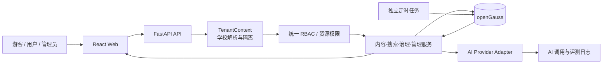

# 此刻校园 TRAE AI 创造力大赛复赛深度优化与落地方案

> 文档性质：复赛冲刺的代码审计版实施蓝图，不代表其中事项已经完成  
> 编制日期：2026-07-24  
> 复赛截止：2026-08-09 23:59（北京时间）  
> 演示租户：至少 3 所可真实切换的学校；江南大学为主展示租户，`code=jiangnan`，`map_zoom=16`
> 前置方案：[`32_TRAE_AI创造力大赛复赛优化方案.md`](./32_TRAE_AI创造力大赛复赛优化方案.md)  
> 规则依据：[官方复赛参赛指南](https://forum.trae.cn/t/topic/152171)、[`TRAE_AI_创造力大赛_复赛详细说明_2026.md`](./TRAE_AI_创造力大赛_复赛详细说明_2026.md)
> 现行口径同步：2026-07-31；早期审计数据仅用于说明演进，实施与验收以两类验证、单数端点、独立 timer、动态分类、DataVec 混合检索/关键词降级和独立测试库为准

---

## 0. 执行结论

“此刻校园”已经具备可访问的 Web 产品、完整的前后端骨架、openGauss 数据库、地图、发布、互动和基础管理后台，不再是纯概念 Demo。但按复赛“完整作品”的标准，它目前仍属于**可运行原型**，尚不能直接冻结提交。

当前最主要的问题不是缺少页面数量，而是以下五个方面需要持续收敛：

1. **产品闭环持续收敛**：2026-07-24 审计时发布页曾固定地点且多页面硬编码分类；现已改为当前学校动态分类、稳定 `category.code` 视觉和切校状态清理，后续验收继续覆盖草稿、编辑、审核、通知与公开展示。
2. **接口契约与业务规则已收敛**：协同验证只接受 `confirmation/refutation`，使用单数 `/validate` 写端点；历史治理路由和三类问题报告已退出现行契约。
3. **“有 school_id”不等于多租户**：公开列表、地图、地点、搜索和全部管理接口没有统一租户上下文；普通管理员实际上拥有跨学校全局权限；注册和地点创建信任客户端传入的学校 ID。
4. **质量证据尚不成立**：前端可构建，但 lint 当前有 35 个错误、4 个警告；后端虚拟环境缺少 pytest，现有测试夹具还会直接清空当前开发数据库；部分测试引用已删除的收藏模型和过时验证类型。README 中历史“全部通过”数字不能作为复赛证据。
5. **商业闭环与用户便利性仍停留在原型阶段**：注册页把学校固定为 `school_id=1`，登录只有邮箱密码且没有找回路径，通知角标没有接入真实未读数，后台设置只写 localStorage；系统也没有租户套餐、权益、用量计量、开通漏斗、官方发布主体、分享入口和产品行为指标。当前版本能够展示功能，却还不能证明“学校愿意采用、管理员能够运营、学生愿意持续使用”。

因此，本方案不以“单校原型”作为复赛终态，而是同时完成**AI 校园信息产品、低摩擦用户体验、可运营多租户平台和可计量商业闭环**。所有在本文列为产品功能的事项均须在 2026 年 8 月 9 日截止前开发、测试、部署和形成演示证据，不再设置任何“复赛后再做”的功能池。

### 0.1 一个核心闭环

以“**AI 驱动的校园时空信息发现与协同治理**”为唯一主线，打通：

> 平台按套餐创建学校并完成开通清单 → 校级管理员配置品牌、邀请成员和认证官方发布者 → 用户通过学校深链接进入并在 60 秒内找到第一条有效信息 → 用户加入并切换学校 → 用自然语言表达需求 → AI 将需求转换为可校验的结构化条件 → 只在当前学校的真实信息中检索 → 给出带来源和理由的结果 → 地图联动定位 → 用户订阅、分享或协同验证 → 发布者补充信息 → 校级管理员审核和治理 → 平台超级管理员查看租户激活、活跃度、服务质量、套餐权益和 AI 成本。

### 0.2 五个产品与工程底座

- **事实一致性底座**：统一状态、分类、举报、验证、分页和前后端类型契约。
- **多租户产品底座**：上线学校创建、成员关系、邀请/加入、租户切换、学校品牌与配置、校级后台、平台总控和强隔离；`admin` 只管理所属学校，`super_admin` 管理全平台。
- **用户便利性底座**：游客可先体验、深链接自动定位学校、注册/找回可完成，搜索—地图—导航—订阅—分享形成移动端短路径，发布支持模板、自动草稿和 AI 建议。
- **商业运营底座**：交付试用/标准/运营三档套餐、权益与额度、租户开通清单、用量计量、官方发布主体和平台转化漏斗；复赛环境由 super_admin 手动分配套餐，不依赖真实支付。
- **发布质量底座**：隔离测试库、核心 E2E、可观测性、部署版本校验、回滚和材料证据。

### 0.3 两项必须完成的智能治理能力

- AI 辅助发布：普通发布链路稳定后立即接入，AI 只建议、不替用户发布，但必须在复赛截止前上线。
- 2 类协同验证与自动过期：完整实现证实/证伪互斥投票，并由独立 systemd timer/oneshot worker 跑通自动过期闭环。

### 0.4 范围边界

- 多学校切换和多校演示数据属于复赛必交范围，不是架构文档中的未来能力。
- 不引入微服务、复杂消息队列、向量数据库、原生 App、即时聊天、复杂推荐系统。
- 不建设真实支付结算、广告竞价、校园电商、商户抽佣或售卖用户数据。复赛商业化交付以“套餐可配置、权益可执行、用量可计量、租户可激活、价值可证明”为边界；这不是把支付延期，而是明确本产品的机构 SaaS 模式不依赖复赛现场收款。
- 不为了“数据库亮点”直接执行当前 `backend/scripts/opengauss/` 全套 SQL；这些脚本与现行模型存在明显漂移，必须先治理。
- 不用未跑通的页面、脚本、测试数量或历史文档数字包装完成度。

这里排除的是不必要的技术复杂度，而不是延期产品功能。多租户、AI 搜索、AI 辅助发布、两类协同验证、自动过期、专题、订阅/推荐、个人中心、官方发布主体、学校开通向导、套餐权益、用量计量、产品漏斗、分享/PWA、校级后台和平台后台均纳入复赛截止日前的完整验收。

---

## 1. 复赛要求转化为项目约束

### 1.1 官方硬要求

| 官方要求 | 对本项目的直接约束 | 最终证据 |
|---|---|---|
| 从 Demo 升级为完整产品 | 核心用户路径必须独立走通，不能依靠讲解者手动修数据 | E2E 记录、验收清单、演示视频 |
| Web 必须真实可访问 | 保持 HTTPS 公网部署，评审期链接持续可用 | 私密问卷中的体验入口、可用性检查 |
| 登录产品需测试账号 | 准备游客、多校普通用户、各校管理员和平台 super_admin 体验路径 | 私密问卷中的账号、所属学校和使用说明 |
| 产品演示视频必交，1–5 分钟 | 视频展示真实产品、真实 AI 链路和完整闭环 | 公开视频链接及问卷存档 |
| 产品说明书 | 说明场景、角色、功能、核心流程、边界和使用方法 | 社区帖与问卷同步存档 |
| TRAE 实践可核验 | 关键任务 Session ID 不少于 3 个，并有过程截图和阶段成果 | 社区公开过程说明、问卷材料 |
| 社区公开 + 飞书私密双轨 | 社区不放体验链接、测试账号、源码包；这些只进私密问卷 | 提交前双清单复核 |
| API Key 不得泄露 | 模型密钥只在服务端环境变量中，日志、视频和文档脱敏 | 安全检查记录、录屏复核 |
| 8 月 9 日 23:59 截止 | 8 月 6 日功能冻结，8 月 8 日完成提交演练，8 月 9 日中午前提交 | 冻结版本号、材料目录、提交截图 |

### 1.2 评分策略

现有初步方案按社会服务赛道准备。该赛道的产品完成度、社会价值、技术实现、实用性、创新性各占 20%。复赛方案必须让每个维度都有**可体验、可截图、可测试**的证据，而不是只写愿景。

| 评分维度 | 本项目的得分抓手 | 应避免的误区 |
|---|---|---|
| 产品完成度 | 发现、发布、审核、通知、验证、治理两条闭环；游客/用户/管理员完整页面 | 用页面总数代替可用闭环 |
| 社会价值 | 降低校园信息获取成本；过期、冲突和虚假信息由社区与管理员共同治理；至少 3 所学校可切换、可独立运营 | 只换学校名称和 Logo、却共用同一批数据的“伪多租户” |
| 技术实现 | openGauss、租户隔离、状态机、结构化 AI、降级、审计日志、自动化测试 | 堆砌未接入运行链路的 SQL 对象 |
| 实用性 | “什么时候、在哪里、是否仍有效”三个高频问题得到快速答案 | 只做一个聊天框或静态 AI 文案 |
| 创新性 | 自然语言意图 → 真实校园数据 → 时空筛选 → 可解释结果 → 社区验证反馈 | 让模型凭空生成校园事实 |

### 1.3 复赛成功标准

复赛版不是“功能最多”的版本，而应满足以下定义：

- 评审打开链接后，无需指导即可在 3 分钟内理解产品并完成一次核心体验。
- 新访客通过学校深链接进入后，目标是在 60 秒内完成“理解当前学校 → 搜索/筛选 → 打开一条有效信息”；不强制先注册。
- 新学校从平台创建到管理员接管、基础内容就绪和可邀请用户，目标在 10 分钟内完成并由开通清单实时显示进度。
- AI 返回的每条校园事实都能追溯到真实帖子，不生成数据库中不存在的地点、时间或活动。
- 任意普通用户和普通管理员都无法访问或操作其他租户的数据。
- `super_admin` 能创建学校、初始化校级管理员和配置；用户能加入多个学校并切换，切换后首页、地图、搜索、专题、通知和后台范围同步变化。
- `super_admin` 能给学校分配套餐和额度，查看激活漏斗、活跃度、内容新鲜度、治理 SLA、AI 成功检索成本与配额告警；校级管理员能看到本校零结果查询和待补信息，不看到其他学校的原始行为数据。
- 学生可找回账号、保存常用查询、订阅分类/地点/专题、从详情一键分享或复制深链接、在移动端安装 Web App；所有关键流程支持键盘操作、清晰焦点和足够点击区域。
- 核心链路没有已知阻断级或高优先级 Bug，部署版本与验收版本一致。
- 演示视频中的每一步都能在评审账号和线上环境中复现。

---

## 2. 2026-07-24 项目真实基线

### 2.1 审计覆盖范围

本次基线核对覆盖：

- 官方复赛帖子和本地复赛详细说明；
- 现有初步优化方案、README、TODO、产品、AI、架构、安全、测试、部署和演示文档；
- `backend/app/` 的 API、模型、Schema、权限、配置、中间件和数据库连接；
- Alembic 迁移、openGauss 物理设计 SQL、种子数据及后端测试；
- `frontend/src/` 的 19 个页面、路由、服务、状态仓库、组件和类型；
- Docker、Nginx、systemd、华为云混合部署脚本；
- 本地 openGauss 实例和公网入口的只读验证。

### 2.2 可量化基线

| 项目 | 真实状态 |
|---|---|
| 后端源代码 | `backend/app/` 共 54 个 Python 文件，51 个已注册 HTTP 接口 |
| 前端源代码 | `frontend/src/` 共 54 个 TS/TSX 文件，19 个页面组件 |
| ORM / 数据库 | 20 张 ORM 业务表；实际数据库另含 `alembic_version`，共 21 张基础表 |
| 数据库版本 | openGauss 7.0.0-RC3，Alembic 位于 `g6b7c8d9e0f1 (head)` |
| 本地演示数据 | 1 所学校、11 个用户、30 条帖子、15 个地点、12 个分类、30 条验证、6 条举报 |
| 当前学校数据 | 当前代码和本地库仍只有江南大学，`jiangnan`，缩放级别 16；这是待改造基线，不是复赛目标 |
| 公网入口 | `https://campus.chaina1.com` 于 2026-07-24 只读检查返回 200，`/health` 返回 `ok`；公开 API 返回 12 个分类、37 条线上帖子 |
| 前端构建 | `npm run build` 通过；地图分包约 1,044.91 kB，超过 Vite 500 kB 警告线 |
| 前端 lint | `npm run lint` 失败：35 个错误、4 个警告 |
| 后端测试 | `backend/.venv` 缺少 pytest，未能收集；现有测试环境也不具备安全执行条件 |
| 增强数据库对象 | 当前数据库未发现项目 SQL 所描述的物化视图、自定义存储过程和自定义触发器 |
| AI 能力 | 目前只有规划和 UI 图标，没有模型适配器、AI API、调用日志、评测集或运行链路 |
| 用户便利性 | 注册固定 `school_id=1`；无找回密码、选校引导、保存查询、原生分享/PWA；页头未读角标默认传入 0 |
| 商业运营 | 无套餐/权益/额度、租户试用与激活状态、用量计量、官方发布主体或产品漏斗；后台设置仍是浏览器本地值 |

公网入口“能打开”只证明基础可达，不代表登录、发布、审核、AI 和全部链路已经在线验收；部署静态首页的 `Last-Modified` 为 2026-07-06，复赛发布时必须增加版本号核对，防止“本地已修、线上仍旧”。

### 2.3 能力成熟度

| 领域 | 已有基础 | 当前成熟度 | 复赛判断 |
|---|---|---:|---|
| 登录与角色 | JWT 登录、刷新，`user/admin/super_admin` 角色字段 | 60% | 可复用，但登出无服务端失效、管理路由未统一 `require_role()` |
| 信息内容 | 帖子 CRUD、图片/标签模型、6 态状态机、审核接口 | 55% | 模型较全，访问控制和前端闭环不完整 |
| 地图 | MapLibre、视野范围标记、地图点选发帖 | 65% | 是优势页面，但分类错配、无租户过滤、包体过大 |
| 普通搜索 | 关键词与部分筛选、搜索历史 | 45% | 后端 N+1，前端仅关键词，无 AI、无地图联动 |
| 互动治理 | 点赞、评论、举报、2 类验证、通知 | 已收敛 | 两类互斥投票使用单数写端点，详情聚合与登录态统计职责分离 |
| 个人中心 | 资料、头像、我的帖子 | 45% | 草稿/状态/分页/统计/编辑删除体验不完整 |
| 管理后台 | 仪表盘、审核、举报、用户、分类、标签 API、日志 | 55% | 有骨架，但全局越权、设置是假设置、标签页面被隐藏 |
| 多租户 | `schools` 及部分 `school_id` 字段 | 25% | 只是数据字段，不是完整租户机制 |
| 用户便利与增长 | 公共首页、移动导航、搜索历史、通知页面 | 25% | 能浏览但首用、找回、分享、订阅、安装、偏好和无障碍闭环缺失 |
| 商业运营 | 学校模型、基础管理员统计 | 10% | 尚不能配置套餐、限制权益、计量成本、跟踪租户激活或认证内容供给方 |
| 数据库工程 | Alembic、索引设计、物理 SQL 文档 | 45% | 迁移可用；高级 SQL 未部署且与现模型漂移 |
| 自动化质量 | 70 个测试函数源代码、构建脚本 | 25% | 当前不能形成可信发布门禁 |
| 部署 | 华为云、HTTPS、Nginx、systemd/openGauss | 70% | 公网可达，但部署方案分叉、健康检查过浅、版本不可识别 |

### 2.4 结论

项目已有很好的复赛底盘，尤其是地图、状态、协同治理概念、openGauss 和基础后台。但下一阶段必须从“实现了许多对象和接口”转为“关键路径一致、隔离、可测、可证明”。

---

## 3. 提交前必须消除的阻断问题

### 3.1 内容访问与状态机

| 证据 | 风险 | 修复目标 |
|---|---|---|
| `GET /posts` 先固定 `published`，再叠加用户传入的 `status` | 查询非 published 状态时形成互斥条件；参数名义上支持但实际上不可用 | 公开列表只接受公开状态；“我的帖子”和管理列表使用独立受权接口 |
| `GET /posts/{id}` 只检查未删除，不检查状态、作者或管理员 | 知道 ID 的游客可查看 draft、pending、archived 等非公开内容 | 公开仅 published/允许展示的 expired；作者看自己的；管理员按本校权限查看 |
| `PostUpdate` 暴露 `status` 和 `is_recommend` | 普通作者可绕过审核、自荐或写入任意状态 | 普通更新 Schema 删除管理字段；所有状态变化只走状态机服务 |
| 举报删除会写入 `post.status="deleted"` | 产生第 7 个未定义状态，破坏 6 态规则 | 删除采用 `is_deleted` + `archived`，并记录统一原因 |
| 管理员状态流转无学校范围 | 普通管理员可跨租户改状态 | 所有管理操作同时校验角色和租户 |

必须把状态机从一个辅助接口升级为**唯一写入口**。内容实质修改后的 published 帖子应回到 pending，防止“审核后替换内容”。

### 3.2 前后端契约

| 不一致 | 当前表现 | 目标 |
|---|---|---|
| 举报类型 | 前端发送 `fake/ad/inappropriate/other`；后端接受 `spam/abuse/harassment/false_info/other` | 以 OpenAPI/共享类型为准，端到端契约测试覆盖全部选项 |
| 点赞响应 | 后端返回 `is_liked`；前端服务声明 `liked` | 统一字段并禁止宽松类型断言掩盖问题 |
| 分页 | 全局类型含 `has_more`，实际后端使用 `total_pages` | 统一分页模型 |
| 评论/帖子作者 | 部分服务类型使用 `user`，实际响应使用 `author` | 生成或维护唯一 API 类型源 |
| 搜索地点 | 前端可发送 `location_name`，后端只接受 `location_id` | 明确地点 ID、文本和地图范围三种筛选语义 |
| 标题长度 | 普通发布页限制 100，后端允许 200 | 前后端共享规则 |

建议从 FastAPI OpenAPI 生成 TypeScript API 类型，至少先消除关键接口的手写重复类型。

### 3.3 发布链路

2026-07-24 审计时，普通发布页曾固定发送 `location_id=1`，分类列表也存在硬编码和种子错位。现行前端从当前学校 API 动态加载分类，使用 `category.code` 稳定计算视觉，并在切校时清理旧分类、筛选和地图标记；发布链路仍需持续以端到端测试确认地点、分类与详情展示一致。

复赛目标应为一套统一的发布工作流：

1. 动态加载后端分类、帖子类型和本校地点；
2. 支持选择已有地点或在地图上新建待验证地点；
3. 支持图片、标签、有效期、活动时间和联系方式；
4. 可保存草稿、继续编辑、提交审核、查看审核原因、修改后重新提交；
5. 发布成功后进入“我的发布”，而不是无条件跳首页；
6. 管理员审核后通知用户，公开列表、地图和搜索结果同时可见。

### 3.4 协同验证语义

现行契约只保留两类互斥投票：

- `confirmation`：证实；
- `refutation`：证伪。

`validation_records(post_id,user_id)` 保证每用户每帖只有一条记录。首次提交创建，提交另一类型原地切换，再次提交同类型取消；作者不能验证自己的帖子。写操作统一使用 `POST /api/v1/posts/{post_id}/validate`，登录态统计使用 `GET /api/v1/posts/{post_id}/validation-stats`，公开聚合由帖子详情 `governance` 字段提供。

`update`、`expiration_report`、`conflict_report` 及独立 governance 路由属于已放弃的历史方案，不再恢复为产品能力。补充信息使用评论或发布者编辑，违规内容使用普通举报，过期状态由独立 timer 驱动，冲突状态由管理员按状态机处理。

### 3.5 测试安全与真实性

`backend/tests/conftest.py` 直接使用 `settings.DATABASE_URL`，每个测试前后对全部业务表执行 `TRUNCATE ... CASCADE`。当前它指向本地开发数据库，因此直接运行测试会清空现有演示数据。同时：

- `backend/.venv` 未安装 `requirements-dev.txt`，pytest 不可用；
- 测试仍导入已删除的 `app.models.favorite`；
- 多个用例仍调用已删除的 `/favorite` 接口；
- 验证类型测试已按 2 类 Schema 和创建/切换/取消语义收敛；
- 物化视图、触发器和存储过程测试假设对应对象已安装，但当前数据库实际没有这些对象。

在建立独立测试数据库、强制环境保护和修复过时测试前，任何“全部测试通过”都不能作为复赛材料。

### 3.6 openGauss 设计脚本漂移

当前真实运行库只有 Alembic 迁移创建的基础表，没有项目 SQL 文档中的自定义触发器、物化视图和存储过程。现有物理 SQL 还包含以下过时引用：

- 已删除的 `favorites` 表和 `favorite_count`；
- 已删除的 `is_top`；
- 旧状态 `pending_review`；
- 历史高级 SQL 中的 5 类验证引用不属于现行运行契约；
- 分区迁移脚本重建旧字段结构；
- 评论和点赞计数触发器若与当前 API 手动计数同时启用，可能形成重复计数。

复赛前以 Alembic 为唯一结构变更入口。高级 SQL 必须逐个迁移、测试、登记，不能用“脚本文件存在”作为运行能力证明。

### 3.7 部署与配置

- FastAPI 当前没有挂载 `/uploads` 静态目录；华为云混合部署由 Nginx `alias` 正常提供文件，但 Docker 部署会把 `/uploads` 转发给后端而得到 404，两个部署方案行为不同。
- `/health` 只返回常量 `ok`，无法证明数据库、上传目录和 AI 服务可用。
- Pydantic 配置没有环境变量前缀，审计环境中的通用 `DEBUG=release` 曾导致 Alembic 启动失败；应避免通用变量名碰撞。
- CORS、密钥和上传路径在多套 `.env`/脚本中重复维护。
- 部署没有暴露构建提交号，无法确认线上是否为验收版本。

需要增加 `/health/live`、`/health/ready` 和 `/version`，并将唯一生产部署方式、配置模板、迁移顺序和回滚步骤固化。

---

## 4. 复赛产品定义与演示故事

### 4.1 一句话定位

> 此刻校园是一个 AI 驱动的校园时空信息发现与协同治理平台：它把散落、短时、易过期的校园信息变成可搜索、可定位、可验证、可追踪的公共信息服务。

### 4.2 与普通校园论坛的区别

| 普通论坛/群聊 | 此刻校园复赛版 |
|---|---|
| 信息按发布时间堆叠 | 按地点、时间、分类、有效性和用户意图检索 |
| 搜索只匹配字面关键词 | AI 将自然语言拆成可校验筛选条件，再查询真实数据 |
| 旧消息仍被转发 | 帖子有状态、有效期、两类社区验证和自动过期 |
| 管理只做删帖 | 审核、普通举报、冲突和过期状态进入可追踪治理流程 |
| AI 直接“回答” | AI 只解释数据库结果，每条结果都能打开来源帖子 |

### 4.3 核心演示问题

主演示建议使用一句真实、高频且同时包含时间和地点意图的问题：

> “今晚十点后，蠡湖校区哪里还能打印？”

系统应展示：

1. AI 解析出的“今晚 22:00 后、打印服务、江南大学、优先最新且已证实”；
2. 来自真实帖子的数据卡片，标注匹配理由、更新时间和协同验证结果；
3. 地图自动聚焦相关地点；
4. 打开详情后可查看原文、地点、有效期和验证记录；
5. 用户可证实、证伪或报告过期；
6. 管理员在治理队列中处理问题并留下审计记录。

第二条短演示使用发布闭环：

> 学生在地图上选择地点 → AI 帮助补全标题/标签/有效期 → 用户确认 → 提交审核 → 管理员审核 → 用户收到通知 → 信息进入公开搜索和地图。

### 4.4 AI 边界

- 不把模型知识当作校园事实；检索结果为空时明确说“当前没有匹配信息”。
- 不自动发布、不自动审核、不自动删除。
- 不把联系方式、邮箱、Token、密钥或未经必要脱敏的正文发送给模型。
- AI 建议必须可编辑；用户确认后才进入业务流程。
- 模型不可用时，产品仍能使用普通关键词、分类和地图筛选。

### 4.5 商业与体验标杆给出的启示

本方案不把“商业化”理解为临时加一个价格页，也不把“便利”理解为多做几个按钮。公开产品资料反复出现四个成熟产品特征：

- 腾讯智慧校园强调统一服务入口、统一身份、统一应用接入和统一数据治理，说明学校购买的不只是一个学生端页面，而是可管理、可接入、可持续运营的服务入口。[腾讯智慧校园](https://www.tencent.com/zh-cn/business/smart-campus.html)
- V校把用户中心、应用中心、运营中心，以及统一账户、云端定制、全终端和“千校千面”放在同一产品体系中，说明多租户只有与运营中心、配置和统一体验结合才具有商业说服力。[V校智慧校园](https://www.vxiao.cn/)
- 格睿科公开方案将 SaaS 订阅、多终端、统一认证、RBAC、数据分析和全流程追溯放在一起，说明“按需订阅”必须同时有权限、计量、数据和服务质量支撑。[格睿科智慧校园](https://www.gridcore.cn/)
- W3C 建议采用最新 WCAG 2.2；其要求覆盖可感知、可操作、可理解和健壮性。复赛不宣称全站已达 AA，而是将登录、搜索、发布、切换和后台五条关键流程按 AA 目标做自动加人工检查。[WCAG 2.2](https://www.w3.org/TR/WCAG22/)

由此得到的产品取舍是：不与大型智慧校园平台比功能总量，而把此刻校园做成它们最容易缺失的一层——**面向短时校园信息的可信发现、低成本供给和持续治理 SaaS**。竞争点是十分钟开校、六十秒首个结果、信息可追溯、跨校强隔离和运营数据可量化。

### 4.6 客户、用户与付费价值

| 角色 | 当前痛点 | 复赛版提供的价值 | 可验证结果 |
|---|---|---|---|
| 平台运营方 | 每新增学校都需要手工部署、改数据、盯成本 | 一套部署创建学校、分配套餐、查看激活和用量 | 创建第三校录像、跨校仪表盘、额度告警 |
| 学校学生工作/信息化/后勤部门 | 群聊信息散、旧信息继续传播、治理不可追踪 | 独立品牌、官方发布者、审核治理、内容缺口和 SLA | 本校后台、零结果榜、待过期/待治理队列 |
| 校园部门/社团/服务组织 | 发布渠道分散、重复解释、内容到期后无人维护 | 认证主页、发布模板、AI 辅助、订阅触达和效果统计 | 认证流程、模板发布、浏览/订阅/有效性数据 |
| 学生与教职工 | 不知道去哪里找、信息真假与时效难判断 | 游客先搜、地图定位、来源与有效期、订阅/分享/导航 | 60 秒首个结果、分享深链接、通知与验证闭环 |

机构 SaaS 的商业模型只保留三条清晰收入路径：学校年度订阅、AI/存储等可计量额度包、初始化与内容运营服务。明确不靠广告干扰搜索排序，不把学生数据作为商品，也不让“付费官方账号”绕过学校认证和内容治理。

复赛不虚构价格、合同或收入。商业完成度用一条可运行公式证明：

> 可复制开通 × 稳定激活 × 可持续内容供给 × 可计量服务成本 × 可证明用户价值 = 可销售的校园信息 SaaS。

---

## 5. 目标技术架构



### 5.1 架构原则

1. **保持单体应用**：工期内按服务模块整理业务逻辑，不拆微服务。
2. **先确定性检索，后模型解释**：模型负责解析意图和生成简短理由，数据库负责事实和权限。
3. **租户上下文位于所有业务查询之前**：不能依赖每个路由作者“记得加 school_id”。
4. **状态变化集中处理**：审核、过期、冲突、归档统一调用状态服务，并记录事件和通知。
5. **耗时任务与 Web 进程分离**：当前生产使用 4 个 Uvicorn worker，不应在每个 worker 内启动重复定时器。使用独立 systemd timer/worker 执行幂等过期任务。
6. **迁移是数据库结构唯一真相**：Alembic 负责所有复赛新增表、索引和约束。

### 5.2 推荐后端模块边界

| 模块 | 职责 |
|---|---|
| `tenant` | 学校目录/开通、成员/邀请、当前学校切换、品牌配置、TenantContext 与隔离 |
| `posts` | 创建、编辑、状态机、媒体、有效期、公开可见性 |
| `discovery` | 普通搜索、AI 意图解析、检索、排序、地图联动 |
| `interactions` | 2 类协同验证、点赞与举报；不再保留独立 governance 路由 |
| `admin` | 校级审核、治理队列、成员、地点、配置、专题和审计 |
| `publishers` | 学校部门/社团/服务组织的认证主页、成员、发布模板和效果统计 |
| `commercial` | 套餐、权益、额度、学校订阅状态、用量日汇总、告警和开通清单 |
| `analytics` | 最小产品事件、激活漏斗、搜索成功/零结果、留存和校级聚合洞察 |
| `platform` | super_admin 学校开通/启停、初始管理员、套餐分配、跨校统计、健康和平台审计 |
| `ai` | Provider 适配、Schema 校验、超时重试、降级、调用记录 |
| `jobs` | 自动过期、通知清理、必要统计维护 |

不要求在复赛前做大规模目录重构，可以先用小型 service 函数消除路由中的重复查询和权限逻辑。

---

## 6. 多租户机制深化方案

### 6.1 复赛交付目标

多租户不是隐藏在表结构中的“可扩展性”，而是复赛线上版本可直接体验的第二核心卖点。截止日前必须达到四个“真”：

1. **真多校**：生产环境至少有 3 个可切换学校租户，江南大学是数据最完整的主展示租户，另外 2 个租户具有不同坐标、地点、帖子、成员、管理员、配置和专题。
2. **真成员关系**：同一账号可以加入多个学校，在不同学校拥有不同角色，并选择默认学校。
3. **真独立运营**：每所学校有自己的审核、举报、用户、地点、分类、专题、设置、AI 统计和审计数据。
4. **真隔离**：任何公开、用户、管理员、批量、AI、缓存和统计路径都不能串校。

另外两所学校的名称、坐标和演示范围须在开发启动后 24 小时内确认。若使用真实学校名称，地图中心和基础资料必须人工核验，演示数据明确标注为模拟数据，不得暗示已与学校建立官方合作；若来不及核实，则使用明确标注的“复赛演示校 A/B”，不能用虚构内容冒充真实运营数据。

### 6.2 必须上线的多租户产品能力

| 能力 | 用户可见结果 | 完整性/商业价值 |
|---|---|---|
| 学校目录 | 游客可查看已启用学校并进入对应校园 | 一个部署服务多个校园市场 |
| 学校创建与初始化 | `super_admin` 创建学校、设置地图中心、Logo、主题、首位管理员和默认分类 | 新租户可由平台后台完成开通 |
| 加入/邀请 | 用户注册时选择学校，也可通过邀请码加入其他学校；成员有 pending/active/disabled 状态 | 支持真实组织获客和准入 |
| 学校切换 | 页头学校选择器展示当前账号可访问学校；切换后所有页面同步刷新 | 多校用户可直观体验租户差异 |
| 独立品牌与设置 | 每校拥有名称、Logo、主题色、介绍、地图中心、审核/匿名/评论/额度策略 | 体现 SaaS 配置与品牌能力 |
| 校级后台 | `admin` 只看到当前学校的待办、内容、成员、地点、分类、专题和日志 | 每校可独立运营 |
| 官方发布主体 | 校内部门、社团、校园服务组织可申请认证主页、成员和发布模板 | 建立稳定内容供给和机构信任 |
| 套餐/权益/用量 | `super_admin` 分配试用/标准/运营套餐，系统执行额度并按校计量 | 将技术成本和交付范围变成可管理服务 |
| 租户激活清单 | 从管理员接受到内容就绪逐项跟踪，未完成项可直接处理 | 缩短学校首次获得价值的时间 |
| 平台后台 | `super_admin` 查看学校列表、启停状态、激活漏斗、跨校汇总、套餐/用量、健康和管理员 | 体现平台商业运营能力 |
| 租户级 AI | AI 搜索、调用日志、评测和成本按学校隔离 | AI 能力可计量、可治理 |
| 深链接/域名映射 | 至少支持 URL 中的学校 code；配置层支持域名映射 | 可分享并为独立域名预留落点 |

### 6.3 数据模型

复赛迁移必须把“用户属于一所学校”升级为“全局身份 + 多校成员关系”：

| 表/字段 | 设计 |
|---|---|
| `users` | 保留全局身份、邮箱和平台角色；将现有 `school_id` 迁移为默认学校兼容字段，最终由成员表决定访问权 |
| `school_memberships` | `user_id/school_id/role/status/is_default/joined_at/invited_by`，唯一约束 `(user_id, school_id)` |
| `school_invitations` | 邀请码或定向邀请、学校、默认角色、状态、到期时间、使用次数和创建人 |
| `school_settings` | 品牌、审核、匿名、评论、发布频率、图片上限、默认有效期、主题和功能开关 |
| `school_domains` | 学校 code、可选域名、是否主域名和启用状态；复赛演示至少使用 code 深链接 |
| `categories` | 增加 `school_id`，唯一约束改为 `(school_id, code)`；创建学校时从平台模板复制 |
| `tags` | 增加 `school_id`，唯一约束改为 `(school_id, slug)`，避免校级管理员影响其他学校 |
| `posts/locations/topic_collections` | 已有或补齐 `school_id`，所有关联对象必须与帖子同校 |
| `reports` | 明确 `school_id` 或通过帖子可靠推导，普通举报队列按学校隔离 |
| `admin_operation_logs` | 增加 `school_id/request_id/result/change_summary` |
| `ai_invocation_logs` | 增加 `school_id`，按租户统计次数、延迟、成功率和降级率 |
| `search_histories/browse_histories` | 增加 `school_id`，历史和推荐不跨校污染 |
| `product_plans/plan_entitlements` | 平台级试用/标准/运营套餐及功能、成员、内容、存储、AI 等额度定义；演示租户启用运营档全部能力 |
| `school_subscriptions` | 学校当前套餐、trial/active/grace/suspended 状态、生效/到期时间和分配人；不存真实支付卡信息 |
| `tenant_usage_daily` | 按学校/日期聚合 active_users、posts、storage_bytes、ai_calls、ai_successes、moderation_actions 等用量 |
| `school_bootstrap_runs` | 学校初始化模板/CSV 导入记录、校验结果、操作者、目标学校和回滚批次；小批量同步事务执行，不引入队列 |
| `publisher_profiles/publisher_memberships` | 学校内官方部门、社团或服务组织的认证资料、成员角色、状态和发布权限 |
| `product_events` | 白名单化、最小化的用户旅程事件；含 `school_id/event_name/anonymous_or_user_id/session_id/occurred_at/props`，严禁写正文、密码、Token 和完整搜索隐私内容 |

迁移需把现有 11 个用户全部补为江南大学 active 成员，并保留原账号可登录；江南大学和另外两所演示学校都分配运营档套餐，避免演示时因额度拦截核心功能。学校、分类和标签的唯一索引必须改为租户复合唯一，避免后续新增学校时发生全局 code/slug 冲突。

### 6.4 角色与有效权限

继续遵守 `user < admin < super_admin` 并统一通过 `app/core/permissions.py` 的 `require_role()` 校验：

- `users.role=super_admin` 表示平台级超级管理员；
- `school_memberships.role=user/admin` 表示该用户在某所学校的有效角色；
- 有效权限由“平台角色 + 当前学校成员角色”共同计算；
- 同一用户可以在 A 校是 admin、在 B 校是 user；
- 普通 admin 无权创建其他学校、查看跨校汇总或给自己升级为 super_admin。

需要新增统一 `get_effective_role(user, tenant)` 和资源级校验，旧 `get_current_admin` 全部替换或内部委托给 `require_role()`，避免两套权限体系继续并存。

### 6.5 租户解析与切换

| 请求类型 | 租户来源 | 安全规则 |
|---|---|---|
| 游客公开请求 | URL 学校 code 或 `X-School-Code`；无值时进入学校目录/默认江南大学 | 只能选择 active 学校 |
| 登录用户请求 | 前端当前学校 + 服务端成员关系 | 每次请求回库/缓存校验 active membership，不能只信 localStorage |
| 写请求 | 服务端 `TenantContext` | 忽略业务载荷中的任意 `school_id`，由上下文注入 |
| 普通管理员 | 当前学校 active admin membership | 所有列表、统计、审核、举报、用户和日志强制同校 |
| 超级管理员 | 显式学校或平台全局上下文 | 跨校动作必须显式选择目标并记录审计 |

建议新增：

- `GET /api/v1/schools`：公开学校目录；
- `GET /api/v1/schools/current`：当前租户品牌和公开配置；
- `GET /api/v1/me/memberships`：当前用户的学校列表和角色；
- `POST /api/v1/schools/{code}/join`：申请/邀请码加入；
- `PUT /api/v1/me/default-school`：设置默认学校；
- `/api/v1/platform/schools/*`：super_admin 学校管理；
- `/api/v1/admin/members/*`：校级成员和邀请管理。

前端现有 `useCampusStore` 应真正接入 Axios 拦截器、路由深链接和 Query 缓存键。切换学校时必须取消旧请求并清空/按学校分区 TanStack Query 缓存，避免短暂显示上一学校数据。

### 6.6 学校开通与运营流程

完整流程必须可由界面完成：

1. `super_admin` 创建学校，填写 code、名称、Logo、地图中心、缩放、主题并分配试用/标准/运营套餐；
2. 系统复制默认分类、帖子类型、发布模板和设置，创建首位管理员邀请，并生成“品牌—管理员—地点—首批内容—首批成员”开通清单；支持预览并导入经校验的地点/内容初始化模板，真实学校默认导入为待审核，演示数据明确标记来源；
3. 校级管理员接受邀请，进入本校后台补充地点、专题、运营设置和至少一个官方发布主体；
4. 开通清单达到门槛后学校从“配置中”转为“可邀请”，平台记录从创建到激活的耗时和卡点；
5. 普通用户从学校深链接/邀请码进入，游客可先搜索，注册时自动带入学校而不是再次填写；
6. 多校用户从页头切换，首页、地图、搜索、发布、通知、订阅和个人统计全部切换；
7. 校级管理员独立审核和治理，并从零结果查询、即将过期、订阅需求和治理 SLA 中获得内容运营建议；
8. `super_admin` 在平台后台查看跨校激活、活跃、健康、套餐、额度、AI 用量和单位成功检索成本，并可暂停租户；
9. 暂停学校后禁止新增写入，向本校管理员显示明确原因和恢复路径，同时保留 super_admin 的审计与恢复能力。

### 6.7 多校演示数据

| 数据项 | 江南大学主租户 | 另外每个演示租户 |
|---|---:|---:|
| 分类 | 使用江南大学当前动态分类 | 从模板复制后允许校级差异，数量不作为前端契约 |
| 地点 | ≥ 15 个 | ≥ 10 个且坐标落在本校范围 |
| 用户 | ≥ 11 个 | ≥ 5 个，含 1 admin、3 user、1 多校成员 |
| 已发布帖子 | ≥ 30 条 | ≥ 20 条，标题、地点和内容不与江南大学重复 |
| 状态样本 | 6 态均有可控测试样本 | 至少有 draft/pending/published/expired/conflict |
| 两类验证 | 证实/证伪及切换、取消样本 | 至少覆盖证实、证伪和无投票状态 |
| 校园专题 | ≥ 2 个 | ≥ 1 个 |
| 官方发布主体 | ≥ 2 个，覆盖至少两类主体 | ≥ 2 个且名称、类型和内容与其他学校不同 |
| 品牌/设置 | 江南大学主题 | 不同 Logo/主题色/地图中心/审核策略 |
| 套餐/激活 | 运营档、activated | 运营档、activated |

每个学校准备独立普通用户和管理员测试账号；再准备一个加入两校的普通账号，用于演示切换后角色、内容和统计变化。

### 6.8 强制隔离清单

- `GET /posts`、`GET /map/markers`、`GET /search`、`GET /locations`、专题和推荐只返回当前学校。
- 帖子详情先做状态可见性，再做租户和成员可见性。
- 创建/更新帖子时，分类、标签、帖子类型、地点和媒体关联均验证同校。
- 注册只能选择 active 学校；邀请码只能加入其所属学校。
- 地点新建只能落入当前学校，且进入本校地点核验队列。
- 所有 admin 查询和批量操作逐条再次校验租户与有效角色。
- 缓存键、分页计数、通知、AI 日志、订阅、搜索和浏览历史包含学校 ID。
- 任何跨校对象 ID 访问统一返回 404，避免泄露资源是否存在。
- 学校切换不会复用上一租户的 React Query 数据、地图 marker 或未提交表单。

### 6.9 租户验收矩阵

至少使用 A、B、C 三校在独立测试库和生产演示数据中验证：

| 场景 | 预期 |
|---|---|
| A 校游客请求列表/地图/搜索/专题 | 只出现 A 校数据和品牌 |
| A 校用户用 B 校地点/分类创建帖子 | 404/拒绝，数据库无写入 |
| A 校用户读取 B 校 draft/pending/通知 | 404 |
| A 校 admin 审核、批量处理 B 校帖子 | 404，产生安全日志 |
| A 校 admin 查看用户/举报/统计/AI 用量 | 所有数量只计算 A 校 |
| 同一账号从 A 切到 B | 数据、地图、权限、通知、专题和设置同步切换 |
| B 校 user、A 校 admin 的同一账号进入 B | 有效角色降为 B 校 user，不能打开 B 校后台 |
| super_admin 创建 C 校并初始化 | 默认分类、设置、邀请和审计完整生成 |
| super_admin 暂停 B 校 | 普通写请求被拒绝，平台审计与恢复可用 |
| 缓存并发切换 A→B→A | 页面不闪现或混入其他学校数据 |

不把数据库 RLS 作为交付依赖，除非 openGauss 轻量版验证通过。复赛以统一 TenantContext、服务层强制过滤、数据库复合约束和三校隔离测试形成四层防线。

### 6.10 商业价值的可验证证据

多租户的商业价值必须通过产品行为证明，而不只在商业计划中描述：

- `super_admin` 不部署新代码、不手工执行 SQL，即可在 3 分钟内创建学校、选择套餐、初始化分类/设置/发布模板并邀请首位管理员；
- 使用准备好的初始化模板时，可在 10 分钟内完成地点/内容校验导入和开通清单；导入过程有预览、错误行、事务回滚和来源标识；
- 一套部署同时服务三所学校，各校品牌、地图、数据、配置、治理和管理员相互独立；
- 平台总览按学校展示开通阶段、成员、内容、活跃度、待办、套餐/额度、AI 调用量、成功/降级率和最近健康状态，可导出学校维度汇总；
- 暂停某学校不会影响其他租户，恢复后原数据和成员关系仍在；
- 运营档到期或额度逼近阈值时只产生可解释告警；任何降级动作都由服务端权益校验执行并留审计，不在前端假装限制；
- 产品说明书给出按学校提供 SaaS 服务的目标客户、开通流程、运营责任、套餐差异和成本计量方式，但不在复赛中伪造真实签约或收入。

建议把“从平台后台创建第三所学校 → 管理员接受邀请 → 用户加入 → 切换后看到独立内容”的全过程保存为一条单独的 TRAE/产品证据链，这是完整性和商业价值最直观的证明。

### 6.11 套餐、权益与用量计量

复赛版交付三档**可执行配置**，不做纯展示价格卡：

| 套餐 | 适用场景 | 权益重点 | 复赛验收方式 |
|---|---|---|---|
| 试用 | 学校体验与内部验证 | 有限成员/内容/AI 额度、基础品牌、完整核心发现与治理 | 平台分配后权益接口返回正确，接近额度显示告警 |
| 标准 | 单校常态运营 | 提升成员/内容/AI 额度、官方发布主体、专题订阅、基础运营看板 | 测试租户切换套餐后能力和额度即时、可审计生效 |
| 运营 | 多组织与精细运营 | 全部复赛功能、更高额度、自定义品牌、内容缺口、治理 SLA、导出 | 三所演示校均使用该档，任何核心功能不被额度阻断 |

套餐具体人民币价格不写入代码和复赛材料，避免没有成本基线就虚构定价。系统必须实现：

- 后端统一 `EntitlementService`，所有受控能力在服务端校验，前端只显示结果；
- 成员、已发布内容、存储、AI 调用等硬/软额度及 80%/100% 阈值告警；
- `tenant_usage_daily` 每日聚合，用幂等任务生成，管理员可查看统计口径和最后更新时间；
- super_admin 手动分配/续期/暂停套餐，记录旧值、新值、原因和操作者；
- 额度耗尽时保留浏览、导出和治理能力，写操作给出明确原因，不能返回模糊 500；
- AI 限额时自动降级到普通搜索，用户仍能完成核心任务。

### 6.12 租户激活与客户成功闭环

商业化的关键不是“租户创建成功”，而是学校是否真正开始产生价值。平台使用五段激活状态：

> created → admin_accepted → configured → content_ready → activated

`activated` 的复赛判定采用透明规则：管理员已接受邀请、品牌/地图已确认、至少 10 个地点、20 条有效内容、1 个专题、1 个官方发布主体、5 个活跃成员，并完成 1 次审核与 1 次治理处理。三所演示学校需全部达到 activated。

平台后台按学校显示：当前阶段、缺失项、创建至激活耗时、7 日活跃、零结果率、有效内容率、治理待办、AI 成功率和额度余量。校级后台只显示本校改进建议，例如“打印服务零结果较多”“12 条内容将在 48 小时内过期”，让数据直接转化为运营动作。

所有商业指标必须给出定义、时间窗口和更新时间。演示数据与真实行为分开展示；不得用种子数据伪装真实用户增长。

---

## 7. 管理后台深化方案

### 7.1 双层后台与治理工作台

后台必须分为两种明确上下文：

- **校级后台**：当前学校 admin 使用，负责本校内容、成员、地点、分类、专题、设置、AI 用量和审计；
- **平台后台**：仅 super_admin 使用，负责学校开通/启停、初始管理员、跨校运营指标、系统健康和平台审计。

校级管理员首页应突出待办，而不只是总数：

- 待审核内容；
- 待处理举报；
- 待核验地点；
- 即将自动过期内容；
- 冲突状态内容；
- 协同验证异常与普通举报；
- 最近异常和失败任务。

每个卡片都可点击进入已带筛选条件的队列。

平台首页应展示学校数、活跃成员、内容与治理量、各校 AI 调用/降级率、异常租户和最近开通记录；所有汇总卡片可下钻到单校，但普通 admin 永远看不到该入口。

### 7.2 审核队列

- 列表展示完整内容摘要、分类、地点、有效期、图片、作者历史和重复风险。
- 审核详情使用管理专用接口，不再依赖可公开访问的普通帖子详情。
- 通过、驳回都支持原因模板和自定义说明。
- 实质内容修改后自动回审；重复提交保持幂等。
- 批量操作显示成功、失败和原因，不能静默跳过跨校/错误状态记录。
- 审核动作、状态变化和用户通知在同一事务中提交。

### 7.3 举报与协同治理

- 统一举报枚举和中文文案。
- 合并普通内容举报与三类问题报告的治理入口，但保留不同处理动作。
- 处理“过期”可将帖子转为 `expired`；处理“冲突”可转为 `conflict`；确认更新后可通知作者并进入待修改状态。
- `delete_post` 不写第 7 种状态；封禁用户前校验角色层级、当前学校和目标是否为自己。
- 普通 `admin` 不得封禁 `super_admin`，也不得操作其他学校管理员。

### 7.4 用户与权限

- 增加昵称/邮箱搜索、角色和状态筛选、学校范围展示。
- 角色变更只允许更高角色执行，并阻止自降权、自封禁和越级操作。
- 批量禁用前二次确认，显示影响数量。
- 用户详情展示发帖、举报、验证和管理记录，但按隐私最小化原则展示。

### 7.5 真实系统设置

当前设置页只写浏览器 localStorage，对后端行为没有影响。复赛版应新增本校设置接口和表，至少包含：

- 站点名称/说明；
- 是否需要审核；
- 是否允许匿名；
- 是否允许评论；
- 每用户发布频率；
- 单帖图片上限；
- 默认有效期策略。

所有设置由后端执行，前端只负责编辑。更改设置必须记录旧值、新值和操作者。

### 7.6 审计日志

日志最少包含：`school_id`、`request_id`、管理员、动作、目标、结果、原因、IP、User-Agent、时间和必要的前后差异。日志详情不得存储 Token、密码、API Key 或完整敏感联系方式。

### 7.7 商业运营与内容供给工作台

平台后台新增“租户运营”页，校级后台新增“内容洞察”页：

- **租户漏斗**：学校创建、管理员接受、配置完成、内容就绪、激活、7 日持续活跃；每个卡点可下钻到缺失项；
- **套餐与额度**：当前套餐、起止时间、成员/内容/存储/AI 用量、80%/100% 告警和最近调整审计；
- **单位服务质量**：AI 成功检索量、降级率、P95 延迟、零结果率、治理平均处理时长、有效内容率；
- **官方发布主体**：部门/社团/校园服务组织申请、认证、成员、模板、状态和内容效果；认证不等于内容免审；
- **内容缺口**：只用聚合后的零结果词类、热门地点、订阅需求和即将过期数据形成待办，不向平台人员暴露不必要的个人原始搜索；
- **效果导出**：导出学校级日期区间汇总和口径说明，不导出跨校个人行为明细。

### 7.8 管理后台验收

- 普通 admin 的任何页面和 API 都只看到本校数据。
- super_admin 可从界面完成学校创建、初始化、启停、管理员邀请和跨校下钻，全部产生平台审计日志。
- super_admin 可从界面分配套餐、查看租户激活阶段和额度告警；校级 admin 可处理官方发布主体认证并查看本校内容缺口。
- 审核、驳回、举报处理、用户禁用均产生可搜索日志和正确通知。
- 所有设置在另一浏览器/设备中仍然生效。
- 管理员不能通过批量接口绕过单条接口的权限和状态校验。
- 标签管理要么恢复真实路由并验收，要么删除未使用代码和 API 声明；不能继续保留 20 KB 隐藏页面作为“已完成功能”。

---

## 8. 功能深化实施包

本节所有功能包均为复赛截止日前的必交范围。编号只表示依赖和实施顺序，不表示可以延期或删减。

### 8.1 TEN：完整多租户产品

**任务**

- 完成 `school_memberships/school_invitations/school_settings/school_domains` 迁移和旧数据回填。
- 实现学校目录、加入/邀请、默认学校、页头切换和学校 code 深链接。
- 实现 super_admin 平台后台、学校创建/初始化/启停和跨校运营总览。
- 实现校级品牌、配置、分类/标签、地点、专题、成员和 AI 用量隔离。
- 准备至少 3 所学校的独立演示数据、管理员/用户账号和多校成员账号。
- 对公开、用户、admin、批量、缓存、AI、通知、历史和统计做租户强隔离。

**验收**

- 三校切换、角色变化、独立后台和平台总控全部可从线上 UI 体验。
- super_admin 可从零创建一个新学校并完成初始化，不需要手工改数据库。
- 三校隔离矩阵全部通过，跨租户数据泄露为 0。

### 8.2 FND：事实与基础安全

**任务**

- 形成 API 契约表，统一举报、点赞、作者、分页、状态、分类和验证类型。
- 公开详情增加状态/作者/租户可见性策略。
- 普通更新接口移除 `status/is_recommend`，状态只走服务层。
- 管理路由统一 `require_role()`，补资源级租户校验。
- 为登录、注册、发布、评论、验证、举报和 AI 搜索增加基础限流。
- 统一异常响应和请求 ID；日志不输出敏感参数。

**验收**

- 未授权访问测试矩阵全部通过；普通用户无法自荐、自发布或读取他人草稿。
- 前后端契约测试覆盖所有关键枚举。
- 没有业务路由直接写入未定义帖子状态。

### 8.3 PUB：完整发布闭环

**任务**

- 合并普通发布页和地图发布的表单逻辑。
- 分类、帖子类型、地点全部来自 API。
- 支持草稿列表、继续编辑、删除/归档、提交审核和重新提交。
- 支持图片上传预览、标签、有效期、活动时间、联系方式和匿名选项。
- 对地点选择做本校校验；新地点进入 `is_verified=false` 队列。
- 前端展示中文状态、审核原因和下一步动作。

**验收**

- 普通用户可在移动端完成“保存草稿 → 编辑 → 提交 → 审核 → 通知 → 公开”。
- 发布页不再出现固定地点或硬编码分类。
- 图片、地点、有效期和联系方式在详情页正确显示。

### 8.4 DSC：发现、地图与详情

**任务**

- 首页、搜索、地图使用同一分类源和租户上下文。
- 普通搜索支持分类、地点、帖子类型、有效状态、时间和排序。
- 消除搜索、地图、通知、管理列表的 N+1 查询。
- 搜索结果总数使用后端 `total`，支持分页/加载更多和可见错误提示。
- 搜索结果与地图选中状态联动；地图失败时保留列表视图。
- 详情页展示图片、状态、有效期、活动时间、联系方式、验证和回复树。
- 地图模块按需加载，评估拆分 MapLibre 和样式资源。

**验收**

- 同一筛选条件下列表与地图结果一致。
- 搜索/地图 API 只返回当前选中学校数据，切换学校后结果、地图中心和分类同时变化。
- 典型 20 条结果查询不再按每条结果额外请求多次数据库。
- 低速网络或地图瓦片失败时仍能浏览列表和详情。

### 8.5 GOV：协同治理

**任务**

- 固定 2 类产品语义，使用单数 `/validate` 写端点支持创建、切换和取消。
- 禁止作者给自己做有效性投票。
- 详情页显示两类验证数量和有效性摘要，登录用户可查看本人当前选择。
- 举报枚举前后端统一；重复举报和频率限制明确。
- 实现幂等自动过期任务，扫描到期 published 内容并转为 expired、通知作者。
- `conflict` 和 `expired` 状态在列表/搜索/地图中有明确展示策略。

**验收**

- 两类交互均有端到端测试；同一用户只能保留一票，并可切换或取消。
- 过期任务重复执行不会重复通知或产生非法状态。
- 管理员处理后状态、通知、审计和前端展示一致。

### 8.6 PRF：个人中心、历史与通知

**任务**

- 我的帖子按状态分组并分页；支持编辑、提交、归档和删除。
- 资料更新后同步刷新全局 auth store，避免页头显示旧数据。
- “已发布”“草稿”“待审核”“贡献验证”统计使用真实后端值。
- 增加未读数量接口，将页头角标接入；通知列表支持分页。
- 详情查看真实记录浏览历史，并提供按当前学校隔离的最近浏览和清除入口。
- 个人中心展示加入的学校、各校角色、默认学校和切换入口。

**验收**

- 同一多校账号在不同学校看到独立的草稿、发布、通知、历史和统计。
- 更新资料、切换默认学校和读取/清除历史后，全局状态与后端一致。

### 8.7 TOPIC：校园专题

项目已有 `topic_collections` 和关联模型但没有 API/UI。复赛版必须实现专题 API、用户端专题页和校级后台编排，并确保专题只能引用同校已发布内容。江南大学至少上线“新生入校一周”和“夜间校园服务”两个专题，另外每个演示租户至少一个独立专题。

**验收**

- 管理员可创建、排序、上下线专题并编排帖子。
- 切换学校后只展示当前学校专题，专题中的每条内容都能回到真实来源帖子。

### 8.8 SUB：订阅与轻量个性化推荐

**任务**

- 支持订阅分类、地点和校园专题；新内容、重要更新、过期或冲突处理后按规则通知。
- 新增租户级订阅表，唯一键包含用户、学校、目标类型和目标 ID。
- 首页增加“为你推荐”，使用当前学校内的浏览/搜索偏好、订阅、新鲜度和验证结果做确定性排序。
- 推荐结果展示推荐原因，可关闭个性化并清除历史。
- 冷启动使用本校热门、最新和管理员推荐，不依赖复杂机器学习模型。

**验收**

- 订阅、通知和推荐不跨校；切换学校后推荐理由和数据随租户变化。
- 用户关闭个性化后不再使用历史偏好，但普通热门/最新内容仍可用。
- 至少覆盖新帖、内容更新、过期和冲突四类通知场景。

### 8.9 ACC：低摩擦进入、注册与账号恢复

**任务**

- 游客从学校 code 深链接进入后直接看到本校首页、搜索、地图和详情；只有发布、订阅、互动和后台要求登录。
- 学校深链接/邀请码写入短期上下文，登录或注册完成后返回原目标页，不把用户丢回通用首页。
- 注册页取消固定 `school_id=1`，显示当前学校并允许返回学校目录；邀请码加入时不重复选校。
- 增加“忘记密码 → 限时单次 Token → 设置新密码 → 旧刷新令牌失效”闭环，发送失败有可恢复提示；演示邮箱在提交前实测。
- 首次登录只用 3 步：确认学校、选择关注分类/地点、完成一次搜索或跳过；任何引导都可跳过和稍后重开。
- 会话过期保留未提交表单草稿，重新登录后返回原操作；退出登录明确清理本地敏感状态和租户缓存。

**验收**

- 无痕浏览器从分享链接到打开目标详情不超过两次主动操作；注册后仍回到原学校/原内容。
- 找回 Token 过期、重复使用、用户禁用和跨账号场景均安全失败。
- 新用户能在 60 秒内得到首个有效结果，未注册也能体验核心价值。

### 8.10 ORG：认证官方发布主体与可信内容供给

**任务**

- 支持学校部门、学生社团、图书馆/打印店等校园服务组织在当前学校创建发布主体主页。
- 主页包含名称、类型、简介、Logo、服务地点、服务时间、联系方式、认证状态和最近有效内容；所有字段按隐私最小化展示。
- 组织 owner/editor 由校级 admin 邀请或审批；同一用户可加入多个组织，但权限只在本校生效。
- 校级 admin 完成申请审核、认证/撤销、成员处理和审计；认证标识不能自行设置，也不代表内容免审。
- 为高频场景提供校级发布模板，例如营业时间、讲座活动、失物招领、临时通知；AI 只能补全建议，发布者最终确认。
- 组织后台展示浏览、订阅、分享、有效性反馈和零结果关联需求的聚合数据，帮助持续更新内容。

**验收**

- 每个演示学校至少有 2 个差异化官方发布主体；江南大学至少覆盖校级部门/社团/校园服务三类中的两类。
- 认证、成员、模板、发布、撤销和跨校拒绝均有 E2E；撤销认证不删除历史内容，但清晰移除认证标识。

### 8.11 UX：移动端便利、分享与可访问性

**任务**

- 首页提供一个统一主搜索入口、最近搜索、已保存查询和高频快捷问题；普通筛选与 AI 搜索使用同一结果模型。
- 地图与列表双向联动，详情提供复制地址、复制深链接和调用外部地图导航；地图不可用时始终保留文字路径。
- 详情、专题和组织主页提供系统原生分享；先用 `navigator.canShare()` 做能力检测，不可用时回退为复制链接，不因兼容性阻断。[W3C Web Share API](https://www.w3.org/TR/web-share/)
- 分享 URL 必含学校 code 和资源 ID；未加入该校的用户可先看公开内容，再选择加入，不能静默切错租户。
- 发布表单每 5 秒和离开页面前自动保存本地/服务端草稿，恢复时显示时间与冲突选择；模板、地点、时间和有效期尽量减少重复输入。
- 增加通知偏好：站内即时/每日摘要、订阅更新、互动、审核、治理和系统通知；安全/账号通知不可全部关闭。
- 交付 Web App Manifest、图标、安装提示和只缓存应用壳的 Service Worker；新版本检测后提示刷新，不离线缓存敏感 API 响应。
- 关键流程按 WCAG 2.2 AA 目标检查：语义标签、键盘顺序、可见焦点、错误关联、对比度、44px 触控目标、减少动效和非颜色唯一表达。

**验收**

- 主流移动尺寸可单手完成选校、搜索、详情、分享、订阅和发布；关键主按钮不被底部导航遮挡。
- 分享深链接在登录/未登录、多校成员和学校暂停状态下均落到正确页面或明确状态页。
- Lighthouse/axe 仅作自动检查，另对五条关键流程做键盘和屏幕阅读器人工抽查；不以自动分数宣称全站合规。

### 8.12 COM：套餐、权益、额度与租户成功

**任务**

- 实现 `product_plans/plan_entitlements/school_subscriptions/tenant_usage_daily` 及统一服务端权益校验。
- 平台后台可分配套餐、设置起止时间和备注，展示租户开通清单、激活阶段、用量、告警与历史变更。
- 学校开通向导支持下载模板、预览并批量导入地点/首批内容；只接受当前目标学校，任何一行失败时整批不提交，并记录可追踪批次。
- 校级后台显示当前套餐、额度余量、统计口径、最后更新时间和联系平台运营的明确入口。
- 额度阈值和到期状态有统一错误码/中文说明；AI 达限时回退普通搜索，不影响已发布内容的浏览和治理。
- 三所演示学校全部设为运营档；另建立一个受限测试租户验证试用额度，不在主演示链路制造阻断。

**验收**

- 套餐切换后权益在一次请求内生效，前后端状态一致并留下审计；绕过前端直接调用受限 API 仍被拒绝。
- 用量日汇总可重复运行且数值不翻倍，原始调用与汇总可抽样核对。
- 平台能说明每所学校“是否激活、为何未激活、用了多少资源、服务质量如何”，不只展示总学校数。

### 8.13 ANA：产品漏斗与可行动运营指标

**任务**

- 建立白名单事件字典，覆盖 `school_viewed/search_started/search_succeeded/search_zero/post_viewed/share_clicked/subscribed/draft_saved/post_submitted/publisher_verified/tenant_activated` 等关键动作。
- 事件由前后端共同记录：服务端业务成功事件作为事实，前端只补充曝光和交互；事件具有幂等 ID、学校、会话、版本和时间。
- 平台只看学校级聚合；校级 admin 看本校聚合与经阈值保护的零结果主题，不提供跨校用户轨迹。
- 首页/后台展示定义明确的漏斗、7 日回访、搜索成功率、零结果率、分享/订阅转化、内容有效率、审核/治理 SLA 和 AI 每次成功检索用量。
- 种子/测试/演示事件使用 `environment/source` 标识并默认从真实增长指标排除。

复赛前的量化门槛：

| 指标 | 门槛 | 说明 |
|---|---:|---|
| 三校激活 | 3/3 | 每校达到 6.12 的 activated 规则 |
| 新学校首次可用时间 | ≤ 10 分钟 | 从创建到开通清单达标，使用准备好的内容模板/种子导入 |
| 游客首个有效结果 | 中位数 ≤ 60 秒 | 至少 8 名未参与开发的试用者，从学校深链接开始计时 |
| 模板发布提交时间 | 中位数 ≤ 3 分钟 | 从选择模板到提交审核，不含管理员审核时间 |
| 45 条 AI 查询有来源结果率 | ≥ 85% | 无匹配时正确空结果不算幻觉，但计入内容缺口 |
| 分享深链接正确率 | 100% | 18 条 E2E 中覆盖登录/未登录/多校/暂停学校 |
| 跨租户与权益绕过 | 0 成功 | API 与 E2E 负向测试 |
| 用量汇总抽样误差 | 0 | 每校抽样核对 AI、内容、成员和治理四类计数 |
| 阻断/高优先级 Bug | 0 | 功能冻结与提交时均满足 |

7 日回访、分享转化和订阅转化在复赛期样本较小时只如实展示样本量与趋势，不为凑目标伪造百分比；它们用于发现问题，不作为编造增长故事的工具。

**验收**

- 每个指标都能从事件或业务表复算，显示时间窗口、样本量、最后更新时间和空数据状态。
- 禁止采集密码、Token、完整正文、完整联系方式和无需保存的原始搜索隐私；用户关闭个性化后不再用于推荐画像。
- 通过一次真实小规模试用，报告“哪里流失、哪里零结果、哪类内容需要补齐”，形成至少 3 个可执行改进结论，而不是只展示漂亮图表。

---

## 9. AI 核心链路

### 9.1 为什么优先 AI 搜索

AI 搜索直接解决当前产品的核心痛点，与已有帖子、分类、地点、地图和状态数据复用度最高；它比独立聊天机器人更容易证明实用性，也比一次加入多个生成能力更容易稳定和测试。

### 9.2 API 设计

建议新增独立接口 `POST /api/v1/search/ai`，保留原 `/search` 作为确定性降级。

请求示例：

```json
{
  "query": "今晚十点后哪里还能打印",
  "map_bounds": {
    "north": 31.49,
    "south": 31.47,
    "east": 120.29,
    "west": 120.25
  },
  "page": 1,
  "page_size": 10
}
```

模型只允许输出经 Schema 校验的意图：

```json
{
  "keywords": ["打印"],
  "category_codes": ["print"],
  "location_text": null,
  "time_start": "2026-07-24T22:00:00+08:00",
  "time_end": null,
  "freshness": "current",
  "sort": "relevance"
}
```

响应应同时返回：

- 原始问题；
- 通过校验后的结构化意图；
- 真实帖子结果及来源 ID；
- 每条结果的短匹配理由；
- 是否发生降级、降级原因；
- `trace_id`，用于问题定位但不暴露内部提示词或密钥。

### 9.3 处理流水线

1. 从 `TenantContext` 得到当前学校；
2. 对输入做长度、频率和敏感信息检查；
3. 调用模型解析意图，设置严格 JSON Schema、超时和有限重试；
4. 对分类、排序、时间和地图范围做白名单校验；
5. 用 openGauss 查询本校、可公开、未删除且符合状态/有效期的数据；
6. 使用确定性分数综合文本匹配、地点、时间、新鲜度和验证情况；
7. 模型只基于候选结果生成简短理由，或直接由模板生成理由；
8. 记录调用元数据和效果，返回结果；
9. 任一步失败则调用普通搜索，明确返回 `fallback=true`。

### 9.4 检索技术选择

复赛阶段先使用结构化筛选 + 当前 openGauss 能力完成事实检索。可在确认兼容后增加全文索引或 trigram，但不把未验证扩展作为上线前置条件。暂不引入向量数据库，原因是演示数据量小、部署和评测成本高，且不能自动解决租户、时效和事实可追溯问题。

### 9.5 AI Provider 适配器

Provider 层统一：

- 模型名称、超时、重试和最大 Token；
- 结构化输出验证；
- 错误分类和熔断；
- 成本/耗时/成功状态记录；
- 测试用假 Provider；
- 密钥仅从服务端环境变量读取。

业务代码不得直接依赖某一家模型 SDK，便于模型故障时切换。

### 9.6 AI 调用日志

新增 `ai_invocation_logs`，最少记录：`school_id`、`user_id`、场景、模型、延迟、输入长度、输出状态、降级原因、候选数、结果数、trace ID 和时间。默认不保存完整敏感输入；如为评测保留样本，应脱敏并明确保留周期。

### 9.7 前端体验

- 搜索框明确写“试试：今晚十点后哪里还能打印”；
- AI 解析后展示可编辑筛选 Chip，如“打印服务”“今晚 22:00 后”“优先已证实”；
- 结果卡显示“为什么匹配”、更新时间、地点和有效性；
- 点击结果同步定位地图；
- 提供“普通搜索”切换和 AI 降级提示；
- 不用全屏聊天 UI 抢占现有产品结构。

### 9.8 AI 评测集与验收指标

建立至少 45 条人工标注问题（三个演示租户各不少于 15 条），覆盖：同义表达、地点、时间、分类、组合条件、无结果、歧义、敏感输入、租户切换和模型故障。

| 指标 | 复赛目标 |
|---|---:|
| 结构化意图关键字段准确率 | ≥ 90% |
| 标注问题 Top-5 有相关结果比例 | ≥ 85% |
| 返回不存在帖子 ID | 0 |
| 跨租户结果 | 0 |
| 模型失败后普通搜索可用率 | 100% |
| 普通搜索 P95 | 在生产基线后设门槛，建议 ≤ 800 ms |
| AI 搜索 P95 | 建议 ≤ 3.5 s，超时立即降级 |

这些是验收目标，必须用真实评测记录证明，不能在材料中提前写成已达到。

### 9.9 AI 辅助发布

在用户已有草稿基础上，AI 可建议：标题、摘要、分类、标签、默认有效期、可能遗漏的信息和敏感信息提醒。它必须满足：

- 只返回结构化建议；
- 不修改原文，用户逐项确认；
- 不改变地点坐标和发布状态；
- 不自动通过审核；
- 失败不影响手动发布。

它在实施顺序上依赖 `PUB` 发布闭环和 AI 基础适配器，但仍属于复赛截止日前必交能力。三所演示学校都要验证分类、标签和有效期建议来自当前租户配置，不能引用其他学校的地点或词表。

---

## 10. 数据库与生命周期治理

### 10.1 Alembic 单一真相

所有新增字段、表、约束和索引都通过 Alembic：

- 租户设置与审计字段；
- AI 调用日志；
- 三类问题报告及处理状态；
- 必要的复合索引；
- 状态和枚举数据迁移。

每个迁移同时提供升级、降级、数据校验和生产备份步骤。

### 10.2 状态机

唯一合法状态保持：`draft/pending/published/expired/conflict/archived`。

建议的关键路径：

| 来源 | 目标 | 触发者 |
|---|---|---|
| draft | pending | 作者提交 |
| draft | archived | 作者放弃 |
| pending | published | 本校管理员通过 |
| pending | archived | 本校管理员驳回 |
| published | pending | 作者实质修改后重审 |
| published | expired | 到期任务或管理员确认过期 |
| published | conflict | 管理员确认冲突 |
| conflict | published | 冲突解决 |
| expired | published | 作者更新并重新审核通过 |
| 任意非终态 | archived | 合法治理/作者动作 |

具体转换以现有 `app/core/post_status.py` 为基础收敛，并用测试锁定。数据库软删除不再创造新状态。

### 10.3 计数一致性

复赛版选择应用服务作为点赞、评论和验证计数的唯一写入者，暂不启用重复计数触发器。并提供离线重算命令，用真实记录校正冗余计数。未来若改为触发器，需删除应用手动计数后再迁移。

### 10.4 定时任务

采用单独 systemd timer/worker，每次任务：

- 获取数据库锁或任务幂等键；
- 批量扫描到期 published 帖子；
- 按状态机转 expired；
- 每帖只发送一次通知；
- 记录开始、成功、失败、处理数量和耗时；
- 支持 dry-run 和手动重跑。

不在 4 个 Web worker 的 startup 事件中启动调度器。

---

## 11. 安全、隐私与可观测性

### 11.1 认证与权限

- 管理接口统一 `require_role(Role.ADMIN)`；平台接口使用 `Role.SUPER_ADMIN`。
- 每个写操作同时进行角色、租户、资源所有权和状态校验。
- Refresh Token 至少增加可撤销标识或服务端会话记录；登出使当前刷新会话失效。
- 登录、注册、刷新、举报、评论和 AI 搜索配置速率限制。
- 管理员不能操作同级/更高级敏感账号，除非满足明确授权规则。

### 11.2 上传安全

- 头像与帖子图片统一走同一验证服务；按文件内容识别格式，不信任扩展名和声明 MIME。
- 限制尺寸、像素、数量，重新编码图片并生成安全文件名。
- Nginx 与应用的上传路径行为保持一致。
- 复赛可继续使用本地持久卷，但必须备份；对象存储不是当前前置条件。

### 11.3 AI 隐私

- 联系方式默认不进入模型；必要时先掩码。
- 提示词、错误日志和演示录屏不出现密钥。
- AI 日志保存最少数据并有保留期限。
- 前端明确标注“AI 结果来自校园帖子，可能需要再次确认”。

### 11.4 产品数据与商业伦理

- 产品事件采用明确白名单和最小字段；原始搜索词只在确有内容运营价值时脱敏、分词和聚合，达到最小样本阈值后才向管理员展示。
- `super_admin` 默认只能看跨校聚合，不因平台角色自动获得个人行为明细；校级 admin 也不能导出完整用户轨迹。
- 套餐、认证状态和商业关系不能影响搜索事实排序，不能购买“已验证”结论，不能绕过内容审核。
- 用户可关闭个性化并清除相关历史；关闭后仍可使用普通搜索、地图和热门/最新内容。
- 指标页面区分生产、演示、测试和种子数据，禁止用演示事件制造虚假增长。

### 11.5 可观测性

- 每个请求生成/接受 `X-Request-ID` 并贯穿日志、AI 调用和管理审计。
- `/health/live`：进程可响应；
- `/health/ready`：数据库、必要目录和 AI 配置状态；AI 故障可标记 degraded，而不是让整个站点不可用；
- `/version`：提交 SHA、构建时间、迁移版本；
- 记录接口状态码、延迟、异常类型，不记录密码/Token/密钥。
- 管理首页可展示最近任务失败和 AI 降级率，不必建设复杂监控平台。

### 11.6 生产发布

- 统一以当前华为云混合部署为复赛生产路径，其他 Docker 方案保留但不作为评审入口。
- 每次发布顺序：备份 → 迁移预检 → 前端构建 → 后端重启 → ready 检查 → 冒烟测试 → 版本核对。
- 保留上一版前端构建和后端提交号，数据库迁移先验证可降级性。
- 8 月 6 日后只允许修复阻断 Bug，不再加入新功能。

---

## 12. 测试与发布门禁

### 12.1 先修测试基础设施

1. 新建独立 `moment_campus_test` 数据库；
2. 测试只读取 `TEST_DATABASE_URL`，缺失时直接停止；
3. 启动时断言数据库名包含 `_test`，严禁与开发/生产 URL 相同；
4. 在 `backend/.venv` 安装开发依赖；
5. 删除/改写收藏和旧验证语义的过时测试；
6. 将依赖高级 SQL 对象的测试单独分组，未安装时明确跳过，不能与核心 API 测试混在一起。

### 12.2 后端测试矩阵

| 组 | 必测内容 |
|---|---|
| 认证 | 游客回跳、注册学校解析、登录、找回/重置、刷新、登出失效、禁用账号、限流 |
| 租户 | 学校创建/初始化/启停、邀请/加入、默认学校、切换/缓存、有效角色，以及公开/写入/admin/批量全部跨校隔离 |
| 状态 | 6 态全部合法/非法转换、普通更新不能绕过、实质修改回审 |
| 发布 | 草稿、地点校验、图片/标签、提交、审核、通知、公开 |
| 搜索 | 普通筛选、分页、地图范围、无结果、租户条件 |
| AI | 三校 Schema/词表/地点隔离、超时、无效输出、降级、无幻觉 ID、脱敏和辅助发布 |
| 治理 | 2 类投票、举报、独立 timer 过期任务、冲突处理、幂等 |
| 管理 | 角色层级、同校限制、审计日志、真实设置 |
| 内容供给 | 官方发布主体认证/撤销、成员权限、模板、组织主页和跨校拒绝 |
| 增长便利 | 多校专题、订阅通知、保存查询、浏览历史、分享深链接、PWA 更新、推荐原因、关闭个性化和冷启动 |
| 商业 | 套餐分配、权益服务、初始化导入预览/事务/回滚、额度阈值、到期/暂停、AI 降级、用量汇总幂等和租户激活状态 |
| 数据 | 事件幂等、环境标记、指标复算、最小样本阈值、清除历史和隐私字段拒绝 |

### 12.3 前端与 E2E

当前前端没有测试脚本。建议增加少量高价值测试，而不是追求页面覆盖率数字：

- Vitest/Testing Library：选校/回跳、发布自动草稿、状态按钮、AI 意图 Chip、分享回退、额度提示和权限路由；
- Playwright：学校目录/加入/切换、游客首用、注册/找回、用户发布、管理员审核、官方主体认证、通知公开、AI 搜索与发布、订阅推荐、分享深链接、super_admin 学校开通/套餐分配、跨租户拒绝；
- axe + 人工：登录、搜索、学校切换、发布和后台五条关键流程的键盘、焦点、错误提示、触控目标与屏幕阅读器抽查；
- 统一 API mock/fixture，不在组件中复制后端类型。

### 12.4 发布门禁

候选版本必须同时满足：

- 后端核心测试在独立测试库全部通过；
- 前端 `npm run lint` 零错误、`npm run build` 通过；
- 至少 18 条核心 Playwright 路径通过，其中多租户相关不少于 6 条、商业/便利性相关不少于 6 条；
- 45 条三校 AI 评测完成并保存结果；
- 桌面 Chrome/Edge 与主流移动尺寸人工验收；
- 生产环境连续重复核心演示至少 10 次无阻断；
- 跨租户测试 0 泄露；
- 套餐权益绕过测试 0 漏洞，产品指标抽样复算一致；
- `/version` 与冻结提交一致；
- 所有已知 Bug 有结论，阻断级和高优先级 Bug 必须为 0；列入本方案的产品功能不得以“后续版本”规避验收。

---

## 13. 可执行任务清单

本节没有“可选”或“复赛后”任务。优先级表示先后依赖；最终 Release Candidate 必须包含全部完成出口。

### 13.1 第一交付波：结构、隔离与安全基线

| ID | 任务 | 预计工作量 | 依赖 | 完成出口 |
|---|---|---:|---|---|
| FND-01 | 统一关键 API 枚举、分页、OpenAPI 与 TS 类型 | 0.5–1 天 | 无 | 契约测试通过 |
| FND-02 | 独立测试库、防误删保护和过时测试清理 | 0.5–1 天 | 无 | 测试无法连接开发/生产库 |
| FND-03 | 帖子可见性、6 态唯一写入口、举报/上传安全 | 1 天 | FND-01 | 草稿泄露、自发布、自推荐关闭 |
| TEN-01 | 多校成员、邀请、设置、域名和租户字段迁移 | 1.5–2 天 | FND-01、FND-02 | 旧用户无损迁移为江南大学成员 |
| TEN-02 | TenantContext、有效角色和全部查询强隔离 | 1.5 天 | TEN-01 | 三校 API 隔离测试通过 |
| TEN-03 | 学校目录、加入、默认学校、学校切换和缓存分区 | 1.5–2 天 | TEN-02 | 多校账号线上切换无串数据 |
| TEN-04 | super_admin 学校开通/启停/初始化和平台审计 | 1.5–2 天 | TEN-01、TEN-02 | 可从 UI 创建完整新租户 |
| COM-01 | 套餐、权益、学校订阅、用量日汇总模型与统一校验 | 1–1.5 天 | TEN-01、FND-01 | 权益不可从前端绕过，汇总幂等 |
| ANA-01 | 产品事件白名单、最小字段、幂等入库和环境标记 | 0.5–1 天 | FND-01、TEN-02 | 关键事件可复算且不含禁采字段 |

### 13.2 第二交付波：完整产品与校级运营

| ID | 任务 | 预计工作量 | 依赖 | 完成出口 |
|---|---|---:|---|---|
| PUB-01 | 动态分类/地点、统一发布表单、图片/标签/时间 | 1–1.5 天 | FND-01、TEN-02 | 三校均可正确发布 |
| PUB-02 | 草稿—编辑—提交—审核—通知—公开 | 1–1.5 天 | PUB-01 | 完整 E2E 通过 |
| DSC-01 | 搜索筛选、N+1、分页、错误状态和地图联动 | 1–1.5 天 | TEN-02 | 三校发现路径正确且性能达标 |
| DSC-02 | 详情全部字段、回复树、状态/治理展示 | 0.5–1 天 | PUB-01、GOV-01 | 详情闭环通过 |
| ADM-01 | 双层后台、校级治理工作台和事务动作 | 1.5–2 天 | TEN-04、PUB-02 | 平台/学校后台权限与待办通过 |
| ADM-02 | 后端真实学校设置、品牌、分类、标签和地点核验 | 1–1.5 天 | TEN-01、ADM-01 | 配置跨浏览器生效并有审计 |
| GOV-01 | 两类协同验证、单数端点和聚合详情 | 0.5–1 天 | FND-03、TEN-02 | 创建、切换、取消 E2E 通过 |
| GOV-02 | 自动过期独立任务和运行记录 | 0.5–1 天 | GOV-01 | 幂等、无重复通知 |
| PRF-01 | 多校个人中心、草稿、真实统计、未读和浏览历史 | 1–1.5 天 | TEN-03、PUB-02 | 各校个人数据独立 |
| TOPIC-01 | 多校专题 API、用户页和后台编排 | 1 天 | TEN-02、ADM-01 | 每个租户至少一个专题 |
| SUB-01 | 分类/地点/专题订阅和四类通知 | 1 天 | TOPIC-01、GOV-01 | 订阅与通知不跨校 |
| REC-01 | 基于历史/订阅/新鲜度的租户级推荐和隐私开关 | 1 天 | PRF-01、SUB-01 | 推荐可解释、可关闭、冷启动可用 |
| ACC-01 | 游客回跳、动态选校、三步首用、找回密码和会话恢复 | 1–1.5 天 | TEN-03、FND-03 | 60 秒首个结果、找回与回跳 E2E 通过 |
| ORG-01 | 官方发布主体、成员、认证、主页、模板和聚合效果 | 1–1.5 天 | TEN-02、ADM-01、PUB-01 | 三校认证/撤销/发布/隔离通过 |
| UX-01 | 保存查询、地图导航、分享回退、通知偏好、PWA 和关键无障碍 | 1.5–2 天 | DSC-01、PRF-01 | 移动端便利链路及人工抽查通过 |
| COM-02 | 套餐分配、初始化导入、额度告警、开通清单、激活漏斗和校级用量页 | 1.5–2 天 | COM-01、TEN-04、ANA-01 | 平台可解释租户状态和成本 |
| ANA-02 | 搜索/激活/留存/内容/治理指标、零结果洞察和隐私阈值 | 1–1.5 天 | ANA-01、DSC-01、GOV-01 | 指标可复算并形成运营待办 |
| TEN-05 | 三校差异化数据、账号、主题、地图与状态样本 | 1–1.5 天 | TEN-01、PUB/GOV | 演示数据清单和账号验收通过 |

### 13.3 第三交付波：AI、工程化与提交

| ID | 任务 | 预计工作量 | 依赖 | 完成出口 |
|---|---|---:|---|---|
| AI-01 | Provider 适配、结构化输出、日志、超时和降级 | 1–1.5 天 | FND-01、TEN-02 | 三校调用隔离和故障测试通过 |
| AI-02 | AI 意图—检索—排序—理由—地图 UI | 1.5–2 天 | AI-01、DSC-01 | 45 条评测达门槛 |
| AI-03 | 多租户 AI 辅助发布与敏感信息提醒 | 1 天 | AI-01、PUB-01 | 三校分类/地点不串用，失败不阻塞 |
| REL-01 | 前端 lint、后端核心测试、18 条 E2E、axe 与人工无障碍抽查 | 2.5–3 天 | 全部功能 | 发布门禁通过 |
| REL-02 | 性能、安全、ready/version、结构化日志和 AI 监控 | 1–1.5 天 | 全部功能 | 生产观测和压测报告通过 |
| REL-03 | 存储适配、备份回滚、部署流水线和版本核对 | 1 天 | TEN/FND | 生产演练和回滚通过 |
| MAT-01 | 产品说明、视频、Session 证据、社区帖和问卷 | 1.5–2 天 | Release Candidate | 完整模拟提交通过 |

加入商业运营和用户便利闭环后，完整范围约 **40–48 人日**。距离截止日约 16 个自然日，3 人满负荷的理论容量约 48 人日，几乎没有返工余量。在“不砍任何功能”的决策下，必须由 3 名实际贡献者从首日并行推进：平台/租户/商业后端、用户体验/前端/内容闭环、AI/数据/测试/材料。若不足 3 人，范围、质量和日期三者存在客观冲突；当前战略既然固定范围和日期，就必须立即补齐协作人力，并让测试和材料随功能同步产出，不能靠最后阶段压缩验收。

---

## 14. 7 月 24 日至 8 月 9 日冲刺排期

排期采用三条并行工作流。所有产品功能必须在 8 月 3 日前合并，8 月 4–6 日只做集成、质量和发布，不把未完成开发推到录制材料阶段。

| 日期 | 工作流 A：平台/租户/商业后端 | 工作流 B：前端/用户体验/内容 | 工作流 C：AI/数据/质量/材料 | 当日闸门 |
|---|---|---|---|---|
| 7/24 | 多租户、套餐/权益、官方主体模型与迁移设计 | 学校切换、首用、平台/校级后台流程稿 | 契约/事件字典、测试库和 18 条 E2E 清单 | 三校名单、套餐矩阵、指标口径、接口冻结 |
| 7/25 | 成员/邀请/设置/域名/套餐/事件迁移，旧数据回填 | 学校目录、切换器、品牌上下文骨架 | 独立测试库、过时测试清理、事件隐私守卫 | 迁移可升级/降级，旧账号可登录 |
| 7/26 | TenantContext、有效角色、资源权限、EntitlementService | Axios 租户头、URL code、Query 缓存分区 | API 类型生成、跨校/权益测试夹具 | 第一批跨校和权益绕过测试通过 |
| 7/27 | 加入/邀请/默认学校、找回 Token 和会话失效 API | 游客回跳、动态选校、三步首用、找回页面 | 三校隔离、认证与 60 秒首用测试 | 同账号多校角色正确，找回链路可用 |
| 7/28 | super_admin 开通/启停/套餐分配、初始化导入、激活清单 | 平台学校管理、套餐/激活总览、组织申请入口 | 审计、导入事务、事件幂等、并发切换 E2E | UI 可创建并配置第三个租户 |
| 7/29 | 校级设置、分类/标签/地点、官方主体与模板服务 | 统一发布、自动草稿、组织主页、审核状态 | 三校差异化数据和演示/真实事件隔离 | 三校发布不串分类/地点/主体 |
| 7/30 | 审核/举报/通知事务、N+1、用量日汇总 | 搜索、地图、详情、分享/导航、校级后台 | AI Provider、Schema、日志/降级 | 普通发现、分享和发布闭环稳定 |
| 7/31 | 两类验证契约、状态服务、官方主体认证/撤销 | 治理 UI、专题页、内容缺口/零结果视图 | DataVec 混合检索/理由、三校评测集、漏斗聚合 | 两类验证、认证和 AI 首轮 E2E 通过 |
| 8/1 | 自动过期、订阅、通知偏好与摘要规则 | 订阅、未读、保存查询、历史、专题编排 | AI 搜索 UI/地图联动、指标复算 | 45 条 AI 评测首轮与指标抽查完成 |
| 8/2 | 推荐、额度告警、平台成本/服务质量统计 | 推荐/隐私、AI 辅助发布、PWA、关键无障碍 | 安全、限流、故障注入、axe/键盘抽查 | 全部功能代码完成 |
| 8/3 | 跨模块修复、约束和用量一致性复核 | 三校全链路、移动端与深链接打磨 | 18 条 E2E、lint、核心测试、指标复算 | Feature Complete，功能不再缺项 |
| 8/4 | 性能/查询/任务幂等 | 响应式、无障碍、错误/空状态 | 压测、安全、ready/version | Release Candidate 1 |
| 8/5 | 备份、迁移和生产发布 | 生产三校冒烟与真实用户试用 | 版本核对、监控、问题归档 | 线上核心路径各重复 10 次 |
| 8/6 | 仅修复阻断/高优先级问题 | 仅修复阻断/高优先级问题 | 产品说明书、视频脚本、Session 证据 | Release Candidate 2 / 功能冻结 |
| 8/7 | 值守与回归 | 正式录屏 | 视频剪辑、社区帖和问卷草稿 | 视频和证据完成 |
| 8/8 | 最终生产巡检 | 账号/权限/多校切换演练 | 完整模拟提交、公开/私密检查 | 提交包签字确认 |
| 8/9 | 上午复核和监控 | 无痕浏览器最终体验 | 建议中午前正式提交并存档 | 不把提交留到 23:59 |

### 14.1 人力情形

- **最低配置为 3 名全程实际贡献者**：A 负责多租户/数据库/权限/套餐与后台服务；B 负责前端、首用、发布、分享和完整用户闭环；C 负责 AI、产品数据、自动化测试、部署和材料，并在瓶颈处补位。
- **只有 2 人时**：40–48 人日范围已超过可用容量，不能通过少写测试或伪造完成度解决。既然范围与截止日固定，必须立即补齐第 3 名贡献者，并让测试、文档和演示数据从首日自动化生成。
- **只有 1 人时**：不存在同时满足全范围、生产质量和 8 月 9 日截止的可信排期。应立刻完成组队和责任切分；多个 AI Session 可以提高效率，但不能替代代码集成、真实测试和线上验收的人力。

若要组队，必须按官方规则在 8 月 9 日 23:59 前通过问卷确认，且实际贡献可由 Session ID、提交和过程材料核验。

---

## 15. 复赛验收与评分证据矩阵

| 评分维度 | 必演功能 | 必备工程证据 | 材料表达 |
|---|---|---|---|
| 产品完成度 | 套餐开通/激活、加入/切换、游客首用、官方供给、发现、发布、治理、订阅和平台运营闭环 | 18 条 E2E、三校各 10 次重复演示、0 阻断/高优先级 Bug | 从学校采用、内容供给到学生持续使用的完整产品 |
| 社会价值 | 多校公共信息治理、官方可信供给、有效期、两类事实验证和跨校可复制运营 | 三校真实隔离数据、官方主体认证、两类验证测试、学校初始化录像 | 不是单校定制项目，而是可服务多个校园的公共信息基础设施 |
| 技术实现 | openGauss、多校成员、TenantContext、权益/计量、双层 RBAC、事件聚合、AI Schema/降级、审计、任务 | 架构图、迁移、三校隔离、权益绕过、指标复算、AI 日志、性能报告 | 多租户、AI、权限、状态、商业运营和数据闭环真正集成 |
| 实用性 | 游客 60 秒首用、自然语言搜索、地图定位/导航、分享订阅、发布审核、通知 | 45 条三校真实问题评测、首用/零结果/分享转化、用户试用反馈 | 减少在群聊和多个平台反复询问 |
| 创新性 | 时空意图解析、可解释检索、社区验证反馈 | 解析 Chip、来源帖子、trace/降级记录 | AI 不编造，而是帮助找到并维护真实校园信息 |

### 15.1 最终 Definition of Done

- [ ] 生产环境至少 3 所学校可真实切换；江南大学为主展示租户，另外两校有独立数据、地图、品牌、设置、账号和后台。
- [ ] `school_memberships`、邀请/加入、默认学校、有效角色和 super_admin 学校开通/启停全部上线。
- [ ] 试用/标准/运营套餐、统一权益校验、额度告警、用量日汇总和租户激活清单全部上线；三所演示校使用运营档。
- [ ] 三校公开、用户、admin、批量、缓存、AI、通知、推荐和统计隔离测试 0 泄露。
- [ ] 6 态状态机唯一，数据库无 `deleted` 等非法业务状态。
- [ ] 2 类协同验证的产品语义、单数端点、代码、测试和文档一致。
- [ ] 举报、点赞、分页、作者、分类和地点契约前后端一致。
- [ ] 发布、审核、通知、公开展示完整 E2E 通过。
- [ ] AI 搜索 45 条三校评测达到目标，模型故障可降级；AI 辅助发布在三校均通过。
- [ ] 多校专题、订阅、轻量推荐、浏览历史和真实学校设置完成并通过 E2E。
- [ ] 游客回跳、动态选校、找回密码、三步首用、保存查询、分享深链接、外部导航、通知偏好和 PWA 完成并通过移动端验收。
- [ ] 三校官方发布主体的申请/认证/撤销、成员、模板、主页和聚合效果完成；认证不能绕过审核。
- [ ] 校园身份认证（学号 + 校园邮箱域名校验 + 一次性验证码）完成，认证作者展示「已认证」徽标；附近地点 + 设施评分评价（`/locations/nearby` Haversine 距离排序）完成；微信小程序客户端（附近/地图/发布/认证）上传体验版。
- [ ] 产品事件可复算、区分演示/测试/生产，平台激活漏斗和校级内容缺口可形成真实运营动作。
- [ ] 前端 lint 零错误、build 通过。
- [ ] 后端测试只在独立测试库运行并通过核心套件。
- [ ] 至少 18 条 E2E 通过，五条关键流程完成 axe、键盘与屏幕阅读器人工抽查。
- [ ] 线上 `/ready` 正常，`/version` 等于冻结提交。
- [ ] 测试账号在无痕浏览器中验证可用。
- [ ] 1–5 分钟视频、产品说明书、至少 3 个 Session ID 和截图齐全。
- [ ] 社区公开材料不含体验链接、测试账号、密钥或可复刻包。
- [ ] 飞书问卷包含体验入口、账号、打开说明、视频和材料存档。

---

## 16. 演示视频与提交材料

### 16.1 建议视频结构（约 4 分 30 秒）

| 时间 | 画面 | 证明点 |
|---|---|---|
| 0:00–0:20 | 校园群聊信息易丢、易过期的真实痛点 | 社会价值、场景真实性 |
| 0:20–0:45 | 从江南大学分享深链接进入，游客直接查看；随后展示学校目录、三校品牌和账号切换 | 低摩擦首用、真多租户、商业扩展性 |
| 0:45–1:25 | 在江南大学输入“今晚十点后哪里还能打印”，展示解析 Chip、理由和地图定位 | AI 核心创新、可解释性 |
| 1:25–1:55 | 打开来源帖子，查看时效并完成证实/证伪协同验证 | 事实可追溯、社区治理 |
| 1:55–2:35 | 认证校园服务组织从模板发帖，地图选点，AI 给出可编辑建议，提交审核 | 可信内容供给、用户便利、AI 辅助而非替代 |
| 2:35–3:05 | 江南大学管理员认证主体、审核/治理，查看零结果内容缺口、审计和通知 | 校级独立运营与客户价值闭环 |
| 3:05–3:35 | 切换另一学校，展示不同地图、内容、专题、推荐和角色 | 数据/配置/权限真实隔离 |
| 3:35–4:05 | super_admin 创建学校、分配套餐，查看激活清单、跨校统计、额度和 AI 成功检索成本 | SaaS 平台与可计量商业价值 |
| 4:05–4:30 | openGauss、成员模型、TenantContext、AI 降级和 TRAE 证据 | 技术实现、可复制性 |

视频中的多校切换、AI 辅助发布和平台后台都必须来自最终线上版本并可由评审账号复现，不能用静态原型、手工换数据或不可重复的预录画面代替。

### 16.2 产品说明书

建议包含：

1. 目标用户和真实问题；
2. 产品定位及与群聊/论坛的区别；
3. 游客、多校用户、校级管理员和平台超级管理员使用路径；
4. AI 搜索的工作方式、来源和边界；
5. 2 类协同验证、独立自动过期 timer 及 6 态生命周期；
6. 学校开通、加入/邀请、切换、独立配置、双层后台和租户隔离模型；
7. 技术架构、openGauss、部署与降级；
8. 测试结果和已知边界；
9. 体验步骤和测试账号说明；
10. 隐私、安全和 API Key 说明；
11. 客户/用户/官方发布主体价值，套餐权益、学校激活、运营成本和商业化落地方式；
12. 游客首用、账号恢复、分享/PWA、无障碍和产品数据隐私说明。

### 16.3 TRAE 实践证明

至少选 3 个真正关键且能看到“问题—决策—实现—验证”的任务：

- TenantContext 与跨校权限修复；
- AI 结构化搜索、降级和评测；
- 发布—审核—通知—公开 E2E；
- 可再增加两类验证契约收敛或测试库安全改造。

每个任务保存 Session ID、关键对话截图、修改前后截图、提交号和测试结果。不要只截最终页面，也不要展示密钥、Token 或个人敏感信息。

### 16.4 公开/私密边界

**社区公开：**作品介绍、团队/个人介绍、产品说明、演示视频、截图、创作历程、TRAE 实践过程和不少于 3 个 Session ID。  
**飞书私密：**体验入口、测试账号、打开说明、可下载作品本体或可选源码、视频与说明书存档、组队信息。  
**禁止公开：**测试账号密码、API Key、Token、数据库口令、可直接复刻的完整作品包。

---

## 17. 风险、降级与功能保全规则

| 风险 | 预警点 | 应对 |
|---|---|---|
| AI 输出不稳定 | 7 月 31 日 Schema 通过率仍低 | 缩小意图字段、模板化理由；保留真实普通搜索，不伪造 AI |
| 多租户迁移破坏旧账号/数据 | 7 月 26 日迁移回填测试失败 | 在测试库完成升级/降级和快照比对，生产先备份；不得退回单校模型 |
| 学校切换串缓存/权限 | 7 月 28 日并发切换测试失败 | 租户进入所有 Query key，请求取消、缓存分区和服务端 membership 校验同时修复 |
| 平台/校级权限混淆 | admin 可见平台接口或跨校数据 | 默认拒绝、双层路由、有效角色函数和资源级检查，阻断发布直到归零 |
| 两类验证影响状态机 | 验证统计或切换异常 | 固定互斥投票契约；过期和冲突分别交由 timer 与管理员状态机处理 |
| openGauss SQL 漂移 | 高级对象测试失败 | 继续以 Alembic 基础表运行，不把高级对象放进演示 |
| 地图瓦片或网络故障 | 线上地图无法加载 | 保留列表搜索和地点文本；视频准备一次真实完整录制 |
| 模型服务故障/限额 | 超时、429、余额不足 | 服务端超时、熔断、普通搜索降级，准备专用配额和监控 |
| 线上版本与本地不一致 | `/version` 不匹配 | 阻止材料录制，重新部署并完成冒烟 |
| 测试误删数据 | TEST URL 与开发 URL 相同 | 启动前硬性中止；先备份再执行任何数据库测试 |
| 多校演示数据不真实 | 地点坐标错误或各校内容只是复制 | 人工核验地图中心，差异化数据清单验收，并明确“模拟数据”属性 |
| 商业化变成价格页装饰 | 套餐只在前端显示、API 可绕过 | 所有权益服务端校验；用受限租户跑绕过、额度和降级测试 |
| 指标漂亮但不可复算 | 前后端重复计数或种子事件混入 | 业务成功事件以服务端为准，幂等 ID、环境标记、抽样回算和口径说明 |
| 埋点侵犯用户隐私 | 保存完整搜索/正文或跨校个人轨迹 | 事件白名单、字段拒绝、聚合阈值、学校级视图和可清除个性化历史 |
| 找回邮件或分享兼容失败 | 邮件服务不通、浏览器不支持原生分享 | 提交前实测专用邮箱；分享使用能力检测并回退复制链接 |
| PWA 缓存旧版本或敏感响应 | Service Worker 导致线上版本错乱 | 仅缓存应用壳，API network-only；版本变化提示刷新并提供清缓存路径 |
| 时间/人力不足 | 任一工作流连续两天未过闸门 | 当天增加协作、拆小任务和并行验证；不把功能移到复赛后 |
| 材料延误 | 8 月 6 日仍无脚本/截图 | 功能冻结，材料与测试优先，不再加入新模块 |

### 17.1 不砍功能时允许降低的技术复杂度

在范围固定的前提下，可以简化实现方式，但不能删除用户可见能力：

1. 推荐使用可解释的规则排序，不必在截止前训练复杂推荐模型；
2. 学校独立入口先完整支持 code 深链接和域名映射配置，不要求自动完成 DNS/证书申请；
3. 存储先通过统一适配器支持当前持久卷和可选对象存储，不建设分布式文件系统；
4. 监控先交付健康、版本、结构化日志、AI/任务统计和后台视图，不引入重型监控集群；
5. 两类验证保持清晰互斥语义，复杂信誉权重可使用透明固定规则；
6. 套餐先使用平台手动分配和固定三档权益，不接支付网关、发票或财务对账；
7. 产品事件先采用自有最小表与服务端聚合，不接入重型第三方 CDP；
8. PWA 只缓存应用壳，不做复杂离线数据编辑和同步；
9. 视觉动效可以收敛，但学校开通、切换、双层后台、官方主体、套餐/计量、首用/分享、专题、订阅、推荐和 AI 功能本身不能缺失。

若 8 月 3 日仍有功能缺项，状态只能标记为“未达到 Feature Complete”，不能通过文档改名为后续规划。解决方式是增加人力和并行度，直到全部完成或如实承认版本未达到本方案的提交标准。

---

## 18. 实施后的推荐复赛版本

### 18.1 必交版本功能面

- 至少 3 所学校的真实多租户 Web 体验，江南大学为主展示租户；
- 学校目录、加入/邀请、多校成员、页头切换、独立品牌/配置和学校 code 深链接；
- 校级 admin 独立后台与 super_admin 平台学校开通、启停、套餐/额度、激活漏斗和跨校运营总览；
- 游客先体验、注册回跳、找回密码、三步首用、保存查询、分享/导航、通知偏好和可安装 PWA；
- 学校部门/社团/服务组织认证主页、成员、发布模板、效果统计和校级审核；
- 游客首页、普通搜索、AI 搜索、地图和详情；
- 普通用户注册/登录、草稿、地图选点发布、AI 辅助发布、审核状态、通知和互动；
- 6 态生命周期、2 类协同验证、独立 timer 自动过期和治理工作台；
- 多校专题、分类/地点/专题订阅、可解释轻量推荐、浏览历史和个人多校统计；
- 校级用户、分类、标签、地点、专题、设置、审计和 AI 用量管理；
- 试用/标准/运营套餐、服务端权益、用量汇总、额度告警、产品事件、零结果洞察和隐私边界；
- 租户强隔离、统一 RBAC、AI 降级、健康/版本接口；
- 独立测试库、18 条以上 E2E、关键流程无障碍抽查、45 条三校 AI 评测、稳定公网部署和回滚。

### 18.2 全部须形成的加分证据

- 从平台后台创建并初始化第三个学校的完整录像；
- 给第三个学校分配套餐并完成“管理员接受—配置—内容就绪—激活”的完整录像；
- 同一账号跨校切换后内容、地图、角色、专题、通知和推荐变化；
- 游客从分享链接 60 秒内找到结果、注册后回到原内容，并完成订阅/分享的计时记录；
- 官方发布主体申请、认证、模板发布、被订阅和收到有效性反馈的供给闭环；
- 校级管理员无法跨校、super_admin 可跨校下钻的对照测试；
- AI 搜索与辅助发布在三个租户中的调用、降级和效果记录；
- 两类验证、独立 timer 自动过期和订阅通知的可视化运行记录；
- 套餐权益绕过测试、额度告警、AI 降级和用量汇总抽样复算；
- 小规模真实用户试用的首用耗时、搜索成功/零结果、分享/订阅转化和定性反馈。

### 18.3 对外表达

不要把项目包装成“大而全的校园超级 App”。最强的叙事是：

> 我们解决的是校园短时信息“找不到、看不懂是否仍有效、没人负责更新”的问题。学生通过学校深链接即可先搜、定位、分享和订阅；校园部门、社团和服务组织用认证主体与模板持续供给可信内容；AI 只理解需求和解释真实结果，社区与管理员共同维护时效。学校可由平台一键开通、分配套餐并独立运营，数据、权限、配置、用量和成本严格隔离。这不是“未来可复制”的单校项目，而是一套已在线运行、可激活、可计量、可持续运营的多租户校园信息 SaaS。

---

## 19. 下一步建议

本报告之后的第一个开发迭代应严格按以下顺序启动：

1. 在 24 小时内确定另外两所演示学校、三名实际贡献者和三条并行工作流负责人；
2. 同时冻结多租户模型、套餐权益、官方发布主体、事件字典，以及举报/状态/验证/分页/分类/地点和响应类型契约；
3. 建立独立测试数据库，完成成员/邀请/设置/套餐/事件迁移和现有江南大学数据回填；
4. 实现 TenantContext、有效角色、EntitlementService、学校目录/加入/切换和 super_admin 学校开通/套餐分配；
5. 同步修复非公开帖子泄露、状态绕过、admin 跨校权限，并打通游客回跳、账号找回和统一发布闭环；
6. 完成官方发布主体、发布模板、分享/导航、通知偏好、PWA、开通清单和激活/内容缺口看板；
7. 在三校稳定的普通搜索上实现结构化 AI 搜索、AI 辅助发布、用量计量和额度降级；
8. 完成两类验证、独立 timer 自动过期、专题、订阅、推荐、个人多校数据、双层后台和产品指标复算；
9. 8 月 3 日以 18 条核心 E2E 和完整 DoD 达到 Feature Complete，随后只做测试、性能、部署和材料。

执行过程中每个任务都必须同时产出：代码、测试、验收截图、真实状态记录和可用于 TRAE 实践证明的 Session/提交证据。任何未通过测试或线上未复现的能力，都只能标为“进行中”或“规划中”。

---

## 20. 参考资料

- [TRAE 社区：复赛参赛指南——从 Demo 到完整作品](https://forum.trae.cn/t/topic/152171)
- [`TRAE_AI_创造力大赛_复赛详细说明_2026.md`](./TRAE_AI_创造力大赛_复赛详细说明_2026.md)
- [`32_TRAE_AI创造力大赛复赛优化方案.md`](./32_TRAE_AI创造力大赛复赛优化方案.md)
- [`09_ai_capability_plan.md`](./09_ai_capability_plan.md)
- [`11_technical_architecture.md`](./11_technical_architecture.md)
- [`14_security_and_privacy.md`](./14_security_and_privacy.md)
- [`15_testing_and_acceptance.md`](./15_testing_and_acceptance.md)
- [`30_华为云混合部署记录.md`](./30_华为云混合部署记录.md)
- [`31_项目演示流程指南.md`](./31_项目演示流程指南.md)
- [腾讯智慧校园：统一入口、身份、应用与数据治理](https://www.tencent.com/zh-cn/business/smart-campus.html)
- [V校智慧校园：用户/应用/运营中心、云定制与千校千面](https://www.vxiao.cn/)
- [格睿科智慧校园：SaaS 订阅、多终端、RBAC 与数据分析](https://www.gridcore.cn/)
- [W3C Web Content Accessibility Guidelines 2.2](https://www.w3.org/TR/WCAG22/)
- [W3C Web Share API](https://www.w3.org/TR/web-share/)
