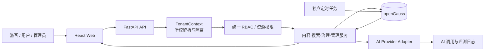

# 此刻校园 TRAE AI 创造力大赛复赛深度优化与落地方案

> 文档性质：复赛冲刺的代码审计版实施蓝图，不代表其中事项已经完成  
> 编制日期：2026-07-24  
> 复赛截止：2026-08-09 23:59（北京时间）  
> 演示学校：江南大学，`code=jiangnan`，`map_zoom=16`  
> 前置方案：[`32_TRAE_AI创造力大赛复赛优化方案.md`](./32_TRAE_AI创造力大赛复赛优化方案.md)  
> 规则依据：[官方复赛参赛指南](https://forum.trae.cn/t/topic/152171)、[`TRAE_AI_创造力大赛_复赛详细说明_2026.md`](./TRAE_AI_创造力大赛_复赛详细说明_2026.md)

---

## 0. 执行结论

“此刻校园”已经具备可访问的 Web 产品、完整的前后端骨架、openGauss 数据库、地图、发布、互动和基础管理后台，不再是纯概念 Demo。但按复赛“完整作品”的标准，它目前仍属于**可运行原型**，尚不能直接冻结提交。

当前最主要的问题不是缺少页面数量，而是四类基础能力没有收敛：

1. **产品闭环存在断点**：普通发布页忽略用户填写的地点并固定发送 `location_id=1`；分类在多个页面硬编码且与数据库种子不一致；草稿、编辑、审核、通知、公开展示之间没有形成稳定闭环。
2. **接口契约与业务规则存在分叉**：举报类型前后端不一致；6 态状态机可被普通更新接口绕过；项目规则要求 5 类协同验证，而当前运行代码只接受 2 类，测试和 SQL 又仍按旧的 5 类实现。
3. **“有 school_id”不等于多租户**：公开列表、地图、地点、搜索和全部管理接口没有统一租户上下文；普通管理员实际上拥有跨学校全局权限；注册和地点创建信任客户端传入的学校 ID。
4. **质量证据尚不成立**：前端可构建，但 lint 当前有 35 个错误、4 个警告；后端虚拟环境缺少 pytest，现有测试夹具还会直接清空当前开发数据库；部分测试引用已删除的收藏模型和过时验证类型。README 中历史“全部通过”数字不能作为复赛证据。

因此，本方案不建议继续横向堆叠大量新模块。复赛应采用以下收敛策略：

### 0.1 一个核心闭环

以“**AI 驱动的校园时空信息发现与协同治理**”为唯一主线，打通：

> 用户用自然语言表达需求 → AI 将需求转换为可校验的结构化条件 → 在当前学校的真实信息中检索 → 给出带来源和理由的结果 → 地图联动定位 → 用户查看详情并协同验证 → 发布者补充信息 → 管理员审核和治理 → 状态、通知与搜索结果同步更新。

### 0.2 三个工程底座

- **事实一致性底座**：统一状态、分类、举报、验证、分页和前后端类型契约。
- **租户与权限底座**：江南大学单校演示不变，但所有数据访问按租户强隔离，管理员只管理本校，`super_admin` 才能跨校。
- **发布质量底座**：隔离测试库、核心 E2E、可观测性、部署版本校验、回滚和材料证据。

### 0.3 两项有条件增强

- AI 辅助发布：只有在普通发布链路稳定后再做，AI 只建议、不替用户发布。
- 5 类协同治理与自动过期：完成核心验证语义后再扩展，不把三类“问题报告”错误地做成互斥投票。

### 0.4 明确不进入复赛主范围

- 不在复赛前上线多学校切换和多校演示数据；演示学校仍唯一为江南大学。
- 不引入微服务、复杂消息队列、向量数据库、原生 App、即时聊天、复杂推荐系统。
- 不为了“数据库亮点”直接执行当前 `backend/scripts/opengauss/` 全套 SQL；这些脚本与现行模型存在明显漂移，必须先治理。
- 不用未跑通的页面、脚本、测试数量或历史文档数字包装完成度。

---

## 1. 复赛要求转化为项目约束

### 1.1 官方硬要求

| 官方要求 | 对本项目的直接约束 | 最终证据 |
|---|---|---|
| 从 Demo 升级为完整产品 | 核心用户路径必须独立走通，不能依靠讲解者手动修数据 | E2E 记录、验收清单、演示视频 |
| Web 必须真实可访问 | 保持 HTTPS 公网部署，评审期链接持续可用 | 私密问卷中的体验入口、可用性检查 |
| 登录产品需测试账号 | 准备游客、普通用户、管理员三种体验路径 | 私密问卷中的账号和使用说明 |
| 产品演示视频必交，1–5 分钟 | 视频展示真实产品、真实 AI 链路和完整闭环 | 公开视频链接及问卷存档 |
| 产品说明书 | 说明场景、角色、功能、核心流程、边界和使用方法 | 社区帖与问卷同步存档 |
| TRAE 实践可核验 | 关键任务 Session ID 不少于 3 个，并有过程截图和阶段成果 | 社区公开过程说明、问卷材料 |
| 社区公开 + 飞书私密双轨 | 社区不放体验链接、测试账号、源码包；这些只进私密问卷 | 提交前双清单复核 |
| API Key 不得泄露 | 模型密钥只在服务端环境变量中，日志、视频和文档脱敏 | 安全检查记录、录屏复核 |
| 8 月 9 日 23:59 截止 | 8 月 6 日功能冻结，8 月 8 日完成提交演练，8 月 9 日中午前提交 | 冻结版本号、材料目录、提交截图 |

### 1.2 评分策略

现有初步方案按社会服务赛道准备。该赛道的产品完成度、社会价值、技术实现、实用性、创新性各占 20%。复赛方案必须让每个维度都有**可体验、可截图、可测试**的证据，而不是只写愿景。

| 评分维度 | 本项目的得分抓手 | 应避免的误区 |
|---|---|---|
| 产品完成度 | 发现、发布、审核、通知、验证、治理两条闭环；游客/用户/管理员完整页面 | 用页面总数代替可用闭环 |
| 社会价值 | 降低校园信息获取成本；过期、冲突和虚假信息由社区与管理员共同治理；架构可复制到其他学校 | 复赛前仓促加入多个空壳学校 |
| 技术实现 | openGauss、租户隔离、状态机、结构化 AI、降级、审计日志、自动化测试 | 堆砌未接入运行链路的 SQL 对象 |
| 实用性 | “什么时候、在哪里、是否仍有效”三个高频问题得到快速答案 | 只做一个聊天框或静态 AI 文案 |
| 创新性 | 自然语言意图 → 真实校园数据 → 时空筛选 → 可解释结果 → 社区验证反馈 | 让模型凭空生成校园事实 |

### 1.3 复赛成功标准

复赛版不是“功能最多”的版本，而应满足以下定义：

- 评审打开链接后，无需指导即可在 3 分钟内理解产品并完成一次核心体验。
- AI 返回的每条校园事实都能追溯到真实帖子，不生成数据库中不存在的地点、时间或活动。
- 任意普通用户和普通管理员都无法访问或操作其他租户的数据。
- 核心链路没有已知 P0/P1 Bug，部署版本与验收版本一致。
- 演示视频中的每一步都能在评审账号和线上环境中复现。

---

## 2. 2026-07-24 项目真实基线

### 2.1 审计覆盖范围

本次基线核对覆盖：

- 官方复赛帖子和本地复赛详细说明；
- 现有初步优化方案、README、TODO、产品、AI、架构、安全、测试、部署和演示文档；
- `backend/app/` 的 API、模型、Schema、权限、配置、中间件和数据库连接；
- Alembic 迁移、openGauss 物理设计 SQL、种子数据及后端测试；
- `frontend/src/` 的 19 个页面、路由、服务、状态仓库、组件和类型；
- Docker、Nginx、systemd、华为云混合部署脚本；
- 本地 openGauss 实例和公网入口的只读验证。

### 2.2 可量化基线

| 项目 | 真实状态 |
|---|---|
| 后端源代码 | `backend/app/` 共 54 个 Python 文件，51 个已注册 HTTP 接口 |
| 前端源代码 | `frontend/src/` 共 54 个 TS/TSX 文件，19 个页面组件 |
| ORM / 数据库 | 20 张 ORM 业务表；实际数据库另含 `alembic_version`，共 21 张基础表 |
| 数据库版本 | openGauss 7.0.0-RC3，Alembic 位于 `g6b7c8d9e0f1 (head)` |
| 本地演示数据 | 1 所学校、11 个用户、30 条帖子、15 个地点、12 个分类、30 条验证、6 条举报 |
| 唯一学校 | 江南大学，`jiangnan`，缩放级别 16 |
| 公网入口 | `https://campus.chaina1.com` 于 2026-07-24 只读检查返回 200，`/health` 返回 `ok`；公开 API 返回 12 个分类、37 条线上帖子 |
| 前端构建 | `npm run build` 通过；地图分包约 1,044.91 kB，超过 Vite 500 kB 警告线 |
| 前端 lint | `npm run lint` 失败：35 个错误、4 个警告 |
| 后端测试 | `backend/.venv` 缺少 pytest，未能收集；现有测试环境也不具备安全执行条件 |
| 增强数据库对象 | 当前数据库未发现项目 SQL 所描述的物化视图、自定义存储过程和自定义触发器 |
| AI 能力 | 目前只有规划和 UI 图标，没有模型适配器、AI API、调用日志、评测集或运行链路 |

公网入口“能打开”只证明基础可达，不代表登录、发布、审核、AI 和全部链路已经在线验收；部署静态首页的 `Last-Modified` 为 2026-07-06，复赛发布时必须增加版本号核对，防止“本地已修、线上仍旧”。

### 2.3 能力成熟度

| 领域 | 已有基础 | 当前成熟度 | 复赛判断 |
|---|---|---:|---|
| 登录与角色 | JWT 登录、刷新，`user/admin/super_admin` 角色字段 | 60% | 可复用，但登出无服务端失效、管理路由未统一 `require_role()` |
| 信息内容 | 帖子 CRUD、图片/标签模型、6 态状态机、审核接口 | 55% | 模型较全，访问控制和前端闭环不完整 |
| 地图 | MapLibre、视野范围标记、地图点选发帖 | 65% | 是优势页面，但分类错配、无租户过滤、包体过大 |
| 普通搜索 | 关键词与部分筛选、搜索历史 | 45% | 后端 N+1，前端仅关键词，无 AI、无地图联动 |
| 互动治理 | 点赞、评论、举报、2 类验证、通知 | 45% | 契约不一致，5 类规则未实现，游客详情会请求需登录的统计接口 |
| 个人中心 | 资料、头像、我的帖子 | 45% | 草稿/状态/分页/统计/编辑删除体验不完整 |
| 管理后台 | 仪表盘、审核、举报、用户、分类、标签 API、日志 | 55% | 有骨架，但全局越权、设置是假设置、标签页面被隐藏 |
| 多租户 | `schools` 及部分 `school_id` 字段 | 25% | 只是数据字段，不是完整租户机制 |
| 数据库工程 | Alembic、索引设计、物理 SQL 文档 | 45% | 迁移可用；高级 SQL 未部署且与现模型漂移 |
| 自动化质量 | 70 个测试函数源代码、构建脚本 | 25% | 当前不能形成可信发布门禁 |
| 部署 | 华为云、HTTPS、Nginx、systemd/openGauss | 70% | 公网可达，但部署方案分叉、健康检查过浅、版本不可识别 |

### 2.4 结论

项目已有很好的复赛底盘，尤其是地图、状态、协同治理概念、openGauss 和基础后台。但下一阶段必须从“实现了许多对象和接口”转为“关键路径一致、隔离、可测、可证明”。

---

## 3. 提交前必须消除的 P0 问题

### 3.1 内容访问与状态机

| 证据 | 风险 | 修复目标 |
|---|---|---|
| `GET /posts` 先固定 `published`，再叠加用户传入的 `status` | 查询非 published 状态时形成互斥条件；参数名义上支持但实际上不可用 | 公开列表只接受公开状态；“我的帖子”和管理列表使用独立受权接口 |
| `GET /posts/{id}` 只检查未删除，不检查状态、作者或管理员 | 知道 ID 的游客可查看 draft、pending、archived 等非公开内容 | 公开仅 published/允许展示的 expired；作者看自己的；管理员按本校权限查看 |
| `PostUpdate` 暴露 `status` 和 `is_recommend` | 普通作者可绕过审核、自荐或写入任意状态 | 普通更新 Schema 删除管理字段；所有状态变化只走状态机服务 |
| 举报删除会写入 `post.status="deleted"` | 产生第 7 个未定义状态，破坏 6 态规则 | 删除采用 `is_deleted` + `archived`，并记录统一原因 |
| 管理员状态流转无学校范围 | 普通管理员可跨租户改状态 | 所有管理操作同时校验角色和租户 |

必须把状态机从一个辅助接口升级为**唯一写入口**。内容实质修改后的 published 帖子应回到 pending，防止“审核后替换内容”。

### 3.2 前后端契约

| 不一致 | 当前表现 | 目标 |
|---|---|---|
| 举报类型 | 前端发送 `fake/ad/inappropriate/other`；后端接受 `spam/abuse/harassment/false_info/other` | 以 OpenAPI/共享类型为准，端到端契约测试覆盖全部选项 |
| 点赞响应 | 后端返回 `is_liked`；前端服务声明 `liked` | 统一字段并禁止宽松类型断言掩盖问题 |
| 分页 | 全局类型含 `has_more`，实际后端使用 `total_pages` | 统一分页模型 |
| 评论/帖子作者 | 部分服务类型使用 `user`，实际响应使用 `author` | 生成或维护唯一 API 类型源 |
| 搜索地点 | 前端可发送 `location_name`，后端只接受 `location_id` | 明确地点 ID、文本和地图范围三种筛选语义 |
| 标题长度 | 普通发布页限制 100，后端允许 200 | 前后端共享规则 |

建议从 FastAPI OpenAPI 生成 TypeScript API 类型，至少先消除关键接口的手写重复类型。

### 3.3 发布链路

普通发布页当前显示地点文本和坐标字段，却始终发送 `location_id=1`；分类列表也是硬编码，其中 ID 4–11 与实际种子分类明显错位。地图点选发布的坐标提交相对正确，但两套发布体验重复且规则不同。

复赛目标应为一套统一的发布工作流：

1. 动态加载后端分类、帖子类型和本校地点；
2. 支持选择已有地点或在地图上新建待验证地点；
3. 支持图片、标签、有效期、活动时间和联系方式；
4. 可保存草稿、继续编辑、提交审核、查看审核原因、修改后重新提交；
5. 发布成功后进入“我的发布”，而不是无条件跳首页；
6. 管理员审核后通知用户，公开列表、地图和搜索结果同时可见。

### 3.4 协同验证语义

项目约束是 5 类：

- `confirmation`：证实；
- `refutation`：证伪；
- `update`：信息需要更新；
- `expiration_report`：可能已经过期；
- `conflict_report`：信息存在冲突。

当前运行代码只接受前两类，`validation_records(post_id,user_id)` 又限制每用户每帖只能有一条记录；测试、物化视图 SQL、存储过程 SQL 和文档仍按 5 类编写。这不是简单增加三个按钮可以解决的问题：证实/证伪是互斥投票，后三类是需要说明、证据和管理员处理状态的问题报告。

推荐物理建模：

- `validation_records` 保留证实/证伪互斥投票；
- 新增 `post_change_reports`（或等价模型）承载 `update/expiration_report/conflict_report`，包含说明、证据、处理状态、处理人和处理时间；
- 对外统一称为 5 类协同验证，在详情页聚合展示；
- 三类问题报告进入管理员治理队列，并驱动 `expired/conflict` 状态，而不是直接由一次点击改状态。

若工期不足，至少要在复赛版中统一代码、测试和文档的事实，不能继续同时宣称“2 类”和“5 类”。本项目既定规则为 5 类，因此目标应是恢复五类产品语义。

### 3.5 测试安全与真实性

`backend/tests/conftest.py` 直接使用 `settings.DATABASE_URL`，每个测试前后对全部业务表执行 `TRUNCATE ... CASCADE`。当前它指向本地开发数据库，因此直接运行测试会清空现有演示数据。同时：

- `backend/.venv` 未安装 `requirements-dev.txt`，pytest 不可用；
- 测试仍导入已删除的 `app.models.favorite`；
- 多个用例仍调用已删除的 `/favorite` 接口；
- 验证类型测试仍断言旧 5 类 Schema，而运行代码已精简为 2 类；
- 物化视图、触发器和存储过程测试假设对应对象已安装，但当前数据库实际没有这些对象。

在建立独立测试数据库、强制环境保护和修复过时测试前，任何“全部测试通过”都不能作为复赛材料。

### 3.6 openGauss 设计脚本漂移

当前真实运行库只有 Alembic 迁移创建的基础表，没有项目 SQL 文档中的自定义触发器、物化视图和存储过程。现有物理 SQL 还包含以下过时引用：

- 已删除的 `favorites` 表和 `favorite_count`；
- 已删除的 `is_top`；
- 旧状态 `pending_review`；
- 5 类验证与当前 2 类运行代码冲突；
- 分区迁移脚本重建旧字段结构；
- 评论和点赞计数触发器若与当前 API 手动计数同时启用，可能形成重复计数。

复赛前以 Alembic 为唯一结构变更入口。高级 SQL 必须逐个迁移、测试、登记，不能用“脚本文件存在”作为运行能力证明。

### 3.7 部署与配置

- FastAPI 当前没有挂载 `/uploads` 静态目录；华为云混合部署由 Nginx `alias` 正常提供文件，但 Docker 部署会把 `/uploads` 转发给后端而得到 404，两个部署方案行为不同。
- `/health` 只返回常量 `ok`，无法证明数据库、上传目录和 AI 服务可用。
- Pydantic 配置没有环境变量前缀，审计环境中的通用 `DEBUG=release` 曾导致 Alembic 启动失败；应避免通用变量名碰撞。
- CORS、密钥和上传路径在多套 `.env`/脚本中重复维护。
- 部署没有暴露构建提交号，无法确认线上是否为验收版本。

需要增加 `/health/live`、`/health/ready` 和 `/version`，并将唯一生产部署方式、配置模板、迁移顺序和回滚步骤固化。

---

## 4. 复赛产品定义与演示故事

### 4.1 一句话定位

> 此刻校园是一个 AI 驱动的校园时空信息发现与协同治理平台：它把散落、短时、易过期的校园信息变成可搜索、可定位、可验证、可追踪的公共信息服务。

### 4.2 与普通校园论坛的区别

| 普通论坛/群聊 | 此刻校园复赛版 |
|---|---|
| 信息按发布时间堆叠 | 按地点、时间、分类、有效性和用户意图检索 |
| 搜索只匹配字面关键词 | AI 将自然语言拆成可校验筛选条件，再查询真实数据 |
| 旧消息仍被转发 | 帖子有状态、有效期、社区验证和过期报告 |
| 管理只做删帖 | 审核、举报、冲突、过期和更新建议进入可追踪治理队列 |
| AI 直接“回答” | AI 只解释数据库结果，每条结果都能打开来源帖子 |

### 4.3 核心演示问题

主演示建议使用一句真实、高频且同时包含时间和地点意图的问题：

> “今晚十点后，蠡湖校区哪里还能打印？”

系统应展示：

1. AI 解析出的“今晚 22:00 后、打印服务、江南大学、优先最新且已证实”；
2. 来自真实帖子的数据卡片，标注匹配理由、更新时间和协同验证结果；
3. 地图自动聚焦相关地点；
4. 打开详情后可查看原文、地点、有效期和验证记录；
5. 用户可证实、证伪或报告过期；
6. 管理员在治理队列中处理问题并留下审计记录。

第二条短演示使用发布闭环：

> 学生在地图上选择地点 → AI 帮助补全标题/标签/有效期 → 用户确认 → 提交审核 → 管理员审核 → 用户收到通知 → 信息进入公开搜索和地图。

### 4.4 AI 边界

- 不把模型知识当作校园事实；检索结果为空时明确说“当前没有匹配信息”。
- 不自动发布、不自动审核、不自动删除。
- 不把联系方式、邮箱、Token、密钥或未经必要脱敏的正文发送给模型。
- AI 建议必须可编辑；用户确认后才进入业务流程。
- 模型不可用时，产品仍能使用普通关键词、分类和地图筛选。

---

## 5. 目标技术架构



### 5.1 架构原则

1. **保持单体应用**：工期内按服务模块整理业务逻辑，不拆微服务。
2. **先确定性检索，后模型解释**：模型负责解析意图和生成简短理由，数据库负责事实和权限。
3. **租户上下文位于所有业务查询之前**：不能依赖每个路由作者“记得加 school_id”。
4. **状态变化集中处理**：审核、过期、冲突、归档统一调用状态服务，并记录事件和通知。
5. **耗时任务与 Web 进程分离**：当前生产使用 4 个 Uvicorn worker，不应在每个 worker 内启动重复定时器。使用独立 systemd timer/worker 执行幂等过期任务。
6. **迁移是数据库结构唯一真相**：Alembic 负责所有复赛新增表、索引和约束。

### 5.2 推荐后端模块边界

| 模块 | 职责 |
|---|---|
| `tenant` | 解析当前学校、校验会员关系、提供租户过滤条件 |
| `posts` | 创建、编辑、状态机、媒体、有效期、公开可见性 |
| `discovery` | 普通搜索、AI 意图解析、检索、排序、地图联动 |
| `governance` | 5 类协同验证、举报、冲突、过期和更新建议 |
| `admin` | 本校审核、治理队列、用户、配置、审计 |
| `ai` | Provider 适配、Schema 校验、超时重试、降级、调用记录 |
| `jobs` | 自动过期、通知清理、必要统计维护 |

不要求在复赛前做大规模目录重构，可以先用小型 service 函数消除路由中的重复查询和权限逻辑。

---

## 6. 多租户机制深化方案

### 6.1 复赛范围与长期目标

复赛体验仍只展示江南大学。多租户建设的目的不是增加空学校，而是证明平台具备**安全复制到其他学校**的能力。

分两层推进：

- **复赛 P0：单校可见、租户强隔离**。所有请求都拥有明确 `TenantContext`，普通管理员只能管理江南大学数据，客户端不能任意指定写入学校。
- **复赛后 P1：真正多校成员体系**。引入用户多校成员关系、学校域名、品牌配置和切换体验。

### 6.2 租户解析

| 请求类型 | 租户来源 | 安全规则 |
|---|---|---|
| 游客公开请求 | 生产域名映射或服务端 `SCHOOL_CODE=jiangnan` | 不接受任意 `school_id` 绕过默认学校 |
| 登录用户请求 | 用户当前成员关系/默认学校 | Token 中的用户 ID 回库校验，不能只信客户端状态 |
| 写请求 | 服务端租户上下文 | 忽略客户端提供的 `school_id`，由服务端注入 |
| 普通管理员 | 管理员当前学校 | 所有列表、统计、审核、举报、用户和日志强制同校 |
| 超级管理员 | 显式选择的学校或全局视图 | 只有 `super_admin` 可跨校，跨校动作必须记录目标学校 |

### 6.3 数据范围

| 实体 | 推荐范围 | 复赛处理 |
|---|---|---|
| `schools` | 租户根 | 仅江南大学启用 |
| `users` | 当前为单校用户 | 保留 `school_id`，所有查询强制同校 |
| `posts/locations/topic_collections` | 学校级 | 已有 `school_id`，补齐全部查询和关联校验 |
| `categories/post_types` | 平台模板或学校覆盖 | 复赛先作为全局模板，不允许普通管理员影响其他学校；后续加覆盖层 |
| `tags` | 可全局或学校级 | 复赛先全局词表；管理权限需限制，后续增加 `school_id nullable` |
| 评论、点赞、验证、举报、通知 | 继承帖子/用户租户 | 所有写入先验证目标资源与当前租户一致 |
| 管理日志 | 学校级 + 平台级 | 增加 `school_id`、请求 ID、IP、UA、结果和变更摘要 |
| AI 调用日志 | 学校级 | 增加 `school_id`，便于成本、效果和隐私审计 |
| 学校设置 | 学校级 | 新增真实后端配置表，替代浏览器 localStorage |

### 6.4 角色模型

遵守 `user < admin < super_admin` 层级并统一使用 `app/core/permissions.py` 的 `require_role()`：

- `user`：当前学校普通成员；
- `admin`：当前学校管理员，只能管理本校；
- `super_admin`：平台级管理员，可查看和管理全部学校。

长期多校版本再引入 `school_memberships(user_id, school_id, role, status, is_default)`，其中角色仍使用同一三态枚举。复赛前若团队只有一名主要开发者，不建议为了未来切换能力立即迁移会员表；先把现有单校关系隔离正确。

### 6.5 强制隔离清单

- `GET /posts`、`GET /map/markers`、`GET /search`、`GET /locations` 默认只返回当前学校。
- 帖子详情先做状态可见性，再做租户可见性。
- 创建/更新帖子时，分类、帖子类型、地点均需验证有效且属于允许范围。
- 注册不接受任意学校 ID；复赛版服务端固定解析 `jiangnan`。
- 地点新建只能落入当前用户学校，且进入地点核验队列。
- 所有 admin 查询都增加学校过滤；所有批量操作逐条再次校验租户。
- 缓存键、分页计数、AI 日志和搜索历史必须包含学校 ID。
- 任何跨校 ID 访问统一返回 404，避免泄露资源是否存在。

### 6.6 租户验收矩阵

至少用 A、B 两个测试学校在**独立测试库**中验证：

| 场景 | 预期 |
|---|---|
| A 校游客请求公开列表/地图/搜索 | 只出现 A 校数据 |
| A 校用户用 B 校地点创建帖子 | 404/拒绝，数据库无写入 |
| A 校用户读取 B 校 draft/pending | 404 |
| A 校 admin 审核 B 校帖子 | 404，产生安全日志 |
| A 校 admin 查看用户/举报/统计 | 所有数量只计算 A 校 |
| super_admin 显式进入 B 校 | 可操作 B 校并记录目标租户 |
| 未提供租户上下文 | 生产默认江南大学；后台敏感接口拒绝歧义请求 |

不把数据库 RLS 作为复赛依赖，除非先确认 openGauss 轻量版支持并完成回归。复赛以应用层统一过滤、数据库外键/唯一约束和隔离测试形成三层防线。

---

## 7. 管理后台深化方案

### 7.1 从“多个列表页”升级为“治理工作台”

管理员首页应突出待办，而不只是总数：

- 待审核内容；
- 待处理举报；
- 待核验地点；
- 过期报告；
- 冲突报告；
- 更新建议；
- 最近异常和失败任务。

每个卡片都可点击进入已带筛选条件的队列。

### 7.2 审核队列

- 列表展示完整内容摘要、分类、地点、有效期、图片、作者历史和重复风险。
- 审核详情使用管理专用接口，不再依赖可公开访问的普通帖子详情。
- 通过、驳回都支持原因模板和自定义说明。
- 实质内容修改后自动回审；重复提交保持幂等。
- 批量操作显示成功、失败和原因，不能静默跳过跨校/错误状态记录。
- 审核动作、状态变化和用户通知在同一事务中提交。

### 7.3 举报与协同治理

- 统一举报枚举和中文文案。
- 合并普通内容举报与三类问题报告的治理入口，但保留不同处理动作。
- 处理“过期”可将帖子转为 `expired`；处理“冲突”可转为 `conflict`；确认更新后可通知作者并进入待修改状态。
- `delete_post` 不写第 7 种状态；封禁用户前校验角色层级、当前学校和目标是否为自己。
- 普通 `admin` 不得封禁 `super_admin`，也不得操作其他学校管理员。

### 7.4 用户与权限

- 增加昵称/邮箱搜索、角色和状态筛选、学校范围展示。
- 角色变更只允许更高角色执行，并阻止自降权、自封禁和越级操作。
- 批量禁用前二次确认，显示影响数量。
- 用户详情展示发帖、举报、验证和管理记录，但按隐私最小化原则展示。

### 7.5 真实系统设置

当前设置页只写浏览器 localStorage，对后端行为没有影响。复赛版应新增本校设置接口和表，至少包含：

- 站点名称/说明；
- 是否需要审核；
- 是否允许匿名；
- 是否允许评论；
- 每用户发布频率；
- 单帖图片上限；
- 默认有效期策略。

所有设置由后端执行，前端只负责编辑。更改设置必须记录旧值、新值和操作者。

### 7.6 审计日志

日志最少包含：`school_id`、`request_id`、管理员、动作、目标、结果、原因、IP、User-Agent、时间和必要的前后差异。日志详情不得存储 Token、密码、API Key 或完整敏感联系方式。

### 7.7 管理后台验收

- 普通 admin 的任何页面和 API 都只看到本校数据。
- 审核、驳回、举报处理、用户禁用均产生可搜索日志和正确通知。
- 所有设置在另一浏览器/设备中仍然生效。
- 管理员不能通过批量接口绕过单条接口的权限和状态校验。
- 标签管理要么恢复真实路由并验收，要么删除未使用代码和 API 声明；不能继续保留 20 KB 隐藏页面作为“已完成功能”。

---

## 8. 功能深化实施包

### 8.1 FND：事实与基础安全（P0）

**任务**

- 形成 API 契约表，统一举报、点赞、作者、分页、状态、分类和验证类型。
- 公开详情增加状态/作者/租户可见性策略。
- 普通更新接口移除 `status/is_recommend`，状态只走服务层。
- 管理路由统一 `require_role()`，补资源级租户校验。
- 为登录、注册、发布、评论、验证、举报和 AI 搜索增加基础限流。
- 统一异常响应和请求 ID；日志不输出敏感参数。

**验收**

- 未授权访问测试矩阵全部通过；普通用户无法自荐、自发布或读取他人草稿。
- 前后端契约测试覆盖所有关键枚举。
- 没有业务路由直接写入未定义帖子状态。

### 8.2 PUB：完整发布闭环（P0）

**任务**

- 合并普通发布页和地图发布的表单逻辑。
- 分类、帖子类型、地点全部来自 API。
- 支持草稿列表、继续编辑、删除/归档、提交审核和重新提交。
- 支持图片上传预览、标签、有效期、活动时间、联系方式和匿名选项。
- 对地点选择做本校校验；新地点进入 `is_verified=false` 队列。
- 前端展示中文状态、审核原因和下一步动作。

**验收**

- 普通用户可在移动端完成“保存草稿 → 编辑 → 提交 → 审核 → 通知 → 公开”。
- 发布页不再出现固定地点或硬编码分类。
- 图片、地点、有效期和联系方式在详情页正确显示。

### 8.3 DSC：发现、地图与详情（P0）

**任务**

- 首页、搜索、地图使用同一分类源和租户上下文。
- 普通搜索支持分类、地点、帖子类型、有效状态、时间和排序。
- 消除搜索、地图、通知、管理列表的 N+1 查询。
- 搜索结果总数使用后端 `total`，支持分页/加载更多和可见错误提示。
- 搜索结果与地图选中状态联动；地图失败时保留列表视图。
- 详情页展示图片、状态、有效期、活动时间、联系方式、验证和回复树。
- 地图模块按需加载，评估拆分 MapLibre 和样式资源。

**验收**

- 同一筛选条件下列表与地图结果一致。
- 搜索/地图 API 默认只返回江南大学数据。
- 典型 20 条结果查询不再按每条结果额外请求多次数据库。
- 低速网络或地图瓦片失败时仍能浏览列表和详情。

### 8.4 GOV：协同治理（P0/P1）

**任务**

- 恢复 5 类产品语义，区分二类投票和三类问题报告。
- 禁止作者给自己做有效性投票；允许作者响应更新/过期/冲突报告。
- 详情页显示验证数量、时间、说明和处理状态。
- 举报枚举前后端统一；重复举报和频率限制明确。
- 实现幂等自动过期任务，扫描到期 published 内容并转为 expired、通知作者。
- `conflict` 和 `expired` 状态在列表/搜索/地图中有明确展示策略。

**验收**

- 五类交互均有端到端测试；同一用户可以投一类票并提交不同问题报告。
- 过期任务重复执行不会重复通知或产生非法状态。
- 管理员处理后状态、通知、审计和前端展示一致。

### 8.5 PRF：个人中心与通知（P1）

**任务**

- 我的帖子按状态分组并分页；支持编辑、提交、归档和删除。
- 资料更新后同步刷新全局 auth store，避免页头显示旧数据。
- “已发布”“草稿”“待审核”“贡献验证”统计使用真实后端值。
- 增加未读数量接口，将页头角标接入；通知列表支持分页。
- 浏览历史模型若保留，则在详情查看时真实记录并提供最近浏览；否则不在复赛中宣称该功能。

### 8.6 TOPIC：校园专题（有条件 P1）

项目已有 `topic_collections` 和关联模型但没有 API/UI。若 P0 全部通过，可只做一个高价值专题，例如“新生入校一周”或“夜间校园服务”，由管理员将已发布帖子编排为专题，增强社会价值和持续使用场景。若 8 月 2 日前未达到 P0 门槛，则本项顺延。

---

## 9. AI 核心链路

### 9.1 为什么优先 AI 搜索

AI 搜索直接解决当前产品的核心痛点，与已有帖子、分类、地点、地图和状态数据复用度最高；它比独立聊天机器人更容易证明实用性，也比一次加入多个生成能力更容易稳定和测试。

### 9.2 API 设计

建议新增独立接口 `POST /api/v1/search/ai`，保留原 `/search` 作为确定性降级。

请求示例：

```json
{
  "query": "今晚十点后哪里还能打印",
  "map_bounds": {
    "north": 31.49,
    "south": 31.47,
    "east": 120.29,
    "west": 120.25
  },
  "page": 1,
  "page_size": 10
}
```

模型只允许输出经 Schema 校验的意图：

```json
{
  "keywords": ["打印"],
  "category_codes": ["print"],
  "location_text": null,
  "time_start": "2026-07-24T22:00:00+08:00",
  "time_end": null,
  "freshness": "current",
  "sort": "relevance"
}
```

响应应同时返回：

- 原始问题；
- 通过校验后的结构化意图；
- 真实帖子结果及来源 ID；
- 每条结果的短匹配理由；
- 是否发生降级、降级原因；
- `trace_id`，用于问题定位但不暴露内部提示词或密钥。

### 9.3 处理流水线

1. 从 `TenantContext` 得到当前学校；
2. 对输入做长度、频率和敏感信息检查；
3. 调用模型解析意图，设置严格 JSON Schema、超时和有限重试；
4. 对分类、排序、时间和地图范围做白名单校验；
5. 用 openGauss 查询本校、可公开、未删除且符合状态/有效期的数据；
6. 使用确定性分数综合文本匹配、地点、时间、新鲜度和验证情况；
7. 模型只基于候选结果生成简短理由，或直接由模板生成理由；
8. 记录调用元数据和效果，返回结果；
9. 任一步失败则调用普通搜索，明确返回 `fallback=true`。

### 9.4 检索技术选择

复赛阶段先使用结构化筛选 + 当前 openGauss 能力完成事实检索。可在确认兼容后增加全文索引或 trigram，但不把未验证扩展作为上线前置条件。暂不引入向量数据库，原因是演示数据量小、部署和评测成本高，且不能自动解决租户、时效和事实可追溯问题。

### 9.5 AI Provider 适配器

Provider 层统一：

- 模型名称、超时、重试和最大 Token；
- 结构化输出验证；
- 错误分类和熔断；
- 成本/耗时/成功状态记录；
- 测试用假 Provider；
- 密钥仅从服务端环境变量读取。

业务代码不得直接依赖某一家模型 SDK，便于模型故障时切换。

### 9.6 AI 调用日志

新增 `ai_invocation_logs`，最少记录：`school_id`、`user_id`、场景、模型、延迟、输入长度、输出状态、降级原因、候选数、结果数、trace ID 和时间。默认不保存完整敏感输入；如为评测保留样本，应脱敏并明确保留周期。

### 9.7 前端体验

- 搜索框明确写“试试：今晚十点后哪里还能打印”；
- AI 解析后展示可编辑筛选 Chip，如“打印服务”“今晚 22:00 后”“优先已证实”；
- 结果卡显示“为什么匹配”、更新时间、地点和有效性；
- 点击结果同步定位地图；
- 提供“普通搜索”切换和 AI 降级提示；
- 不用全屏聊天 UI 抢占现有产品结构。

### 9.8 AI 评测集与验收指标

建立至少 30 条人工标注问题，覆盖：同义表达、地点、时间、分类、组合条件、无结果、歧义、敏感输入和模型故障。

| 指标 | 复赛目标 |
|---|---:|
| 结构化意图关键字段准确率 | ≥ 90% |
| 标注问题 Top-5 有相关结果比例 | ≥ 85% |
| 返回不存在帖子 ID | 0 |
| 跨租户结果 | 0 |
| 模型失败后普通搜索可用率 | 100% |
| 普通搜索 P95 | 在生产基线后设门槛，建议 ≤ 800 ms |
| AI 搜索 P95 | 建议 ≤ 3.5 s，超时立即降级 |

这些是验收目标，必须用真实评测记录证明，不能在材料中提前写成已达到。

### 9.9 AI 辅助发布（P1）

在用户已有草稿基础上，AI 可建议：标题、摘要、分类、标签、默认有效期、可能遗漏的信息和敏感信息提醒。它必须满足：

- 只返回结构化建议；
- 不修改原文，用户逐项确认；
- 不改变地点坐标和发布状态；
- 不自动通过审核；
- 失败不影响手动发布。

只有 `PUB` 发布闭环和 `AI` 基础适配器通过验收后才实施。

---

## 10. 数据库与生命周期治理

### 10.1 Alembic 单一真相

所有新增字段、表、约束和索引都通过 Alembic：

- 租户设置与审计字段；
- AI 调用日志；
- 三类问题报告及处理状态；
- 必要的复合索引；
- 状态和枚举数据迁移。

每个迁移同时提供升级、降级、数据校验和生产备份步骤。

### 10.2 状态机

唯一合法状态保持：`draft/pending/published/expired/conflict/archived`。

建议的关键路径：

| 来源 | 目标 | 触发者 |
|---|---|---|
| draft | pending | 作者提交 |
| draft | archived | 作者放弃 |
| pending | published | 本校管理员通过 |
| pending | archived | 本校管理员驳回 |
| published | pending | 作者实质修改后重审 |
| published | expired | 到期任务或管理员确认过期 |
| published | conflict | 管理员确认冲突 |
| conflict | published | 冲突解决 |
| expired | published | 作者更新并重新审核通过 |
| 任意非终态 | archived | 合法治理/作者动作 |

具体转换以现有 `app/core/post_status.py` 为基础收敛，并用测试锁定。数据库软删除不再创造新状态。

### 10.3 计数一致性

复赛版选择应用服务作为点赞、评论和验证计数的唯一写入者，暂不启用重复计数触发器。并提供离线重算命令，用真实记录校正冗余计数。未来若改为触发器，需删除应用手动计数后再迁移。

### 10.4 定时任务

采用单独 systemd timer/worker，每次任务：

- 获取数据库锁或任务幂等键；
- 批量扫描到期 published 帖子；
- 按状态机转 expired；
- 每帖只发送一次通知；
- 记录开始、成功、失败、处理数量和耗时；
- 支持 dry-run 和手动重跑。

不在 4 个 Web worker 的 startup 事件中启动调度器。

---

## 11. 安全、隐私与可观测性

### 11.1 认证与权限

- 管理接口统一 `require_role(Role.ADMIN)`；平台接口使用 `Role.SUPER_ADMIN`。
- 每个写操作同时进行角色、租户、资源所有权和状态校验。
- Refresh Token 至少增加可撤销标识或服务端会话记录；登出使当前刷新会话失效。
- 登录、注册、刷新、举报、评论和 AI 搜索配置速率限制。
- 管理员不能操作同级/更高级敏感账号，除非满足明确授权规则。

### 11.2 上传安全

- 头像与帖子图片统一走同一验证服务；按文件内容识别格式，不信任扩展名和声明 MIME。
- 限制尺寸、像素、数量，重新编码图片并生成安全文件名。
- Nginx 与应用的上传路径行为保持一致。
- 复赛可继续使用本地持久卷，但必须备份；对象存储不是当前前置条件。

### 11.3 AI 隐私

- 联系方式默认不进入模型；必要时先掩码。
- 提示词、错误日志和演示录屏不出现密钥。
- AI 日志保存最少数据并有保留期限。
- 前端明确标注“AI 结果来自校园帖子，可能需要再次确认”。

### 11.4 可观测性

- 每个请求生成/接受 `X-Request-ID` 并贯穿日志、AI 调用和管理审计。
- `/health/live`：进程可响应；
- `/health/ready`：数据库、必要目录和 AI 配置状态；AI 故障可标记 degraded，而不是让整个站点不可用；
- `/version`：提交 SHA、构建时间、迁移版本；
- 记录接口状态码、延迟、异常类型，不记录密码/Token/密钥。
- 管理首页可展示最近任务失败和 AI 降级率，不必建设复杂监控平台。

### 11.5 生产发布

- 统一以当前华为云混合部署为复赛生产路径，其他 Docker 方案保留但不作为评审入口。
- 每次发布顺序：备份 → 迁移预检 → 前端构建 → 后端重启 → ready 检查 → 冒烟测试 → 版本核对。
- 保留上一版前端构建和后端提交号，数据库迁移先验证可降级性。
- 8 月 6 日后只允许修复阻断 Bug，不再加入新功能。

---

## 12. 测试与发布门禁

### 12.1 先修测试基础设施

1. 新建独立 `moment_campus_test` 数据库；
2. 测试只读取 `TEST_DATABASE_URL`，缺失时直接停止；
3. 启动时断言数据库名包含 `_test`，严禁与开发/生产 URL 相同；
4. 在 `backend/.venv` 安装开发依赖；
5. 删除/改写收藏和旧验证语义的过时测试；
6. 将依赖高级 SQL 对象的测试单独分组，未安装时明确跳过，不能与核心 API 测试混在一起。

### 12.2 后端测试矩阵

| 组 | 必测内容 |
|---|---|
| 认证 | 注册学校解析、登录、刷新、登出失效、禁用账号、限流 |
| 租户 | 公开查询、详情、写入、admin、批量操作全部跨校隔离 |
| 状态 | 6 态全部合法/非法转换、普通更新不能绕过、实质修改回审 |
| 发布 | 草稿、地点校验、图片/标签、提交、审核、通知、公开 |
| 搜索 | 普通筛选、分页、地图范围、无结果、租户条件 |
| AI | Schema、超时、无效输出、降级、无幻觉 ID、脱敏 |
| 治理 | 2 类投票、3 类报告、举报、过期任务、冲突处理、幂等 |
| 管理 | 角色层级、同校限制、审计日志、真实设置 |

### 12.3 前端与 E2E

当前前端没有测试脚本。建议增加少量高价值测试，而不是追求页面覆盖率数字：

- Vitest/Testing Library：发布表单、状态按钮、AI 意图 Chip、权限路由；
- Playwright：游客发现、用户发布、管理员审核、通知公开、AI 搜索、跨租户拒绝；
- 统一 API mock/fixture，不在组件中复制后端类型。

### 12.4 发布门禁

候选版本必须同时满足：

- 后端核心测试在独立测试库全部通过；
- 前端 `npm run lint` 零错误、`npm run build` 通过；
- 6 条核心 Playwright 路径通过；
- 30 条 AI 评测完成并保存结果；
- 桌面 Chrome/Edge 与主流移动尺寸人工验收；
- 生产环境连续重复核心演示至少 10 次无阻断；
- 跨租户测试 0 泄露；
- `/version` 与冻结提交一致；
- 所有 P0/P1 已知 Bug 有结论，P0 必须为 0。

---

## 13. 可执行任务清单

### 13.1 P0：必须进入复赛版本

| ID | 任务 | 预计工作量 | 依赖 | 完成出口 |
|---|---|---:|---|---|
| FND-01 | 统一关键 API 枚举、分页和 TS 类型 | 0.5–1 天 | 无 | 契约测试通过 |
| FND-02 | 独立测试库与防误删保护 | 0.5 天 | 无 | 测试无法连接开发/生产库 |
| FND-03 | 帖子公开可见性与状态写入口收敛 | 1 天 | FND-01 | 草稿泄露、自发布、自推荐测试通过 |
| TEN-01 | TenantContext 和公开查询强隔离 | 1 天 | FND-01 | 列表/详情/搜索/地图隔离测试通过 |
| TEN-02 | admin 同校限制与 `require_role()` | 1 天 | TEN-01 | 管理跨校测试全部拒绝 |
| PUB-01 | 动态分类/地点和统一发布表单 | 1–1.5 天 | FND-01、TEN-01 | 不再硬编码，移动端发布通过 |
| PUB-02 | 草稿—编辑—提交—审核—通知—公开 | 1–1.5 天 | PUB-01、TEN-02 | E2E 通过 |
| DSC-01 | 普通搜索筛选、N+1、分页、错误状态 | 1 天 | TEN-01 | 查询数和功能验收通过 |
| DSC-02 | 搜索与地图联动、详情字段补齐 | 1 天 | DSC-01、PUB-01 | 主发现路径 E2E 通过 |
| ADM-01 | 治理工作台、审核详情和事务动作 | 1–1.5 天 | TEN-02、PUB-02 | 管理员闭环通过 |
| AI-01 | Provider 适配、结构化输出、日志、降级 | 1–1.5 天 | FND-01、TEN-01 | 故障测试和日志验收通过 |
| AI-02 | AI 意图—检索—排序—理由—地图 UI | 2 天 | AI-01、DSC-01 | 30 条评测达门槛 |
| REL-01 | 修复 lint、关键后端/前端/E2E 测试 | 1.5–2 天 | 上述模块 | 发布门禁通过 |
| REL-02 | ready/version、部署脚本、备份回滚 | 1 天 | FND、AI | 生产演练通过 |

P0 总量约 15–18 人日。单人开发必须严格串行并削减 P1；两到三人团队可按后端底座、前端闭环、测试/材料并行。

### 13.2 P1：P0 通过后再进入

| ID | 任务 | 进入条件 | 完成出口 |
|---|---|---|---|
| GOV-01 | 五类协同治理完整语义 | 状态与管理队列稳定 | 五类 E2E、聚合展示、处理记录通过 |
| GOV-02 | 自动过期独立任务 | 状态机稳定 | 幂等与重复通知测试通过 |
| ADM-02 | 后端真实学校设置 | TEN-02 完成 | 跨浏览器生效、有审计 |
| PRF-01 | 我的帖子分组、真实统计、未读角标 | PUB-02 完成 | 个人闭环通过 |
| AI-03 | AI 辅助发布 | AI-02、PUB-02 完成 | 建议可编辑、失败不阻塞 |
| TOPIC-01 | 一个真实校园专题 | 所有 P0 通过且日期不晚于 8 月 2 日 | 专题可浏览、内容可追溯 |

### 13.3 P2：复赛后

- `school_memberships` 多校成员体系和学校切换；
- 学校域名、独立品牌和分类覆盖；
- 对象存储、CDN、完整监控和 CI/CD；
- 个性化订阅、地点订阅和推荐；
- 更大规模全文/向量混合检索；
- 多校运营与超级管理员学校管理中心。

---

## 14. 7 月 24 日至 8 月 9 日冲刺排期

| 日期 | 主任务 | 当日闸门 |
|---|---|---|
| 7/24 | 完成代码审计、范围冻结、建立真实基线 | 本文档评审；确认单人/团队容量 |
| 7/25 | API 契约、独立测试库、过时测试清理 | 测试绝不接触开发库；关键枚举统一 |
| 7/26 | 帖子可见性、状态写入口、举报契约、权限基础 | 草稿泄露和状态绕过关闭 |
| 7/27 | TenantContext、公开 API 同校过滤 | 第一轮跨校隔离测试通过 |
| 7/28 | admin 同校限制、统一发布表单 | 普通发布不再硬编码 |
| 7/29 | 草稿—审核—通知—公开完整闭环 | 用户/管理员 E2E 通过 |
| 7/30 | 普通搜索、N+1、地图/详情联动 | 无 AI 时发现路径已稳定 |
| 7/31 | AI Provider、结构化意图、降级、调用日志 | AI 后端契约与故障测试通过 |
| 8/1 | AI 结果 UI、匹配理由、地图联动 | 30 条评测首轮完成 |
| 8/2 | 修正评测；判断 P1 是否进入 | P0 未完成则全部 P1 顺延 |
| 8/3 | 五类治理/自动过期或个人中心补齐 | 只完成已通过门槛的 P1 |
| 8/4 | 安全、性能、上传、ready/version、lint | Release Candidate 1 |
| 8/5 | 全量测试、移动端、线上灰度、真实用户试用 | 生产核心路径 10 次重复通过 |
| 8/6 | 功能冻结、修复阻断 Bug、产品说明书 | Release Candidate 2；不再加功能 |
| 8/7 | 录制视频、整理 ≥3 个 Session ID 与截图 | 视频和 TRAE 证据完成 |
| 8/8 | 社区帖预览、问卷材料、账号/链接/权限演练 | 完整模拟提交一次 |
| 8/9 | 上午复核，建议中午前正式提交并存档 | 不把提交留到 23:59 |

### 14.1 人力情形

- **单人**：只承诺 P0 + AI 搜索；五类治理做到事实统一和最小可用，AI 辅助发布、专题、真实多校成员体系全部顺延。
- **两人**：一人后端/数据库/AI，一人前端/交互/E2E；材料共同完成。
- **三人**：第三人承担测试、真实用户试用、性能、视频和提交材料，同时帮助治理后台。

若要组队，必须按官方规则在 8 月 9 日 23:59 前通过问卷确认，且实际贡献可由 Session ID、提交和过程材料核验。

---

## 15. 复赛验收与评分证据矩阵

| 评分维度 | 必演功能 | 必备工程证据 | 材料表达 |
|---|---|---|---|
| 产品完成度 | 发现闭环、发布闭环、治理闭环 | E2E、10 次重复演示、0 P0 | “从问题到可信信息”的完整路径 |
| 社会价值 | 有效期、过期/冲突报告、本校治理、可复制租户架构 | 五类治理测试、租户隔离矩阵 | 校园公共信息可持续维护，而非一次性帖子 |
| 技术实现 | openGauss、TenantContext、RBAC、AI Schema/降级、审计、任务 | 架构图、版本/迁移、AI 日志、性能报告 | AI 与业务数据、权限和状态真正集成 |
| 实用性 | 自然语言搜索、地图定位、发布审核、通知 | 30 条真实问题评测、用户试用反馈 | 减少在群聊和多个平台反复询问 |
| 创新性 | 时空意图解析、可解释检索、社区验证反馈 | 解析 Chip、来源帖子、trace/降级记录 | AI 不编造，而是帮助找到并维护真实校园信息 |

### 15.1 最终 Definition of Done

- [ ] 生产环境只展示江南大学，租户隔离测试 0 泄露。
- [ ] 6 态状态机唯一，数据库无 `deleted` 等非法业务状态。
- [ ] 5 类协同验证的产品语义、代码、测试和文档一致。
- [ ] 举报、点赞、分页、作者、分类和地点契约前后端一致。
- [ ] 发布、审核、通知、公开展示完整 E2E 通过。
- [ ] AI 搜索 30 条评测达到目标，模型故障可降级。
- [ ] 前端 lint 零错误、build 通过。
- [ ] 后端测试只在独立测试库运行并通过核心套件。
- [ ] 线上 `/ready` 正常，`/version` 等于冻结提交。
- [ ] 测试账号在无痕浏览器中验证可用。
- [ ] 1–5 分钟视频、产品说明书、至少 3 个 Session ID 和截图齐全。
- [ ] 社区公开材料不含体验链接、测试账号、密钥或可复刻包。
- [ ] 飞书问卷包含体验入口、账号、打开说明、视频和材料存档。

---

## 16. 演示视频与提交材料

### 16.1 建议视频结构（约 3 分 40 秒）

| 时间 | 画面 | 证明点 |
|---|---|---|
| 0:00–0:20 | 校园群聊信息易丢、易过期的真实痛点 | 社会价值、场景真实性 |
| 0:20–0:45 | 首页和江南大学地图 | 产品已真实上线 |
| 0:45–1:35 | 输入“今晚十点后哪里还能打印”，展示解析 Chip、结果理由和地图定位 | AI 核心创新、可解释性 |
| 1:35–2:05 | 打开来源帖子，查看时效并完成协同验证/过期报告 | 事实可追溯、社区治理 |
| 2:05–2:50 | 地图选点发布，AI 给出可编辑建议，提交审核 | 用户完整路径、AI 辅助而非替代 |
| 2:50–3:20 | 管理员审核/治理、审计日志、用户收到通知、帖子公开 | 管理闭环、权限与工程完整性 |
| 3:20–3:40 | 架构、openGauss、租户隔离、降级和 TRAE 开发证据 | 技术实现、可复制性 |

如果 AI 辅助发布未达到门槛，视频中删除这一段，用手动发布展示稳定闭环，不能演示假按钮或预录不可复现结果。

### 16.2 产品说明书

建议包含：

1. 目标用户和真实问题；
2. 产品定位及与群聊/论坛的区别；
3. 游客、普通用户、管理员使用路径；
4. AI 搜索的工作方式、来源和边界；
5. 5 类协同验证及 6 态生命周期；
6. 多租户和权限模型；
7. 技术架构、openGauss、部署与降级；
8. 测试结果和已知边界；
9. 体验步骤和测试账号说明；
10. 隐私、安全和 API Key 说明。

### 16.3 TRAE 实践证明

至少选 3 个真正关键且能看到“问题—决策—实现—验证”的任务：

- TenantContext 与跨校权限修复；
- AI 结构化搜索、降级和评测；
- 发布—审核—通知—公开 E2E；
- 可再增加五类协同治理或测试库安全改造。

每个任务保存 Session ID、关键对话截图、修改前后截图、提交号和测试结果。不要只截最终页面，也不要展示密钥、Token 或个人敏感信息。

### 16.4 公开/私密边界

**社区公开：**作品介绍、团队/个人介绍、产品说明、演示视频、截图、创作历程、TRAE 实践过程和不少于 3 个 Session ID。  
**飞书私密：**体验入口、测试账号、打开说明、可下载作品本体或可选源码、视频与说明书存档、组队信息。  
**禁止公开：**测试账号密码、API Key、Token、数据库口令、可直接复刻的完整作品包。

---

## 17. 风险、降级与砍项规则

| 风险 | 预警点 | 应对 |
|---|---|---|
| AI 输出不稳定 | 7 月 31 日 Schema 通过率仍低 | 缩小意图字段、模板化理由；保留真实普通搜索，不伪造 AI |
| 多租户改造扩大范围 | 7 月 28 日核心隔离未通过 | 保持单校用户模型，只做 TenantContext 和强隔离，成员表顺延 |
| 五类治理影响状态机 | 8 月 2 日仍无法稳定 | 优先完成二类投票 + 三类最小问题报告，不做复杂信誉算法 |
| openGauss SQL 漂移 | 高级对象测试失败 | 继续以 Alembic 基础表运行，不把高级对象放进演示 |
| 地图瓦片或网络故障 | 线上地图无法加载 | 保留列表搜索和地点文本；视频准备一次真实完整录制 |
| 模型服务故障/限额 | 超时、429、余额不足 | 服务端超时、熔断、普通搜索降级，准备专用配额和监控 |
| 线上版本与本地不一致 | `/version` 不匹配 | 阻止材料录制，重新部署并完成冒烟 |
| 测试误删数据 | TEST URL 与开发 URL 相同 | 启动前硬性中止；先备份再执行任何数据库测试 |
| 时间不足 | 8 月 2 日 P0 未全部通过 | 立即冻结全部 P1，只修闭环、AI 搜索和发布质量 |
| 材料延误 | 8 月 6 日仍无脚本/截图 | 功能冻结，材料与测试优先，不再加入新模块 |

### 17.1 砍项顺序

1. 校园专题；
2. AI 辅助发布；
3. 个人浏览历史和次要统计；
4. 后端真实设置中的非关键项；
5. 五类治理的高级信誉/自动决策；
6. 多校成员和学校切换。

不能砍：租户隔离、状态与契约修复、发布审核闭环、AI 搜索降级、核心测试、线上可达、视频和提交材料。

---

## 18. 实施后的推荐复赛版本

### 18.1 必交版本功能面

- 江南大学单校 Web 体验；
- 游客首页、普通搜索、AI 搜索、地图和详情；
- 普通用户注册/登录、草稿、地图选点发布、审核状态、通知、互动；
- 6 态生命周期和 5 类协同治理的清晰最小实现；
- 本校管理员治理工作台、审核、举报/问题报告、用户、分类、日志；
- 租户强隔离、统一 RBAC、AI 降级、健康/版本接口；
- 独立测试库、核心自动化测试、稳定公网部署。

### 18.2 可加分但不得拖累主线

- AI 辅助发布；
- 一个真实校园专题；
- 真实学校设置；
- 自动过期任务的可视化运行记录；
- 小规模真实用户试用反馈与前后效率对比。

### 18.3 对外表达

不要把项目包装成“大而全的校园超级 App”。最强的叙事是：

> 我们解决的是校园短时信息“找不到、看不懂是否仍有效、没人负责更新”的问题。AI 负责理解需求和解释真实结果，地图负责空间定位，社区验证与管理员治理负责让信息持续可信；多租户隔离让这一套机制能够安全复制到其他学校。

---

## 19. 下一步建议

本报告之后的第一个开发迭代应严格按以下顺序启动：

1. 锁定举报、状态、验证、分页、分类、地点和响应类型契约；
2. 建立独立测试数据库和误删保护；
3. 修复非公开帖子泄露、状态绕过和 admin 跨校权限；
4. 统一发布表单，完成草稿—审核—通知—公开链路；
5. 在稳定的普通搜索上实现结构化 AI 搜索和降级；
6. 达到 P0 门槛后，再决定五类治理深化、AI 辅助发布和专题是否进入复赛版本。

执行过程中每个任务都必须同时产出：代码、测试、验收截图、真实状态记录和可用于 TRAE 实践证明的 Session/提交证据。任何未通过测试或线上未复现的能力，都只能标为“进行中”或“规划中”。

---

## 20. 参考资料

- [TRAE 社区：复赛参赛指南——从 Demo 到完整作品](https://forum.trae.cn/t/topic/152171)
- [`TRAE_AI_创造力大赛_复赛详细说明_2026.md`](./TRAE_AI_创造力大赛_复赛详细说明_2026.md)
- [`32_TRAE_AI创造力大赛复赛优化方案.md`](./32_TRAE_AI创造力大赛复赛优化方案.md)
- [`09_ai_capability_plan.md`](./09_ai_capability_plan.md)
- [`11_technical_architecture.md`](./11_technical_architecture.md)
- [`14_security_and_privacy.md`](./14_security_and_privacy.md)
- [`15_testing_and_acceptance.md`](./15_testing_and_acceptance.md)
- [`30_华为云混合部署记录.md`](./30_华为云混合部署记录.md)
- [`31_项目演示流程指南.md`](./31_项目演示流程指南.md)

