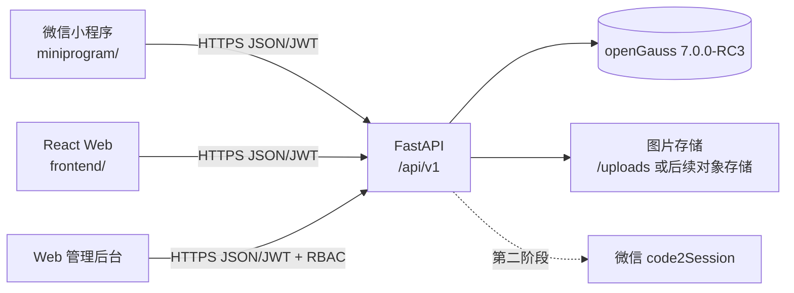
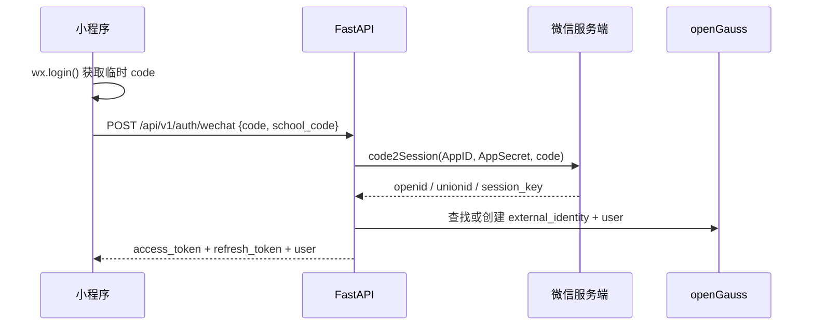

# 此刻校园微信小程序接入评估与实施准备报告

> 文档类型：技术调研与实施方案
>
> 调研日期：2026-07-29
>
> 适用项目：`moment-campus`
>
> 当前结论：建议新增独立的小程序前端模块，复用现有 FastAPI/openGauss 后端；首期不复制管理后台、不以实时定位和微信一键登录作为上线前置条件。

## 1. 结论先行

当前项目可以增加微信小程序，且不需要新增一套后端或数据库。现有后端采用前后端分离 REST API，已经具备信息流、地图标记、搜索、发布、图片上传、评论、点赞、协同验证、举报、通知、学校切换和 JWT 认证等接口，适合作为 Web 与小程序共同使用的服务端。

建议采用以下方案：

1. 在项目根目录新增 `miniprogram/`，使用“微信原生小程序 + TypeScript”实现用户端；保留 `frontend/` 作为 Web 用户端和管理后台。
2. 首个可体验版本只实现用户关键闭环：登录、选校、信息流、地图、搜索、详情、发布、互动、协同验证、个人中心；管理员继续使用现有 Web 后台。
3. 首期直接复用现有邮箱密码 + JWT 登录，先打通体验版；微信一键登录作为第二阶段能力，届时再新增外部身份表和后端微信登录接口。
4. 地图使用微信原生 `<map>` 组件。首期默认显示江南大学中心点，通过地图点击选择发布地点，不依赖 `wx.getLocation` 或 `wx.chooseLocation`。
5. 必须先验证 `campus.chaina1.com` 能否配置为小程序合法域名。当前 HTTPS 服务可访问，但本次未能通过官方渠道确认其 ICP 备案状态；这可能是体验版真机请求后端的硬门槛。

“原生小程序 + TypeScript”优先于直接使用 Taro/uni-app，原因是本项目的核心地图、定位授权、图片上传、登录和生命周期都需要按微信能力重写；现有 React 页面大量依赖 DOM、React Router、Axios、Zustand、MapLibre GL，无法原样复用。原生方案在参赛体验版阶段链路更短、调试更直接、平台兼容风险更低。若团队后续明确要同时发布支付宝/抖音等多端，再评估 Taro。

## 2. 当前项目适配性盘点

### 2.1 已具备的复用基础

| 能力 | 当前实现 | 小程序接入判断 |
|---|---|---|
| 后端 | FastAPI + SQLAlchemy async | 可直接复用 REST API |
| 数据库 | openGauss 7.0.0-RC3 | 无需新增数据库 |
| 认证 | JWT access token 30 分钟 + refresh token 7 天 | 首期可复用，客户端存储方式需重写 |
| 多租户 | `X-School-Code` + 三校数据 | 可复用；请求封装需自动注入学校 code |
| 地图数据 | `GET /api/v1/map/markers` | 可复用；渲染层改为微信 `<map>` |
| 学校配置 | `center_lat`、`center_lng`、`map_zoom` | 可直接作为小程序地图初始视野 |
| 发布 | 6 态 Post 状态机 | 可复用；普通用户发布后进入 `pending` |
| 协同验证 | 5 类验证/报告 | 可复用 |
| 图片上传 | `POST /api/v1/upload/image`，≤5 MB | 可通过 `wx.uploadFile` 调用 |
| 权限 | `user < admin < super_admin`，后端统一校验 | 小程序不应复制前端权限判断作为安全依据 |
| 管理端 | React Web 管理后台 | 首期保留 Web，不迁移到小程序 |

2026-07-29 对当前工作区进行静态 OpenAPI 生成，共得到 105 个 path、123 个 operation。小程序首期只需使用其中约 20～30 个接口，无需追求全部页面一比一迁移。

### 2.2 不能直接复用的 Web 实现

| Web 实现 | 小程序中的替代方式 |
|---|---|
| React DOM 页面 | WXML + WXSS + TypeScript 页面/组件 |
| React Router | `app.json` 页面注册、`wx.navigateTo`、`wx.switchTab` |
| Axios 拦截器 | 封装 `wx.request` / `wx.uploadFile` |
| `localStorage` | `wx.setStorageSync` / `wx.getStorageSync` |
| MapLibre GL + 高德瓦片 | 微信原生 `<map>` + markers/callout |
| 浏览器 Geolocation | `wx.getLocation`，但需平台权限与用户授权 |
| HTML 文件选择 | `wx.chooseMedia` + `wx.uploadFile` |
| Web CSS/Tailwind | WXSS；不能直接照搬全部 DOM 样式 |
| Playwright 浏览器 E2E | 微信开发者工具自动化 SDK/Minium + 真机测试 |

### 2.3 当前已发现的接入注意事项

1. 当前上传接口返回 `/uploads/...` 相对路径。小程序客户端需要统一补全为 `https://campus.chaina1.com/uploads/...`，或后续让后端在响应中返回绝对 URL。
2. 当前所有用户必须有 `email` 和 `password_hash`。因此不能只增加一个 `wx.login` 前端按钮就完成微信登录，必须设计微信身份与现有 User 的绑定关系。
3. 当前 Web 的 refresh token 并发刷新做了单飞锁，小程序请求层也必须实现同样机制，避免多个 401 同时刷新。
4. 小程序网络请求不受浏览器 CORS 机制控制，因此无需为了小程序扩大后端 CORS；真正需要配置的是小程序后台的服务器合法域名。
5. 当前地图数据必须核实坐标系。微信地图相关坐标应使用 GCJ-02；现有江南大学点位需要在真机地图上逐点抽查，不能只看 Web 高德瓦片上的视觉结果。
6. 本地导入后端时，当前 `.env.opengauss` 中的 `DEBUG` 值会触发布尔解析错误；本次静态检查通过临时环境变量 `DEBUG=false` 完成。正式开发前应单独修复该配置问题。

## 3. 推荐总体架构



模块职责：

- `frontend/`：继续承载现有 Web 用户端和 admin/super_admin 管理后台。
- `miniprogram/`：新增的小程序用户端，不直连数据库，不保存 AppSecret。
- `backend/`：作为唯一业务后端，统一状态机、多租户、权限、审核、上传和日志。
- openGauss：保持唯一数据库，不为小程序创建第二套库。

## 4. 建议新增的目录与模块

### 4.1 首期必须新增：`miniprogram/`

建议目录如下：

```text
miniprogram/
├── project.config.json             # 项目公共配置，不放 AppSecret
├── project.private.config.json     # 本机私有配置，加入 .gitignore
├── package.json
├── tsconfig.json
├── typings/
├── src/
│   ├── app.ts
│   ├── app.json
│   ├── app.wxss
│   ├── components/
│   │   ├── post-card/
│   │   ├── state-badge/
│   │   ├── empty-state/
│   │   └── privacy-dialog/
│   ├── pages/
│   │   ├── home/
│   │   ├── map/
│   │   ├── search/
│   │   ├── post-detail/
│   │   ├── publish/
│   │   ├── login/
│   │   ├── school-select/
│   │   ├── profile/
│   │   └── notifications/
│   ├── services/
│   │   ├── request.ts              # baseURL、JWT、X-School-Code、401 刷新锁
│   │   ├── auth.ts
│   │   ├── schools.ts
│   │   ├── posts.ts
│   │   ├── map.ts
│   │   ├── search.ts
│   │   ├── interactions.ts
│   │   ├── notifications.ts
│   │   └── upload.ts
│   ├── store/
│   │   ├── auth.ts
│   │   └── campus.ts
│   ├── types/
│   └── utils/
│       ├── image-url.ts
│       ├── token.ts
│       └── coordinate.ts
└── tests/
    ├── unit/
    └── e2e/
```

代码包过大时，再按页面拆分分包。首期不要把管理后台、平台运营和大量统计图表打入小程序包。

### 4.2 首期后端不必新增的内容

- 不新增小程序专用业务后端。
- 不新增第二个数据库。
- 不复制 Post 状态机、协同验证和 RBAC。
- 不为小程序单独维护一套相同业务表。
- 不把微信 AppSecret 放入小程序代码或 `project.config.json`。

### 4.3 第二阶段微信一键登录需要新增的后端内容

推荐新增：

```text
backend/app/api/wechat_auth.py
backend/app/services/wechat_auth.py
backend/app/models/external_identity.py
backend/app/schemas/wechat_auth.py
backend/tests/test_wechat_auth.py
backend/alembic/versions/*_add_external_identity.py
```

建议数据模型：

| 字段 | 说明 |
|---|---|
| `user_id` | 关联现有 users |
| `provider` | 固定为 `wechat_miniprogram`，为后续扩展保留 |
| `provider_subject` | 微信 `openid`，同一 AppID 内唯一 |
| `union_id` | 可空；绑定微信开放平台后用于多应用统一身份 |
| `created_at` / `updated_at` | 审计字段 |

约束建议：`UNIQUE(provider, provider_subject)`。`session_key` 不作为长期明文身份凭据写入日志或客户端；如业务确实需要，应只在服务端短期安全保存。

建议登录流程：



`AppSecret` 只能配置为服务端环境变量，例如 `WECHAT_APP_ID`、`WECHAT_APP_SECRET`，不得进入 Git、前端包、文档截图或演示视频。

对于现有 User 的 `email/password_hash` 非空约束，有两种实施方式：

1. 推荐长期方案：将登录身份从 User 拆分到 `external_identity` / password identity，允许纯微信用户；改动较大但模型干净。
2. 快速兼容方案：首次微信登录要求绑定已有邮箱账号，或由服务端创建不可登录的内部占位邮箱与随机密码；开发快，但需要明确账号合并和找回策略。

首期采用现有邮箱密码登录，可避免在体验版前仓促修改用户核心模型。

## 5. 需要准备的账号、资料与基础设施

### 5.1 小程序平台资料

- 一个未注册过公众平台/开放平台且未绑定个人号的邮箱。
- 小程序主体：个人、企业、政府、媒体或其他组织之一。
- 管理员微信、实名信息、手机号等平台要求材料。
- 小程序名称、头像、简介、服务类目和实际业务页面说明。
- AppID；AppSecret 仅由服务端负责人保管。
- 项目成员微信和体验成员微信。
- 隐私政策、用户协议、内容发布与举报规则。
- 用于审核/体验的普通用户与管理员测试账号。

项目是校园信息 + UGC + 地图场景，注册前应在小程序后台确认主体可选的服务类目。若要使用实时定位或系统选点，还要确认该类目是否允许申请相关位置接口。个人主体的类目和能力通常更受限；如具备合法组织主体，优先使用与实际业务一致的非个人主体。

### 5.2 域名与服务器

需要准备或确认：

- 正式 HTTPS 域名，不能使用 IP 或 `localhost`。
- TLS 证书链完整且受信任。
- 域名可在“小程序后台 → 开发 → 开发设置 → 服务器域名”中配置。
- 官方文档要求服务器域名完成 ICP 备案；需人工在官方渠道确认 `campus.chaina1.com` 的备案状态。
- 将同一域名按实际用途加入 `request`、`uploadFile`、`downloadFile` 合法域名。
- 服务端能稳定公开访问 `/api/v1` 和 `/uploads`。

本次实时检查结果（2026-07-29）：

| 地址 | 结果 |
|---|---|
| `https://campus.chaina1.com/` | HTTP 200 |
| `https://campus.chaina1.com/health/live` | HTTP 200 |
| `https://campus.chaina1.com/api/v1/schools` | HTTP 200 |

这只能证明当前网络和 HTTPS 可访问，不能替代 ICP 备案核验，也不能证明已经在小程序后台配置成功。

复赛规则“不要求 ICP 备案”是主办方交付要求，不代表微信平台免除服务器合法域名的技术约束。小程序体验版仍需在真机上验证实际请求。

### 5.3 地图相关资料

- 建议注册腾讯位置服务专属 KEY，并按微信 `<map>` 文档配置 `subkey`。
- 首期无需购买个性化地图样式。
- 明确数据库统一坐标系，建议小程序地图数据按 GCJ-02 使用。
- 对江南大学 15 个地点、复旦和浙大样例地点做真机抽查。
- 隐私保护指引中只声明实际使用的位置能力。

重要限制：

- `wx.getLocation` 需要 `scope.userLocation`，并要求在 `app.json` 声明；当前官方文档还要求符合开放类目并在后台申请接口权限。
- `wx.chooseLocation` 同样需要位置授权，且只向位置强相关的业务场景开放。
- 因此首期地图浏览以学校中心点为默认位置，发布选点采用 `<map bindtap>` 获取点击经纬度；“定位到我”作为权限获批后的增强功能。

## 6. 需要安装哪些应用和依赖

### 6.1 必须安装

1. 微信开发者工具 Windows 版：用于创建项目、编译、模拟器调试、真机预览、上传代码和生成体验版。
2. 手机微信：至少准备 Android 和 iOS 各一台真机进行权限、地图、上传和弱网验证。
3. Node.js/npm：当前机器已有 Node `v24.13.0`、npm `11.6.2`，可用于 TypeScript 构建和测试依赖。
4. 现有 `backend/.venv`：继续用于全部 Python 后端开发和测试。

当前机器常见安装目录中未发现微信开发者工具可执行文件，只发现历史 `User Data` 目录，建议从官方下载页重新安装或确认实际安装路径。

### 6.2 建议安装到小程序模块的开发依赖

- `miniprogram-api-typings`：微信 API TypeScript 类型。
- `miniprogram-simulate`：自定义组件单元测试。
- `miniprogram-automator`：通过微信开发者工具执行自动化测试。
- Jest 或 Vitest：纯函数、数据转换、请求层逻辑测试；具体选择在脚手架创建时统一。

不建议首期同时引入大型 UI 框架、Taro、uni-app 和多套状态库。先完成真实设备上的关键闭环，再决定是否扩展工程化依赖。

## 7. 首期功能范围

### 7.1 P0：体验版必须具备

| 页面/能力 | 复用接口 | 说明 |
|---|---|---|
| 登录 | `POST /auth/login`、`POST /auth/refresh` | 首期邮箱密码登录 |
| 选校/当前学校 | `/schools`、`/schools/current`、join/default/switch 相关接口 | 默认江南大学，保留三校演示 |
| 首页信息流 | `GET /posts` | 分页、分类、状态展示 |
| 地图 | `GET /map/markers` | `<map>` markers，点击进入详情 |
| 搜索 | `GET /search`、可选 `POST /search/ai` | 先保证普通搜索稳定 |
| 帖子详情 | `GET /posts/{id}` | 图片、状态、地点、互动数据 |
| 发布 | `POST /posts`、`POST /upload/image` | 地图点击选点，最多按现有规则上传 |
| 评论/点赞 | comments、like 接口 | 登录后操作 |
| 协同验证/举报 | validations、governance/report 接口 | 保留 5 类协同语义 |
| 个人中心 | `/users/me`、`/users/me/posts` | 资料与我的发布 |
| 通知 | `/notifications` | 可放入 P0 尾部或 P1 |

### 7.2 首期明确不做

- 管理员后台和 super_admin 平台后台的小程序版本。
- Web 页面全量一比一复制。
- 实时定位作为必需流程。
- 微信支付。
- 微信手机号快捷验证。
- 小程序个性化地图付费样式。
- 离线缓存、复杂分包和多端编译。
- 未完成身份模型设计前的自动创建纯微信账户。

## 8. 请求、认证和上传适配规则

### 8.1 请求封装

小程序 `request.ts` 至少需要：

- 环境区分：开发、体验、生产；不得硬编码密钥。
- 统一 `baseURL`，体验/生产使用 HTTPS。
- 自动添加 `Authorization: Bearer <access_token>`。
- 除公开学校目录和认证接口外，自动添加 `X-School-Code`。
- 401 时只触发一次 refresh，其余请求等待同一 Promise。
- refresh 失败后清理会话并回到登录页，保留用户原操作上下文。
- 统一解析后端 `{detail, request_id}` 错误响应。
- 将 `/uploads/...` 转为完整 HTTPS 图片 URL。
- 对网络断开、超时、429、5xx 设置不同提示，不无条件重复提交发布请求。

### 8.2 Token 存储

建议 access token 主要保存在运行时内存，refresh token 使用小程序 Storage 持久化；若为简化首期同时持久化两者，需要记录风险并避免日志输出。退出登录时调用后端 logout（若后端实现有效失效策略）并清理本地 Storage。

### 8.3 图片上传

流程：`wx.chooseMedia` → 客户端数量/大小校验 → `wx.uploadFile` → 后端 Pillow 内容校验和重编码 → 返回 URL → 发布 Post。

需要验证：

- JPEG/PNG/GIF 与真机临时文件格式是否匹配。
- 5 MB 限制的前端提示与后端响应一致。
- 上传请求携带 Authorization 和学校上下文。
- 图片 URL 在开发版、体验版和线上版均能访问。
- iOS 相册权限拒绝、Android 相机权限拒绝时有可恢复提示。

## 9. 测试方案

### 9.1 测试分层

| 层级 | 工具 | 重点 |
|---|---|---|
| 后端单元/集成 | `backend/.venv` + pytest | 小程序登录、Token、权限、多租户、上传、状态机 |
| 小程序逻辑单测 | Jest/Vitest | URL、Token、分页、错误映射、坐标转换 |
| 组件单测 | `miniprogram-simulate` | PostCard、状态徽标、空态、表单校验 |
| 模拟器联调 | 微信开发者工具 | 页面路由、请求、样式、不同机型尺寸 |
| 自动化 E2E | `miniprogram-automator` 或 Minium | 页面跳转、元素状态、交互、wx API mock |
| 真机测试 | 微信开发版/体验版 | 地图、相册、相机、网络、登录、分享、权限 |
| 后端回归 | `pytest tests/ -v` | 确保 Web 与小程序共享后端无回归 |
| Web 回归 | `npm run build` + 现有 E2E | 确保后端改动没有破坏 Web |

浏览器 Playwright 或项目规范中的浏览器 MCP 不能替代微信开发者工具/真机测试，因为它无法验证微信宿主 API、体验版合法域名、原生 `<map>`、相册和位置权限。实现阶段仍应继续用浏览器 E2E 回归 Web 端，同时为小程序增加平台专用自动化与真机记录。

### 9.2 必测关键链路

1. 游客进入江南大学首页，浏览信息流和地图标记。
2. 普通用户使用测试账号登录，Token 过期后自动刷新。
3. 切换三校后，帖子、分类、地图中心和标记不串校。
4. 发布带图片 Post，地图点击选点，提交后状态为 `pending`。
5. 管理员在 Web 审核通过，小程序刷新后看到 `published`。
6. 普通用户评论、点赞、confirmation/refutation/update/expiration_report/conflict_report。
7. 普通用户访问管理接口返回 403，未登录写操作返回 401。
8. 图片超过 5 MB、伪装扩展名、损坏图片被拒绝。
9. 网络断开、请求超时、429、500 时不重复发布且能重试。
10. Android/iOS 真机分别验证地图标记、相册上传、隐私弹窗和返回栈。
11. 体验版二维码由非开发者的“体验成员”扫码，完整走通登录—发布—审核—验证链路。

### 9.3 测试环境建议

- 开发环境：开发者工具可临时关闭合法域名校验，仅用于本机联调，不能作为验收证据。
- 体验环境：真实 AppID + 体验版 + 独立测试账号 + 公开 HTTPS 后端。
- 生产环境：审核通过后的正式版本；与体验环境区分数据或至少使用明确的演示学校/演示账号。

体验版验收必须记录：版本号、二维码生成时间、体验成员、手机型号、微信版本、后端 commit、测试结果和已知问题。

## 10. 隐私、审核与安全

1. 在小程序后台配置《小程序用户隐私保护指引》，只声明实际处理的信息。
2. 调用涉及个人信息的微信接口前，按官方隐私协议流程取得用户同意。
3. 首期不默认采集精确位置和行动轨迹，符合项目既有隐私原则。
4. UGC 发布继续进入 `pending`，由 Web 管理后台审核；保留举报和治理入口。
5. AppSecret、微信服务端响应、session_key、JWT、AI API Key 不写日志、不进 Git、不出现在截图/录屏。
6. 所有权限仍由 FastAPI `require_role()` 和资源归属校验决定，小程序隐藏按钮不等于授权。
7. 对发布、评论、举报、登录和上传维持限流与审计日志。
8. 隐私政策、实际调用的接口和后台声明必须一致，否则接口可能被禁用或审核失败。

## 11. 开发、体验与发布流程

### 11.1 开发前准备

1. 注册小程序账号并确定主体/类目。
2. 获取 AppID，绑定开发者与体验成员。
3. 安装微信开发者工具并创建空项目。
4. 确认 `campus.chaina1.com` 的 ICP/合法域名可配置性。
5. 在小程序后台配置 request/upload/download 域名。
6. 确认地图位置接口申请策略和隐私保护指引。
7. 在仓库创建 `miniprogram/`，先完成请求层与登录，再开发页面。

### 11.2 版本流转

微信官方版本流程为：

```text
开发者工具预览 → 上传开发版本 → 设置体验版 → 体验成员测试
→ 提交审核 → 审核通过 → 管理员手动发布（全量或分阶段）
```

复赛提交可使用体验版二维码，无需正式上架，但必须保证评审期有效、注明进入路径，并同时提供可用测试账号和 1～5 分钟演示视频。

## 12. 实施阶段与工作量估算

以下为 1 名熟悉 TypeScript 和现有项目的开发者估算，不含主体注册、ICP 备案和平台审核等待时间：

| 阶段 | 内容 | 估算 |
|---|---|---:|
| 0. 平台硬门槛验证 | AppID、类目、合法域名、体验成员、地图策略 | 0.5～2 人日 |
| 1. 工程骨架 | 原生 TS、请求层、环境、Token、学校上下文 | 1～2 人日 |
| 2. 浏览闭环 | 首页、地图、搜索、详情 | 3～5 人日 |
| 3. 创作互动 | 登录、发布、上传、评论、点赞、协同验证 | 4～6 人日 |
| 4. 个人与通知 | 个人中心、我的发布、通知 | 1～2 人日 |
| 5. 测试与体验版 | 自动化、真机、回归、体验二维码 | 3～5 人日 |
| 6. 微信一键登录（可选） | code2Session、身份表、绑定/合并、测试 | 2～4 人日 |

首个稳定体验版约 12～20 人日；若只做参赛演示所需的精简闭环，可压缩到 8～12 人日。全量迁移现有 Web 用户端功能预计 25～40 人日，不建议作为首期目标。

## 13. 决策点与风险清单

| 风险/决策 | 级别 | 处理建议 |
|---|---|---|
| 域名不能配置为合法域名/未备案 | P0 | 写代码前先在小程序后台实测添加 |
| 主体类目不支持位置接口 | P0 | 首期不依赖实时定位和系统选点 |
| 现有坐标不是 GCJ-02 | P0 | 真机逐点核验，必要时一次性迁移/转换 |
| 微信用户与邮箱账号合并不清晰 | P1 | 首期邮箱登录，第二阶段评审身份模型 |
| 试图全量复制 34 个 Web 页面 | P1 | 只做用户关键闭环，管理端保留 Web |
| AppSecret 泄漏 | P0 | 仅服务端环境变量，定期轮换 |
| 图片相对 URL 在小程序失效 | P1 | 客户端统一补全或后端返回绝对 URL |
| 小程序包体/性能 | P1 | 精简依赖、分包、图片懒加载、分页 markers |
| UGC 审核被拒 | P1 | 保持 pending 审核、举报、协议与隐私说明 |
| 体验二维码评审期失效 | P0 | 提交前使用非开发者体验成员复测并留备份说明 |

## 14. 实施验收标准

只有同时满足以下条件，才能把“微信小程序接入”标为完成：

- `miniprogram/` 可由微信开发者工具正常导入、编译和预览。
- 体验成员能通过体验版二维码在 Android/iOS 真机打开。
- 合法域名配置生效，真机不关闭校验也能请求 API、上传和加载图片。
- 登录、浏览、地图、搜索、发布 Post、Web 审核、协同验证、权限校验完整走通。
- 三校数据不串租户，江南大学默认中心和 `map_zoom=16` 正确。
- 后端相关 pytest、小程序自动化、Web `npm run build` 与 Web 核心 E2E 通过。
- 隐私保护指引与实际调用接口一致。
- AppSecret/API Key 未进入代码、日志、截图和 Git 历史。
- `TODO.md`、相关 docs 和中文 AIwork 任务报告已更新并提交。
- 测试报告真实记录真机型号、版本、失败项与已知问题。

## 15. 建议立即执行的顺序

1. 注册/登录小程序后台，确定主体和服务类目，取得 AppID。
2. 在后台尝试添加 `https://campus.chaina1.com` 为 request/upload/download 合法域名；若失败，先解决备案或换合规域名。
3. 绑定至少 1 名开发者、2 名体验成员，准备普通用户和管理员测试账号。
4. 安装微信开发者工具，创建原生 TypeScript 空项目。
5. 新增 `miniprogram/`，先实现学校目录、邮箱登录、JWT 刷新和首页帖子列表。
6. 接入 `<map>` 与 `/map/markers`，先不申请实时定位。
7. 接入详情、发布、上传、评论、点赞和 5 类协同验证。
8. 增加自动化和真机测试，设置体验版，使用非开发者体验成员验收。
9. 稳定后再决定是否实施微信一键登录和正式审核发布。

## 16. 资料来源

### 16.1 微信官方资料（2026-07-29 查阅）

- [小程序接入指南：注册、主体、成员、AppID、审核与发布](https://developers.weixin.qq.com/miniprogram/introduction/)
- [小程序起步：申请账号、安装开发工具、创建与预览](https://developers.weixin.qq.com/miniprogram/dev/framework/quickstart/getstart.html)
- [微信开发者工具下载](https://developers.weixin.qq.com/miniprogram/dev/devtools/download.html)
- [网络：服务器合法域名、HTTPS、备案与端口规则](https://developers.weixin.qq.com/miniprogram/dev/framework/ability/network.html)
- [`wx.login`：获取 code、openid/unionid/session_key 说明](https://developers.weixin.qq.com/miniprogram/dev/api/open-api/login/wx.login.html)
- [小程序登录服务端接口列表](https://developers.weixin.qq.com/miniprogram/dev/server/API/user-login/)
- [`map` 组件：markers、地图能力与腾讯位置服务 KEY](https://developers.weixin.qq.com/miniprogram/dev/component/map.html)
- [`wx.getLocation`：授权、类目、接口申请与 GCJ-02](https://developers.weixin.qq.com/miniprogram/dev/api/location/wx.getLocation.html)
- [`wx.chooseLocation`：位置选择接口及申请限制](https://developers.weixin.qq.com/miniprogram/dev/api/location/wx.chooseLocation.html)
- [小程序隐私协议开发指南](https://developers.weixin.qq.com/miniprogram/dev/framework/user-privacy/PrivacyAuthorize.html)
- [协同工作、体验版本、审核与发布流程](https://developers.weixin.qq.com/miniprogram/dev/framework/quickstart/release.html)
- [小程序自动化 SDK](https://developers.weixin.qq.com/miniprogram/dev/devtools/auto/)
- [自定义组件单元测试](https://developers.weixin.qq.com/miniprogram/dev/framework/custom-component/unit-test.html)

### 16.2 项目资料

- [项目总览](00_project_overview.md)
- [用户流程](05_user_flows.md)
- [技术架构](11_technical_architecture.md)
- [API 接口规范（含过时声明和权威来源指引）](13_api_specification.md)
- [安全与隐私](14_security_and_privacy.md)
- [测试与验收](15_testing_and_acceptance.md)
- [项目运行与开发环境说明](22_项目运行与开发环境说明.md)
- [项目全量排查报告](project-audit/此刻校园项目全量排查报告.md)
- [refreshToken httpOnly Cookie 评估](project-audit/refreshToken-httpOnly-cookie-评估报告.md)
- [复赛详细说明](TRAE_AI_创造力大赛_复赛详细说明_2026.md)

## 17. 本报告边界

本次任务只完成现状评估、官方资料核对和实施方案，没有创建小程序账号、没有申请 AppID/类目/位置权限、没有新增 `miniprogram/` 代码，也没有生成体验版二维码。因此没有执行小程序真机、自动化或完整业务 E2E；这些属于后续实施任务的完成条件，不能视为已完成。
