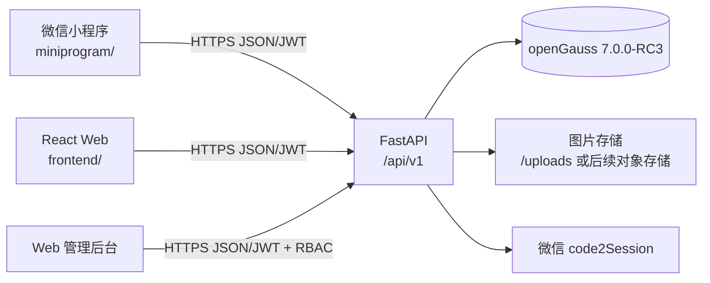
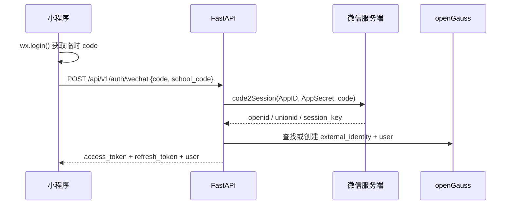

# 此刻校园微信小程序接入评估与实施准备报告

> 文档类型：技术调研与实施方案
>
> 调研日期：2026-07-29
>
> 适用项目：`moment-campus`
>
> 当前结论：新增独立的小程序用户端，复用现有 FastAPI/openGauss 后端；小程序与 Web 用户端保持功能对等，微信一键登录和实时定位均为 P0，管理后台仍只保留 Web。

## 1. 结论先行

当前项目可以增加微信小程序，且不需要新增一套后端或数据库。现有后端采用前后端分离 REST API，已经具备信息流、地图标记、搜索、发布、图片上传、评论、点赞、协同验证、举报、通知、学校切换和 JWT 认证等接口，适合作为 Web 与小程序共同使用的服务端。

建议采用以下方案：

1. 在项目根目录新增 `miniprogram/`，使用“微信原生小程序 + TypeScript”实现完整用户端；保留 `frontend/` 作为 Web 用户端和管理后台。
2. 小程序覆盖当前 Web 所有用户端能力，包括注册/登录等价流程、首页推荐、地图、搜索与 AI 搜索、专题、详情、发布/编辑/草稿、上传、互动、协同验证、订阅、通知、个人资料、多校关系、浏览历史与推荐偏好；admin/super_admin 后台仍只在 Web 提供。
3. 微信一键登录列为 P0。以 `users.id` 作为跨端唯一主账号，Web 邮箱密码身份和微信小程序身份都绑定到同一个 `users.id`，两端分别签发会话，业务数据完全共享。
4. 实时定位列为 P0。地图使用微信原生 `<map>`，通过 `wx.getLocation({type: 'gcj02'})` 显示当前位置，并保留学校中心点和手动选点作为拒绝授权时的可用降级。
5. 必须先验证 `campus.chaina1.com` 能否配置为小程序合法域名。当前 HTTPS 服务可访问，但本次未能通过官方渠道确认其 ICP 备案状态；这可能是体验版真机请求后端的硬门槛。

“原生小程序 + TypeScript”优先于直接使用 Taro/uni-app，原因是本项目的核心地图、定位授权、图片上传、登录和生命周期都需要按微信能力重写；现有 React 页面大量依赖 DOM、React Router、Axios、Zustand、MapLibre GL，无法原样复用。原生方案在参赛体验版阶段链路更短、调试更直接、平台兼容风险更低。若团队后续明确要同时发布支付宝/抖音等多端，再评估 Taro。

## 2. 当前项目适配性盘点

### 2.1 已具备的复用基础

| 能力 | 当前实现 | 小程序接入判断 |
|---|---|---|
| 后端 | FastAPI + SQLAlchemy async | 可直接复用 REST API |
| 数据库 | openGauss 7.0.0-RC3 | 无需新增数据库 |
| 认证 | JWT access token 30 分钟 + refresh token 7 天 | JWT 业务认证可复用；需新增微信身份、绑定流程和服务端会话管理 |
| 多租户 | `X-School-Code` + 三校数据 | 可复用；请求封装需自动注入学校 code |
| 地图数据 | `GET /api/v1/map/markers` | 可复用；渲染层改为微信 `<map>` |
| 学校配置 | `center_lat`、`center_lng`、`map_zoom` | 可直接作为小程序地图初始视野 |
| 发布 | 6 态 Post 状态机 | 可复用；普通用户发布后进入 `pending` |
| 协同验证 | 5 类验证/报告 | 可复用 |
| 图片上传 | `POST /api/v1/upload/image`，≤5 MB | 可通过 `wx.uploadFile` 调用 |
| 权限 | `user < admin < super_admin`，后端统一校验 | 小程序不应复制前端权限判断作为安全依据 |
| 管理端 | React Web 管理后台 | 首期保留 Web，不迁移到小程序 |

2026-07-29 对当前工作区进行静态 OpenAPI 生成，共得到 105 个 path、123 个 operation。小程序需要覆盖所有用户可用接口；平台级和管理员接口仍由 Web 独占。功能对等不要求像素级或组件代码相同，但两端的业务能力、状态机、权限、数据和错误语义必须一致。

### 2.2 不能直接复用的 Web 实现

| Web 实现 | 小程序中的替代方式 |
|---|---|
| React DOM 页面 | WXML + WXSS + TypeScript 页面/组件 |
| React Router | `app.json` 页面注册、`wx.navigateTo`、`wx.switchTab` |
| Axios 拦截器 | 封装 `wx.request` / `wx.uploadFile` |
| `localStorage` | `wx.setStorageSync` / `wx.getStorageSync` |
| MapLibre GL + 高德瓦片 | 微信原生 `<map>` + markers/callout |
| 浏览器 Geolocation | `wx.getLocation`，但需平台权限与用户授权 |
| HTML 文件选择 | `wx.chooseMedia` + `wx.uploadFile` |
| Web CSS/Tailwind | WXSS；不能直接照搬全部 DOM 样式 |
| Playwright 浏览器 E2E | 微信开发者工具自动化 SDK/Minium + 真机测试 |

### 2.3 当前已发现的接入注意事项

1. 当前上传接口返回 `/uploads/...` 相对路径。小程序客户端需要统一补全为 `https://campus.chaina1.com/uploads/...`，或后续让后端在响应中返回绝对 URL。
2. 当前所有用户必须有 `email` 和 `password_hash`。因此不能只增加一个 `wx.login` 前端按钮就完成微信登录，必须设计微信身份与现有 User 的绑定关系。
3. 当前 Web 的 refresh token 并发刷新做了单飞锁，小程序请求层也必须实现同样机制，避免多个 401 同时刷新。
4. 小程序网络请求不受浏览器 CORS 机制控制，因此无需为了小程序扩大后端 CORS；真正需要配置的是小程序后台的服务器合法域名。
5. 当前地图数据必须核实坐标系。微信地图相关坐标应使用 GCJ-02；现有江南大学点位需要在真机地图上逐点抽查，不能只看 Web 高德瓦片上的视觉结果。
6. 本地导入后端时，当前 `.env.opengauss` 中的 `DEBUG` 值会触发布尔解析错误；本次静态检查通过临时环境变量 `DEBUG=false` 完成。正式开发前应单独修复该配置问题。

## 3. 推荐总体架构



模块职责：

- `frontend/`：继续承载现有 Web 用户端和 admin/super_admin 管理后台。
- `miniprogram/`：新增的小程序用户端，不直连数据库，不保存 AppSecret。
- `backend/`：作为唯一业务后端，统一状态机、多租户、权限、审核、上传和日志。
- openGauss：保持唯一数据库，不为小程序创建第二套库。

## 4. 建议新增的目录与模块

### 4.1 首期必须新增：`miniprogram/`

建议目录如下：

```text
miniprogram/
├── project.config.json             # 项目公共配置，不放 AppSecret
├── project.private.config.json     # 本机私有配置，加入 .gitignore
├── package.json
├── tsconfig.json
├── typings/
├── src/
│   ├── app.ts
│   ├── app.json
│   ├── app.wxss
│   ├── components/
│   │   ├── post-card/
│   │   ├── state-badge/
│   │   ├── empty-state/
│   │   └── privacy-dialog/
│   ├── pages/
│   │   ├── home/
│   │   ├── map/
│   │   ├── search/
│   │   ├── post-detail/
│   │   ├── publish/
│   │   ├── login/
│   │   ├── school-select/
│   │   ├── profile/
│   │   └── notifications/
│   ├── services/
│   │   ├── request.ts              # baseURL、JWT、X-School-Code、401 刷新锁
│   │   ├── auth.ts
│   │   ├── schools.ts
│   │   ├── posts.ts
│   │   ├── map.ts
│   │   ├── search.ts
│   │   ├── interactions.ts
│   │   ├── notifications.ts
│   │   └── upload.ts
│   ├── store/
│   │   ├── auth.ts
│   │   └── campus.ts
│   ├── types/
│   └── utils/
│       ├── image-url.ts
│       ├── token.ts
│       └── coordinate.ts
└── tests/
    ├── unit/
    └── e2e/
```

代码包过大时，再按页面拆分分包。首期不要把管理后台、平台运营和大量统计图表打入小程序包。

### 4.2 首期后端不必新增的内容

- 不新增小程序专用业务后端。
- 不新增第二个数据库。
- 不复制 Post 状态机、协同验证和 RBAC。
- 不为小程序单独维护一套相同业务表。
- 不把微信 AppSecret 放入小程序代码或 `project.config.json`。

### 4.3 P0 微信一键登录与统一账号需要新增的后端内容

推荐新增：

```text
backend/app/api/wechat_auth.py
backend/app/services/wechat_auth.py
backend/app/models/external_identity.py
backend/app/models/auth_session.py
backend/app/schemas/wechat_auth.py
backend/tests/test_wechat_auth.py
backend/tests/test_auth_sessions.py
backend/alembic/versions/*_add_external_identity.py
backend/alembic/versions/*_add_auth_session.py
```

建议数据模型：

| 字段 | 说明 |
|---|---|
| `user_id` | 关联现有 users |
| `provider` | 固定为 `wechat_miniprogram`，为后续扩展保留 |
| `provider_subject` | 微信 `openid`，同一 AppID 内唯一 |
| `union_id` | 可空；绑定微信开放平台后用于多应用统一身份 |
| `created_at` / `updated_at` | 审计字段 |

约束建议：`UNIQUE(provider, provider_subject)`。`session_key` 不作为长期明文身份凭据写入日志或客户端；如业务确实需要，应只在服务端短期安全保存。

建议登录流程：



`AppSecret` 只能配置为服务端环境变量，例如 `WECHAT_APP_ID`、`WECHAT_APP_SECRET`，不得进入 Git、前端包、文档截图或演示视频。

对于现有 User 的 `email/password_hash` 非空约束，有两种实施方式：

1. 推荐长期方案：将登录身份从 User 拆分到 `external_identity` / password identity，允许纯微信用户；改动较大但模型干净。
2. 快速兼容方案：首次微信登录要求绑定已有邮箱账号，或由服务端创建不可登录的内部占位邮箱与随机密码；开发快，但需要明确账号合并和找回策略。

既然微信一键登录是 P0，就不能继续使用“先生成占位邮箱、以后再处理”的临时模型。应把 `users` 明确为业务主体，把登录凭据拆为可扩展的身份记录：

- `users.id`：跨 Web、小程序和未来其他客户端的唯一业务账号。
- 邮箱密码身份：供 Web 登录，解析到一个 `users.id`。
- 微信小程序身份：`AppID + OpenID`，解析到同一个 `users.id`。
- `UnionID`：小程序绑定微信开放平台后用于跨微信应用识别；不能用于自动猜测已有邮箱账号。
- `auth_sessions`：Web 和小程序分别持有自己的可撤销会话，但 JWT `sub` 都是同一个 `users.id`。

### 4.4 Web 与小程序账号一致性的推荐模型

建议新增 `user_auth_identities`（也可沿用上文 `external_identity` 名称，但职责应统一）和 `auth_sessions`：

```text
users
  id                  # 唯一业务用户 ID，帖子/评论/角色/学校关系均引用它
  nickname/avatar/... # 用户资料，不代表登录方式

user_auth_identities
  id
  user_id             # FK -> users.id
  identity_type       # email_password / wechat_miniprogram / wechat_website
  provider_app_id     # 微信 AppID；邮箱身份为空
  provider_subject    # 规范化 email 或 OpenID
  union_id            # 可空，只用于微信开放平台关联
  credential_hash     # 仅邮箱密码身份使用；微信身份为空
  verified_at
  created_at/updated_at
  UNIQUE(identity_type, provider_app_id, provider_subject)

auth_sessions
  id                  # session id，同时写入 JWT sid
  user_id
  client_type         # web / wechat_miniprogram
  refresh_token_hash  # 只存哈希
  device_id/device_name
  expires_at/last_used_at/revoked_at
  created_at
```

现有 `users.email` 和 `users.password_hash` 可以分两步迁移：先建身份表并回填所有历史邮箱账号，登录代码双读；验证稳定后再将其从 User 主表中移出或改为可空。这样不会一次性破坏现有 Web 登录。

为什么还需要 `auth_sessions`：当前 refresh token 完全是无状态 JWT，没有 `jti/sid` 和服务端会话记录，`POST /auth/logout` 只返回成功，不能撤销某台设备。双端上线后至少要支持：只退出当前端、查看登录设备、单独撤销某个会话、修改密码后撤销全部会话，以及 refresh token 轮换和重放检测。

### 4.5 首次登录、绑定与跨端访问流程

#### 场景 A：已有 Web 账号，第一次进入小程序

1. 小程序调用 `wx.login`，后端用 code2Session 得到 OpenID/UnionID。
2. 后端发现该微信身份尚未绑定，只返回一次性、短有效期的 `binding_ticket`，不直接创建重复用户。
3. 页面让用户选择“绑定已有此刻校园账号”或“创建新账号”。
4. 用户选择绑定，输入现有 Web 邮箱和密码；后端同时校验 `binding_ticket` 与邮箱密码。
5. 在同一数据库事务中，把微信身份绑定到该 Web 账号的 `users.id`，然后签发 `client_type=wechat_miniprogram` 会话。
6. 此后 Web 邮箱登录和小程序微信登录都得到相同的 JWT `sub=user_id`。

#### 场景 B：没有 Web 账号，从小程序首次注册

1. code2Session 后使用 `binding_ticket` 创建新的 `users` 和微信身份。
2. 用户选择学校并完善昵称等资料，不强制伪造邮箱。
3. 若用户以后要用 Web，可在“账号与安全”中设置并验证邮箱密码身份；完成后 Web 登录仍解析到原来的 `users.id`。
4. 在没有邮件服务前，不得把未验证邮箱当成可找回凭据；实现阶段需补邮件验证码，或使用下述 Web 微信登录方案。

#### 场景 C：Web 也希望直接使用微信登录

可在微信开放平台注册并审核“网站应用”，把网站应用和小程序绑定到同一个微信开放平台账号。官方说明同一开放平台账号下的应用可通过 UnionID 识别同一微信用户。网站 OAuth 和小程序 OpenID 不相同，因此不能直接拿小程序 OpenID 登录网站；服务端应通过 UnionID 找到同一个 `users.id`。

如果暂时不申请网站应用，也可以保留 Web 邮箱密码登录，或以后实现“小程序扫码确认 Web 登录”的自有挑战码流程。无论采用哪种入口，最终都只创建 `auth_sessions`，不复制 User。

建议接口边界：

| 接口 | 用途 |
|---|---|
| `POST /auth/wechat/exchange` | 接收 `wx.login` code；已绑定则直接签发小程序会话，未绑定则返回一次性 `binding_ticket` |
| `POST /auth/wechat/bind-existing` | 用 `binding_ticket + email + password` 绑定已有 Web User |
| `POST /auth/wechat/register` | 用 `binding_ticket` 创建新 User、学校关系和微信身份 |
| `GET /auth/identities` | 查看当前 User 已绑定的邮箱/微信登录方式 |
| `POST /auth/identities/email` | 微信用户设置并验证 Web 邮箱登录方式 |
| `DELETE /auth/identities/{id}` | 在重新认证且不删除最后登录方式的前提下解绑 |
| `GET /auth/sessions` | 查看 Web/小程序登录设备 |
| `DELETE /auth/sessions/{sid}` | 撤销指定设备会话 |
| `POST /auth/logout` | 撤销当前 `sid`，不影响另一端 |
| `POST /auth/logout-all` | 撤销该 User 全部会话 |
| `POST /auth/refresh` | 校验并轮换当前 session 的 refresh token，检测旧 token 重放 |

#### 冲突与安全规则

- 禁止按昵称、头像、手机号或相同邮箱文本自动合并账号。
- 一个微信身份只能绑定一个 User；一个 User 是否允许绑定多个微信号必须作为明确产品规则。
- 已绑定到 A 账号的微信身份不能静默改绑到 B；必须先在 A 登录态中解绑或走人工申诉。
- 绑定、解绑、合并、撤销会话必须写审计日志，并要求近期重新认证。
- 不允许用户解绑最后一种可用登录身份。
- `binding_ticket` 必须一次性、短时、服务端签名，并绑定 OpenID、AppID 和操作类型。
- AppSecret、session_key、微信 access token 不下发客户端、不写日志。

## 5. 需要准备的账号、资料与基础设施

### 5.1 小程序平台资料

- 一个未注册过公众平台/开放平台且未绑定个人号的邮箱。
- 小程序主体：个人、企业、政府、媒体或其他组织之一。
- 管理员微信、实名信息、手机号等平台要求材料。
- 小程序名称、头像、简介、服务类目和实际业务页面说明。
- AppID；AppSecret 仅由服务端负责人保管。
- 项目成员微信和体验成员微信。
- 隐私政策、用户协议、内容发布与举报规则。
- 用于审核/体验的普通用户与管理员测试账号。

项目是校园信息 + UGC + 地图场景，注册前应在小程序后台确认主体可选的服务类目。由于实时定位已确定为 P0，必须确认该类目允许申请位置接口并实际开通，不能只在开发者工具中跳过校验。个人主体的类目和能力通常更受限；如具备合法组织主体，优先使用与实际业务一致的非个人主体。

### 5.2 域名与服务器

需要准备或确认：

- 正式 HTTPS 域名，不能使用 IP 或 `localhost`。
- TLS 证书链完整且受信任。
- 域名可在“小程序后台 → 开发 → 开发设置 → 服务器域名”中配置。
- 官方文档要求服务器域名完成 ICP 备案；需人工在官方渠道确认 `campus.chaina1.com` 的备案状态。
- 将同一域名按实际用途加入 `request`、`uploadFile`、`downloadFile` 合法域名。
- 服务端能稳定公开访问 `/api/v1` 和 `/uploads`。

本次实时检查结果（2026-07-29）：

| 地址 | 结果 |
|---|---|
| `https://campus.chaina1.com/` | HTTP 200 |
| `https://campus.chaina1.com/health/live` | HTTP 200 |
| `https://campus.chaina1.com/api/v1/schools` | HTTP 200 |

这只能证明当前网络和 HTTPS 可访问，不能替代 ICP 备案核验，也不能证明已经在小程序后台配置成功。

复赛规则“不要求 ICP 备案”是主办方交付要求，不代表微信平台免除服务器合法域名的技术约束。小程序体验版仍需在真机上验证实际请求。

### 5.3 地图相关资料

- 建议注册腾讯位置服务专属 KEY，并按微信 `<map>` 文档配置 `subkey`。
- 首期无需购买个性化地图样式。
- 明确数据库统一坐标系，建议小程序地图数据按 GCJ-02 使用。
- 对江南大学 15 个地点、复旦和浙大样例地点做真机抽查。
- 隐私保护指引中只声明实际使用的位置能力。

重要限制：

- `wx.getLocation` 需要 `scope.userLocation`，并要求在 `app.json` 声明；当前官方文档还要求符合开放类目并在后台申请接口权限。
- `wx.chooseLocation` 同样需要位置授权，且只向位置强相关的业务场景开放。
- P0 实现使用 `wx.getLocation({type: 'gcj02'})` 获取实时位置，在地图展示当前定位点，并按需计算用户与校园信息点的距离。
- 用户拒绝、系统关闭定位或接口超时时，必须降级到所选学校中心点和手动地图选点；“实时定位是必要功能”不等于强迫用户授权后才能使用其余功能。
- 数据库明确约定中国境内地图坐标为 GCJ-02；Web 高德地图与小程序地图共享同一坐标，不在每个页面临时转换。

## 6. 需要安装哪些应用和依赖

### 6.1 必须安装

1. 微信开发者工具 Windows 版：用于创建项目、编译、模拟器调试、真机预览、上传代码和生成体验版。
2. 手机微信：至少准备 Android 和 iOS 各一台真机进行权限、地图、上传和弱网验证。
3. Node.js/npm：当前机器已有 Node `v24.13.0`、npm `11.6.2`，可用于 TypeScript 构建和测试依赖。
4. 现有 `backend/.venv`：继续用于全部 Python 后端开发和测试。

当前机器常见安装目录中未发现微信开发者工具可执行文件，只发现历史 `User Data` 目录，建议从官方下载页重新安装或确认实际安装路径。

### 6.2 建议安装到小程序模块的开发依赖

- `miniprogram-api-typings`：微信 API TypeScript 类型。
- `miniprogram-simulate`：自定义组件单元测试。
- `miniprogram-automator`：通过微信开发者工具执行自动化测试。
- Jest 或 Vitest：纯函数、数据转换、请求层逻辑测试；具体选择在脚手架创建时统一。

不建议首期同时引入大型 UI 框架、Taro、uni-app 和多套状态库。功能对等通过共享 API 契约、状态枚举、能力矩阵和跨端验收实现，而不是强行复用依赖 DOM 的 React 组件。

## 7. 小程序完整用户端功能范围

### 7.1 P0：与当前 Web 用户端保持功能对等

| 页面/能力 | 复用接口 | 说明 |
|---|---|---|
| 登录与注册 | 新增微信登录/绑定接口、`POST /auth/refresh` | 微信一键登录；已有 Web 账号绑定；可选保留邮箱登录入口 |
| 选校/当前学校 | `/schools`、`/schools/current`、join/default/switch 相关接口 | 默认江南大学，保留三校演示 |
| 首页信息流与推荐 | `GET /posts`、recommendations 接口 | 分页、分类、状态、推荐理由和降级语义一致 |
| 地图与实时定位 | `GET /map/markers` + `wx.getLocation` | `<map>` markers、GCJ-02、当前位置、拒绝授权降级 |
| 搜索 | `GET /search`、`POST /search/ai` | 普通搜索与 AI 搜索均纳入对等范围 |
| 帖子详情 | `GET /posts/{id}` | 图片、状态、地点、互动数据 |
| 发布/编辑/草稿 | posts、draft、upload、AI suggest 接口 | 分类、标签、地点、图片、有效期、AI 辅助和草稿一致 |
| 评论/点赞 | comments、like 接口 | 创建、回复、删除权限和状态一致 |
| 协同验证/举报 | validations、governance/report 接口 | 保留 5 类协同语义 |
| 专题 | topics 接口 | 专题列表、详情和帖子跳转一致 |
| 订阅 | subscriptions 接口 | 分类、地点、专题订阅和取消订阅一致 |
| 个人中心 | users、schools、history、preferences 接口 | 资料/头像、我的发布、多校关系、浏览历史和推荐偏好一致 |
| 通知 | notifications 接口 | 列表、未读数、全部已读和通知偏好一致 |
| 账号与安全 | 新增 identities/sessions 接口 | 查看绑定身份、设置 Web 登录方式、设备会话与退出 |

### 7.2 小程序端明确不做

- 管理员后台和 super_admin 平台后台的小程序版本。
- Web 的页面布局和组件代码像素级复制；要求功能与数据结果一致，不要求界面实现相同。
- 微信支付。
- 微信手机号快捷验证。
- 小程序个性化地图付费样式。
- 与用户端无关的平台运营、学校管理、审核、日志和统计后台。

### 7.3 如何持续保证两端功能一致

不能只在首次开发时人工对照页面。建议维护 `docs/` 下的“用户端能力矩阵”，每项至少记录：Web 页面、Web service、后端 operationId、小程序页面、小程序 service、两端 E2E 用例和差异说明。CI 中增加三类门禁：

1. 从 FastAPI OpenAPI 生成/校验共享 TypeScript 类型和枚举，避免 Post 状态、验证类型、字段名称漂移。
2. 对所有“用户可调用”的后端 operationId 建立 allowlist，检查 Web 和小程序是否都有调用封装，或明确标记平台特有原因。
3. 同一套业务场景分别跑 Web E2E 和小程序自动化，比较最终 API/数据库状态，而不是只比较截图。

可以新增轻量共享模块 `packages/contracts/`，只放 API 类型、Post 六态、五类协同验证、错误码和纯函数；不要把 React DOM 组件共享给小程序。

## 8. 请求、认证和上传适配规则

### 8.1 请求封装

小程序 `request.ts` 至少需要：

- 环境区分：开发、体验、生产；不得硬编码密钥。
- 统一 `baseURL`，体验/生产使用 HTTPS。
- 自动添加 `Authorization: Bearer <access_token>`。
- 除公开学校目录和认证接口外，自动添加 `X-School-Code`。
- 401 时只触发一次 refresh，其余请求等待同一 Promise。
- refresh 失败后清理会话并回到登录页，保留用户原操作上下文。
- 统一解析后端 `{detail, request_id}` 错误响应。
- 将 `/uploads/...` 转为完整 HTTPS 图片 URL。
- 对网络断开、超时、429、5xx 设置不同提示，不无条件重复提交发布请求。

### 8.2 Token 存储

建议 access token 主要保存在运行时内存，refresh token 使用小程序 Storage 持久化。refresh token 必须对应 `auth_sessions` 中的哈希记录并轮换；退出登录撤销当前 `sid`，退出全部设备则撤销该用户所有会话。Web 和小程序不共享同一 refresh token，但两者 JWT 的 `sub` 相同。

### 8.3 图片上传

流程：`wx.chooseMedia` → 客户端数量/大小校验 → `wx.uploadFile` → 后端 Pillow 内容校验和重编码 → 返回 URL → 发布 Post。

需要验证：

- JPEG/PNG/GIF 与真机临时文件格式是否匹配。
- 5 MB 限制的前端提示与后端响应一致。
- 上传请求携带 Authorization 和学校上下文。
- 图片 URL 在开发版、体验版和线上版均能访问。
- iOS 相册权限拒绝、Android 相机权限拒绝时有可恢复提示。

## 9. 测试方案

### 9.1 测试分层

| 层级 | 工具 | 重点 |
|---|---|---|
| 后端单元/集成 | `backend/.venv` + pytest | code2Session mock、绑定/冲突、会话撤销、权限、多租户、上传、状态机 |
| 小程序逻辑单测 | Jest/Vitest | URL、Token、分页、错误映射、坐标转换 |
| 组件单测 | `miniprogram-simulate` | PostCard、状态徽标、空态、表单校验 |
| 模拟器联调 | 微信开发者工具 | 页面路由、请求、样式、不同机型尺寸 |
| 自动化 E2E | `miniprogram-automator` 或 Minium | 页面跳转、元素状态、交互、wx API mock |
| 真机测试 | 微信开发版/体验版 | 地图、相册、相机、网络、登录、分享、权限 |
| 后端回归 | `pytest tests/ -v` | 确保 Web 与小程序共享后端无回归 |
| Web 回归 | `npm run build` + 现有 E2E | 确保后端改动没有破坏 Web |

浏览器 Playwright 或项目规范中的浏览器 MCP 不能替代微信开发者工具/真机测试，因为它无法验证微信宿主 API、体验版合法域名、原生 `<map>`、相册和位置权限。实现阶段仍应继续用浏览器 E2E 回归 Web 端，同时为小程序增加平台专用自动化与真机记录。

### 9.2 必测关键链路

1. 游客进入江南大学首页，浏览信息流和地图标记。
2. 已有 Web 用户首次微信登录并绑定原账号；验证两端 `/users/me` 的 `id` 相同。
3. 切换三校后，帖子、分类、地图中心和标记不串校。
4. 微信新用户创建账号后，在账号安全中添加 Web 登录方式，并在 Web 登录到同一 `user_id`。
5. Web 与小程序同时在线、分别刷新 Token；退出小程序不应退出 Web，修改密码/退出全部设备应同时撤销两端。
6. 真机允许定位后返回 GCJ-02 坐标并正确显示；拒绝、系统关闭、超时后降级到校园中心且其他功能可用。
7. 发布带图片 Post，使用实时位置或地图选点，提交后状态为 `pending`。
8. 管理员在 Web 审核通过，小程序刷新后看到 `published`。
9. 普通用户评论、点赞、confirmation/refutation/update/expiration_report/conflict_report。
10. 普通用户访问管理接口返回 403，未登录写操作返回 401。
11. 图片超过 5 MB、伪装扩展名、损坏图片被拒绝。
12. 网络断开、请求超时、429、500 时不重复发布且能重试。
13. Android/iOS 真机分别验证地图标记、相册上传、隐私弹窗和返回栈。
14. 用能力矩阵逐项验证 Web 用户端与小程序功能，无未说明缺口。
15. 体验版二维码由非开发者的“体验成员”扫码，完整走通微信登录—定位—发布—Web 审核—协同验证链路。

### 9.3 测试环境建议

- 开发环境：开发者工具可临时关闭合法域名校验，仅用于本机联调，不能作为验收证据。
- 体验环境：真实 AppID + 体验版 + 独立测试账号 + 公开 HTTPS 后端。
- 生产环境：审核通过后的正式版本；与体验环境区分数据或至少使用明确的演示学校/演示账号。

体验版验收必须记录：版本号、二维码生成时间、体验成员、手机型号、微信版本、后端 commit、测试结果和已知问题。

## 10. 隐私、审核与安全

1. 在小程序后台配置《小程序用户隐私保护指引》，只声明实际处理的信息。
2. 调用涉及个人信息的微信接口前，按官方隐私协议流程取得用户同意。
3. 实时定位只在用户主动进入地图/触发定位时调用，说明用途并取得授权；不后台持续定位、不保存行动轨迹，拒绝授权不阻断其他功能。
4. UGC 发布继续进入 `pending`，由 Web 管理后台审核；保留举报和治理入口。
5. AppSecret、微信服务端响应、session_key、JWT、AI API Key 不写日志、不进 Git、不出现在截图/录屏。
6. 所有权限仍由 FastAPI `require_role()` 和资源归属校验决定，小程序隐藏按钮不等于授权。
7. 对发布、评论、举报、登录和上传维持限流与审计日志。
8. 隐私政策、实际调用的接口和后台声明必须一致，否则接口可能被禁用或审核失败。

## 11. 开发、体验与发布流程

### 11.1 开发前准备

1. 注册小程序账号并确定主体/类目。
2. 获取 AppID，绑定开发者与体验成员。
3. 安装微信开发者工具并创建空项目。
4. 确认 `campus.chaina1.com` 的 ICP/合法域名可配置性。
5. 在小程序后台配置 request/upload/download 域名。
6. 确认地图位置接口申请策略和隐私保护指引。
7. 在仓库创建 `miniprogram/`，先完成请求层与登录，再开发页面。

### 11.2 版本流转

微信官方版本流程为：

```text
开发者工具预览 → 上传开发版本 → 设置体验版 → 体验成员测试
→ 提交审核 → 审核通过 → 管理员手动发布（全量或分阶段）
```

复赛提交可使用体验版二维码，无需正式上架，但必须保证评审期有效、注明进入路径，并同时提供可用测试账号和 1～5 分钟演示视频。

## 12. 实施阶段与工作量估算

以下为 1 名熟悉 TypeScript 和现有项目的开发者估算，不含主体注册、ICP 备案和平台审核等待时间：

| 阶段 | 内容 | 估算 |
|---|---|---:|
| 0. 平台硬门槛验证 | AppID、开放平台、类目、位置接口、合法域名、体验成员 | 1～3 人日 |
| 1. 统一身份与会话 | code2Session、身份回填、绑定/冲突、auth_sessions、邮件验证策略 | 5～8 人日 |
| 2. 工程骨架与共享契约 | 原生 TS、请求层、环境、Token、学校上下文、contracts | 2～4 人日 |
| 3. 浏览、定位与发现 | 首页推荐、实时定位地图、普通/AI 搜索、专题、详情 | 6～9 人日 |
| 4. 创作与互动 | 发布/编辑/草稿、上传、AI 辅助、评论、点赞、协同验证、举报 | 6～10 人日 |
| 5. 个人能力 | 资料、多校、历史、偏好、订阅、通知、账号安全 | 4～7 人日 |
| 6. 功能对等与体验版 | 能力矩阵、自动化、Web 回归、双端会话、Android/iOS 真机 | 6～10 人日 |

按“完整用户端功能对等 + 微信一键登录 + 实时定位”口径，首个稳定体验版约 30～50 人日。平台资质、位置接口和审核等待时间不包含在内。若工期不足，应调整交付日期或明确分阶段上线，不能把缺失功能写成已对等。

## 13. 决策点与风险清单

| 风险/决策 | 级别 | 处理建议 |
|---|---|---|
| 域名不能配置为合法域名/未备案 | P0 | 写代码前先在小程序后台实测添加 |
| 主体类目不支持位置接口 | P0 | 开发前完成类目/接口申请；失败时需更换合规主体或重新确认产品范围 |
| 现有坐标不是 GCJ-02 | P0 | 真机逐点核验，必要时一次性迁移/转换 |
| 微信用户与邮箱账号绑定冲突 | P0 | 同一 User 多身份、显式绑定、唯一约束、禁止静默合并 |
| 无状态 refresh 无法单端撤销 | P0 | 新增 auth_sessions、sid、哈希轮换和重放检测 |
| 两端功能持续漂移 | P0 | 共享契约、用户能力矩阵、双端 E2E 门禁 |
| 全量用户功能导致包体过大 | P1 | 分包、按需加载、图片优化；管理端不进入小程序 |
| AppSecret 泄漏 | P0 | 仅服务端环境变量，定期轮换 |
| 图片相对 URL 在小程序失效 | P1 | 客户端统一补全或后端返回绝对 URL |
| 小程序包体/性能 | P1 | 精简依赖、分包、图片懒加载、分页 markers |
| UGC 审核被拒 | P1 | 保持 pending 审核、举报、协议与隐私说明 |
| 体验二维码评审期失效 | P0 | 提交前使用非开发者体验成员复测并留备份说明 |

## 14. 实施验收标准

只有同时满足以下条件，才能把“微信小程序接入”标为完成：

- `miniprogram/` 可由微信开发者工具正常导入、编译和预览。
- 体验成员能通过体验版二维码在 Android/iOS 真机打开。
- 合法域名配置生效，真机不关闭校验也能请求 API、上传和加载图片。
- 微信登录、账号绑定、独立双端会话、实时定位、浏览、地图、普通/AI 搜索、专题、发布/编辑/草稿、Web 审核、互动、协同验证、订阅、通知、个人中心和权限校验完整走通。
- 已有 Web 用户在小程序绑定后，两端 `/users/me.id` 相同；任一端产生的业务数据可在另一端看到。
- 用户端能力矩阵无未说明缺口，Web 与小程序自动化验证相同业务结果。
- 三校数据不串租户，江南大学默认中心和 `map_zoom=16` 正确。
- 后端相关 pytest、小程序自动化、Web `npm run build` 与 Web 核心 E2E 通过。
- 隐私保护指引与实际调用接口一致。
- AppSecret/API Key 未进入代码、日志、截图和 Git 历史。
- `TODO.md`、相关 docs 和中文 AIwork 任务报告已更新并提交。
- 测试报告真实记录真机型号、版本、失败项与已知问题。

## 15. 建议立即执行的顺序

1. 注册/登录小程序后台，确定主体和服务类目，取得 AppID。
2. 在后台尝试添加 `https://campus.chaina1.com` 为 request/upload/download 合法域名；若失败，先解决备案或换合规域名。
3. 绑定至少 1 名开发者、2 名体验成员，准备普通用户和管理员测试账号。
4. 安装微信开发者工具，创建原生 TypeScript 空项目。
5. 先实现并迁移统一身份、显式绑定和 `auth_sessions`，用已有 Web 账号验证双端 `user_id` 一致。
6. 新增 `miniprogram/` 与 `packages/contracts/`，实现微信登录、请求层、学校上下文和首页。
7. 申请并接入实时定位，完成 GCJ-02 坐标审计和拒绝授权降级。
8. 按能力矩阵逐项实现所有 Web 用户端功能，管理端保持 Web。
9. 执行双端自动化、后端回归和 Android/iOS 真机测试，设置体验版并由非开发者体验成员验收。

## 16. 资料来源

### 16.1 微信官方资料（2026-07-29 查阅）

- [小程序接入指南：注册、主体、成员、AppID、审核与发布](https://developers.weixin.qq.com/miniprogram/introduction/)
- [小程序起步：申请账号、安装开发工具、创建与预览](https://developers.weixin.qq.com/miniprogram/dev/framework/quickstart/getstart.html)
- [微信开发者工具下载](https://developers.weixin.qq.com/miniprogram/dev/devtools/download.html)
- [网络：服务器合法域名、HTTPS、备案与端口规则](https://developers.weixin.qq.com/miniprogram/dev/framework/ability/network.html)
- [`wx.login`：获取 code、openid/unionid/session_key 说明](https://developers.weixin.qq.com/miniprogram/dev/api/open-api/login/wx.login.html)
- [小程序登录流程与自定义登录态](https://developers.weixin.qq.com/miniprogram/dev/framework/open-ability/login.html)
- [UnionID 机制与开放平台绑定](https://developers.weixin.qq.com/miniprogram/dev/framework/open-ability/union-id.html)
- [网站应用微信 OAuth 登录](https://developers.weixin.qq.com/doc/oplatform/Website_App/WeChat_Login/Wechat_Login.html)
- [小程序登录服务端接口列表](https://developers.weixin.qq.com/miniprogram/dev/server/API/user-login/)
- [`map` 组件：markers、地图能力与腾讯位置服务 KEY](https://developers.weixin.qq.com/miniprogram/dev/component/map.html)
- [`wx.getLocation`：授权、类目、接口申请与 GCJ-02](https://developers.weixin.qq.com/miniprogram/dev/api/location/wx.getLocation.html)
- [`wx.chooseLocation`：位置选择接口及申请限制](https://developers.weixin.qq.com/miniprogram/dev/api/location/wx.chooseLocation.html)
- [小程序隐私协议开发指南](https://developers.weixin.qq.com/miniprogram/dev/framework/user-privacy/PrivacyAuthorize.html)
- [协同工作、体验版本、审核与发布流程](https://developers.weixin.qq.com/miniprogram/dev/framework/quickstart/release.html)
- [小程序自动化 SDK](https://developers.weixin.qq.com/miniprogram/dev/devtools/auto/)
- [自定义组件单元测试](https://developers.weixin.qq.com/miniprogram/dev/framework/custom-component/unit-test.html)

### 16.2 项目资料

- [项目总览](00_project_overview.md)
- [用户流程](05_user_flows.md)
- [技术架构](11_technical_architecture.md)
- [API 接口规范（含过时声明和权威来源指引）](13_api_specification.md)
- [安全与隐私](14_security_and_privacy.md)
- [测试与验收](15_testing_and_acceptance.md)
- [项目运行与开发环境说明](22_项目运行与开发环境说明.md)
- [项目全量排查报告](project-audit/此刻校园项目全量排查报告.md)
- [refreshToken httpOnly Cookie 评估](project-audit/refreshToken-httpOnly-cookie-评估报告.md)
- [复赛详细说明](TRAE_AI_创造力大赛_复赛详细说明_2026.md)

## 17. 本报告边界

本次任务只完成现状评估、官方资料核对和实施方案，没有创建小程序账号、没有申请 AppID/类目/位置权限、没有新增 `miniprogram/` 代码，也没有生成体验版二维码。因此没有执行小程序真机、自动化或完整业务 E2E；这些属于后续实施任务的完成条件，不能视为已完成。
